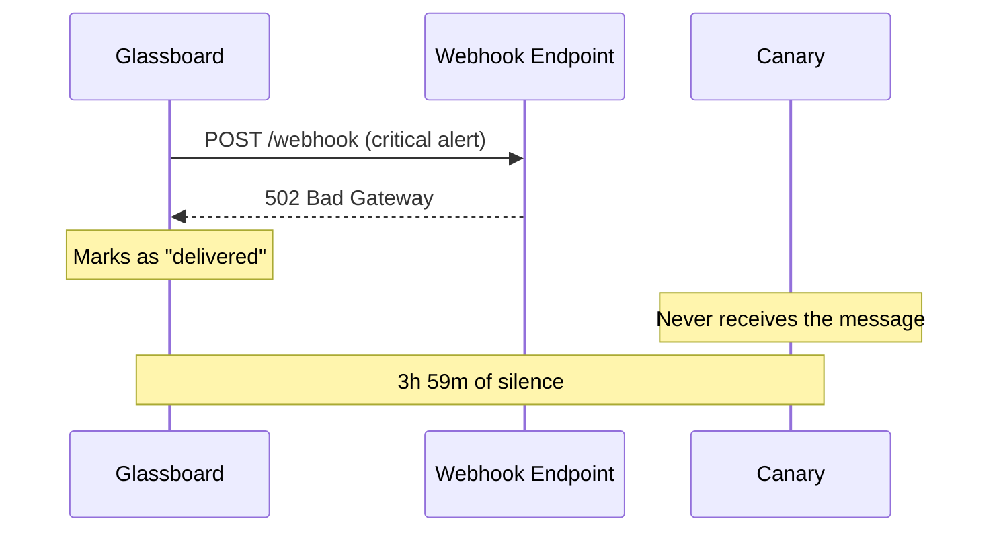

A Glassboard alert fired at 3:47 AM on a Tuesday. CPU on `web-03` had been pegged at 97% for twelve minutes. The monitoring dashboard lit up. The webhook to Canary fired. And then nothing happened.

{/* truncate */}

Nobody woke up. The server stayed down for four hours. Three customers noticed before we did.

## The Timeline

```text title="Incident timeline — 2025-02-18"
03:35  web-03 CPU crosses 90% threshold
03:47  Glassboard fires critical alert
03:47  Webhook POST to Canary endpoint — 502 Bad Gateway
03:47  No retry. No log. No escalation.
03:48  Glassboard marks alert as "delivered"
04:15  web-03 stops responding to health checks
04:22  Trellis restarts the pod. It crashes again.
07:31  First customer support ticket arrives
07:45  On-call engineer checks Glassboard manually
07:46  Incident declared
```

The gap between "alert sent" and "human notified" was three hours and fifty-nine minutes. The gap between "webhook fired" and "webhook confirmed" was zero — because nobody was checking.

## The Gap



Glassboard did its job. It fired the alert. The problem was everything after: no delivery confirmation, no retry, no dead-letter queue, no fallback. The webhook was fire-and-forget. Or more accurately, fire-and-hope.

:::danger Silent Failures
A webhook that returns a non-2xx status and triggers no retry is indistinguishable from a webhook that was never sent. If your integration layer does not confirm delivery, you do not have an integration layer. You have a suggestion.
:::

## What We Built

The post-mortem had one conclusion: the relay layer needed to own delivery. Not "send and move on." Own it. Confirm it. Retry it. Record it. Escalate when it fails.

That is what became Envoy.

The first version was 400 lines of Alloy and a Vial image that sat between Glassboard and Canary. It did three things:

1. **Receive** the webhook and validate the source with Cipher.
2. **Transform** the payload with Parcel into the format Canary expected.
3. **Deliver** with Courier — exponential backoff, three retries, dead-letter queue on permanent failure.

```text title="relay.grain"
relay "glassboard-to-canary" {
  source   = "glassboard"
  cipher   = "hmac-sha256"

  transform {
    title    = "[{{ severity }}] {{ alertname }}"
    body     = "{{ instance }} — {{ message }}"
    priority = severity_to_priority(severity)
  }

  destination = "canary://infra-alerts"

  retry {
    strategy = "exponential"
    max      = 5
    backoff  = "1s, 5s, 30s, 2m, 10m"
  }
}
```

The 3:47 AM alert would have arrived at 3:47 AM. And if the first attempt failed, at 3:48. And if that failed, at 3:53. And so on, until someone was awake or the message landed in a dead-letter queue with a separate escalation path.

## The Lesson

Reliability is not a feature you add later. It is the first thing you build, or you build on sand.

Envoy exists because a webhook failed at 3 AM and nobody noticed. Every design decision we have made since then starts with the same question: *what happens when this fails?*

If the answer is "nothing," we have not finished building it.
