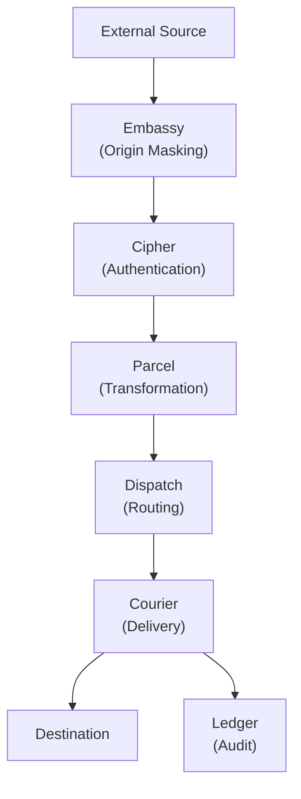
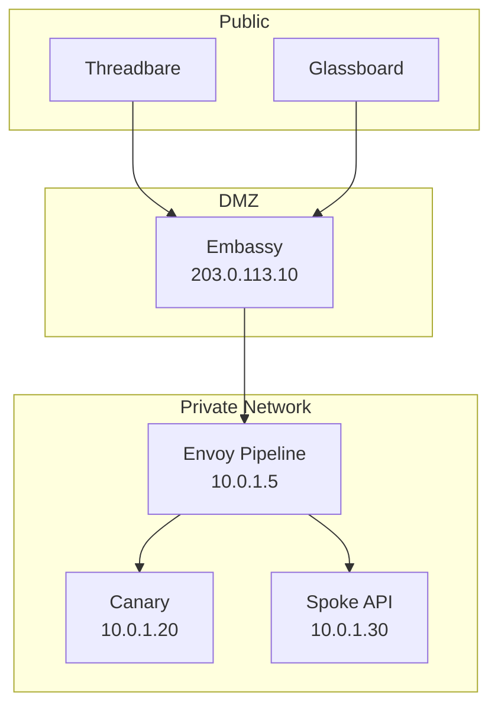
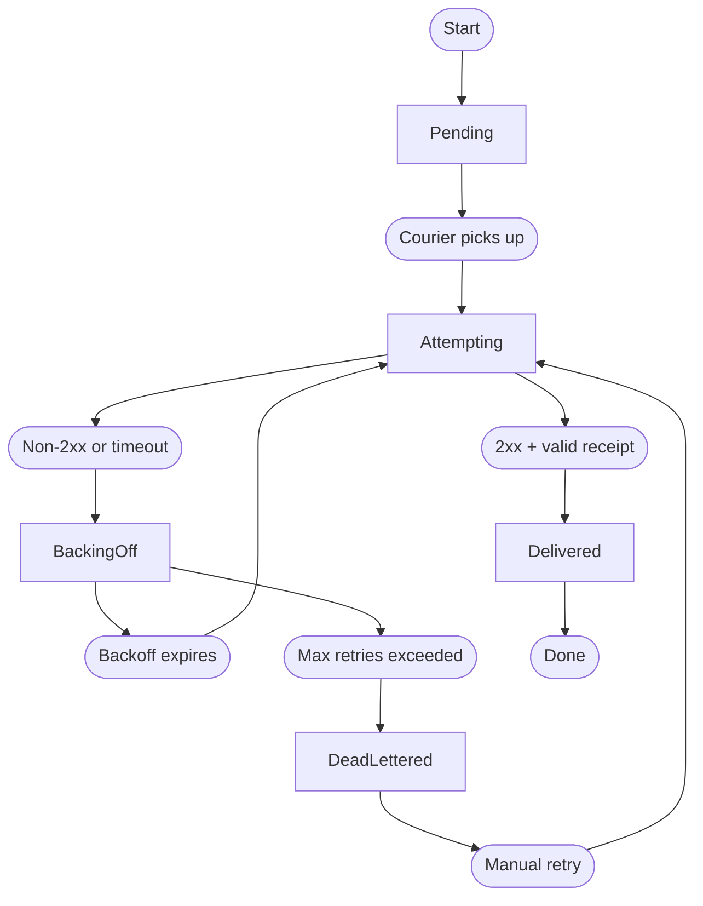

# Architecture

Envoy is designed as a pipeline of discrete stages. Each stage has a single responsibility, a defined input, and a defined output. This page covers the system-level architecture, Embassy's origin-masking model, Courier's retry state machine, and Ledger's append-only storage.

> The best infrastructure is the kind you forget about until you need it. If you are thinking about your integration layer, it has already failed.

## Request Lifecycle

Every incoming request passes through the full pipeline:



1. **Embassy** receives the external request and proxies it inward. The internal service address is never exposed.
2. **Cipher** authenticates the source. Invalid requests are rejected with no further processing.
3. **Parcel** transforms the payload into the format the destination expects.
4. **Dispatch** evaluates routing rules and selects the destination (or destinations, for fanout).
5. **Courier** delivers the message with retry guarantees.
6. **Ledger** records every state transition for the full transaction lifecycle.

## Embassy: Origin Masking

Embassy is Envoy's reverse proxy layer. It keeps internal services completely off the public internet. External sources send requests to Embassy's public endpoint. Embassy forwards them to the internal Envoy pipeline. The destination service — whether Canary, a Spoke endpoint, or any other internal system — never receives traffic from outside the network.



Embassy terminates TLS using Ironclad certificates, validates the request format, and strips headers that could leak internal topology. The forwarded request contains only the payload and the authentication headers needed by Cipher.

### Embassy Configuration

```text title="relay.grain — Embassy block"
embassy {
  listen      = "0.0.0.0:443"
  tls_cert    = "/etc/envoy/ironclad/cert.pem"
  tls_key     = "/etc/envoy/ironclad/key.pem"
  upstream    = "http://10.0.1.5:8090"
  strip_headers = ["X-Forwarded-For", "X-Real-IP"]
}
```

## Courier: Retry State Machine

Courier manages the delivery lifecycle for every message. Each message transitions through a defined set of states:



| State         | Description                                                          | Ledger Entry  |
|---------------|----------------------------------------------------------------------|---------------|
| Pending       | Message queued, waiting for Courier to pick up.                      | `queued`      |
| Attempting    | Delivery in progress. Courier is waiting for a response.             | `attempting`  |
| Delivered     | Destination returned 2xx with a valid receipt. Transaction complete. | `delivered`   |
| Backing Off   | Delivery failed. Courier is waiting before the next attempt.         | `retrying`    |
| Dead-Lettered | All retry attempts exhausted. Message moved to dead-letter queue.    | `dead_letter` |

### Delivery Receipts

Courier does not consider a 2xx response sufficient for delivery confirmation. The response body must match the expected receipt schema for the destination protocol. A 200 from a reverse proxy with an empty body is not a confirmed delivery — it is an acknowledgement that the proxy received the bytes.

## Ledger: Audit Storage

Ledger is an append-only log that records every state transition for every message. Nothing is updated in place. Nothing is deleted (until the retention policy expires).

```text title="Ledger entries for a single message"
[ledger] msg_f7a2b8c4  queued       (relay: threadbare-pushes)
[ledger] msg_f7a2b8c4  attempting   (attempt: 1/5, destination: canary://ci-builds)
[ledger] msg_f7a2b8c4  delivered    (latency: 3.1ms, receipt: confirmed)
```

### Retention Policies

| Policy    | Retention | Storage Impact | Use Case                                |
|-----------|-----------|----------------|-----------------------------------------|
| Minimal   | 24 hours  | Low            | High-throughput relays, ephemeral data. |
| Standard  | 30 days   | Moderate       | Most production deployments.            |
| Extended  | 1 year    | High           | Compliance and audit requirements.      |
| Permanent | Unlimited | Very high      | Forensic and legal hold.                |

```text title="relay.grain — Ledger retention"
ledger {
  retention = "30d"
  export {
    format   = "json"
    schedule = "daily"
    target   = "spoke://audit.internal/ingest"
  }
}
```

## Next Steps

- [API Reference](/docs/reference/api-reference/) — Query Ledger entries, inspect Courier state, and manage relays via the Spoke API.
- [Configuration](/docs/setup/configuration/) — Full relay manifest reference including Embassy and Ledger blocks.
