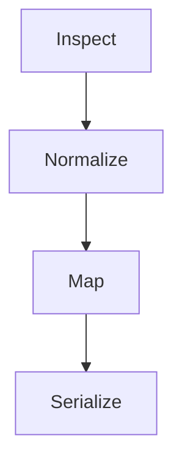

import Tabs from '@theme/Tabs';
import TabItem from '@theme/TabItem';

# Protocol Translation

Parcel is Envoy's payload transformation pipeline. It takes an incoming message in one format and rewrites it into the format the destination expects. No shared schema required. No mutual agreement between source and destination.

## Pipeline Stages

Every message passes through four stages:



1. **Inspect** — Identify the content type, encoding, and structure of the incoming payload.
2. **Normalize** — Convert the raw payload into Parcel's internal representation (a typed key-value tree).
3. **Map** — Apply the transformation rules from the relay manifest to produce the output structure.
4. **Serialize** — Encode the output into the format the destination expects.

## Format Negotiation

Parcel inspects the `Content-Type` header and the payload structure to determine the source format. The destination format is inferred from the destination protocol. If the source and destination use the same format, Parcel still runs the mapping stage — transformation is never skipped.

| Source Format | Destination Format | Mapping Mode     |
|---------------|--------------------|------------------|
| JSON          | JSON               | Field remapping  |
| JSON          | Plaintext          | Template render  |
| XML           | JSON               | Tree conversion  |
| Form-data     | JSON               | Key extraction   |
| Plaintext     | JSON               | Pattern matching |

## Transformation Rules

<Tabs>
<TabItem value="json-to-json" label="JSON to JSON" default>

JSON-to-JSON transforms remap fields from the source structure to the destination structure. The transform block in the relay manifest defines the mapping.

```text title="relay.grain — JSON to JSON"
relay "glassboard-to-canary" {
  source      = "glassboard"
  destination = "canary://infra-alerts"

  transform {
    title    = "[{{ severity }}] {{ alertname }}"
    body     = "{{ instance }} — {{ message }}"
    priority = severity_to_priority(severity)
  }
}
```

**Input (Glassboard alert):**

```json title="Incoming payload"
{
  "alertname": "HighMemory",
  "severity": "warning",
  "instance": "db-02.arcline.internal",
  "message": "Memory usage at 87%"
}
```

**Output (Canary notification):**

```json title="Transformed payload"
{
  "title": "[warning] HighMemory",
  "body": "db-02.arcline.internal — Memory usage at 87%",
  "priority": 3
}
```

</TabItem>
<TabItem value="json-to-plaintext" label="JSON to Plaintext">

JSON-to-plaintext transforms render the source fields into a flat text string. Useful for destinations that accept only plain messages.

```text title="relay.grain — JSON to plaintext"
relay "glassboard-to-spoke" {
  source      = "glassboard"
  destination = "spoke://alerts.internal/webhook"

  transform {
    format = "plaintext"
    template = """
      ALERT: {{ alertname }}
      SEVERITY: {{ severity }}
      HOST: {{ instance }}
      MESSAGE: {{ message }}
    """
  }
}
```

**Output:**

```text title="Plaintext output"
ALERT: HighMemory
SEVERITY: warning
HOST: db-02.arcline.internal
MESSAGE: Memory usage at 87%
```

</TabItem>
</Tabs>

## Field Mapping Rules

Parcel supports three kinds of field mappings:

| Mapping Type | Syntax                              | Description                                           |
|--------------|-------------------------------------|-------------------------------------------------------|
| Direct       | `title = "{{ alertname }}"`         | Copy a source field directly.                         |
| Computed     | `priority = severity_to_priority()` | Apply a built-in function to derive a value.          |
| Composite    | `body = "{{ a }} — {{ b }}"`        | Combine multiple source fields into one output field. |

### Built-In Functions

| Function                   | Input     | Output | Description                                     |
|----------------------------|-----------|--------|-------------------------------------------------|
| `severity_to_priority()`   | string    | number | Maps severity levels to priority numbers (1-5). |
| `timestamp_to_iso()`       | number    | string | Converts Unix timestamps to ISO 8601.           |
| `truncate(field, length)`  | string, n | string | Truncates a string to the specified length.     |
| `default(field, fallback)` | any, any  | any    | Returns the fallback if the field is missing.   |

## Lossy vs Lossless Transforms

Not every source field has a destination equivalent. Parcel distinguishes between lossless transforms (all source data preserved) and lossy transforms (some data dropped).

```text title="Lossless transform"
transform {
  mode = "lossless"
  # All source fields are included in the output.
  # Unmapped fields are appended to the body as key-value pairs.
}
```

```text title="Lossy transform (default)"
transform {
  # Only explicitly mapped fields appear in the output.
  # Unmapped source fields are discarded.
  title = "{{ alertname }}"
  body  = "{{ message }}"
}
```

:::info
Lossy mode is the default. Most destinations have a fixed schema and will reject unexpected fields. Use lossless mode only when the destination can handle arbitrary key-value data.
:::

## Next Steps

- [Routing & Dispatch](/docs/core/routing-dispatch/) — How Dispatch routes transformed messages to their destinations.
- [Configuration](/docs/setup/configuration/) — Full relay manifest reference including transform directives.
