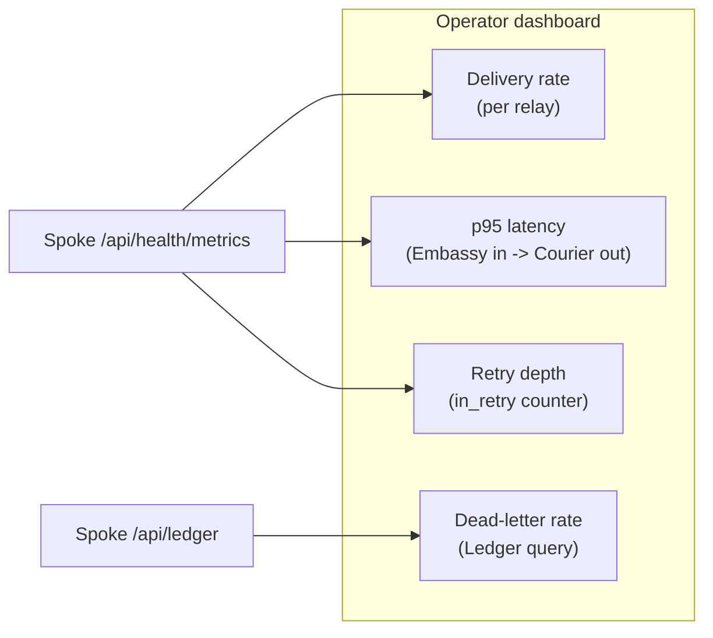
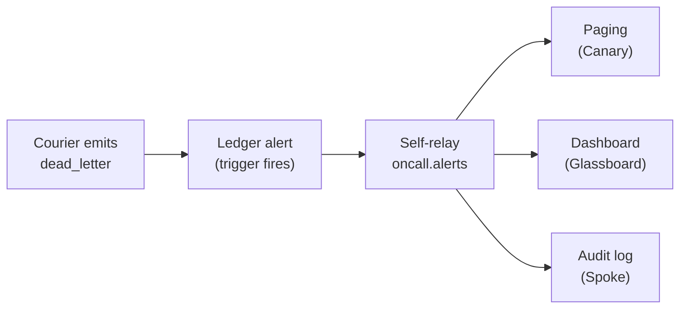

# Monitoring Relays

A relay that nobody is watching is a relay that has already failed — you just have not noticed yet. Envoy gives you four observability surfaces: the Ledger for transaction-level forensics, the Spoke `/api/health/metrics` endpoint for time-series aggregation, Courier's retry-state stream for tail-end alerting, and Dispatch's per-relay counters for routing-rule health.

> Visibility is not a feature. It is a precondition. You cannot operate what you cannot see.

## What to Watch

Every relay has the same four health signals. If any one of them drifts, something is wrong.

| Signal            | Source                      | Healthy Range                         | Alert When                       |
|-------------------|-----------------------------|---------------------------------------|----------------------------------|
| Delivery rate     | `delivery_rate` per relay   | `>= 0.99` over rolling 5 minutes      | Drops below `0.95` for 2 minutes |
| Retry queue depth | Courier `in_retry` counter  | `< 50` messages                       | Above `200` for 5 minutes        |
| Dead-letter rate  | Ledger `dead_letter` events | `0` per hour, per relay               | Any non-zero count               |
| p95 end-to-end    | Embassy in to Courier out   | `< 10ms` local, `< 80ms` cross-region | Exceeds budget for 3 minutes     |

Everything else is decoration.

## Querying the Ledger

The Ledger is append-only and queryable through Spoke. Every transformation, route, attempt, and delivery is one row. Forensic queries answer the only question that matters during an incident: where did the message go?

```bash title="Find every failed delivery in the last hour"
curl -s "http://localhost:8090/api/ledger?status=dead_letter&since=1h" \
  -H "Authorization: Bearer ${READ_TOKEN}" | jq
```

```json title="Ledger response"
{
  "entries": [
    {
      "id": "msg_e6d5c4b3",
      "relay": "glassboard-critical",
      "first_seen": "2026-05-15T09:14:21Z",
      "last_attempt": "2026-05-15T09:24:08Z",
      "attempts": 5,
      "destination": "canary://oncall-urgent",
      "failure_reason": "destination_5xx",
      "last_status_code": 503
    }
  ],
  "total": 1,
  "since": "2026-05-15T08:24:08Z"
}
```

Filter by source, destination, time window, or relay name. Every column in the Ledger is indexed.

```bash title="Trace a single message end-to-end"
curl -s http://localhost:8090/api/ledger/msg_f7a2b8c4/trace \
  -H "Authorization: Bearer ${READ_TOKEN}" | jq
```

The trace endpoint returns every Ledger row for that message in chronological order — Cipher verified, Parcel transformed, Dispatch routed, Courier attempted, Courier delivered. No row is implied. No row is reconstructed. What you see is what happened.

## Building Dashboards

The `/api/health/metrics` endpoint is designed for scraping. Pull every 15 seconds and feed a time-series store.

```bash title="GET /api/health/metrics"
curl -s http://localhost:8090/api/health/metrics | jq
```

```json title="Metrics response (excerpt)"
{
  "relay_count": 4,
  "messages": {
    "total": 12847,
    "delivered": 12842,
    "dead_lettered": 5,
    "in_retry": 0
  },
  "latency": {
    "p50_ms": 2.1,
    "p95_ms": 4.3,
    "p99_ms": 7.8
  }
}
```

A useful dashboard has four panels and nothing else.



Resist the temptation to add a fifth panel. A dashboard with twelve metrics is twelve metrics that nobody glances at.

:::tip
Track each metric per relay, not per Envoy instance. A single failing relay does not lower the aggregate enough to set off an instance-wide alarm, but it absolutely needs to wake somebody up.
:::

## Alerting on Retry Exhaustion

Courier emits a Ledger event the moment it gives up on a message. The event arrives before the operator notices, which is the whole point.

```bash title=".grain — alert on dead-letter"
ledger {
  alerts {
    name      = "dead-letter-fired"
    trigger   = "status == 'dead_letter'"
    window    = "1m"
    threshold = 1
    target    = "spoke://oncall.internal/ingest"
  }
}
```

When the trigger fires, Envoy posts a structured alert to the configured Spoke target. That target is, in most deployments, another relay — Envoy is talking to itself, which is the cleanest way to fan an alert out to Canary, a paging service, and an audit log simultaneously.



:::warning
A dead-letter is not always a destination failure. It can also mean Parcel cannot transform the payload, or Cipher cannot agree on a signature. Always include the `failure_reason` field in the alert payload, or the on-call engineer will be debugging the wrong layer.
:::

## Tracking p95 Latency

End-to-end latency for Envoy is the wall-clock time between an Embassy `accept` event and a Courier `delivered` event for the same message. Every Ledger row carries the message ID and a high-resolution timestamp, so the calculation does not require a separate tracing system.

```bash title="Compute p95 over the last 15 minutes"
curl -s "http://localhost:8090/api/ledger/latency?since=15m&percentile=95" \
  -H "Authorization: Bearer ${READ_TOKEN}" | jq
```

```json title="Latency response"
{
  "window": "15m",
  "percentile": 95,
  "latency_ms": 4.3,
  "samples": 1842,
  "by_relay": {
    "threadbare-pushes": 3.1,
    "glassboard-critical": 5.8,
    "canary-down": 4.2,
    "custom-deploy-hook": 6.0
  }
}
```

Healthy single-region Envoy holds p95 under 10 milliseconds. Cross-region — see [Scaling Relays](/docs/operations/scaling-relays/) — adds the inter-region round-trip and pushes the realistic budget to 60–80 milliseconds depending on geography.

:::info
p99 is more informative than p95 for relays that fan out to slow destinations. Set the SLO on whichever percentile actually catches the long tail of the destination you care about.
:::

## What Not to Monitor

A short list, because the alerting graveyard is full of dashboards that fired on the wrong signal.

- **CPU and memory on the Envoy host.** Envoy idles below 1% CPU and 8MB resident. If the host is busy, the cause is upstream — investigate the destination, not the relay.
- **TCP connection counts.** Embassy multiplexes aggressively. The number you see is not the number you think you see.
- **Goroutine counts.** Useful during a profiling session, useless on a dashboard. Spikes are normal during fanout.

Watch the four signals at the top of this page. Everything else is noise dressed up as information.

## Next Steps

- [Scaling Relays](/docs/operations/scaling-relays/) — Horizontal scaling, sharding, retry budget tuning, and multi-region failover.
- [API Reference](/docs/reference/api-reference/) — Full Spoke API including Ledger query endpoints.
- [Architecture](/docs/advanced/architecture/) — How Ledger, Courier, and Embassy interact under load.
