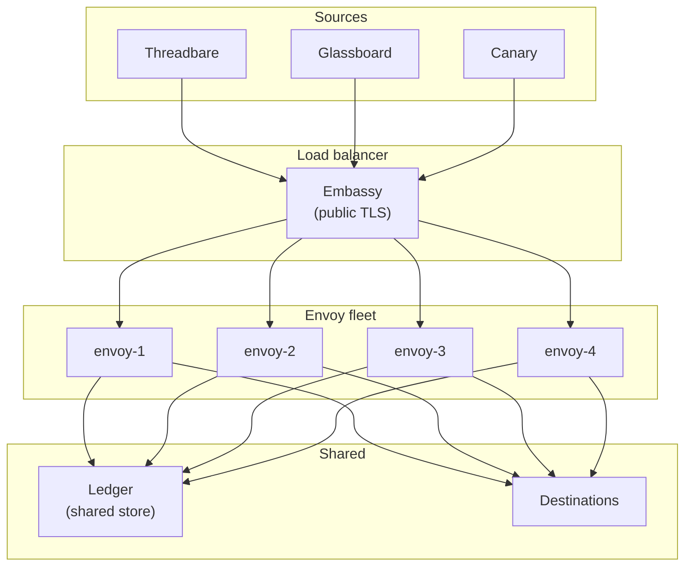
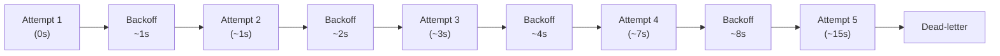
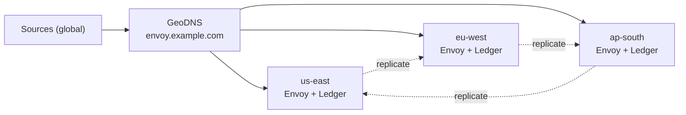

# Scaling Relays

A single Envoy Vial handles thousands of messages per second on commodity hardware. The interesting failures begin somewhere past that — when one region goes dark, when one destination starts rate-limiting, or when one topic suddenly receives a hundred times the traffic of the other ninety-nine. This page covers how to size, shard, and replicate Envoy so the cluster outlives any single component.

> Scale is not a target. It is a consequence of correct sharding.

## Horizontal Topology

Envoy scales horizontally by adding instances behind a load balancer. Every instance is stateless except for the Ledger, which is shared. Trellis orchestrates instance lifecycle, while Spark deploys identical configurations to every node.



Every instance authenticates, transforms, routes, and delivers independently. Ledger writes are append-only — no contention, no coordination.

:::info
Embassy must front the entire fleet. Putting Embassy behind the load balancer instead of in front of it would expose internal IPs in failure responses. The order matters.
:::

## Sharding by Topic

Round-robin load balancing works until one topic absorbs more traffic than the rest of the fleet combined. The fix is topic-aware sharding: every instance owns a deterministic subset of topics.

```text title="relay.grain — topic sharding"
sharding {
  strategy = "topic-hash"
  shards   = 4

  // highlight-start
  assignment {
    "envoy-1" = ["ci-builds", "deploy-alerts"]
    "envoy-2" = ["infra-alerts", "oncall-urgent"]
    "envoy-3" = ["monitoring", "project-updates"]
    "envoy-4" = ["fanout-default"]
  }
  // highlight-end
}
```

| Strategy        | Use Case                                  | Trade-off                                            |
|-----------------|-------------------------------------------|------------------------------------------------------|
| Round-robin     | Uniform topic traffic, small fleets       | One hot topic overwhelms one instance.               |
| Topic-hash      | Predictable assignment, no coordination   | Rebalancing requires config push.                    |
| Consistent-hash | Large fleets, frequent membership changes | Slight imbalance under skew.                         |
| Manual          | Hot-topic isolation, regulatory pinning   | Operator must update assignments when traffic moves. |

Trellis handles rebalancing during membership changes — when an instance joins or leaves the fleet, Trellis recomputes assignments and pushes updated `.grain` snippets through Spark.

## Tuning Courier's Retry Budget

Courier's retry budget is the policy that decides when to keep trying and when to give up. The defaults are conservative — they assume an HTTP destination that occasionally times out. Aggressive destinations (rate-limited APIs, paging services with strict SLAs) need a tighter budget.

```text title="relay.grain — Courier retry budget"
courier {
  retry {
    max_attempts    = 5
    initial_backoff = "1s"
    max_backoff     = "60s"
    multiplier      = 2.0
    jitter          = "10%"
  }

  // highlight-start
  budget {
    per_destination_per_minute = 100
    per_relay_per_minute       = 500
  }
  // highlight-end
}
```

| Knob                  | Default | When to Lower                           | When to Raise                               |
|-----------------------|---------|-----------------------------------------|---------------------------------------------|
| `max_attempts`        | 5       | Destination has strict SLA on freshness | Destination is flaky but eventually healthy |
| `initial_backoff`     | 1s      | High-priority alerts, p99 sensitive     | Destination publishes a Retry-After         |
| `max_backoff`         | 60s     | Destination recovers fast               | Destination recovers in minutes             |
| `per_destination/min` | 100     | Rate-limited downstream API             | High-volume relay to local destination      |

:::warning
A retry budget that is too generous will keep a sick destination sick. If Canary returns 503 a hundred times in a minute and Courier retries each one five times, the destination receives five hundred extra requests during the worst possible moment. Always cap `per_destination_per_minute`.
:::



Exponential backoff with jitter — five attempts cover roughly 15 seconds of wall-clock time. After that, the message goes to the dead-letter queue and Courier emits the Ledger event configured under [Monitoring Relays](/docs/operations/monitoring-relays/).

## Cipher Rate-Limit Configuration

Cipher is Envoy's first line of defense against a misbehaving source. A leaky webhook secret, a runaway upstream, or a deliberate flood — all three look the same from the inside, and all three need the same answer: rejection at the edge, before Parcel and Dispatch are involved.

```text title="relay.grain — Cipher rate limits"
cipher {
  rate_limit {
    per_source_per_second = 50
    per_source_per_minute = 1000
    burst                 = 100

    // highlight-start
    on_exceed {
      action        = "reject"
      response_code = 429
      response_body = '{"error":"rate_limited"}'
      log_to        = "ledger"
    }
    // highlight-end
  }
}
```

| Setting                 | Purpose                                                               |
|-------------------------|-----------------------------------------------------------------------|
| `per_source_per_second` | Hard ceiling on instantaneous traffic from a single source identity.  |
| `per_source_per_minute` | Sustained-rate ceiling, protects against slow floods.                 |
| `burst`                 | Allowance for short spikes — covers normal webhook clustering.        |
| `on_exceed.action`      | `reject` returns 429, `defer` queues briefly, `quarantine` blocks 5m. |

The `log_to = "ledger"` line is the important one. A rejected request leaves a Ledger entry — a forensic record of what was attempted, by whom, when. The body is discarded. The metadata stays.

:::tip
Set per-source limits well below the destination's known capacity. The math is simple: if Canary accepts 200 RPS and you have four upstreams sharing the relay, no single upstream should exceed 50 RPS at Cipher. Backpressure belongs at the edge, not the destination.
:::

## Multi-Region Failover

A single-region Envoy cluster is one cable cut away from a full outage. Multi-region Envoy keeps relays alive across regional failure — at the cost of higher tail latency and a more involved configuration.



Trellis runs an active-active topology: every region accepts traffic, every region delivers locally, and the Ledger replicates asynchronously between regions. A regional failure shifts GeoDNS to the surviving regions; the messages in flight at the moment of failure replay from the surviving Ledger replicas.

```text title=".grain — multi-region block"
multi_region {
  active_active = true

  regions {
    "us-east"  = { weight = 40, ledger_endpoint = "spoke://ledger.us-east.internal" }
    "eu-west"  = { weight = 35, ledger_endpoint = "spoke://ledger.eu-west.internal" }
    "ap-south" = { weight = 25, ledger_endpoint = "spoke://ledger.ap-south.internal" }
  }

  failover {
    on_region_loss = "rebalance"
    replay_window  = "5m"
  }
}
```

| Parameter        | Effect                                                                         |
|------------------|--------------------------------------------------------------------------------|
| `active_active`  | All regions accept and deliver. Disabled means cold-standby with longer RTO.   |
| `weight`         | GeoDNS traffic share when all regions are healthy.                             |
| `replay_window`  | How far back to replay Ledger entries from the failed region.                  |
| `on_region_loss` | `rebalance` shifts weight, `drain` finishes in-flight only, `halt` stops cold. |

:::warning
Active-active multi-region means a message might be transformed under one regional Parcel ruleset and audited in the Ledger of another. Keep the `.grain` manifest in lockstep across regions — Spark's deploy pipeline rejects drift automatically, but only if you point all regions at the same source of truth.
:::

## Capacity Reference

Conservative numbers, measured on a 2-vCPU, 4GB Vial. Real fleets typically exceed these by a comfortable margin.

| Workload                           | Single Instance | Four-Instance Fleet |
|------------------------------------|-----------------|---------------------|
| Sustained inbound RPS              | 2,500           | 9,000               |
| Burst inbound RPS (60s)            | 8,000           | 28,000              |
| Active relays                      | 200             | 800                 |
| Concurrent in-flight deliveries    | 5,000           | 18,000              |
| Memory at sustained load           | 32 MB           | 32 MB per instance  |
| p95 end-to-end (local destination) | 4 ms            | 5 ms                |

If you exceed these numbers and the dashboards still look healthy, the dashboards are wrong. Re-check the four signals from [Monitoring Relays](/docs/operations/monitoring-relays/) before adding capacity.

## Next Steps

- [Monitoring Relays](/docs/operations/monitoring-relays/) — Ledger queries, dashboards, retry-exhaustion alerts.
- [Architecture](/docs/advanced/architecture/) — Embassy, Courier state machine, and Ledger storage.
- [API Reference](/docs/reference/api-reference/) — Spoke endpoints for relay administration.
