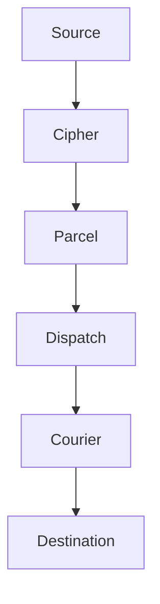

# Overview

Envoy is a protocol translator and relay engine for systems that were never designed to understand each other. It sits between any two services, learns how they speak, transforms the message, and delivers it — without either side knowing there is an interpreter in the room.

No shared format. No shared protocol. No bilateral agreement. Just delivery.

> Integration should not require both sides to agree on a format. If both sides need to change, you have not solved the integration problem — you have created a new one.

## How It Works

Every message passes through five stages: authenticate, inspect, transform, route, deliver. The relay manifest declares the rules. Envoy handles the execution.



1. **Cipher** authenticates the source — HMAC signatures, bearer tokens, or IP allowlists.
2. **Parcel** inspects and transforms the payload into the format the destination expects.
3. **Dispatch** routes the message to the correct destination based on content, source, or severity.
4. **Courier** delivers with guaranteed retry, dead-letter queues, and delivery receipts.

## The Tool Suite

| Tool         | Purpose                                                                                        |
|--------------|------------------------------------------------------------------------------------------------|
| **Dispatch** | Intelligent routing engine — routes by content, source, or severity.                           |
| **Courier**  | Guaranteed-delivery retry engine — exponential backoff, dead-letter queues, delivery receipts. |
| **Parcel**   | Payload transformation pipeline — rewrites messages between formats.                           |
| **Cipher**   | Authentication gateway — HMAC signatures, bearer tokens, IP allowlists.                        |
| **Ledger**   | Full delivery audit trail — every message received, transformed, routed, delivered.            |
| **Embassy**  | Origin-masking reverse proxy — keeps internal services off the public internet.                |

:::info Minimal Footprint
Envoy ships as a single 3MB Vial image with zero external dependencies. Every protocol handler, transformation engine, and retry mechanism is built in. Nothing is pulled from the outside at build time or runtime.
:::

## Quick Start

Pull the Vial image and start the relay:

```bash title="Start Envoy"
vial pull envoy
vial run envoy --port 8090
```

Send a test message through the relay:

```bash title="Test delivery"
curl -X POST http://localhost:8090/relay/test-topic \
  -H "Content-Type: application/json" \
  -H "Authorization: Bearer your-relay-token" \
  -d '{"title": "Hello", "message": "Relay is operational."}'
```

The message is authenticated by Cipher, transformed by Parcel (if rules match), routed by Dispatch, and delivered by Courier. Ledger records the full transaction.

## Next Steps

- [Installation](/docs/setup/installation/) — Vial, Spark, and Trellis deployment options.
- [Your First Relay](/docs/setup/your-first-relay/) — Receive a Threadbare webhook, transform it, deliver it to Canary.
- [Configuration](/docs/setup/configuration/) — The `.grain` relay manifest in depth.
- [API Reference](/docs/reference/api-reference/) — Full Spoke API reference for relay management.
