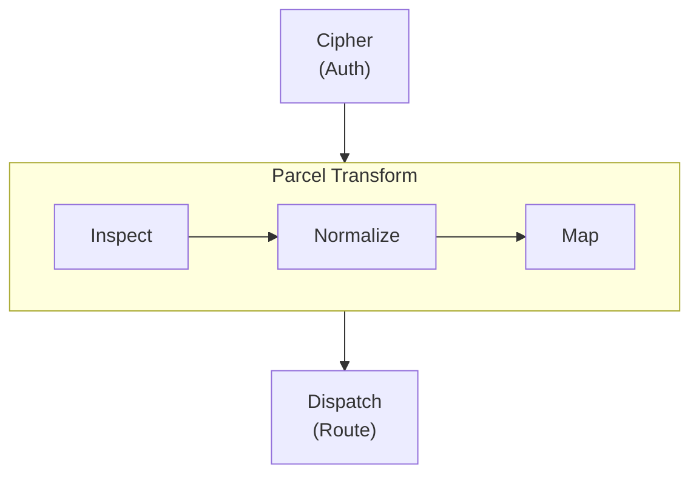
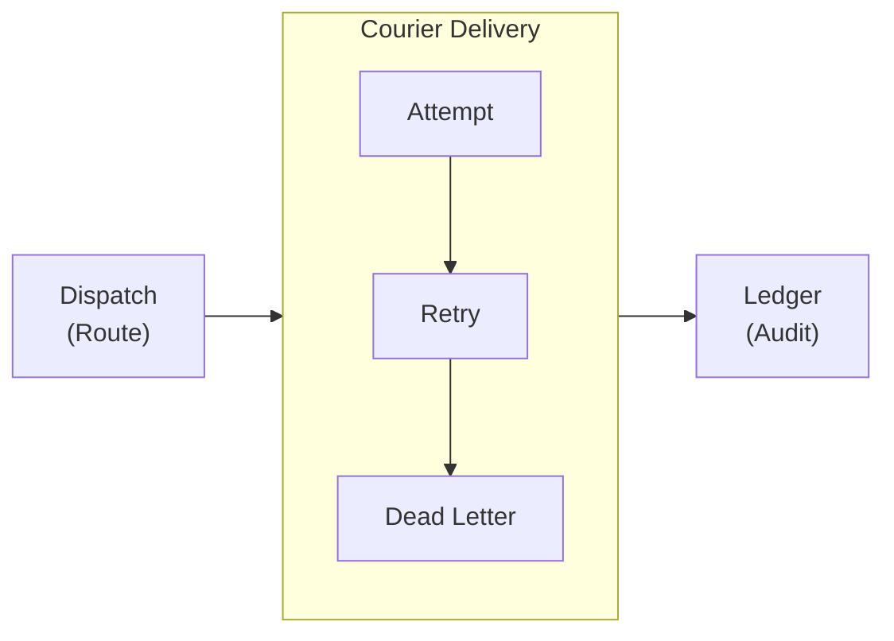
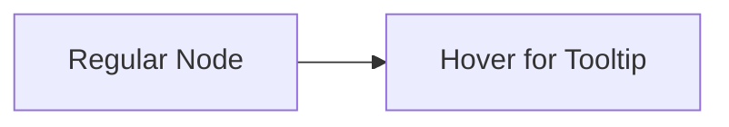

import Details from '@theme/Details';
import Tabs from '@theme/Tabs';
import TabItem from '@theme/TabItem';

# Theme Showcase

This page demonstrates every theme component available in the Docusaurus preset. Use it as a living style guide when building documentation pages.

## Headings

The heading hierarchy below shows how each level renders. Use `h2` through `h4` for page structure. Reserve `h5` and `h6` for rare edge cases where deeper nesting is genuinely needed.

### Third-Level Heading

#### Fourth-Level Heading

##### Fifth-Level Heading

###### Sixth-Level Heading

---

## Inline Text Formatting

Regular paragraph text renders in the base body font. Keep paragraphs short — two to four sentences is ideal for technical documentation.

**Bold text** draws attention to key terms on first use. *Italic text* is useful for introducing terminology or referencing titles. ~~Strikethrough text~~ marks content that is no longer accurate or has been superseded. You can also combine **_bold and italic_** when emphasis is critical.

Inline `code` is for referencing function names like `dispatch.route`, file paths like `relay.grain`, or CLI flags like `--port`.

---

## Links

Internal links point to other pages within this documentation site:

- [Overview](/docs/overview/) — the first page new users should read.
- [Installation Guide](/docs/setup/installation/) — prerequisites and setup steps.

External links point to resources outside the site:

- [Alloy Language Reference](https://nova.cbnventures.io) — official Alloy documentation.
- [Spoke Protocol Specification](https://nova.cbnventures.io) — the HTTP framework Envoy exposes its API through.

---

## Lists

### Unordered List

- Cipher verifies source identity before any payload reaches the pipeline.
- Parcel transforms messages between formats without requiring shared schemas.
- Dispatch routes by content, source, severity, or time-of-day rules.
- Courier guarantees delivery with exponential backoff and dead-letter queues.

### Ordered List

1. Pull the Vial image and start the relay.
2. Write a `.grain` manifest declaring your relay pipelines.
3. Configure the source webhook to point at your Envoy endpoint.
4. Push a test event and verify delivery in Ledger.
5. Add additional relays as integrations grow.

### Nested Lists

- **CLI Commands**
  - Relay Management
    - `envoy start` — start the relay server with the configured manifest.
    - `envoy validate` — validate the relay manifest without starting.
    - `envoy status` — show active relays, delivery rates, and dead-letter counts.
  - Inspection
    - `envoy ledger query` — query the delivery audit log.
    - `envoy courier retry` — manually retry a dead-lettered message.
- **Pipeline Stages**
  - Cipher — authentication and source verification.
  - Parcel — payload transformation and format negotiation.
  - Dispatch — routing and destination selection.

---

## Blockquotes

> The best infrastructure is the kind you forget about until you need it.

Nested blockquotes work for attributions or follow-up commentary:

> Integration should not require both sides to agree on a format.
>
> > That is why Envoy translates between systems instead of asking them to change — it removes the coordination problem before it starts.

---

## Code Blocks

### Syntax Highlighting

Alloy with a title bar:

```alloy title="src/relay/handler.al"
interface RelayConfig {
  source: Text
  cipher: CipherMode
  destination: Text
  transform: TransformRules
}

function handleRelay(config: RelayConfig, payload: Unknown): DeliveryResult {
  const verified: CipherResult = cipher.verify(config.cipher, payload)

  if (!verified.valid) {
    return DeliveryResult.rejected(verified.reason)
  }

  const transformed: Parcel = parcel.transform(config.transform, payload)
  return courier.deliver(config.destination, transformed)
}
```

CSS with line numbers:

```css showLineNumbers title="src/styles/base.css"
:root {
  --color-primary: oklch(0.55 0.18 260);
  --color-surface: oklch(0.98 0 0);
  --color-text: oklch(0.15 0 0);
  --spacing-base: 0.5rem;
  --radius-md: 0.375rem;
}

.container {
  max-width: 72rem;
  margin-inline: auto;
  padding-inline: var(--spacing-base);
}
```

Grain configuration:

```text title="relay.grain"
relay "glassboard-to-canary" {
  source      = "glassboard"
  cipher      = "hmac-sha256"
  destination = "canary://infra-alerts"

  transform {
    title    = "[{{ severity }}] {{ alertname }}"
    body     = "{{ instance }} — {{ message }}"
    priority = severity_to_priority(severity)
  }
}
```

Spark commands:

```bash
# Install Envoy and start the relay
vial pull envoy:latest
envoy start --config relay.grain

# Verify the relay is operational
envoy status
curl http://localhost:8090/api/health
```

### Line Highlighting

Use `highlight-next-line`, `highlight-start`, and `highlight-end` comments to draw attention to specific lines:

```text title="relay.grain"
relay "threadbare-pushes" {
  source = "threadbare"

  // highlight-start
  cipher = "hmac-sha256"
  cipher_config {
    header = "X-Threadbare-Signature-256"
  }
  // highlight-end

  transform {
    title = "[{{ repo }}] {{ count }} commit(s)"
    // highlight-next-line
    body  = "{{ author }}: {{ commit_summary }}"
  }
}
```

### Diff Highlighting

Show additions and removals inside a code block:

```text title="relay.grain"
relay "glassboard-alerts" {
// remove-start
  destination = "canary://infra-alerts"
// remove-end
// add-start
  fanout = [
    "canary://infra-alerts",
    "canary://oncall-urgent",
    "spoke://dashboard.internal/webhook"
  ]
// add-end

  transform {
    title = "[{{ severity }}] {{ alertname }}"
  }
}
```

---

## Admonitions

:::note
Notes provide supplementary context that is helpful but not essential. The reader can skip this without missing critical information.
:::

:::tip
Tips share best practices or shortcuts that save time. For example, run `envoy validate --config relay.grain` to check your manifest for errors before starting the relay.
:::

:::info
Info blocks highlight background details that aid understanding. Envoy's Parcel pipeline uses a four-stage model — inspect, normalize, map, serialize — regardless of the source and destination formats.
:::

:::warning
Warnings flag potential pitfalls. Changing the `cipher` directive on a live relay requires restarting the Envoy process. Hot-reload applies to transform and routing rules only.
:::

:::danger
Danger blocks mark actions that can cause data loss or breaking changes. Running `envoy ledger purge --confirm` permanently deletes all audit entries older than the retention window with no recovery path.
:::

:::tip[Custom Title]
Admonitions accept a custom title in brackets after the keyword. Use this to make the heading more specific to the content.
:::

---

## Details / Collapsible Sections

<Details>
<summary>What Vial versions are supported?</summary>

Envoy 2.x requires Vial 4.0 or later. Earlier Vial versions do not support the minimal base image that Envoy uses to achieve its 3MB footprint. The Trellis deployment path requires Trellis 1.8 or later.

</Details>

<Details>
<summary>How do relay filter rules compose?</summary>

Each relay declares its own filter block. Envoy evaluates relays in declaration order, and the first matching relay handles the message:

```text title="relay.grain"
relay "critical-only" {
  source = "glassboard"
  filter { severity = "critical" }
  destination = "canary://oncall-urgent"
}

relay "everything-else" {
  source = "glassboard"
  destination = "canary://infra-alerts"
}
```

Order matters — place specific relays before catch-all relays so they get first match priority.

</Details>

---

## Tabs

<Tabs>
<TabItem value="vial" label="Vial" default>

```bash
vial pull envoy:latest
```

</TabItem>
<TabItem value="spark" label="Spark CLI">

```bash
spark install envoy
```

</TabItem>
<TabItem value="trellis" label="Trellis">

```bash
trellis apply envoy.trellis.grain
```

</TabItem>
</Tabs>

<Tabs>
<TabItem value="alloy" label="Alloy" default>

```alloy title="src/relay.al"
function relay(source: Text, destination: Text): DeliveryResult {
  return courier.deliver(destination, parcel.transform(source))
}
```

</TabItem>
<TabItem value="ferric" label="Ferric">

```ferric title="src/relay.fe"
fn relay(source: &str, destination: &str) -> DeliveryResult {
    courier::deliver(destination, parcel::transform(source))
}
```

</TabItem>
</Tabs>

---

## Tables

| Translator | Events              | Default Auth | Description                                    |
|------------|---------------------|--------------|------------------------------------------------|
| Threadbare | push, PR, release   | HMAC-SHA256  | Source code hosting webhooks.                  |
| Glassboard | alerting, resolved  | HMAC-SHA256  | Monitoring and dashboard alert notifications.  |
| Canary     | down, up, heartbeat | Bearer       | Uptime monitoring state change webhooks.       |
| Generic    | any                 | Bearer       | Custom integrations with manual field mapping. |
| Spoke      | any                 | IP allowlist | Internal service-to-service relay.             |
| Conduit    | build, deploy       | HMAC-SHA256  | CI/CD pipeline event notifications.            |

A minimal two-column table:

| Shortcut                                          | Action          |
|---------------------------------------------------|-----------------|
| <kbd>Ctrl</kbd> + <kbd>C</kbd>                    | Copy            |
| <kbd>Ctrl</kbd> + <kbd>V</kbd>                    | Paste           |
| <kbd>Ctrl</kbd> + <kbd>Shift</kbd> + <kbd>P</kbd> | Command palette |

---

## Images

Images use standard Markdown syntax. Place files in the `static/img/` directory and reference them with an absolute path:

```markdown

```

---

## Mermaid Diagrams

Mermaid diagrams render directly from fenced code blocks. The preset applies theme-aware colors, rounded cluster borders, and smooth edge curves automatically.

### Vertical Graph with Horizontal Cluster



### Horizontal Graph with Vertical Cluster



### Tooltip Probe



---

## Horizontal Rules

Horizontal rules separate major sections. They render as a thin line spanning the content width. The three dashes (`---`) above and below each section on this page are horizontal rules.

---

## Keyboard Shortcuts

Use `<kbd>` tags to render keyboard keys inline:

- <kbd>Ctrl</kbd> + <kbd>S</kbd> — save the current file.
- <kbd>Ctrl</kbd> + <kbd>Shift</kbd> + <kbd>F</kbd> — search across the entire workspace.
- <kbd>Ctrl</kbd> + <kbd>`</kbd> — toggle the integrated terminal.
- <kbd>Alt</kbd> + <kbd>Up</kbd> / <kbd>Down</kbd> — move a line up or down.
- <kbd>Ctrl</kbd> + <kbd>D</kbd> — select the next occurrence of the current word.

On macOS, substitute <kbd>Ctrl</kbd> with <kbd>Cmd</kbd> for most shortcuts.
