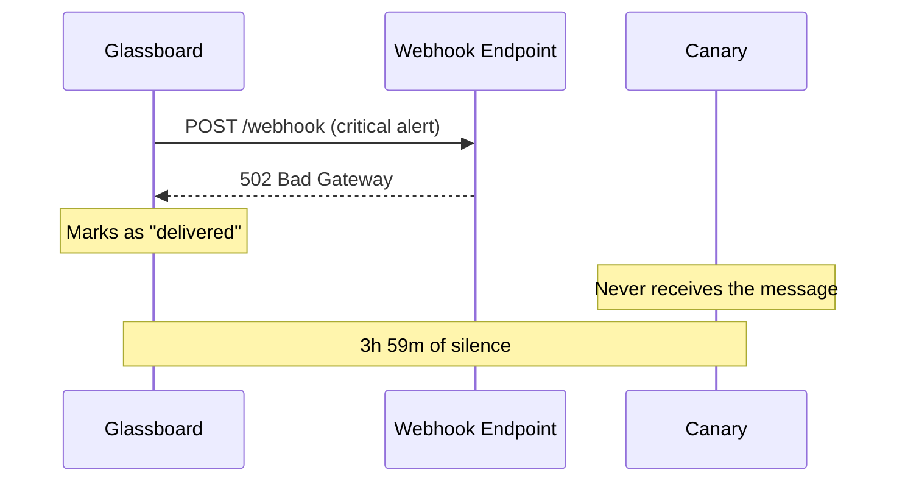

أُطلق تنبيه Glassboard عند 3:47 فجرًا من يوم ثلاثاء. كان CPU على `web-03` مثبّتًا عند 97% لمدّة اثنتي عشرة دقيقة. اشتعلت لوحة الرصد. أُطلق خطّاف الويب إلى Canary. ثمّ لم يحدث شيء.

{/* truncate */}

لم يستيقظ أحد. ظلّ الخادم معطّلًا لأربع ساعات. لاحظ ثلاثة عملاء قبل أن نلاحظ نحن.

## الجدول الزمني

```text title="Incident timeline — 2025-02-18"
03:35  web-03 CPU crosses 90% threshold
03:47  Glassboard fires critical alert
03:47  Webhook POST to Canary endpoint — 502 Bad Gateway
03:47  No retry. No log. No escalation.
03:48  Glassboard marks alert as "delivered"
04:15  web-03 stops responding to health checks
04:22  Trellis restarts the pod. It crashes again.
07:31  First customer support ticket arrives
07:45  On-call engineer checks Glassboard manually
07:46  Incident declared
```

كانت الفجوة بين «أُرسل التنبيه» و«أُبلِّغ بشريّ» ثلاث ساعات وتسعًا وخمسين دقيقة. وكانت الفجوة بين «أُطلق خطّاف الويب» و«تأكّد خطّاف الويب» صفرًا — لأن لا أحد كان يتفقّد.

## الفجوة



أدّى Glassboard مهمّته. أطلق التنبيه. المشكلة في كلّ ما تلا ذلك: لا تأكيد تسليم، لا إعادة محاولة، لا طابور رسائل ميّتة، لا احتياطي. كان خطّاف الويب أطلق-وانسَ. أو بدقّة أكبر، أطلق-وارجُ.

:::danger أعطال صامتة
خطّاف ويب يُعيد حالة غير 2xx ولا يُحفّز إعادة محاولة لا يختلف عن خطّاف ويب لم يُرسَل أصلًا. إن لم تُؤكّد طبقة التكامل لديك التسليم، فلا توجد لديك طبقة تكامل. لديك اقتراح.
:::

## ما الذي بنيناه

كان للتشريح خلاصة واحدة: على طبقة الترحيل أن تمتلك التسليم. لا «أرسل وامضِ». بل امتلكه. أكّده. أعد محاولته. سجّله. صعّده عند الفشل.

ذلك ما أصبح Envoy.

كانت النسخة الأولى 400 سطر من Alloy ووحدة Vial تقع بين Glassboard وCanary. كانت تفعل ثلاثة أشياء:

1. **استقبل** خطّاف الويب وتحقّق من المصدر باستخدام Cipher.
2. **حوِّل** الحمولة باستخدام Parcel إلى الصيغة التي يتوقّعها Canary.
3. **سلِّم** باستخدام Courier — تراجع أُسّي، ثلاث محاولات، طابور رسائل ميّتة عند الفشل الدائم.

```text title="relay.grain"
relay "glassboard-to-canary" {
  source   = "glassboard"
  cipher   = "hmac-sha256"

  transform {
    title    = "[{{ severity }}] {{ alertname }}"
    body     = "{{ instance }} — {{ message }}"
    priority = severity_to_priority(severity)
  }

  destination = "canary://infra-alerts"

  retry {
    strategy = "exponential"
    max      = 5
    backoff  = "1s, 5s, 30s, 2m, 10m"
  }
}
```

كان تنبيه 3:47 فجرًا سيصل عند 3:47 فجرًا. وإن فشلت المحاولة الأولى، فعند 3:48. وإن فشل ذلك، فعند 3:53. وهكذا، حتى يستيقظ أحدهم أو تهبط الرسالة في طابور رسائل ميّتة بمسار تصعيد منفصل.

## الدرس

الموثوقية ليست ميزة تُضيفها لاحقًا. بل هي أوّل شيء تبنيه، أو تبني على الرمل.

يوجد Envoy لأن خطّاف ويب فشل في الثالثة فجرًا ولم يلحظ أحد. كلّ قرار تصميم اتّخذناه منذ ذلك الحين يبدأ بالسؤال نفسه: *ماذا يحدث حين يفشل هذا؟*

إن كان الجواب «لا شيء»، فلم ننتهِ من بنائه.
