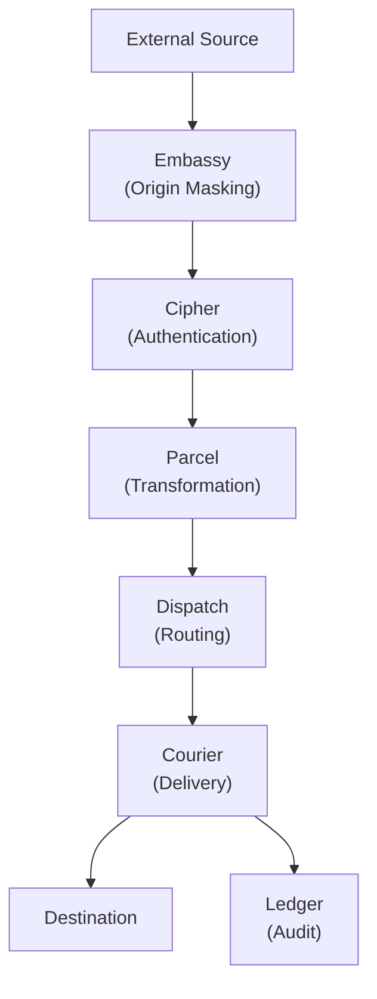
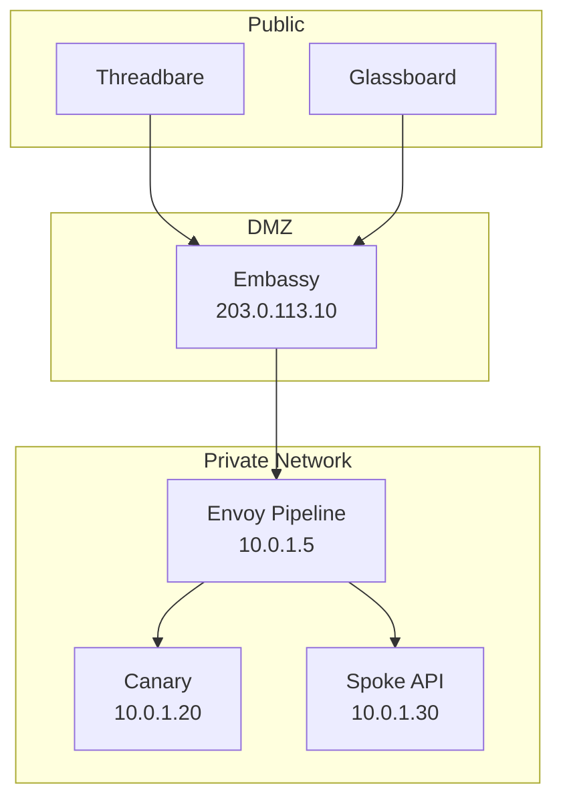
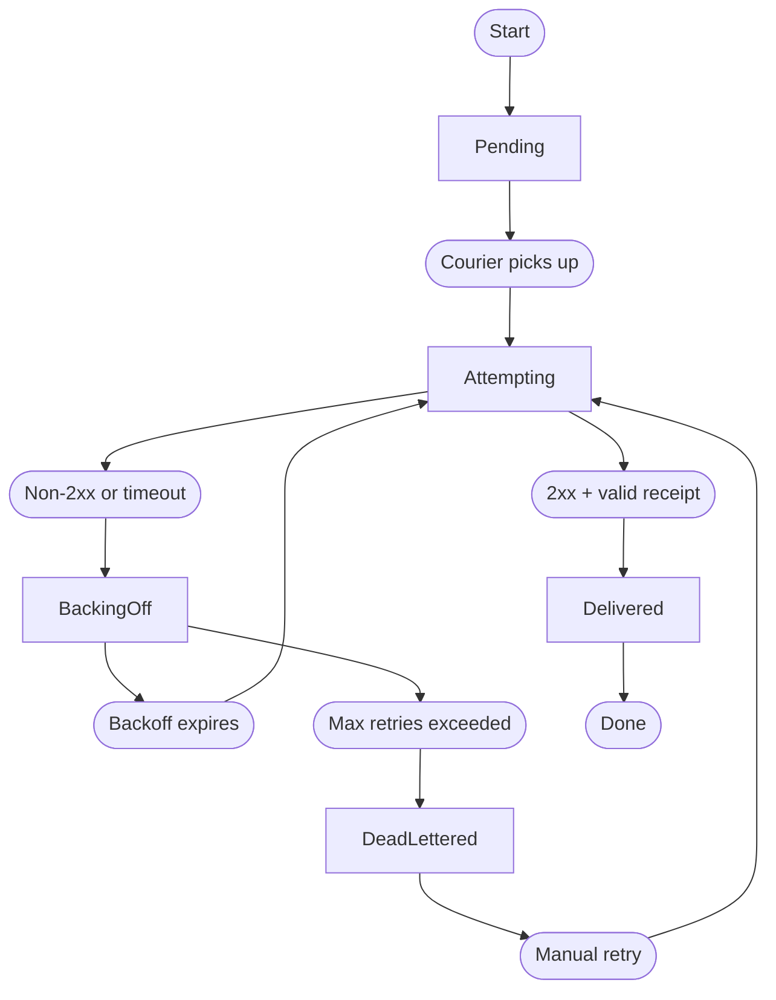

# البنية المعمارية

Envoy مُصمَّم بوصفه خطًّا مكوّنًا من مراحل منفصلة. لكلّ مرحلة مسؤولية واحدة، ومُدخل مُحدَّد، ومُخرَج مُحدَّد. تتناول هذه الصفحة البنية على مستوى النظام، ونموذج إخفاء المنشأ في Embassy، وآلة حالات إعادة المحاولات في Courier، وتخزين Ledger بصيغة الإلحاق فقط.

> أفضل بنية تحتية هي تلك التي تنساها حتى تحتاجها. إن كنت تفكّر في طبقة التكامل لديك، فقد فشلت بالفعل.

## دورة حياة الطلب

يمرّ كلّ طلب وارد عبر خطّ المعالجة الكامل:



1. **Embassy** يستقبل الطلب الخارجي ويوكّله إلى الداخل. لا يُكشَف عنوان الخدمة الداخلية أبدًا.
2. **Cipher** يصادق على المصدر. تُرفَض الطلبات غير الصالحة دون أيّ معالجة إضافية.
3. **Parcel** يحوّل الحمولة إلى الصيغة التي تتوقّعها الوجهة.
4. **Dispatch** يُقيّم قواعد التوجيه ويختار الوجهة (أو الوجهات، في حالة التشتيت).
5. **Courier** يسلّم الرسالة مع ضمانات إعادة المحاولة.
6. **Ledger** يسجّل كلّ تحوّل حالة طوال دورة حياة المعاملة.

## Embassy: إخفاء المنشأ

Embassy هو طبقة الوكيل العكسي في Envoy. يُبقي الخدمات الداخلية بعيدة كلّيًّا عن الإنترنت العامّ. ترسل المصادر الخارجية طلباتها إلى نقطة Embassy العامّة. ثمّ يوجّهها Embassy إلى خطّ Envoy الداخلي. ولا تستقبل خدمة الوجهة — سواء كانت Canary، أو نقطة Spoke، أو أيّ نظام داخلي آخر — أيّ حركة قادمة من خارج الشبكة.



ينهي Embassy جلسات TLS باستخدام شهادات Ironclad، ويُصادق على صيغة الطلب، ويُجرّده من الرؤوس التي قد تُسرّب الطوبولوجيا الداخلية. ولا يحتوي الطلب المُمرَّر إلّا على الحمولة ورؤوس المصادقة التي يحتاجها Cipher.

### إعداد Embassy

```text title="relay.grain — Embassy block"
embassy {
  listen      = "0.0.0.0:443"
  tls_cert    = "/etc/envoy/ironclad/cert.pem"
  tls_key     = "/etc/envoy/ironclad/key.pem"
  upstream    = "http://10.0.1.5:8090"
  strip_headers = ["X-Forwarded-For", "X-Real-IP"]
}
```

## Courier: آلة حالات إعادة المحاولات

يدير Courier دورة حياة التسليم لكلّ رسالة. تنتقل كلّ رسالة عبر مجموعة مُحدَّدة من الحالات:



| الحالة        | الوصف                                                                    | إدخال Ledger  |
|---------------|--------------------------------------------------------------------------|---------------|
| Pending       | الرسالة في الطابور بانتظار أن يلتقطها Courier.                           | `queued`      |
| Attempting    | التسليم قيد التنفيذ. Courier ينتظر الاستجابة.                            | `attempting`  |
| Delivered     | أعادت الوجهة 2xx مع إيصال صالح. اكتملت المعاملة.                         | `delivered`   |
| Backing Off   | فشل التسليم. Courier ينتظر قبل المحاولة التالية.                         | `retrying`    |
| Dead-Lettered | استُنفدت محاولات إعادة الإرسال. نُقلت الرسالة إلى طابور الرسائل الميّتة. | `dead_letter` |

### إيصالات التسليم

لا يعتبر Courier استجابة 2xx كافية لتأكيد التسليم. يجب أن يطابق محتوى الاستجابة مخطّط الإيصال المتوقَّع لبروتوكول الوجهة. استجابة 200 من وكيل عكسي بمحتوى فارغ ليست تسليمًا مؤكّدًا — بل هي إقرار بأن الوكيل استقبل البايتات.

## Ledger: تخزين التدقيق

Ledger سجل بصيغة الإلحاق فقط، يُدوّن كلّ تحوّل حالة لكلّ رسالة. لا يُحدَّث شيء في موضعه. ولا يُحذَف شيء (حتى تنقضي سياسة الاحتفاظ).

```text title="Ledger entries for a single message"
[ledger] msg_f7a2b8c4  queued       (relay: threadbare-pushes)
[ledger] msg_f7a2b8c4  attempting   (attempt: 1/5, destination: canary://ci-builds)
[ledger] msg_f7a2b8c4  delivered    (latency: 3.1ms, receipt: confirmed)
```

### سياسات الاحتفاظ

| السياسة      | مدّة الاحتفاظ | أثر التخزين | حالة الاستخدام                           |
|--------------|---------------|-------------|------------------------------------------|
| الحدّ الأدنى | 24 ساعة       | منخفض       | مُرحِّلات بإنتاجية عالية، وبيانات عابرة. |
| القياسي      | 30 يومًا      | متوسّط      | معظم عمليات نشر الإنتاج.                 |
| المُمتدّ     | سنة واحدة     | عالٍ        | متطلّبات الامتثال والتدقيق.              |
| الدائم       | غير محدود     | عالٍ جدًّا  | الحفظ الجنائي والقانوني.                 |

```text title="relay.grain — Ledger retention"
ledger {
  retention = "30d"
  export {
    format   = "json"
    schedule = "daily"
    target   = "spoke://audit.internal/ingest"
  }
}
```

## الخطوات التالية

- [مرجع الواجهة البرمجية](/docs/reference/api-reference/) — استعلام إدخالات Ledger، وفحص حالة Courier، وإدارة المُرحِّلات عبر Spoke API.
- [الإعداد](/docs/setup/configuration/) — مرجع بيان الترحيل الكامل، بما في ذلك كتل Embassy وLedger.
