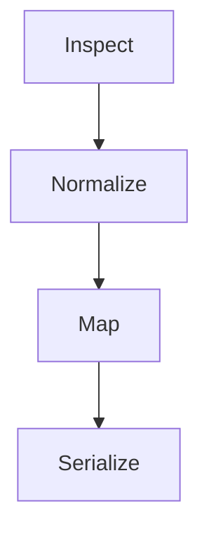

import Tabs from '@theme/Tabs';
import TabItem from '@theme/TabItem';

# ترجمة البروتوكولات

Parcel هو خطّ معالجة تحويل الحمولات في Envoy. يأخذ رسالة واردة بصيغة، ويُعيد كتابتها بالصيغة التي تتوقّعها الوجهة. لا حاجة إلى مخطّط مشترك. ولا إلى اتفاق متبادل بين المصدر والوجهة.

## مراحل خطّ المعالجة

تمرّ كلّ رسالة عبر أربع مراحل:



1. **Inspect** — تحديد نوع المحتوى، والترميز، وبنية الحمولة الواردة.
2. **Normalize** — تحويل الحمولة الخام إلى التمثيل الداخلي لـ Parcel (شجرة مفتاح-قيمة مكتوبة الأنواع).
3. **Map** — تطبيق قواعد التحويل المُعرَّفة في بيان الترحيل لإنتاج بنية المُخرَج.
4. **Serialize** — ترميز المُخرَج إلى الصيغة التي تتوقّعها الوجهة.

## تفاوض الصيغة

يفحص Parcel رأس `Content-Type` وبنية الحمولة لتحديد صيغة المصدر. وتُستنبَط صيغة الوجهة من بروتوكول الوجهة. وإن استخدم المصدر والوجهة الصيغة نفسها، فإنّ Parcel يُجري مرحلة التعيين رغم ذلك — لا يُتجاوز التحويل أبدًا.

| صيغة المصدر | صيغة الوجهة | وضع التعيين        |
|-------------|-------------|--------------------|
| JSON        | JSON        | إعادة تعيين الحقول |
| JSON        | نصّ عادي    | عرض من قالب        |
| XML         | JSON        | تحويل شجري         |
| Form-data   | JSON        | استخراج المفاتيح   |
| نصّ عادي    | JSON        | مطابقة الأنماط     |

## قواعد التحويل

<Tabs>
<TabItem value="json-to-json" label="JSON إلى JSON" default>

تُعيد تحويلات JSON إلى JSON تعيين الحقول من بنية المصدر إلى بنية الوجهة. تُعرّف كتلة `transform` في بيان الترحيل التعيينَ.

```text title="relay.grain — JSON to JSON"
relay "glassboard-to-canary" {
  source      = "glassboard"
  destination = "canary://infra-alerts"

  transform {
    title    = "[{{ severity }}] {{ alertname }}"
    body     = "{{ instance }} — {{ message }}"
    priority = severity_to_priority(severity)
  }
}
```

**المُدخَل (تنبيه Glassboard):**

```json title="Incoming payload"
{
  "alertname": "HighMemory",
  "severity": "warning",
  "instance": "db-02.arcline.internal",
  "message": "Memory usage at 87%"
}
```

**المُخرَج (إشعار Canary):**

```json title="Transformed payload"
{
  "title": "[warning] HighMemory",
  "body": "db-02.arcline.internal — Memory usage at 87%",
  "priority": 3
}
```

</TabItem>
<TabItem value="json-to-plaintext" label="JSON إلى نصّ عادي">

تُحوّل تحويلات JSON إلى نصّ عادي حقول المصدر إلى سلسلة نصّية مُسطّحة. مفيد للوجهات التي تقبل الرسائل العادية فقط.

```text title="relay.grain — JSON to plaintext"
relay "glassboard-to-spoke" {
  source      = "glassboard"
  destination = "spoke://alerts.internal/webhook"

  transform {
    format = "plaintext"
    template = """
      ALERT: {{ alertname }}
      SEVERITY: {{ severity }}
      HOST: {{ instance }}
      MESSAGE: {{ message }}
    """
  }
}
```

**المُخرَج:**

```text title="Plaintext output"
ALERT: HighMemory
SEVERITY: warning
HOST: db-02.arcline.internal
MESSAGE: Memory usage at 87%
```

</TabItem>
</Tabs>

## قواعد تعيين الحقول

يدعم Parcel ثلاثة أنواع من تعيينات الحقول:

| نوع التعيين | الصياغة                             | الوصف                                  |
|-------------|-------------------------------------|----------------------------------------|
| مباشر       | `title = "{{ alertname }}"`         | نسخ حقل المصدر مباشرة.                 |
| محسوب       | `priority = severity_to_priority()` | تطبيق دالّة مُدمَجة لاشتقاق قيمة.      |
| مركّب       | `body = "{{ a }} — {{ b }}"`        | دمج عدّة حقول مصدر في حقل مُخرَج واحد. |

### الدوالّ المُدمَجة

| الدالّة                    | المُدخَل | المُخرَج | الوصف                                          |
|----------------------------|----------|----------|------------------------------------------------|
| `severity_to_priority()`   | نصّ      | رقم      | تُعيّن مستويات الخطورة إلى أرقام أولوية (1-5). |
| `timestamp_to_iso()`       | رقم      | نصّ      | تُحوّل طوابع زمن Unix إلى ISO 8601.            |
| `truncate(field, length)`  | نصّ، n   | نصّ      | تقتطع سلسلة نصّية إلى الطول المحدّد.           |
| `default(field, fallback)` | أيّ، أيّ | أيّ      | تُعيد البديل إذا كان الحقل مفقودًا.            |

## التحويلات بفقدان مقابل بلا فقدان

ليس لكلّ حقل مصدر مكافئ في الوجهة. يميّز Parcel بين التحويلات بلا فقدان (تُحفَظ فيها كلّ بيانات المصدر) والتحويلات بفقدان (تُسقَط فيها بعض البيانات).

```text title="Lossless transform"
transform {
  mode = "lossless"
  # All source fields are included in the output.
  # Unmapped fields are appended to the body as key-value pairs.
}
```

```text title="Lossy transform (default)"
transform {
  # Only explicitly mapped fields appear in the output.
  # Unmapped source fields are discarded.
  title = "{{ alertname }}"
  body  = "{{ message }}"
}
```

:::info
الوضع بفقدان هو الافتراضي. معظم الوجهات تملك مخطّطًا ثابتًا وسترفض الحقول غير المتوقّعة. استخدم الوضع بلا فقدان فقط حين تستطيع الوجهة التعامل مع بيانات مفتاح-قيمة عشوائية.
:::

## الخطوات التالية

- [التوجيه والإرسال](/docs/core/routing-dispatch/) — كيف يوجّه Dispatch الرسائل المُحوَّلة إلى وجهاتها.
- [الإعداد](/docs/setup/configuration/) — مرجع بيان الترحيل الكامل، بما في ذلك توجيهات التحويل.
