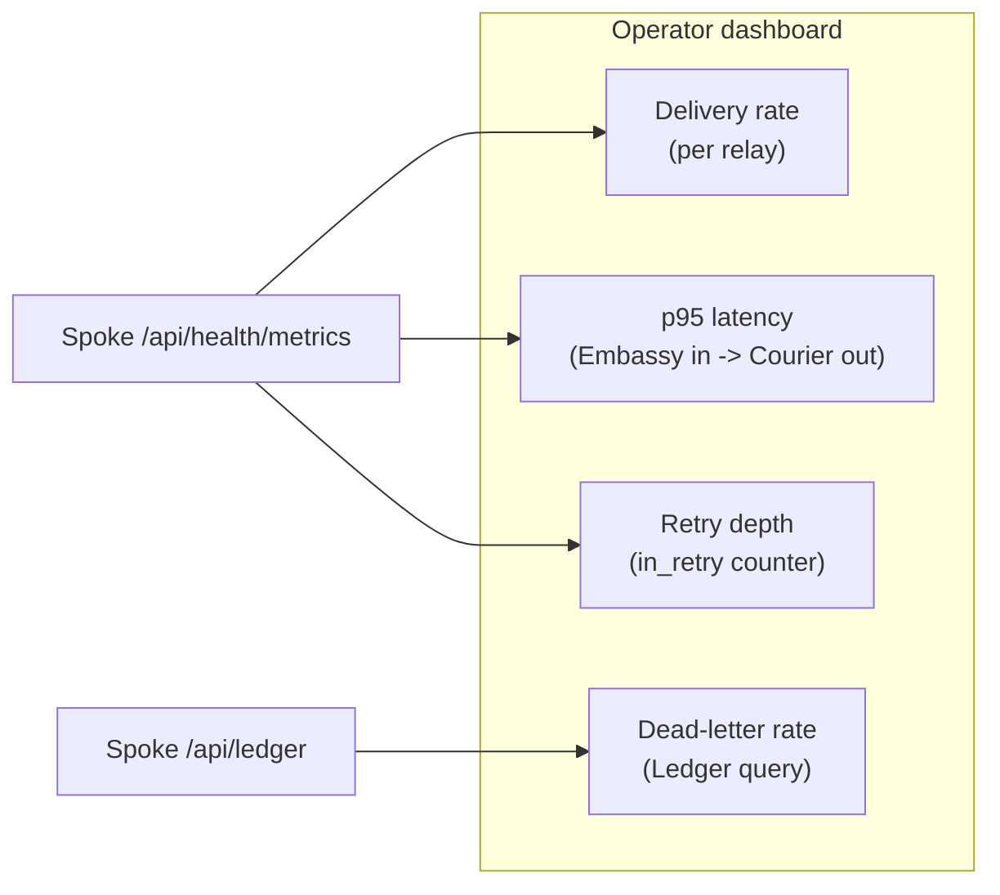
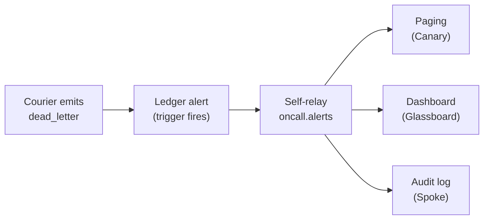

# رصد المُرحِّلات

المُرحِّل الذي لا يراقبه أحد هو مُرحِّل فشل بالفعل — أنت فقط لم تنتبه بعد. يمنحك Envoy أربع واجهات للرصد: Ledger للتحقيقات على مستوى المعاملة، ونقطة Spoke `/api/health/metrics` للتجميع الزمني، وتدفّق حالات إعادة المحاولة في Courier للتنبيهات على الذيل، وعدّادات Dispatch لكلّ مُرحِّل لرصد صحّة قواعد التوجيه.

> الرؤية ليست ميزة. بل شرطٌ مسبق. لا يمكنك تشغيل ما لا تستطيع رؤيته.

## ما الذي يجب مراقبته

لكلّ مُرحِّل الإشارات الصحّية الأربع نفسها. إذا انحرفت أيّ منها، فثمّة خطب.

| الإشارة                  | المصدر                           | المدى الصحّي                         | نبّه حين                       |
|--------------------------|----------------------------------|--------------------------------------|--------------------------------|
| معدّل التسليم            | `delivery_rate` لكلّ مُرحِّل     | `>= 0.99` على نافذة 5 دقائق متجدّدة  | يهبط دون `0.95` لمدّة دقيقتين  |
| عمق طابور إعادة المحاولة | عدّاد Courier `in_retry`         | `< 50` رسالة                         | يتجاوز `200` لمدّة 5 دقائق     |
| معدّل الرسائل الميّتة    | أحداث Ledger `dead_letter`       | `0` في الساعة، لكلّ مُرحِّل          | أيّ عدد غير صفري               |
| p95 طرف-لطرف             | من Embassy وارد إلى Courier صادر | `< 10ms` محلّي، `< 80ms` عبر المناطق | يتجاوز الميزانية لمدّة 3 دقائق |

كلّ ما سوى ذلك زخرفة.

## استعلام Ledger

Ledger بصيغة الإلحاق فقط وقابل للاستعلام عبر Spoke. كلّ تحويل، وتوجيه، ومحاولة، وتسليم هو صفّ واحد. تجيب الاستعلامات الجنائية عن السؤال الوحيد المهمّ خلال الحادثة: إلى أين ذهبت الرسالة؟

```bash title="Find every failed delivery in the last hour"
curl -s "http://localhost:8090/api/ledger?status=dead_letter&since=1h" \
  -H "Authorization: Bearer ${READ_TOKEN}" | jq
```

```json title="Ledger response"
{
  "entries": [
    {
      "id": "msg_e6d5c4b3",
      "relay": "glassboard-critical",
      "first_seen": "2026-05-15T09:14:21Z",
      "last_attempt": "2026-05-15T09:24:08Z",
      "attempts": 5,
      "destination": "canary://oncall-urgent",
      "failure_reason": "destination_5xx",
      "last_status_code": 503
    }
  ],
  "total": 1,
  "since": "2026-05-15T08:24:08Z"
}
```

صفّ بحسب المصدر، أو الوجهة، أو النافذة الزمنية، أو اسم المُرحِّل. كلّ عمود في Ledger مُفهرَس.

```bash title="Trace a single message end-to-end"
curl -s http://localhost:8090/api/ledger/msg_f7a2b8c4/trace \
  -H "Authorization: Bearer ${READ_TOKEN}" | jq
```

تُعيد نقطة التتبّع كلّ صفوف Ledger لتلك الرسالة بترتيب زمني — تحقّق Cipher، وحوّل Parcel، ووجّه Dispatch، وحاول Courier، وسلّم Courier. لا صفّ مُستنتَج. ولا صفّ مُعاد بناؤه. ما تراه هو ما حدث.

## بناء لوحات المراقبة

نقطة `/api/health/metrics` مُصمَّمة للاستخراج. اسحب كلّ 15 ثانية وأطعِم مخزن سلاسل زمنية.

```bash title="GET /api/health/metrics"
curl -s http://localhost:8090/api/health/metrics | jq
```

```json title="Metrics response (excerpt)"
{
  "relay_count": 4,
  "messages": {
    "total": 12847,
    "delivered": 12842,
    "dead_lettered": 5,
    "in_retry": 0
  },
  "latency": {
    "p50_ms": 2.1,
    "p95_ms": 4.3,
    "p99_ms": 7.8
  }
}
```

اللوحة المفيدة لها أربعة ألواح ولا شيء غير ذلك.



قاوم إغراء إضافة لوح خامس. لوحة مراقبة باثني عشر مقياسًا هي اثنا عشر مقياسًا لا يلقي إليها أحد نظرة.

:::tip
تتبّع كلّ مقياس لكلّ مُرحِّل، لا لكلّ مثيل Envoy. مُرحِّل واحد فاشل لا يُخفّض المجموع بما يكفي لإطلاق إنذار على مستوى المثيل، لكنّه قطعًا يحتاج إلى إيقاظ شخص ما.
:::

## التنبيه عند استنفاد المحاولات

يُصدر Courier حدث Ledger في اللحظة التي يستسلم فيها لرسالة. يصل الحدث قبل أن يلاحظ المُشغِّل، وهذا هو المقصد كلّه.

```bash title=".grain — alert on dead-letter"
ledger {
  alerts {
    name      = "dead-letter-fired"
    trigger   = "status == 'dead_letter'"
    window    = "1m"
    threshold = 1
    target    = "spoke://oncall.internal/ingest"
  }
}
```

عند إطلاق المُحفِّز، يُرسل Envoy تنبيهًا مهيكلًا إلى هدف Spoke المُعدّ. وفي معظم عمليات النشر، يكون ذلك الهدف مُرحِّلًا آخر — Envoy يحدّث نفسه، وهذه أنظف طريقة لتشتيت تنبيه إلى Canary، وخدمة استدعاء، وسجلّ تدقيق في آن واحد.



:::warning
الرسالة الميّتة ليست دائمًا فشل وجهة. قد تعني أيضًا أن Parcel لا يستطيع تحويل الحمولة، أو أن Cipher لا يستطيع الاتفاق على توقيع. ضمِّن دائمًا حقل `failure_reason` في حمولة التنبيه، وإلّا فسيقع مهندس المناوبة في تصحيح الطبقة الخاطئة.
:::

## تتبّع زمن الاستجابة p95

زمن الاستجابة من طرف لطرف لـ Envoy هو زمن الساعة بين حدث Embassy `accept` وحدث Courier `delivered` للرسالة نفسها. كلّ صفّ في Ledger يحمل معرّف الرسالة وطابعًا زمنيًّا عالي الدقّة، فلا يتطلّب الحساب نظام تتبّع منفصلًا.

```bash title="Compute p95 over the last 15 minutes"
curl -s "http://localhost:8090/api/ledger/latency?since=15m&percentile=95" \
  -H "Authorization: Bearer ${READ_TOKEN}" | jq
```

```json title="Latency response"
{
  "window": "15m",
  "percentile": 95,
  "latency_ms": 4.3,
  "samples": 1842,
  "by_relay": {
    "threadbare-pushes": 3.1,
    "glassboard-critical": 5.8,
    "canary-down": 4.2,
    "custom-deploy-hook": 6.0
  }
}
```

يُبقي Envoy السليم بمنطقة واحدة p95 دون 10 ميلي ثانية. عبر المناطق — راجع [توسيع المُرحِّلات](/docs/operations/scaling-relays/) — يُضاف زمن ذهاب وإياب بين المناطق فيدفع الميزانية الواقعية إلى ما بين 60 و80 ميلي ثانية بحسب الجغرافيا.

:::info
p99 أكثر دلالة من p95 للمُرحِّلات التي تُشتّت إلى وجهات بطيئة. اضبط أهداف مستوى الخدمة على أيّ مئوية تلتقط فعلًا الذيل الطويل للوجهة التي تهمّك.
:::

## ما الذي لا يجب رصده

قائمة قصيرة، لأن مقبرة التنبيهات مليئة بلوحات أطلقت على الإشارة الخاطئة.

- **CPU والذاكرة على مضيف Envoy.** Envoy في وضع الخمول دون 1% CPU و8MB مُقيمة. إن كان المضيف مشغولًا، فالسبب أعلى في السلسلة — حقّق في الوجهة، لا في المُرحِّل.
- **عدد اتصالات TCP.** Embassy يُضاعِف الاتصالات بقوّة. الرقم الذي تراه ليس الرقم الذي تظنّه.
- **عدد goroutines.** مفيد خلال جلسة تحليل أداء، عديم النفع على لوحة مراقبة. الارتفاعات طبيعية أثناء التشتيت.

راقب الإشارات الأربع أعلى هذه الصفحة. كلّ ما سواها ضجيج متنكّر في زيّ معلومات.

## الخطوات التالية

- [توسيع المُرحِّلات](/docs/operations/scaling-relays/) — التوسّع الأفقي، والتقسيم، وضبط ميزانية إعادة المحاولات، وتجاوز الفشل متعدّد المناطق.
- [مرجع الواجهة البرمجية](/docs/reference/api-reference/) — Spoke API الكامل بما في ذلك نقاط استعلام Ledger.
- [البنية المعمارية](/docs/advanced/architecture/) — كيف يتفاعل Ledger وCourier وEmbassy تحت الحمل.
