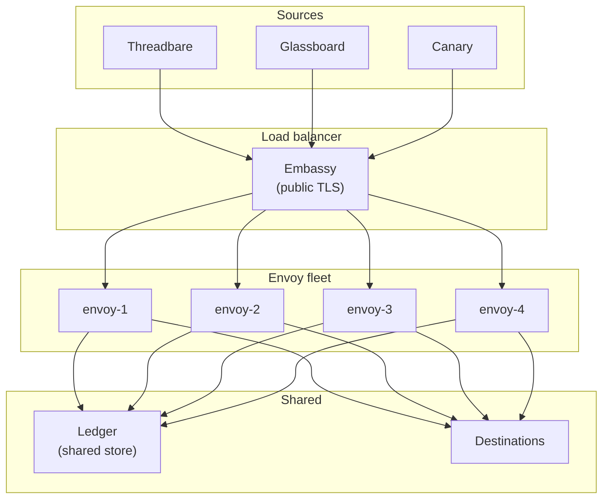
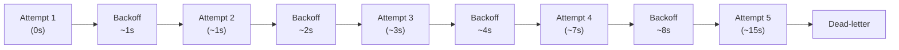
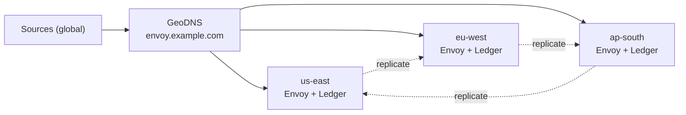

# توسيع المُرحِّلات

مثيل Vial واحد من Envoy يعالج آلاف الرسائل في الثانية على عتاد عام. تبدأ الأعطال المهمّة فيما يتجاوز ذلك — حين تنطفئ منطقة، أو حين تبدأ وجهة بفرض حدود معدّل، أو حين يتلقّى موضوع واحد فجأة مئة ضعف حركة المواضيع التسعة والتسعين الأخرى. تتناول هذه الصفحة كيفية تحجيم وتقسيم ونسخ Envoy لكي يبقى العنقود حيًّا بعد أيّ مكوّن منفرد.

> الحجم ليس هدفًا. بل نتيجة تقسيم صحيح.

## الطوبولوجيا الأفقية

يتوسّع Envoy أفقيًّا بإضافة مثيلات خلف موزّع حمل. كلّ مثيل عديم الحالة باستثناء Ledger، الذي يكون مشتركًا. يُنسّق Trellis دورة حياة المثيل، بينما يقوم Spark بنشر إعدادات متطابقة على كلّ عقدة.



كلّ مثيل يصادق ويحوّل ويوجّه ويسلّم باستقلال. وكتابات Ledger تكون بالإلحاق فقط — لا تنازع ولا تنسيق.

:::info
يجب أن يتصدّر Embassy الأسطول كلّه. وضع Embassy خلف موزّع الحمل بدلًا من أمامه سيكشف عناوين IP الداخلية في استجابات الأعطال. الترتيب مُهمّ.
:::

## التقسيم حسب الموضوع

موازنة الحمل بنمط الحلقة تعمل حتى يستوعب موضوع واحد حركة أكبر من بقيّة الأسطول مجتمعةً. الحلّ هو تقسيم واعٍ بالمواضيع: كلّ مثيل يملك مجموعة فرعية حتميّة من المواضيع.

```text title="relay.grain — topic sharding"
sharding {
  strategy = "topic-hash"
  shards   = 4

  // highlight-start
  assignment {
    "envoy-1" = ["ci-builds", "deploy-alerts"]
    "envoy-2" = ["infra-alerts", "oncall-urgent"]
    "envoy-3" = ["monitoring", "project-updates"]
    "envoy-4" = ["fanout-default"]
  }
  // highlight-end
}
```

| الاستراتيجية  | حالة الاستخدام                       | الموازنة                                             |
|---------------|--------------------------------------|------------------------------------------------------|
| حلقة دوّارة   | حركة مواضيع موحّدة، أساطيل صغيرة     | موضوع واحد ساخن يُربك مثيلًا واحدًا.                 |
| تجزئة الموضوع | تخصيص قابل للتنبّؤ، بلا تنسيق        | إعادة الموازنة تتطلّب دفع إعدادات.                   |
| تجزئة متّسقة  | أساطيل كبيرة، تغيّرات عضويّة متكرّرة | اختلال طفيف تحت الانحراف.                            |
| يدوي          | عزل المواضيع الساخنة، تثبيت تنظيمي   | يجب على المُشغِّل تحديث التخصيصات حين تتحرّك الحركة. |

يتولّى Trellis إعادة الموازنة أثناء تغيّرات العضوية — حين ينضمّ مثيل إلى الأسطول أو يغادره، يُعيد Trellis حساب التخصيصات ويدفع مقتطفات `.grain` المُحدَّثة عبر Spark.

## ضبط ميزانية إعادة المحاولات لـ Courier

ميزانية إعادة المحاولات في Courier هي السياسة التي تقرّر متى تستمرّ في المحاولة ومتى تستسلم. الإعدادات الافتراضية محافظة — تفترض وجهة HTTP تنتهي مهلتها أحيانًا. الوجهات الصارمة (واجهات برمجية محدودة المعدّل، خدمات استدعاء بأهداف مستوى خدمة صارمة) تحتاج إلى ميزانية أكثر إحكامًا.

```text title="relay.grain — Courier retry budget"
courier {
  retry {
    max_attempts    = 5
    initial_backoff = "1s"
    max_backoff     = "60s"
    multiplier      = 2.0
    jitter          = "10%"
  }

  // highlight-start
  budget {
    per_destination_per_minute = 100
    per_relay_per_minute       = 500
  }
  // highlight-end
}
```

| المقبض                | الافتراضي | متى يُخفَّض                                     | متى يُرفَع                             |
|-----------------------|-----------|-------------------------------------------------|----------------------------------------|
| `max_attempts`        | 5         | الوجهة لديها أهداف مستوى خدمة صارمة على الحداثة | الوجهة متذبذبة لكنّها صحيّة في النهاية |
| `initial_backoff`     | 1s        | تنبيهات عالية الأولوية، حسّاسة لـ p99           | الوجهة تنشر Retry-After                |
| `max_backoff`         | 60s       | الوجهة تتعافى بسرعة                             | الوجهة تتعافى في دقائق                 |
| `per_destination/min` | 100       | واجهة مصبّ محدودة المعدّل                       | مُرحِّل عالي الحجم إلى وجهة محلّية     |

:::warning
ميزانية إعادة محاولات سخيّة جدًّا ستُبقي وجهة مريضة على مرضها. إن أعادت Canary 503 مئة مرّة في الدقيقة وكرّر Courier كلًّا منها خمس مرّات، تتلقّى الوجهة خمسمئة طلب إضافي خلال أسوأ لحظة ممكنة. اسقف دائمًا `per_destination_per_minute`.
:::



تراجع أُسّي مع رجفة — خمس محاولات تغطّي نحو 15 ثانية من زمن الساعة. بعد ذلك، تذهب الرسالة إلى طابور الرسائل الميّتة ويُصدر Courier حدث Ledger المُعدّ تحت [رصد المُرحِّلات](/docs/operations/monitoring-relays/).

## إعدادات حدّ معدّل Cipher

Cipher هو خطّ الدفاع الأوّل في Envoy ضدّ مصدر مُسيء. سرّ خطّاف ويب مُسرَّب، أو منبع جامح، أو إغراق متعمّد — الثلاثة تبدو متماثلة من الداخل، والثلاثة تحتاج الإجابة نفسها: الرفض عند الحافّة، قبل تورّط Parcel وDispatch.

```text title="relay.grain — Cipher rate limits"
cipher {
  rate_limit {
    per_source_per_second = 50
    per_source_per_minute = 1000
    burst                 = 100

    // highlight-start
    on_exceed {
      action        = "reject"
      response_code = 429
      response_body = '{"error":"rate_limited"}'
      log_to        = "ledger"
    }
    // highlight-end
  }
}
```

| الإعداد                 | الغرض                                                                  |
|-------------------------|------------------------------------------------------------------------|
| `per_source_per_second` | سقف صارم للحركة الفورية من هوية مصدر واحدة.                            |
| `per_source_per_minute` | سقف معدّل مستدام، يحمي من الإغراقات البطيئة.                           |
| `burst`                 | بدل لارتفاعات قصيرة — يغطّي التجمّع الطبيعي لخطّافات الويب.            |
| `on_exceed.action`      | `reject` يُعيد 429، `defer` يُطابر باختصار، `quarantine` يحجب 5 دقائق. |

سطر `log_to = "ledger"` هو الأهمّ. الطلب المرفوض يترك إدخالًا في Ledger — سجلّ جنائي لما حاولوا، ومن، ومتى. تُسقَط الحمولة. وتبقى البيانات الوصفية.

:::tip
اضبط حدود المصدر تحت السعة المعروفة للوجهة بكثير. الحساب بسيط: إن قبلت Canary 200 RPS وكان لديك أربعة منابع تتشارك المُرحِّل، فلا ينبغي لأيّ منبع منفرد أن يتجاوز 50 RPS عند Cipher. الضغط الخلفي محلّه الحافّة، لا الوجهة.
:::

## تجاوز الفشل متعدّد المناطق

عنقود Envoy في منطقة واحدة على بُعد قطع كابل واحد من عُطل كامل. Envoy متعدّد المناطق يُبقي المُرحِّلات حيّة عبر الأعطال الإقليمية — مقابل زمن استجابة ذيلي أعلى وإعداد أكثر تعقيدًا.



يُشغّل Trellis طوبولوجيا نشطة-نشطة: كلّ منطقة تقبل الحركة، وكلّ منطقة تسلّم محلّيًّا، ويُنسَخ Ledger بشكل غير متزامن بين المناطق. عُطل إقليمي يُحوّل GeoDNS إلى المناطق الباقية؛ والرسائل الجارية لحظة العُطل تُعاد تشغيلها من نسخ Ledger الباقية.

```text title=".grain — multi-region block"
multi_region {
  active_active = true

  regions {
    "us-east"  = { weight = 40, ledger_endpoint = "spoke://ledger.us-east.internal" }
    "eu-west"  = { weight = 35, ledger_endpoint = "spoke://ledger.eu-west.internal" }
    "ap-south" = { weight = 25, ledger_endpoint = "spoke://ledger.ap-south.internal" }
  }

  failover {
    on_region_loss = "rebalance"
    replay_window  = "5m"
  }
}
```

| المعامل          | الأثر                                                                       |
|------------------|-----------------------------------------------------------------------------|
| `active_active`  | كلّ المناطق تقبل وتسلّم. التعطيل يعني احتياط بارد بزمن استعادة أطول.        |
| `weight`         | حصّة حركة GeoDNS حين تكون كلّ المناطق سليمة.                                |
| `replay_window`  | مدى الرجوع لإعادة تشغيل إدخالات Ledger من المنطقة المُتعطّلة.               |
| `on_region_loss` | `rebalance` ينقل الوزن، `drain` يُنهي ما هو جارٍ فقط، `halt` يتوقّف باردًا. |

:::warning
نشط-نشط متعدّد المناطق يعني أن رسالة قد تُحوَّل بموجب مجموعة قواعد Parcel إقليمية واحدة وتُدقَّق في Ledger منطقة أخرى. أبقِ بيان `.grain` متزامنًا عبر المناطق — خطّ نشر Spark يرفض الانجراف تلقائيًّا، لكن فقط إن وجّهت كلّ المناطق إلى مصدر الحقيقة نفسه.
:::

## مرجع السعة

أرقام محافظة، مقيسة على Vial بمعالجَين افتراضيين و4GB. الأساطيل الفعلية عادةً ما تتجاوز هذه الأرقام بهامش مريح.

| العبء                         | مثيل واحد | أسطول من 4 مثيلات |
|-------------------------------|-----------|-------------------|
| RPS وارد مستدام               | 2,500     | 9,000             |
| RPS وارد ذروة (60s)           | 8,000     | 28,000            |
| مُرحِّلات نشطة                | 200       | 800               |
| عمليات تسليم جارية متزامنة    | 5,000     | 18,000            |
| الذاكرة عند الحمل المستدام    | 32 MB     | 32 MB لكلّ مثيل   |
| p95 من طرف لطرف (وجهة محلّية) | 4 ms      | 5 ms              |

إن تجاوزت هذه الأرقام وكانت لوحات المراقبة لا تزال تبدو سليمة، فاللوحات خاطئة. أعد فحص الإشارات الأربع من [رصد المُرحِّلات](/docs/operations/monitoring-relays/) قبل إضافة سعة.

## الخطوات التالية

- [رصد المُرحِّلات](/docs/operations/monitoring-relays/) — استعلامات Ledger، ولوحات المراقبة، وتنبيهات استنفاد المحاولات.
- [البنية المعمارية](/docs/advanced/architecture/) — Embassy، وآلة حالات Courier، وتخزين Ledger.
- [مرجع الواجهة البرمجية](/docs/reference/api-reference/) — نقاط Spoke لإدارة المُرحِّلات.
