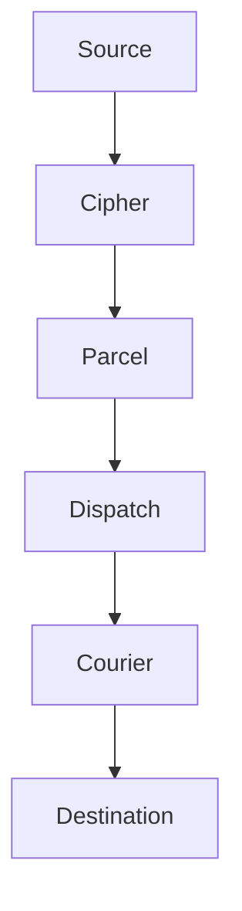

# نظرة عامّة

Envoy مترجم بروتوكولات ومحرّك ترحيل للأنظمة التي لم تُصمَّم لتفهم بعضها. يجلس بين أيّ خدمتين، يتعلّم كيف تتحدّثان، ويحوّل الرسالة، ويسلّمها — دون أن يعرف أيٌّ من الطرفين أن في الغرفة وسيطًا.

لا صيغة مشتركة. لا بروتوكول مشترك. لا اتفاق ثنائي. مجرّد تسليم.

> ينبغي ألّا يتطلّب التكامل أن يتفق الطرفان على صيغة. إن احتاج كلا الطرفين إلى التغيير، فأنت لم تحلّ مشكلة التكامل — بل خلقت مشكلة جديدة.

## كيف يعمل

تمرّ كلّ رسالة عبر خمس مراحل: المصادقة، والفحص، والتحويل، والتوجيه، والتسليم. بيان الترحيل يُعلن القواعد. وEnvoy يتولّى التنفيذ.



1. **Cipher** يصادق على المصدر — توقيعات HMAC، أو الرموز الحاملة، أو قوائم IP المسموح بها.
2. **Parcel** يفحص الحمولة ويحوّلها إلى الصيغة التي تتوقّعها الوجهة.
3. **Dispatch** يوجّه الرسالة إلى الوجهة الصحيحة استنادًا إلى المحتوى، أو المصدر، أو درجة الخطورة.
4. **Courier** يسلّم مع ضمان إعادة المحاولة، وطوابير الرسائل الميّتة، وإيصالات التسليم.

## مجموعة الأدوات

| الأداة       | الغرض                                                                               |
|--------------|-------------------------------------------------------------------------------------|
| **Dispatch** | محرّك توجيه ذكي — يوجّه حسب المحتوى، أو المصدر، أو درجة الخطورة.                    |
| **Courier**  | محرّك إعادة محاولات بضمان تسليم — تراجع أُسّي، وطوابير رسائل ميّتة، وإيصالات تسليم. |
| **Parcel**   | خطّ معالجة لتحويل الحمولات — يُعيد كتابة الرسائل بين الصيغ.                         |
| **Cipher**   | بوّابة مصادقة — توقيعات HMAC، ورموز حاملة، وقوائم IP مسموح بها.                     |
| **Ledger**   | مسار تدقيق كامل للتسليم — كلّ رسالة استُقبلت وحُوِّلت ووُجِّهت وسُلِّمت.            |
| **Embassy**  | وكيل عكسي لإخفاء المنشأ — يُبقي الخدمات الداخلية بعيدة عن الإنترنت العامّ.          |

:::info بصمة دنيا
يُشحَن Envoy بوصفه وحدة Vial واحدة بحجم 3MB دون أيّ تبعيات خارجية. كلّ معالج بروتوكول، ومحرّك تحويل، وآلية إعادة محاولة، مبنيّة داخليًّا. لا يُجلَب أيّ شيء من الخارج عند البناء أو وقت التشغيل.
:::

## البدء السريع

اسحب وحدة Vial وابدأ التشغيل:

```bash title="Start Envoy"
vial pull envoy
vial run envoy --port 8090
```

أرسل رسالة اختبار عبر المُرحِّل:

```bash title="Test delivery"
curl -X POST http://localhost:8090/relay/test-topic \
  -H "Content-Type: application/json" \
  -H "Authorization: Bearer your-relay-token" \
  -d '{"title": "Hello", "message": "Relay is operational."}'
```

تُصادَق الرسالة بواسطة Cipher، وتُحوَّل بواسطة Parcel (إن انطبقت القواعد)، وتُوجَّه بواسطة Dispatch، وتُسلَّم بواسطة Courier. ويسجّل Ledger المعاملة كاملة.

## الخطوات التالية

- [التثبيت](/docs/setup/installation/) — خيارات النشر عبر Vial وSpark وTrellis.
- [أوّل مُرحِّل لك](/docs/setup/your-first-relay/) — استقبل خطّاف ويب من Threadbare، وحوِّله، وسلّمه إلى Canary.
- [الإعداد](/docs/setup/configuration/) — بيان الترحيل بصيغة `.grain` بشيء من التعمّق.
- [مرجع الواجهة البرمجية](/docs/reference/api-reference/) — مرجع Spoke API الكامل لإدارة المُرحِّلات.
