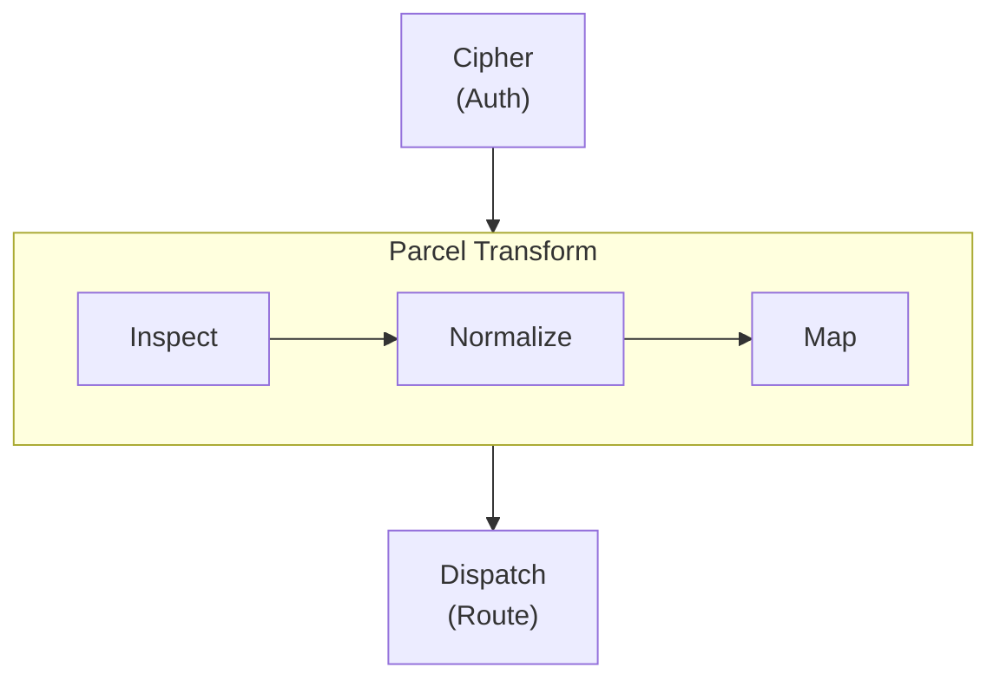
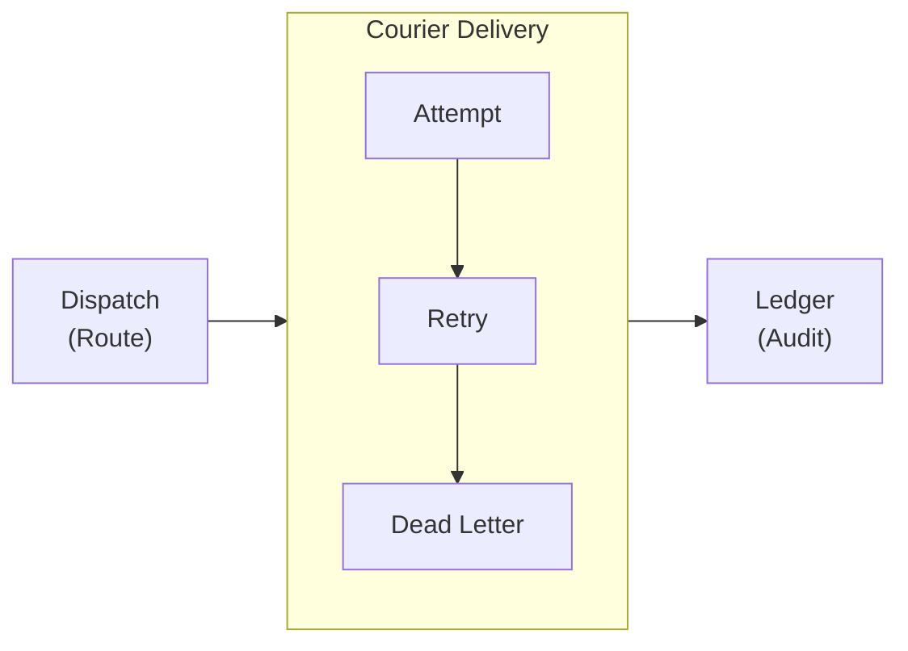
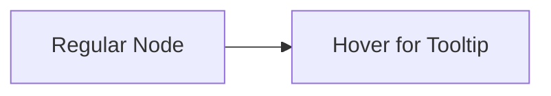

import Details from '@theme/Details';
import Tabs from '@theme/Tabs';
import TabItem from '@theme/TabItem';

# عرض القالب

تُعرّف هذه الصفحة بكلّ مكوّن قالب متاح في إعداد Docusaurus المُسبَق. استخدمها بوصفها دليل أسلوب حيّ عند بناء صفحات التوثيق.

## العناوين

يُظهر التسلسل الهرمي للعناوين أدناه كيف يُعرَض كلّ مستوى. استخدم `h2` إلى `h4` لبنية الصفحة. واحتفظ بـ `h5` و`h6` لحالات نادرة يلزم فيها تعشيش أعمق بحقّ.

### عنوان من المستوى الثالث

#### عنوان من المستوى الرابع

##### عنوان من المستوى الخامس

###### عنوان من المستوى السادس

---

## تنسيق النصّ المضمَّن

يُعرَض نصّ الفقرة العادي بخطّ الجسم الأساسي. أبقِ الفقرات قصيرة — من جملتين إلى أربع جمل مثالي للتوثيق التقني.

**النصّ الغامق** يجذب الانتباه إلى المصطلحات الأساسية عند ذكرها أوّل مرّة. *النصّ المائل* مفيد لتقديم المصطلحات أو الإشارة إلى العناوين. ~~النصّ المشطوب~~ يُشير إلى محتوى لم يعد دقيقًا أو تمّ تجاوزه. كما يمكنك دمج **_الغامق والمائل معًا_** حين يكون التأكيد حاسمًا.

`الشيفرة` المضمّنة للإشارة إلى أسماء الدوالّ مثل `dispatch.route`، أو مسارات الملفّات مثل `relay.grain`، أو خيارات واجهة الأوامر مثل `--port`.

---

## الروابط

تشير الروابط الداخلية إلى صفحات أخرى داخل موقع التوثيق هذا:

- [نظرة عامّة](/docs/overview/) — أوّل صفحة ينبغي للمستخدمين الجدد قراءتها.
- [دليل التثبيت](/docs/setup/installation/) — المتطلّبات المسبقة وخطوات الإعداد.

تشير الروابط الخارجية إلى موارد خارج الموقع:

- [مرجع لغة Alloy](https://nova.cbnventures.io) — توثيق Alloy الرسمي.
- [مواصفة بروتوكول Spoke](https://nova.cbnventures.io) — إطار HTTP الذي يكشف Envoy واجهته البرمجية من خلاله.

---

## القوائم

### قائمة غير مرتّبة

- Cipher يتحقّق من هوية المصدر قبل أن تصل أيّ حمولة إلى خطّ المعالجة.
- Parcel يحوّل الرسائل بين الصيغ دون اشتراط مخطّطات مشتركة.
- Dispatch يوجّه حسب المحتوى، أو المصدر، أو الخطورة، أو قواعد وقت اليوم.
- Courier يضمن التسليم بتراجع أُسّي وطوابير رسائل ميّتة.

### قائمة مرتّبة

1. اسحب وحدة Vial وابدأ المُرحِّل.
2. اكتب بيان `.grain` يُعلن خطوط ترحيلك.
3. أعدّ خطّاف ويب المصدر للإشارة إلى نقطة Envoy لديك.
4. ادفع حدث اختبار وتحقّق من التسليم في Ledger.
5. أضف مُرحِّلات إضافية كلّما تنامت التكاملات.

### قوائم متداخلة

- **أوامر واجهة الأوامر**
  - إدارة المُرحِّل
    - `envoy start` — بدء خادم المُرحِّل بالبيان المُعدّ.
    - `envoy validate` — التحقّق من بيان المُرحِّل دون بدئه.
    - `envoy status` — عرض المُرحِّلات النشطة، ومعدّلات التسليم، وأعداد الرسائل الميّتة.
  - الفحص
    - `envoy ledger query` — استعلام سجلّ تدقيق التسليم.
    - `envoy courier retry` — إعادة محاولة رسالة ميّتة يدويًّا.
- **مراحل خطّ المعالجة**
  - Cipher — المصادقة والتحقّق من المصدر.
  - Parcel — تحويل الحمولة وتفاوض الصيغة.
  - Dispatch — التوجيه واختيار الوجهة.

---

## الاقتباسات

> أفضل بنية تحتية هي تلك التي تنساها حتى تحتاجها.

تعمل الاقتباسات المتداخلة للإسناد أو التعليقات اللاحقة:

> ينبغي ألّا يتطلّب التكامل أن يتفق الطرفان على صيغة.
>
> > لذلك يترجم Envoy بين الأنظمة بدلًا من الطلب منها أن تتغيّر — فهو يزيل مشكلة التنسيق قبل أن تبدأ.

---

## كتل الشيفرة

### إبراز الصياغة

Alloy مع شريط عنوان:

```alloy title="src/relay/handler.al"
interface RelayConfig {
  source: Text
  cipher: CipherMode
  destination: Text
  transform: TransformRules
}

function handleRelay(config: RelayConfig, payload: Unknown): DeliveryResult {
  const verified: CipherResult = cipher.verify(config.cipher, payload)

  if (!verified.valid) {
    return DeliveryResult.rejected(verified.reason)
  }

  const transformed: Parcel = parcel.transform(config.transform, payload)
  return courier.deliver(config.destination, transformed)
}
```

CSS مع أرقام الأسطر:

```css showLineNumbers title="src/styles/base.css"
:root {
  --color-primary: oklch(0.55 0.18 260);
  --color-surface: oklch(0.98 0 0);
  --color-text: oklch(0.15 0 0);
  --spacing-base: 0.5rem;
  --radius-md: 0.375rem;
}

.container {
  max-width: 72rem;
  margin-inline: auto;
  padding-inline: var(--spacing-base);
}
```

إعداد Grain:

```text title="relay.grain"
relay "glassboard-to-canary" {
  source      = "glassboard"
  cipher      = "hmac-sha256"
  destination = "canary://infra-alerts"

  transform {
    title    = "[{{ severity }}] {{ alertname }}"
    body     = "{{ instance }} — {{ message }}"
    priority = severity_to_priority(severity)
  }
}
```

أوامر Spark:

```bash
# Install Envoy and start the relay
vial pull envoy:latest
envoy start --config relay.grain

# Verify the relay is operational
envoy status
curl http://localhost:8090/api/health
```

### إبراز الأسطر

استخدم تعليقات `highlight-next-line` و`highlight-start` و`highlight-end` لجذب الانتباه إلى أسطر محدّدة:

```text title="relay.grain"
relay "threadbare-pushes" {
  source = "threadbare"

  // highlight-start
  cipher = "hmac-sha256"
  cipher_config {
    header = "X-Threadbare-Signature-256"
  }
  // highlight-end

  transform {
    title = "[{{ repo }}] {{ count }} commit(s)"
    // highlight-next-line
    body  = "{{ author }}: {{ commit_summary }}"
  }
}
```

### إبراز الفروق

اعرض الإضافات والإزالات داخل كتلة شيفرة:

```text title="relay.grain"
relay "glassboard-alerts" {
// remove-start
  destination = "canary://infra-alerts"
// remove-end
// add-start
  fanout = [
    "canary://infra-alerts",
    "canary://oncall-urgent",
    "spoke://dashboard.internal/webhook"
  ]
// add-end

  transform {
    title = "[{{ severity }}] {{ alertname }}"
  }
}
```

---

## التنبيهات

:::note
الملاحظات توفّر سياقًا تكميليًّا مفيدًا لكنّه غير ضروري. يستطيع القارئ تخطّيها دون أن يفوته شيء أساسي.
:::

:::tip
تشارك النصائح أفضل الممارسات أو الاختصارات التي توفّر الوقت. فعلى سبيل المثال، شغّل `envoy validate --config relay.grain` لفحص بيانك من الأخطاء قبل بدء المُرحِّل.
:::

:::info
تُبرز كتل المعلومات تفاصيل خلفية تُعين على الفهم. يستخدم خطّ Parcel في Envoy نموذجًا من أربع مراحل — الفحص، والتطبيع، والتعيين، والتسلسل — بصرف النظر عن صيغ المصدر والوجهة.
:::

:::warning
تُحذّر التنبيهات من مزالق محتملة. تغيير توجيه `cipher` على مُرحِّل حيّ يتطلّب إعادة تشغيل عملية Envoy. إعادة التحميل الساخن تنطبق على قواعد التحويل والتوجيه فقط.
:::

:::danger
تُشير كتل الخطر إلى إجراءات قد تُسبّب فقدان بيانات أو تغييرات كاسرة. تشغيل `envoy ledger purge --confirm` يحذف نهائيًّا كلّ إدخالات التدقيق الأقدم من نافذة الاحتفاظ دون مسار استعادة.
:::

:::tip[عنوان مخصّص]
تقبل التنبيهات عنوانًا مخصّصًا بين قوسين بعد الكلمة المفتاحية. استخدم هذا لجعل العنوان أكثر تخصيصًا للمحتوى.
:::

---

## التفاصيل / الأقسام القابلة للطيّ

<Details>
<summary>ما إصدارات Vial المدعومة؟</summary>

يتطلّب Envoy 2.x إصدار Vial 4.0 أو أحدث. إصدارات Vial الأقدم لا تدعم الصورة الأساسية الدنيا التي يستخدمها Envoy لتحقيق بصمته البالغة 3MB. ويتطلّب مسار نشر Trellis إصدار Trellis 1.8 أو أحدث.

</Details>

<Details>
<summary>كيف تتركّب قواعد فلتر المُرحِّل؟</summary>

يُعلن كلّ مُرحِّل كتلة فلتره الخاصّة. يُقيّم Envoy المُرحِّلات بترتيب الإعلان، ويُعالج الرسالةَ أوّلُ مُرحِّل مطابِق:

```text title="relay.grain"
relay "critical-only" {
  source = "glassboard"
  filter { severity = "critical" }
  destination = "canary://oncall-urgent"
}

relay "everything-else" {
  source = "glassboard"
  destination = "canary://infra-alerts"
}
```

الترتيب مهمّ — ضع المُرحِّلات المحدّدة قبل المُرحِّلات الجامعة كي تحصل على أولوية المطابقة.

</Details>

---

## التبويبات

<Tabs>
<TabItem value="vial" label="Vial" default>

```bash
vial pull envoy:latest
```

</TabItem>
<TabItem value="spark" label="Spark CLI">

```bash
spark install envoy
```

</TabItem>
<TabItem value="trellis" label="Trellis">

```bash
trellis apply envoy.trellis.grain
```

</TabItem>
</Tabs>

<Tabs>
<TabItem value="alloy" label="Alloy" default>

```alloy title="src/relay.al"
function relay(source: Text, destination: Text): DeliveryResult {
  return courier.deliver(destination, parcel.transform(source))
}
```

</TabItem>
<TabItem value="ferric" label="Ferric">

```ferric title="src/relay.fe"
fn relay(source: &str, destination: &str) -> DeliveryResult {
    courier::deliver(destination, parcel::transform(source))
}
```

</TabItem>
</Tabs>

---

## الجداول

| المترجم    | الأحداث             | المصادقة الافتراضية | الوصف                                  |
|------------|---------------------|---------------------|----------------------------------------|
| Threadbare | push, PR, release   | HMAC-SHA256         | خطّافات ويب لاستضافة شيفرة المصدر.     |
| Glassboard | alerting, resolved  | HMAC-SHA256         | إشعارات تنبيهات الرصد ولوحات المراقبة. |
| Canary     | down, up, heartbeat | Bearer              | خطّافات ويب لتغيّر حالات رصد التوفّر.  |
| Generic    | any                 | Bearer              | تكاملات مخصّصة مع تعيين حقول يدوي.     |
| Spoke      | any                 | IP allowlist        | ترحيل داخلي بين الخدمات.               |
| Conduit    | build, deploy       | HMAC-SHA256         | إشعارات أحداث خطوط CI/CD.              |

جدول مُصغَّر بعمودين:

| الاختصار                                          | الإجراء      |
|---------------------------------------------------|--------------|
| <kbd>Ctrl</kbd> + <kbd>C</kbd>                    | نسخ          |
| <kbd>Ctrl</kbd> + <kbd>V</kbd>                    | لصق          |
| <kbd>Ctrl</kbd> + <kbd>Shift</kbd> + <kbd>P</kbd> | لوحة الأوامر |

---

## الصور

تستخدم الصور صياغة Markdown القياسية. ضع الملفّات في مجلّد `static/img/` وأشر إليها بمسار مطلق:

```markdown

```

---

## مخطّطات Mermaid

تُعرَض مخطّطات Mermaid مباشرة من كتل شيفرة مُسوَّرة. يُطبّق الإعداد المُسبَق ألوانًا واعية بالقالب، وحدود مجموعات مُدوَّرة، ومنحنيات حواف ناعمة تلقائيًّا.

### رسم بياني عمودي مع مجموعة أفقية



### رسم بياني أفقي مع مجموعة عموديّة



### اختبار التلميح



---

## الفواصل الأفقية

تفصل الفواصل الأفقية بين الأقسام الكبرى. تُعرَض بوصفها خطًّا رفيعًا يمتدّ على عرض المحتوى. الشُّرَط الثلاث (`---`) فوق كلّ قسم وتحته في هذه الصفحة هي فواصل أفقية.

---

## اختصارات لوحة المفاتيح

استخدم وسوم `<kbd>` لعرض مفاتيح لوحة المفاتيح بشكل مضمَّن:

- <kbd>Ctrl</kbd> + <kbd>S</kbd> — حفظ الملفّ الحالي.
- <kbd>Ctrl</kbd> + <kbd>Shift</kbd> + <kbd>F</kbd> — البحث عبر مساحة العمل بأكملها.
- <kbd>Ctrl</kbd> + <kbd>`</kbd> — تبديل الطرفية المُدمَجة.
- <kbd>Alt</kbd> + <kbd>Up</kbd> / <kbd>Down</kbd> — نقل سطر لأعلى أو لأسفل.
- <kbd>Ctrl</kbd> + <kbd>D</kbd> — تحديد الورود التالي للكلمة الحالية.

على macOS، استبدل <kbd>Ctrl</kbd> بـ <kbd>Cmd</kbd> لمعظم الاختصارات.
