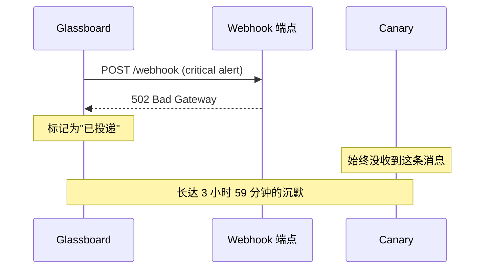

一条 Glassboard 告警在某个星期二的 3:47 触发：`web-03` 的 CPU 已经在 97% 连续撑了十二分钟。监控仪表盘亮了，发往 Canary 的 webhook 触发了——然后什么都没发生。

{/* truncate */}

没人醒来。服务器一直宕了四个小时，是三位客户先于我们发现的。

## 时间线

```text title="事故时间线 — 2025-02-18"
03:35  web-03 CPU crosses 90% threshold
03:47  Glassboard fires critical alert
03:47  Webhook POST to Canary endpoint — 502 Bad Gateway
03:47  No retry. No log. No escalation.
03:48  Glassboard marks alert as "delivered"
04:15  web-03 stops responding to health checks
04:22  Trellis restarts the pod. It crashes again.
07:31  First customer support ticket arrives
07:45  On-call engineer checks Glassboard manually
07:46  Incident declared
```

"告警发出"到"有人被通知"之间隔了三小时五十九分钟。"webhook 发出"到"webhook 确认到达"之间隔了零——因为根本没人在确认。

## 缝隙



Glassboard 完成了自己的工作，它触发了告警。问题出在它之后的一切：没有投递确认、没有重试、没有死信队列、没有兜底。这条 webhook 是 fire-and-forget——更准确地说，是 fire-and-hope。

:::danger 静默失败
返回非 2xx 状态、且不会触发重试的 webhook，与"根本没发送"是无法区分的。如果你的集成层不去确认投递，那它就不算集成层，只是一份建议。
:::

## 我们构建了什么

复盘只得出一个结论：中继层必须自己拥有投递的全过程。不是"发完就走"，而是真正去拥有——确认、重试、记录、必要时升级。

那就是 Envoy 的起点。

第一版只有 400 行 Alloy，与一份座落在 Glassboard 与 Canary 之间的 Vial 镜像。它只做三件事：

1. **接收** webhook 并通过 Cipher 校验来源。
2. **转换** 载荷，由 Parcel 改写为 Canary 期望的格式。
3. **投递** 由 Courier 完成——指数退避、三次重试，永久失败后进死信队列。

```text title="relay.grain"
relay "glassboard-to-canary" {
  source   = "glassboard"
  cipher   = "hmac-sha256"

  transform {
    title    = "[{{ severity }}] {{ alertname }}"
    body     = "{{ instance }} — {{ message }}"
    priority = severity_to_priority(severity)
  }

  destination = "canary://infra-alerts"

  retry {
    strategy = "exponential"
    max      = 5
    backoff  = "1s, 5s, 30s, 2m, 10m"
  }
}
```

3:47 的告警会在 3:47 抵达；若第一次失败，3:48 再来一次；再失败，3:53；以此类推，直到有人醒来，或消息落入死信队列并触发独立的升级路径。

## 教训

可靠性不是事后才加的功能。要么你一开始就把它建起来，要么你就是在沙地上盖楼。

Envoy 之所以存在，是因为一条 webhook 在凌晨 3 点失败而没人察觉。从那以后，我们的每一个设计决策都以同一个问题开头：*它失败的时候会发生什么？*

如果答案是"什么也不会发生"，那就还没建完。
