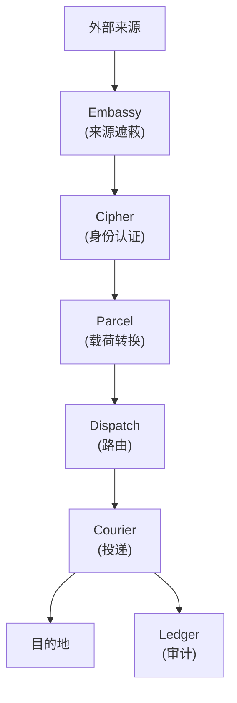
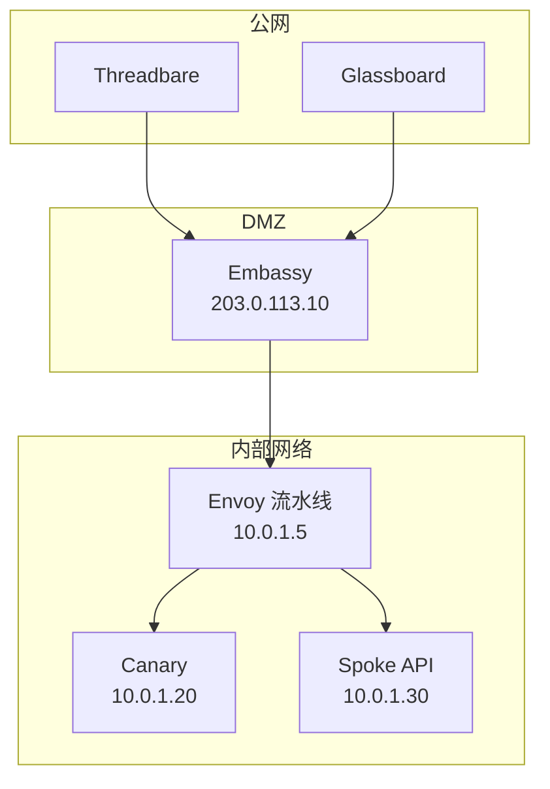
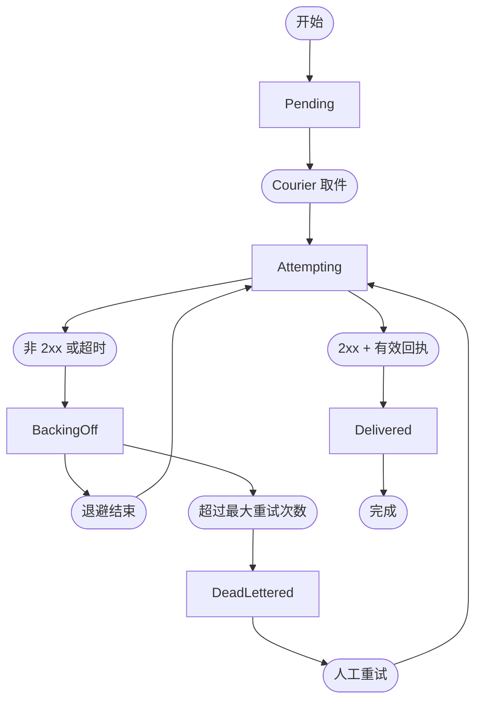

# 架构

Envoy 被设计为一条由若干离散阶段串联起来的流水线。每个阶段只承担单一职责，拥有明确的输入与输出。本页讨论系统级架构、Embassy 的来源遮蔽模型、Courier 的重试状态机，以及 Ledger 的追加式存储。

> 最好的基础设施，是你想不起它存在的那种，直到你需要它。一旦你开始为集成层操心，它其实已经失败了。

## 请求生命周期

每一条进入的请求都会走完完整流水线：



1. **Embassy** 接收外部请求，并向内代理。内部服务地址绝不暴露。
2. **Cipher** 对来源进行身份认证。无效请求直接被拒绝，不再走后续流程。
3. **Parcel** 把载荷转换为目的地期望的格式。
4. **Dispatch** 评估路由规则，选定目的地（分发场景下则是多个目的地）。
5. **Courier** 在带重试保障的前提下完成投递。
6. **Ledger** 记录整个事务生命周期中的每一次状态变迁。

## Embassy：来源遮蔽

Embassy 是 Envoy 的反向代理层。它把内部服务彻底隔离在公共互联网之外：外部来源把请求发送到 Embassy 的公网端点，Embassy 再把它们转发到内部的 Envoy 流水线。无论目的地是 Canary、Spoke 端点，还是任何其他内部系统，都不会直接接收来自网络外部的流量。



Embassy 使用 Ironclad 证书终止 TLS，校验请求格式，并剥除可能泄露内部拓扑的请求头。最终转发出去的请求只剩下载荷与 Cipher 所需的认证头。

### Embassy 配置

```text title="relay.grain — Embassy 块"
embassy {
  listen      = "0.0.0.0:443"
  tls_cert    = "/etc/envoy/ironclad/cert.pem"
  tls_key     = "/etc/envoy/ironclad/key.pem"
  upstream    = "http://10.0.1.5:8090"
  strip_headers = ["X-Forwarded-For", "X-Real-IP"]
}
```

## Courier：重试状态机

Courier 管理每条消息的投递生命周期，消息在一组明确的状态之间流转：



| 状态            | 描述                     | Ledger 条目     |
|---------------|------------------------|---------------|
| Pending       | 消息已入队，等待 Courier 取件。   | `queued`      |
| Attempting    | 投递进行中，Courier 正在等待响应。  | `attempting`  |
| Delivered     | 目的地返回 2xx 并附有效回执，事务完成。 | `delivered`   |
| Backing Off   | 投递失败，Courier 在等待下一次尝试。 | `retrying`    |
| Dead-Lettered | 所有重试尝试均已耗尽，消息进入死信队列。   | `dead_letter` |

### 投递回执

Courier 不会把 2xx 响应直接视为投递确认。响应正文还必须符合目的地协议对应的回执 schema。一个反向代理返回的空体 200 不算确认投递——它只能说明代理收到了字节流。

## Ledger：审计存储

Ledger 是一份只追加的日志，记录每一条消息的每一次状态变迁。条目原地不可更新，也不可删除（直到保留策略到期）。

```text title="单条消息在 Ledger 中的条目"
[ledger] msg_f7a2b8c4  queued       (relay: threadbare-pushes)
[ledger] msg_f7a2b8c4  attempting   (attempt: 1/5, destination: canary://ci-builds)
[ledger] msg_f7a2b8c4  delivered    (latency: 3.1ms, receipt: confirmed)
```

### 保留策略

| 策略        | 保留期限  | 存储压力 | 使用场景          |
|-----------|-------|------|---------------|
| Minimal   | 24 小时 | 低    | 高吞吐中继、可短存的数据。 |
| Standard  | 30 天  | 中    | 多数生产部署。       |
| Extended  | 1 年   | 高    | 合规与审计需求。      |
| Permanent | 不限期   | 极高   | 取证调查与法律保全。    |

```text title="relay.grain — Ledger 保留策略"
ledger {
  retention = "30d"
  export {
    format   = "json"
    schedule = "daily"
    target   = "spoke://audit.internal/ingest"
  }
}
```

## 下一步

- [API 参考](/docs/reference/api-reference/) — 通过 Spoke API 查询 Ledger 条目、查看 Courier 状态、管理中继。
- [配置](/docs/setup/configuration/) — 完整的中继清单参考，包含 Embassy 与 Ledger 块。
