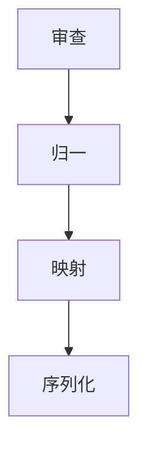

import Tabs from '@theme/Tabs';
import TabItem from '@theme/TabItem';

# 协议翻译

Parcel 是 Envoy 的载荷转换流水线。它接受一条以某种格式表达的消息，再把它重写成目的地期望的格式。不需要共享 schema，也不要求来源与目的地之间达成任何约定。

## 流水线阶段

每一条消息都会经过四个阶段：



1. **审查** — 识别来访载荷的内容类型、编码与结构。
2. **归一** — 将原始载荷转换为 Parcel 的内部表示（一棵带类型的键值树）。
3. **映射** — 应用中继清单中的转换规则，生成输出结构。
4. **序列化** — 把输出编码成目的地期望的格式。

## 格式协商

Parcel 通过检查 `Content-Type` 头与载荷结构来确定来源格式。目的地格式则由目的地协议推断而出。即使来源与目的地使用相同格式，Parcel 也仍会运行映射阶段——转换永不跳过。

| 来源格式      | 目的地格式 | 映射方式  |
|-----------|-------|-------|
| JSON      | JSON  | 字段重映射 |
| JSON      | 纯文本   | 模板渲染  |
| XML       | JSON  | 树形转换  |
| Form-data | JSON  | 键值提取  |
| 纯文本       | JSON  | 模式匹配  |

## 转换规则

<Tabs>
<TabItem value="json-to-json" label="JSON 到 JSON" default>

JSON 到 JSON 的转换把来源结构中的字段映射到目的地结构。中继清单中的 transform 块定义了这种映射。

```text title="relay.grain — JSON 到 JSON"
relay "glassboard-to-canary" {
  source      = "glassboard"
  destination = "canary://infra-alerts"

  transform {
    title    = "[{{ severity }}] {{ alertname }}"
    body     = "{{ instance }} — {{ message }}"
    priority = severity_to_priority(severity)
  }
}
```

**输入（Glassboard 告警）：**

```json title="入站载荷"
{
  "alertname": "HighMemory",
  "severity": "warning",
  "instance": "db-02.arcline.internal",
  "message": "Memory usage at 87%"
}
```

**输出（Canary 通知）：**

```json title="转换后的载荷"
{
  "title": "[warning] HighMemory",
  "body": "db-02.arcline.internal — Memory usage at 87%",
  "priority": 3
}
```

</TabItem>
<TabItem value="json-to-plaintext" label="JSON 到纯文本">

JSON 到纯文本的转换把来源字段渲染为一段扁平文本。适合那些只接受纯消息的目的地。

```text title="relay.grain — JSON 到纯文本"
relay "glassboard-to-spoke" {
  source      = "glassboard"
  destination = "spoke://alerts.internal/webhook"

  transform {
    format = "plaintext"
    template = """
      ALERT: {{ alertname }}
      SEVERITY: {{ severity }}
      HOST: {{ instance }}
      MESSAGE: {{ message }}
    """
  }
}
```

**输出：**

```text title="纯文本输出"
ALERT: HighMemory
SEVERITY: warning
HOST: db-02.arcline.internal
MESSAGE: Memory usage at 87%
```

</TabItem>
</Tabs>

## 字段映射规则

Parcel 支持三种字段映射：

| 映射类型 | 语法                                  | 描述                |
|------|-------------------------------------|-------------------|
| 直接   | `title = "{{ alertname }}"`         | 直接复制一个来源字段。       |
| 计算   | `priority = severity_to_priority()` | 调用内置函数得出值。        |
| 组合   | `body = "{{ a }} — {{ b }}"`        | 将多个来源字段合并为一个输出字段。 |

### 内置函数

| 函数                         | 输入     | 输出  | 描述                         |
|----------------------------|--------|-----|----------------------------|
| `severity_to_priority()`   | 字符串    | 数字  | 将严重程度映射为优先级数字（1-5）。        |
| `timestamp_to_iso()`       | 数字     | 字符串 | 将 Unix 时间戳转换为 ISO 8601 格式。 |
| `truncate(field, length)`  | 字符串、数字 | 字符串 | 将字符串截断到指定长度。               |
| `default(field, fallback)` | 任意、任意  | 任意  | 当字段缺失时返回备用值。               |

## 有损与无损转换

并非每个来源字段都在目的地存在对应项。Parcel 区分无损转换（保留所有来源数据）与有损转换（丢弃部分数据）。

```text title="无损转换"
transform {
  mode = "lossless"
  # 所有来源字段都会出现在输出中。
  # 未映射的字段会作为键值对追加到正文里。
}
```

```text title="有损转换（默认）"
transform {
  # 只有显式映射的字段会出现在输出中。
  # 未映射的来源字段被丢弃。
  title = "{{ alertname }}"
  body  = "{{ message }}"
}
```

:::info
有损模式是默认选项。多数目的地都有固定 schema，会拒绝意外字段。仅在目的地能够处理任意键值数据时，才使用无损模式。
:::

## 下一步

- [路由与分发](/docs/core/routing-dispatch/) — Dispatch 如何把转换后的消息送达目的地。
- [配置](/docs/setup/configuration/) — 完整的中继清单参考，包含转换指令。
