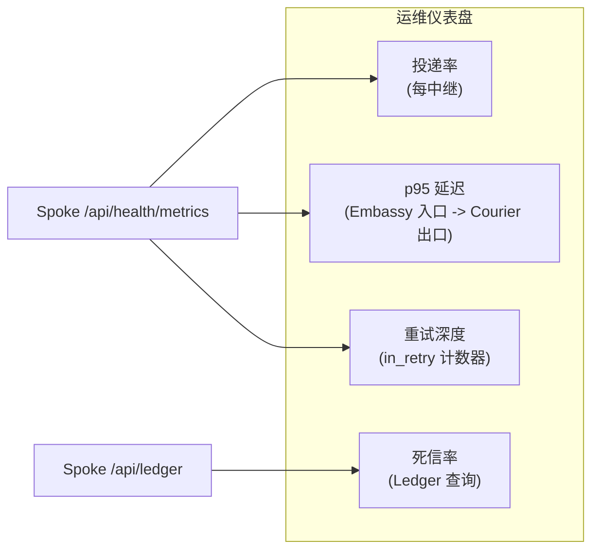
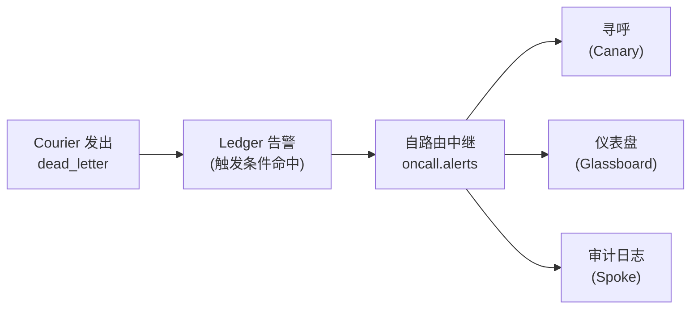

# 中继监控

无人观察的中继，是已经失败但尚未被察觉的中继。Envoy 提供四类可观测性入口：用于事务级取证的 Ledger、用于时序聚合的 Spoke `/api/health/metrics` 端点、用于尾部告警的 Courier 重试状态流，以及用于检视路由规则健康度的 Dispatch 每中继计数器。

> 可观测性不是一项功能，而是一种前提。看不见的东西，运维不了。

## 该盯什么

每一个中继都有同样的四项健康信号。任意一项发生漂移，都意味着出了问题。

| 信号      | 来源                      | 健康区间                      | 触发告警的阈值          |
|---------|-------------------------|---------------------------|------------------|
| 投递率     | 每中继 `delivery_rate`     | 滚动 5 分钟内 `>= 0.99`        | 持续 2 分钟低于 `0.95` |
| 重试队列深度  | Courier `in_retry` 计数器  | `< 50` 条                  | 持续 5 分钟高于 `200`  |
| 死信率     | Ledger `dead_letter` 事件 | 每中继每小时 `0`                | 任意非零计数           |
| p95 端到端 | Embassy 入口至 Courier 出口  | 同区域 `< 10ms`，跨区域 `< 80ms` | 持续 3 分钟超出预算      |

其余一切，都是装饰。

## 查询 Ledger

Ledger 只追加，通过 Spoke 可查询。每一次转换、路由、尝试、投递都是一行。事故期间的取证查询只回答一个真正重要的问题：消息究竟去了哪里？

```bash title="查询过去一小时内的所有失败投递"
curl -s "http://localhost:8090/api/ledger?status=dead_letter&since=1h" \
  -H "Authorization: Bearer ${READ_TOKEN}" | jq
```

```json title="Ledger 响应"
{
  "entries": [
    {
      "id": "msg_e6d5c4b3",
      "relay": "glassboard-critical",
      "first_seen": "2026-05-15T09:14:21Z",
      "last_attempt": "2026-05-15T09:24:08Z",
      "attempts": 5,
      "destination": "canary://oncall-urgent",
      "failure_reason": "destination_5xx",
      "last_status_code": 503
    }
  ],
  "total": 1,
  "since": "2026-05-15T08:24:08Z"
}
```

可按来源、目的地、时间窗口或中继名筛选。Ledger 中的每一列都建有索引。

```bash title="端到端追踪单条消息"
curl -s http://localhost:8090/api/ledger/msg_f7a2b8c4/trace \
  -H "Authorization: Bearer ${READ_TOKEN}" | jq
```

trace 端点按时间顺序返回该消息的所有 Ledger 行——Cipher 已校验、Parcel 已转换、Dispatch 已路由、Courier 已尝试、Courier 已投递。没有任何一行是推测出来的，也没有任何一行是重建出来的。你看到的就是真正发生的。

## 构建仪表盘

`/api/health/metrics` 端点专为抓取而设计。每 15 秒拉取一次，喂给时序数据库即可。

```bash title="GET /api/health/metrics"
curl -s http://localhost:8090/api/health/metrics | jq
```

```json title="指标响应（节选）"
{
  "relay_count": 4,
  "messages": {
    "total": 12847,
    "delivered": 12842,
    "dead_lettered": 5,
    "in_retry": 0
  },
  "latency": {
    "p50_ms": 2.1,
    "p95_ms": 4.3,
    "p99_ms": 7.8
  }
}
```

一个有用的仪表盘只有四个面板，再不多。



请抵制添加第五个面板的诱惑。一个有十二项指标的仪表盘，等于十二项谁都不会去看的指标。

:::tip
按中继而非按 Envoy 实例追踪每项指标。单个故障中继不足以拉低整体均值触发实例级告警，但它绝对值得有人被叫醒。
:::

## 对重试耗尽告警

Courier 一旦放弃某条消息，会立刻向 Ledger 发出一个事件。事件先于运维察觉抵达——这正是它存在的全部意义。

```text title=".grain — 死信告警"
ledger {
  alerts {
    name      = "dead-letter-fired"
    trigger   = "status == 'dead_letter'"
    window    = "1m"
    threshold = 1
    target    = "spoke://oncall.internal/ingest"
  }
}
```

触发条件命中时，Envoy 会向配置好的 Spoke 目标投递一条结构化告警。该目标在多数部署中其实就是另一条中继——Envoy 在自言自语，这是把告警同时分发到 Canary、寻呼服务与审计日志最干净的做法。



:::warning
死信并不总意味着目的地故障。它也可能是 Parcel 无法完成转换，或 Cipher 无法就签名达成一致。请务必在告警载荷中带上 `failure_reason` 字段，否则值班工程师会去排查错误的层。
:::

## 追踪 p95 延迟

Envoy 的端到端延迟，是同一条消息在 Embassy `accept` 事件与 Courier `delivered` 事件之间的墙钟时间。Ledger 的每一行都带有消息 ID 和高分辨率时间戳，所以这项计算不需要单独的追踪系统。

```bash title="计算过去 15 分钟内的 p95"
curl -s "http://localhost:8090/api/ledger/latency?since=15m&percentile=95" \
  -H "Authorization: Bearer ${READ_TOKEN}" | jq
```

```json title="延迟响应"
{
  "window": "15m",
  "percentile": 95,
  "latency_ms": 4.3,
  "samples": 1842,
  "by_relay": {
    "threadbare-pushes": 3.1,
    "glassboard-critical": 5.8,
    "canary-down": 4.2,
    "custom-deploy-hook": 6.0
  }
}
```

健康的单区域 Envoy 能让 p95 稳定在 10 毫秒以内。跨区域——见[中继扩展](/docs/operations/scaling-relays/)——则会叠加区域间的往返延迟，让实际预算上升到 60 至 80 毫秒，具体取决于地理距离。

:::info
对于分发到慢速目的地的中继，p99 比 p95 更有参考价值。把 SLO 设在哪个分位上，应取决于你关心的目的地长尾真正落在哪个分位。
:::

## 不该监控的东西

简短一份清单——告警的坟场里，全是基于错误信号触发的仪表盘。

- **Envoy 宿主机的 CPU 与内存。** Envoy 通常空闲时 CPU 占用低于 1%、驻留内存不到 8MB。如果宿主忙起来，原因必然来自上游——该排查的是目的地，而不是中继。
- **TCP 连接数。** Embassy 会激进地复用连接，你看到的数字并不是你以为的那个数字。
- **Goroutine 数量。** 这是性能分析会话里的有用数据，放上仪表盘则毫无价值。在分发场景中尖刺是常态。

盯住本页开头那四个信号即可，其余都是伪装成信息的噪音。

## 下一步

- [中继扩展](/docs/operations/scaling-relays/) — 横向扩展、分片、重试预算调优与多区域容灾。
- [API 参考](/docs/reference/api-reference/) — 完整 Spoke API，包括 Ledger 查询端点。
- [架构](/docs/advanced/architecture/) — 高负载下 Ledger、Courier 与 Embassy 如何协作。
