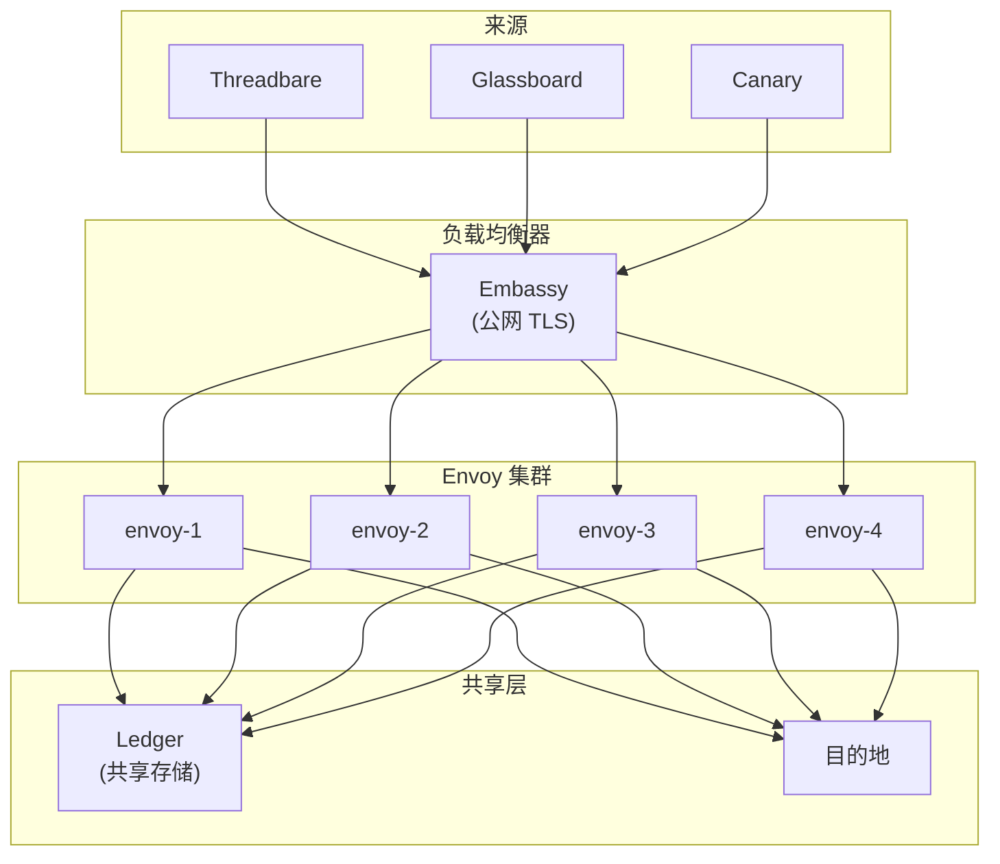
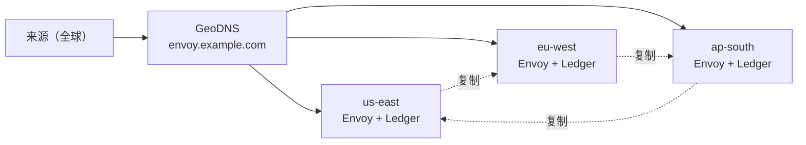

# 中继扩展

一台 Envoy Vial 在普通硬件上每秒就能处理数千条消息。真正有意思的故障在这之外——某个区域整体失联、某个目的地开始限速、某个主题忽然承接了其余九十九个主题加起来的一百倍流量。本页讲述如何对 Envoy 进行容量规划、分片与复制，让集群的寿命超过任何单一组件。

> 扩展不是目标，而是正确分片的结果。

## 横向拓扑

Envoy 通过在负载均衡器后追加实例实现横向扩展。除共享的 Ledger 外，每个实例都是无状态的。Trellis 编排实例生命周期，Spark 把相同的配置发布到每个节点。



每个实例独立完成认证、转换、路由与投递。Ledger 写入只追加——既无争用，也无需协调。

:::info
Embassy 必须置于整个集群之前。若把 Embassy 放到负载均衡器之后，故障响应会把内部 IP 暴露出去。次序至关重要。
:::

## 按主题分片

轮询式负载均衡在某一主题吸纳的流量超过集群其余总和之前都能用。修法是基于主题的分片：每个实例确定性地拥有一部分主题。

```text title="relay.grain — 按主题分片"
sharding {
  strategy = "topic-hash"
  shards   = 4

  // highlight-start
  assignment {
    "envoy-1" = ["ci-builds", "deploy-alerts"]
    "envoy-2" = ["infra-alerts", "oncall-urgent"]
    "envoy-3" = ["monitoring", "project-updates"]
    "envoy-4" = ["fanout-default"]
  }
  // highlight-end
}
```

| 策略    | 适用场景         | 取舍              |
|-------|--------------|-----------------|
| 轮询    | 主题流量均匀、小规模集群 | 单个热主题会把单一实例压垮。  |
| 主题哈希  | 分配可预测、无需协调   | 再平衡需要重新推送配置。    |
| 一致性哈希 | 大规模集群、成员频繁变化 | 流量倾斜时会出现轻微失衡。   |
| 手动指派  | 热主题隔离、合规绑定   | 流量迁移时需运维手动更新指派。 |

Trellis 在成员变更时负责再平衡——当某个实例加入或离开集群时，Trellis 重新计算指派并通过 Spark 把更新后的 `.grain` 片段推送到位。

## 调优 Courier 的重试预算

Courier 的重试预算决定何时继续尝试、何时放弃。默认值偏保守——它假设目的地是一个偶尔超时的 HTTP 服务。激进型目的地（受限速 API、SLA 严苛的寻呼服务）需要更紧的预算。

```text title="relay.grain — Courier 重试预算"
courier {
  retry {
    max_attempts    = 5
    initial_backoff = "1s"
    max_backoff     = "60s"
    multiplier      = 2.0
    jitter          = "10%"
  }

  // highlight-start
  budget {
    per_destination_per_minute = 100
    per_relay_per_minute       = 500
  }
  // highlight-end
}
```

| 旋钮                    | 默认值 | 何时调小             | 何时调大               |
|-----------------------|-----|------------------|--------------------|
| `max_attempts`        | 5   | 目的地对数据新鲜度有严格 SLA | 目的地时灵时不灵但终究会恢复     |
| `initial_backoff`     | 1s  | 高优先级告警、对 p99 敏感  | 目的地返回了 Retry-After |
| `max_backoff`         | 60s | 目的地恢复迅速          | 目的地需要分钟级恢复         |
| `per_destination/min` | 100 | 下游 API 被限速       | 投递至本地目的地的高吞吐中继     |

:::warning
过于宽松的重试预算只会让一个生病的目的地继续生病。如果 Canary 一分钟内返回一百次 503，而 Courier 又对每条消息重试五次，目的地就会在最糟糕的时刻额外承受五百次请求。请始终给 `per_destination_per_minute` 设上限。
:::


带抖动的指数退避——五次尝试大约覆盖 15 秒的墙钟时间。超出后，消息进入死信队列，Courier 依[中继监控](/docs/operations/monitoring-relays/)中所配的策略发出 Ledger 事件。

## Cipher 限速配置

Cipher 是 Envoy 抵御失控来源的第一道防线。泄漏的 webhook 密钥、失控的上游服务、刻意发起的洪水攻击——三者在内部看起来是同一种现象，也都需要同一个答案：在最外层就拒掉，不让 Parcel 与 Dispatch 牵涉其中。

```text title="relay.grain — Cipher 限速"
cipher {
  rate_limit {
    per_source_per_second = 50
    per_source_per_minute = 1000
    burst                 = 100

    // highlight-start
    on_exceed {
      action        = "reject"
      response_code = 429
      response_body = '{"error":"rate_limited"}'
      log_to        = "ledger"
    }
    // highlight-end
  }
}
```

| 设置项                     | 用途                                                 |
|-------------------------|----------------------------------------------------|
| `per_source_per_second` | 单个来源身份瞬时流量的硬上限。                                    |
| `per_source_per_minute` | 持续速率上限，防止慢速洪水。                                     |
| `burst`                 | 允许的短时尖峰额度——覆盖正常的 webhook 簇发。                       |
| `on_exceed.action`      | `reject` 返回 429、`defer` 短暂排队、`quarantine` 封禁 5 分钟。 |

`log_to = "ledger"` 这一行尤为关键。被拒绝的请求依然会留下 Ledger 条目——谁在何时尝试了什么，全部留痕。请求正文被丢弃，元数据被保留。

:::tip
请把单来源上限设得明显低于目的地的已知容量。数学很简单：若 Canary 接受 200 RPS、而四个上游共享同一中继，则 Cipher 处任一上游都不应超过 50 RPS。背压属于最外层，而非目的地。
:::

## 多区域容灾

单区域 Envoy 集群距离整体宕机只差一根海缆。多区域 Envoy 能在区域级故障下保持中继存活——代价是更高的尾部延迟与更复杂的配置。



Trellis 运行一种主-主拓扑：每个区域都接收流量、就近投递，Ledger 在区域之间异步复制。区域故障发生时，GeoDNS 把流量切到尚存活的区域；故障瞬间在途的消息会从尚存活的 Ledger 副本中回放。

```text title=".grain — 多区域块"
multi_region {
  active_active = true

  regions {
    "us-east"  = { weight = 40, ledger_endpoint = "spoke://ledger.us-east.internal" }
    "eu-west"  = { weight = 35, ledger_endpoint = "spoke://ledger.eu-west.internal" }
    "ap-south" = { weight = 25, ledger_endpoint = "spoke://ledger.ap-south.internal" }
  }

  failover {
    on_region_loss = "rebalance"
    replay_window  = "5m"
  }
}
```

| 参数               | 作用                                              |
|------------------|-------------------------------------------------|
| `active_active`  | 所有区域同时接收并投递。关闭后变为冷备份，RTO 更长。                    |
| `weight`         | 所有区域健康时 GeoDNS 的流量分配比例。                         |
| `replay_window`  | 故障区域 Ledger 条目可回放的回溯窗口。                         |
| `on_region_loss` | `rebalance` 重新分配权重、`drain` 只完成在途投递、`halt` 彻底停摆。 |

:::warning
主-主多区域意味着某条消息可能在一个区域的 Parcel 规则下被转换，却被另一区域的 Ledger 记录在案。请保证各区域的 `.grain` 清单严格一致——Spark 的发布流水线会自动拒绝任何漂移，但前提是各区域都指向同一个真理来源。
:::

## 容量参考

以下是保守值，基于 2 vCPU、4GB 的 Vial 实测得出。真实集群通常会以可观的余量超出。

| 工作负载           | 单实例   | 四实例集群     |
|----------------|-------|-----------|
| 持续入站 RPS       | 2,500 | 9,000     |
| 突发入站 RPS（60 秒） | 8,000 | 28,000    |
| 活跃中继数          | 200   | 800       |
| 并发在途投递         | 5,000 | 18,000    |
| 持续负载下内存        | 32 MB | 每实例 32 MB |
| p95 端到端（本地目的地） | 4 ms  | 5 ms      |

若你已超出这些数字而仪表盘仍然健康，那是仪表盘错了。在加机器之前，请先回头核对[中继监控](/docs/operations/monitoring-relays/)里列出的四项信号。

## 下一步

- [中继监控](/docs/operations/monitoring-relays/) — Ledger 查询、仪表盘、重试耗尽告警。
- [架构](/docs/advanced/architecture/) — Embassy、Courier 状态机与 Ledger 存储。
- [API 参考](/docs/reference/api-reference/) — 用于中继管理的 Spoke 端点。
