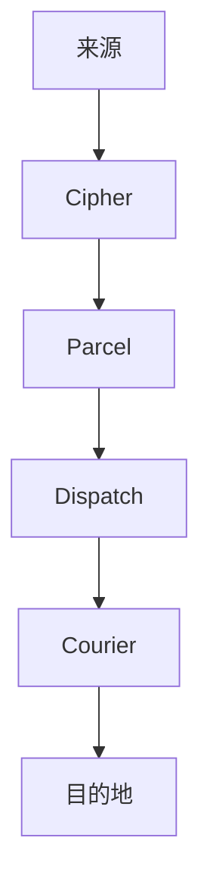

# 概述

Envoy 是一款协议转换与中继引擎，专为那些原本不打算互相理解的系统而设计。它静静地坐在任意两项服务之间，学习它们各自的语言，转换消息，并将其送达——而通信双方甚至不会察觉到房间里还藏着一位翻译。

不需要共享格式。不需要共享协议。不需要双边约定。只需要送达。

> 集成不应该要求双方就同一种格式达成一致。如果双方都必须改变，你解决的不是集成问题——你只是制造了一个新的问题。

## 工作原理

每一条消息都会经过五个阶段：身份认证、审查、转换、路由、投递。中继清单声明规则；Envoy 负责执行。



1. **Cipher** 对来源进行认证——HMAC 签名、Bearer 令牌或 IP 白名单。
2. **Parcel** 审查并将载荷转换为目的地所需的格式。
3. **Dispatch** 依据内容、来源或严重程度，将消息路由至正确的目的地。
4. **Courier** 以可靠重试、死信队列与投递回执完成交付。

## 工具套件

| 工具           | 用途                                |
|--------------|-----------------------------------|
| **Dispatch** | 智能路由引擎——按内容、来源或严重程度路由。            |
| **Courier**  | 可靠投递重试引擎——指数退避、死信队列、投递回执。         |
| **Parcel**   | 载荷转换流水线——在不同格式之间重写消息。             |
| **Cipher**   | 身份认证网关——HMAC 签名、Bearer 令牌、IP 白名单。 |
| **Ledger**   | 完整投递审计轨迹——每一条消息的接收、转换、路由、投递全过程。   |
| **Embassy**  | 来源遮蔽反向代理——让内部服务远离公共互联网。           |

:::info 极小占用
Envoy 以单一 3MB Vial 镜像发布，零外部依赖。所有协议处理器、转换引擎与重试机制都内置于其中。构建期或运行期都不会从外部拉取任何东西。
:::

## 快速开始

拉取 Vial 镜像并启动中继：

```bash title="启动 Envoy"
vial pull envoy
vial run envoy --port 8090
```

通过中继发送一条测试消息：

```bash title="验证投递"
curl -X POST http://localhost:8090/relay/test-topic \
  -H "Content-Type: application/json" \
  -H "Authorization: Bearer your-relay-token" \
  -d '{"title": "你好", "message": "中继运作正常。"}'
```

消息会先由 Cipher 认证，由 Parcel 转换（若规则匹配），由 Dispatch 路由，最终由 Courier 投递。Ledger 完整记录整个事务。

## 下一步

- [安装](/docs/setup/installation/) — Vial、Spark 与 Trellis 部署方式。
- [你的第一条中继](/docs/setup/your-first-relay/) — 接收 Threadbare webhook、转换载荷、投递至 Canary。
- [配置](/docs/setup/configuration/) — 深入解读 `.grain` 中继清单。
- [API 参考](/docs/reference/api-reference/) — 完整的 Spoke API 中继管理参考。
