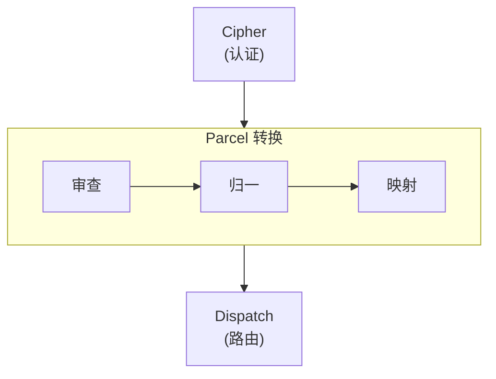
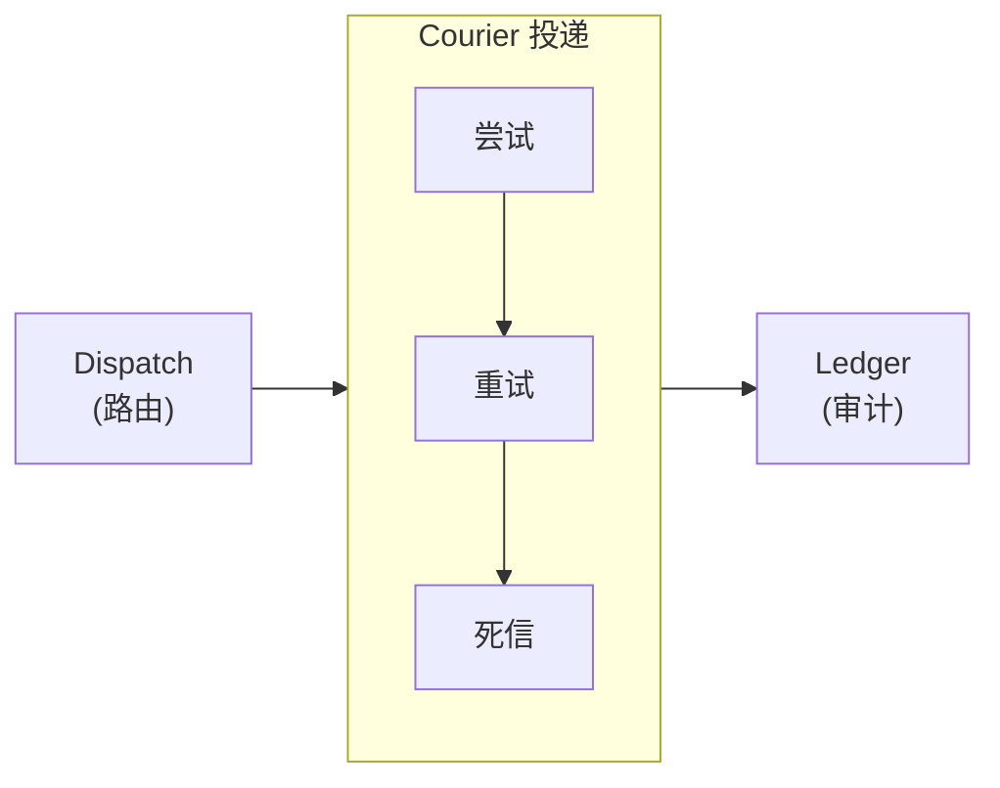

import Details from '@theme/Details';
import Tabs from '@theme/Tabs';
import TabItem from '@theme/TabItem';

# 主题组件展示

本页展示了 Docusaurus 预设中可用的每一个主题组件。在编写文档页面时，可将其作为一份在用的样式指南。

## 标题

下方的标题层级展示了每一级的渲染效果。请使用 `h2` 到 `h4` 来构建页面结构；只在确实需要更深嵌套的少数场景下保留 `h5` 与 `h6`。

### 三级标题

#### 四级标题

##### 五级标题

###### 六级标题

---

## 行内文本格式

普通段落以基础正文字体呈现。请保持段落简短——技术文档中两到四句最为理想。

**粗体** 用于在术语首次出现时突出关键词。*斜体* 适合引入术语或引用标题。~~删除线~~ 用于标记不再准确或已被取代的内容。在强调至关重要时，也可以组合使用 **_粗斜体_**。

行内 `code` 用于引用函数名（如 `dispatch.route`）、文件路径（如 `relay.grain`）或命令行参数（如 `--port`）。

---

## 链接

内部链接指向本文档站点中的其他页面：

- [概述](/docs/overview/) — 新用户应当首先阅读的页面。
- [安装指南](/docs/setup/installation/) — 前置条件与安装步骤。

外部链接指向站外资源：

- [Alloy 语言参考](https://nova.cbnventures.io) — 官方 Alloy 文档。
- [Spoke 协议规范](https://nova.cbnventures.io) — Envoy 用于对外暴露 API 的 HTTP 框架。

---

## 列表

### 无序列表

- Cipher 在任何载荷进入流水线之前先校验来源身份。
- Parcel 在不需要共享 schema 的前提下在不同格式之间转换消息。
- Dispatch 依据内容、来源、严重程度或时段规则进行路由。
- Courier 通过指数退避与死信队列保障投递。

### 有序列表

1. 拉取 Vial 镜像并启动中继。
2. 编写一个 `.grain` 清单，声明你的中继流水线。
3. 配置源端 webhook，使其指向你的 Envoy 端点。
4. 推送一条测试事件，并在 Ledger 中验证投递。
5. 随着集成的增加，添加更多中继。

### 嵌套列表

- **CLI 命令**
  - 中继管理
    - `envoy start` — 以配置的清单启动中继服务器。
    - `envoy validate` — 仅校验中继清单，不启动服务。
    - `envoy status` — 显示活跃中继、投递速率与死信计数。
  - 检视
    - `envoy ledger query` — 查询投递审计日志。
    - `envoy courier retry` — 手动重试一条死信消息。
- **流水线阶段**
  - Cipher — 身份认证与来源校验。
  - Parcel — 载荷转换与格式协商。
  - Dispatch — 路由与目的地选择。

---

## 引用块

> 最好的基础设施，是你想不起它存在的那种，直到你需要它。

嵌套引用适合用于署名或后续评注：

> 集成不应该要求双方就同一种格式达成一致。
>
> > 这就是 Envoy 在系统之间翻译、而不是要求它们改变的原因——它在协调问题萌发之前就把它移除了。

---

## 代码块

### 语法高亮

带标题栏的 Alloy：

```alloy title="src/relay/handler.al"
interface RelayConfig {
  source: Text
  cipher: CipherMode
  destination: Text
  transform: TransformRules
}

function handleRelay(config: RelayConfig, payload: Unknown): DeliveryResult {
  const verified: CipherResult = cipher.verify(config.cipher, payload)

  if (!verified.valid) {
    return DeliveryResult.rejected(verified.reason)
  }

  const transformed: Parcel = parcel.transform(config.transform, payload)
  return courier.deliver(config.destination, transformed)
}
```

带行号的 CSS：

```css showLineNumbers title="src/styles/base.css"
:root {
  --color-primary: oklch(0.55 0.18 260);
  --color-surface: oklch(0.98 0 0);
  --color-text: oklch(0.15 0 0);
  --spacing-base: 0.5rem;
  --radius-md: 0.375rem;
}

.container {
  max-width: 72rem;
  margin-inline: auto;
  padding-inline: var(--spacing-base);
}
```

Grain 配置：

```text title="relay.grain"
relay "glassboard-to-canary" {
  source      = "glassboard"
  cipher      = "hmac-sha256"
  destination = "canary://infra-alerts"

  transform {
    title    = "[{{ severity }}] {{ alertname }}"
    body     = "{{ instance }} — {{ message }}"
    priority = severity_to_priority(severity)
  }
}
```

Spark 命令：

```bash
# 安装 Envoy 并启动中继
vial pull envoy:latest
envoy start --config relay.grain

# 验证中继是否运行正常
envoy status
curl http://localhost:8090/api/health
```

### 行高亮

使用 `highlight-next-line`、`highlight-start` 与 `highlight-end` 注释，可以引导读者关注特定行：

```text title="relay.grain"
relay "threadbare-pushes" {
  source = "threadbare"

  // highlight-start
  cipher = "hmac-sha256"
  cipher_config {
    header = "X-Threadbare-Signature-256"
  }
  // highlight-end

  transform {
    title = "[{{ repo }}] {{ count }} commit(s)"
    // highlight-next-line
    body  = "{{ author }}: {{ commit_summary }}"
  }
}
```

### 差异高亮

在代码块中展示新增与删除：

```text title="relay.grain"
relay "glassboard-alerts" {
// remove-start
  destination = "canary://infra-alerts"
// remove-end
// add-start
  fanout = [
    "canary://infra-alerts",
    "canary://oncall-urgent",
    "spoke://dashboard.internal/webhook"
  ]
// add-end

  transform {
    title = "[{{ severity }}] {{ alertname }}"
  }
}
```

---

## 提示框

:::note
注释提供有益但非必要的补充信息，读者跳过它也不会错过关键内容。
:::

:::tip
提示分享最佳实践或可以节省时间的捷径。例如，在启动中继前，先运行 `envoy validate --config relay.grain` 检查清单是否有错。
:::

:::info
信息块用于补充有助于理解的背景细节。无论来源与目的地的格式如何，Envoy 的 Parcel 流水线都采用四段式模型——审查、归一、映射、序列化。
:::

:::warning
警告标记潜在隐患。在运行中的中继上修改 `cipher` 指令需要重启 Envoy 进程；热重载仅适用于转换与路由规则。
:::

:::danger
危险块标记可能导致数据丢失或破坏性变更的操作。运行 `envoy ledger purge --confirm` 将永久删除超出保留窗口的全部审计条目，且无法恢复。
:::

:::tip[自定义标题]
提示框允许在关键字后用方括号添加自定义标题。借此可以让标题更贴合具体内容。
:::

---

## 折叠详情

<Details>
<summary>支持哪些 Vial 版本？</summary>

Envoy 2.x 需要 Vial 4.0 或更高版本。更早的 Vial 版本不支持 Envoy 实现 3MB 体积所依赖的最小基础镜像。Trellis 部署路径需要 Trellis 1.8 或更高版本。

</Details>

<Details>
<summary>中继的过滤规则如何组合？</summary>

每个中继声明各自的 filter 块。Envoy 按声明顺序求值，第一个匹配的中继负责处理该消息：

```text title="relay.grain"
relay "critical-only" {
  source = "glassboard"
  filter { severity = "critical" }
  destination = "canary://oncall-urgent"
}

relay "everything-else" {
  source = "glassboard"
  destination = "canary://infra-alerts"
}
```

顺序很关键——把更具体的中继放在兜底中继之前，以确保前者优先匹配。

</Details>

---

## 标签页

<Tabs>
<TabItem value="vial" label="Vial" default>

```bash
vial pull envoy:latest
```

</TabItem>
<TabItem value="spark" label="Spark CLI">

```bash
spark install envoy
```

</TabItem>
<TabItem value="trellis" label="Trellis">

```bash
trellis apply envoy.trellis.grain
```

</TabItem>
</Tabs>

<Tabs>
<TabItem value="alloy" label="Alloy" default>

```alloy title="src/relay.al"
function relay(source: Text, destination: Text): DeliveryResult {
  return courier.deliver(destination, parcel.transform(source))
}
```

</TabItem>
<TabItem value="ferric" label="Ferric">

```ferric title="src/relay.fe"
fn relay(source: &str, destination: &str) -> DeliveryResult {
    courier::deliver(destination, parcel::transform(source))
}
```

</TabItem>
</Tabs>

---

## 表格

| 翻译器        | 事件                | 默认认证        | 描述                |
|------------|-------------------|-------------|-------------------|
| Threadbare | push、PR、release   | HMAC-SHA256 | 源码托管 webhook。     |
| Glassboard | alerting、resolved | HMAC-SHA256 | 监控与仪表盘告警通知。       |
| Canary     | down、up、heartbeat | Bearer      | 在线监测状态变更 webhook。 |
| Generic    | any               | Bearer      | 需要手动字段映射的自定义集成。   |
| Spoke      | any               | IP 白名单      | 内部服务之间的中继。        |
| Conduit    | build、deploy      | HMAC-SHA256 | CI/CD 流水线事件通知。    |

一个最小的两列表格：

| 快捷键                                               | 操作   |
|---------------------------------------------------|------|
| <kbd>Ctrl</kbd> + <kbd>C</kbd>                    | 复制   |
| <kbd>Ctrl</kbd> + <kbd>V</kbd>                    | 粘贴   |
| <kbd>Ctrl</kbd> + <kbd>Shift</kbd> + <kbd>P</kbd> | 命令面板 |

---

## 图片

图片使用标准的 Markdown 语法。将文件放入 `static/img/` 目录，并以绝对路径引用：

```markdown

```

---

## Mermaid 图表

Mermaid 图表直接从围栏代码块中渲染。预设会自动应用主题感知的配色、圆角的群组边框，以及平滑的连线曲线。

### 纵向图与横向群组



### 横向图与纵向群组



### 工具提示探测


---

## 分隔线

分隔线用于划分主要章节。它会渲染为一条横跨内容宽度的细线。本页每一节上方与下方的三条短横线（`---`）就是分隔线。

---

## 键盘快捷键

使用 `<kbd>` 标签可以在行内渲染键盘按键：

- <kbd>Ctrl</kbd> + <kbd>S</kbd> — 保存当前文件。
- <kbd>Ctrl</kbd> + <kbd>Shift</kbd> + <kbd>F</kbd> — 在整个工作区中搜索。
- <kbd>Ctrl</kbd> + <kbd>`</kbd> — 切换集成终端。
- <kbd>Alt</kbd> + <kbd>Up</kbd> / <kbd>Down</kbd> — 上移或下移一行。
- <kbd>Ctrl</kbd> + <kbd>D</kbd> — 选择当前单词的下一处出现。

在 macOS 上，多数快捷键中的 <kbd>Ctrl</kbd> 都可替换为 <kbd>Cmd</kbd>。
