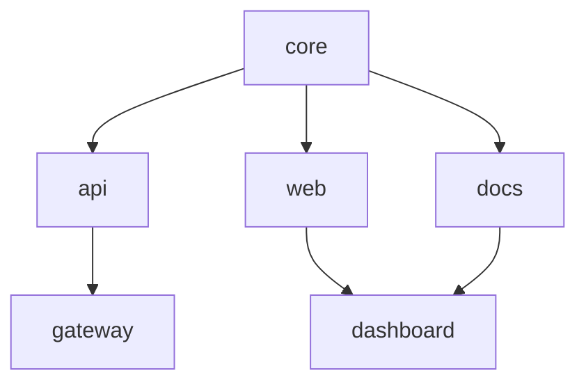

We had a workspace with 200 packages. A full build took twelve minutes and fourteen seconds. We got it down to fourteen seconds on a warm forge and under a minute cold. Here is how.

{/* truncate */}

## The Problem

Our largest internal workspace — the one that powers the Foundry documentation site, the CLI, and all supporting libraries — had grown to 200 packages. Every time someone pushed to the main branch, Conduit ran a full build. Twelve minutes and fourteen seconds, every single time.

We profiled it. Ninety percent of that time was redundant re-computation. Packages that had not changed were being rebuilt. Dependencies that had already been resolved were being resolved again. The Smelter was compiling the same files it compiled thirty seconds ago.

The build pipeline had no memory.

## The Solution: Quench + Bellows

We built two tools to solve this.

**Quench** is a content-addressable build cache. It hashes every source file, every dependency version, and every manifest directive. If the hash matches a previous build, Quench skips the compilation entirely and restores the cached output. No timestamps. No file watchers. Just hashes.

**Bellows** is a parallel task runner. It reads the dependency graph from Tongs and fans work across every available core. Packages with no interdependencies build simultaneously. Packages that depend on each other wait in the correct order.

Together, they turned our build from a serial twelve-minute crawl into a parallel fourteen-second sprint.

## How Bellows Orchestrates Work

Bellows reads the Tongs dependency graph and schedules packages in waves. Independent packages run in parallel. Dependent packages wait for their prerequisites.



In this graph, `core` builds first. Then `api`, `web`, and `docs` build in parallel. Finally, `gateway` and `dashboard` build once their dependencies finish. Bellows figures out the waves automatically from the Tongs graph — you never specify execution order manually.

## Benchmark Results

We benchmarked across four workspace sizes. All tests ran on an 8-core machine with 32 GB of memory. Times are wall-clock averages over 10 runs.

| Workspace Size | Before (Serial) | Cold Forge | Warm Forge | Cache Hit Rate |
|----------------|-----------------|------------|------------|----------------|
| 10 packages    | 42s             | 8.1s       | 1.2s       | 91%            |
| 50 packages    | 3m 18s          | 14.7s      | 1.8s       | 94%            |
| 100 packages   | 6m 42s          | 28.3s      | 2.1s       | 96%            |
| 200 packages   | 12m 14s         | 52.6s      | 3.4s       | 97%            |

The warm forge times are almost flat across workspace sizes. That is the power of a content-addressable cache — if nothing changed, the size of the workspace is irrelevant.

### Full Benchmark Data (All 10 Runs)

**200 packages — cold forge (seconds):**

| Run | Time  |
|-----|-------|
| 1   | 54.2s |
| 2   | 51.8s |
| 3   | 53.1s |
| 4   | 52.9s |
| 5   | 51.4s |
| 6   | 53.7s |
| 7   | 52.0s |
| 8   | 52.3s |
| 9   | 53.5s |
| 10  | 51.1s |

**200 packages — warm forge (seconds):**

| Run | Time |
|-----|------|
| 1   | 3.6s |
| 2   | 3.2s |
| 3   | 3.5s |
| 4   | 3.4s |
| 5   | 3.1s |
| 6   | 3.7s |
| 7   | 3.3s |
| 8   | 3.4s |
| 9   | 3.5s |
| 10  | 3.3s |

Standard deviation for warm forges: 0.18s. The cache is deterministic.

## How Quench Hashing Works

Quench does not use file modification timestamps. Timestamps lie — a `git checkout` changes the mtime of every file even if the content is identical. Instead, Quench hashes three things:

1. **Source content.** Every file in the package, hashed with SHA-256.
2. **Dependency versions.** The resolved version of every dependency in the Tongs graph.
3. **Manifest directives.** The Warden rules, Smelter config, and target platform from the `.grain` manifest.

If all three hashes match a previous build, Quench restores the cached artifacts and skips compilation entirely.

```text title="Quench cache check output"
$ foundry quench status
  core       [HIT]  abc12f → cached 2.1s ago
  api        [HIT]  def34a → cached 2.1s ago
  web        [MISS] ghi56b → source changed (src/routes/index.al)
  docs       [HIT]  jkl78c → cached 14m ago
  gateway    [WAIT] depends on api (HIT), will use cache
  dashboard  [MISS] depends on web (MISS), must rebuild
```

Only the packages that actually changed — and their downstream dependents — get rebuilt. Everything else comes from cache.

## The Trade-offs

Nothing is free. Here is what we gave up:

- **Disk space.** Quench stores cached artifacts for every unique hash. A 200-package workspace uses approximately 2.4 GB of cache. We run `foundry quench prune --older-than 7d` weekly in Conduit.
- **First-run cost.** A cold forge with an empty cache is slower than a naive serial build because Quench still computes all the hashes. The payoff comes on every subsequent build.
- **Determinism requirement.** If your build is not deterministic — if the same inputs can produce different outputs — Quench will serve stale artifacts. We enforce determinism through Warden rules that ban non-deterministic imports and runtime-dependent code generation.

## Try It

```bash
# Run a cold forge and populate the cache
foundry ignite

# Change one file and run again
foundry ignite
# → Only the changed package and its dependents rebuild
```

The cache is local by default. For shared caching across a team, see the [Build Pipeline](/docs/pipeline/build-pipeline/) documentation on remote cache configuration.
