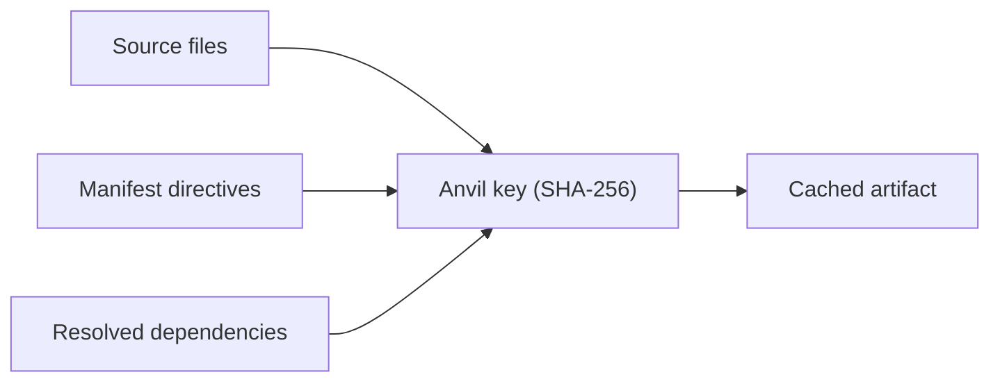

import Tabs from '@theme/Tabs';
import TabItem from '@theme/TabItem';

# Incremental Builds

The first `foundry ignite` in a fresh checkout is a cold forge — every package compiles from scratch. Every subsequent forge should be incremental: only the work that has genuinely changed gets redone. This is the job of the Anvil cache.

This document explains how Anvil stores artifacts, how Foundry decides whether a cached entry is still valid, when Crucible re-runs tests, and how Tongs reuses dependency handles across builds.

## Anvil, the Artifact Store

Anvil is the on-disk cache where Forge writes every build artifact. It is content-addressed: each entry is keyed by a hash of its inputs, never by package name or path.

| Component      | Stores                                              |
|----------------|-----------------------------------------------------|
| Object store   | Compiled modules, bundles, type indexes.            |
| Manifest index | Maps `(workspace, package, hash)` to object IDs.    |
| Tongs handles  | Resolved dependency descriptors per package.        |
| Warden output  | Linter findings for the verify stage.               |
| Crucible logs  | Test outcomes per package and per assertion bundle. |

Anvil lives under `~/.anvil` by default and can be relocated with the `FOUNDRY_CACHE_DIR` environment variable. Multiple workspaces on the same machine share the same Anvil — the workspace prefix in every key keeps entries from colliding.

```bash title="Inspect the Anvil store"
foundry anvil status
```

```text title="Output"
Anvil   ~/.anvil
Objects 18,402 entries (1.4 GB)
Index   3 workspaces, 84 packages, 41,022 hash records
Tongs   1,288 cached handles
```

## Content-Addressed Artifacts

Every cached object is identified by a SHA-256 of its full input set. Two builds that produce the same compiled module — on different machines, in different directories, at different times — receive the same Anvil key.



The benefit is shareability. A team can publish their Anvil store as a read-only mirror, and every developer on the team gets a warm cache on their first checkout. Forge fetches matching objects on demand without rebuilding anything locally.

:::info
Anvil keys are deterministic but not stable across Foundry minor versions. A Smelter codegen change can shift every key in the store. The cache is treated as ephemeral — losing it costs time, not correctness.
:::

## Invalidation Rules

A cache entry is valid only if all three of its inputs match the current state:

1. **Source content.** Every file in the package's `src/` directory contributes its SHA-256 to the key.
2. **Manifest directives.** The Warden preset, Smelter profile, language version, and target string from the `.grain` manifest.
3. **Resolved dependencies.** The Tongs handle for every entry in the package's `depends` array, including the transitive closure.

If any input changes, the key changes, and the cached object is no longer reachable. The old entry is not deleted immediately — it remains in the object store until pruned, allowing a branch switch to reuse the previous build without recompilation.

| Change                                                           | Invalidates                                       |
|------------------------------------------------------------------|---------------------------------------------------|
| Edit `src/routes/health.al`                                      | The owning package.                               |
| Bump a `depends` version                                         | The package + all downstream consumers.           |
| Change `warden` from `["strict"]` to `["strict", "conventions"]` | Every package in the workspace.                   |
| Switch branches                                                  | Nothing — both branches' artifacts remain cached. |
| Add a comment to `.grain`                                        | Nothing — comments are stripped before hashing.   |

### When Manifest Changes Spread

A change to a global directive — `lang`, `warden`, `smelter`, or `target` — is treated as a workspace-wide invalidation. Every package re-hashes against the new directive and rebuilds.

A change to a single package block invalidates only that package and its downstream consumers.

```bash title="Trace an invalidation"
foundry anvil why core
```

```text title="Output"
Package: core
Key:     0x9f2c4e... (current)
Reason:  source change in src/encoding.al (last modified 4m ago)
Status:  cached entry 0x14a83b... is now unreachable

Downstream effects:
  auth   → INVALIDATED (depends on core)
  api    → INVALIDATED (depends on core via auth)
  web    → INVALIDATED (depends on core via auth)
  cli    → INVALIDATED (depends on core)
```

## When Crucible Re-Runs Tests

Crucible's test cache lives inside Anvil. A test outcome is keyed by the package artifact hash plus the test scaffold hash. Two principles follow:

- **Source unchanged, tests unchanged → no re-run.** Crucible loads the previous outcome from the cache.
- **Source changed or scaffold changed → re-run.** Crucible executes the affected tests and writes the new outcome.

<Tabs>
<TabItem value="default" label="Default mode" default>

```bash title="Forge with cached tests"
foundry ignite
```

Crucible reuses the cached outcome whenever the artifact and scaffold both hash to known values. This is the fastest path and the default in local development.

</TabItem>
<TabItem value="force" label="Force re-run">

```bash title="Re-run every test"
foundry ignite --force-tests
```

Useful when investigating flaky tests or after upgrading Crucible itself. The `--force-tests` flag bypasses the test cache but still uses cached compile artifacts.

</TabItem>
<TabItem value="ci" label="CI mode">

```bash title="Run in Conduit"
foundry ignite --ci
```

In CI mode, Crucible disables the test cache by default — every test runs on every build. Override with `FOUNDRY_CACHE_TESTS=1` for shared-cache CI environments.

</TabItem>
</Tabs>

:::warning
Tests that touch external state — network calls, real databases, the filesystem outside the package — can produce different results from identical inputs. Mark these with `@crucible.external` so they are never cached.
:::

## Tongs Handle Reuse

A Tongs handle is the resolved description of a single dependency — its version, its hash, its exported symbols. Resolving a handle is expensive when there are many packages, so Tongs caches the handles in Anvil and reuses them across forges.

```text title="Handle cache hit"
$ foundry ignite --verbose
  → Tongs: 24 handles loaded from cache (3ms)
  → Tongs: 0 handles re-resolved
  → Forge: cache check complete
```

A handle is invalidated only when the package it describes is itself invalidated. This is why a clean dependency tree can hand a warm cache to a completely new workspace consuming the same package — the handles travel with the artifacts.

## Cache Maintenance

Anvil grows over time. Two commands keep it healthy:

```bash title="Prune unreachable entries"
foundry anvil prune --older-than 14d
```

```bash title="Reclaim space aggressively"
foundry anvil prune --orphaned
```

The first removes entries that have not been hit in 14 days. The second removes entries that are no longer reachable from any current workspace state — typically the result of branch deletions or manifest rewrites.

:::tip
If you suspect a cache corruption issue, run `foundry anvil verify`. It walks every object and re-hashes it against its key. Mismatches are reported and the entries are quarantined for review before deletion.
:::

## Next Steps

- [Workspace Model](/docs/core/workspace-model/) — The structural foundation that Anvil keys hash against.
- [Build Pipeline](/docs/pipeline/build-pipeline/) — How Quench and Bellows orchestrate the actual compile, link, and verify stages.
- [Testing with Crucible](/docs/pipeline/testing-with-crucible/) — Test scaffold generation and the on-disk layout of test outcomes.
