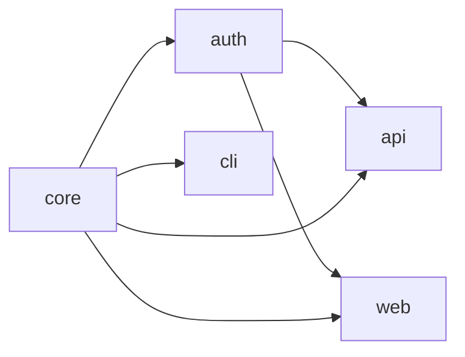

import Details from '@theme/Details';

# Workspace Model

A Foundry workspace is a tree of subprojects bound together by one `.grain` manifest. The manifest is the source of truth — Foundry never infers structure from directory layout or implicit conventions. Every package, dependency, and build rule must be declared explicitly.

This document describes how Foundry thinks about a workspace: what the manifest contains, how Tongs builds the dependency graph, and how Forge resolves cross-workspace references during a build.

## The Grain Manifest

Every workspace has exactly one root manifest named `project.grain`. The manifest declares the workspace identity, the language, the Warden preset, and the package layout.

```text title="project.grain"
workspace "platform" {
  lang   = "alloy"
  warden = ["strict", "conventions"]

  packages {
    core    { type = "library" }
    auth    { type = "library", depends = ["core"] }
    api     { type = "service", depends = ["core", "auth"] }
    web     { type = "app",     depends = ["core", "auth"] }
    cli     { type = "binary",  depends = ["core"] }
  }
}
```

Foundry parses this manifest into an in-memory representation called the **workspace model**. Every downstream tool — Forge, Tongs, Quench, Crucible, Warden — operates against the workspace model, not the raw text.

:::info
The workspace model is immutable for the duration of a Forge run. If you edit the manifest while a build is in progress, the running build completes with the original model. Re-run `foundry ignite` to pick up the changes.
:::

## Subprojects and Package Roles

Each package block declares one subproject. Foundry recognises four package types, and each type maps to a specific role in the workspace.

| Type      | Role                                      | Build Output                        |
|-----------|-------------------------------------------|-------------------------------------|
| `library` | Reusable code consumed by other packages. | Compiled module + Tongs index.      |
| `service` | Long-running process with a Spoke API.    | Service bundle + Spoke descriptor.  |
| `app`     | User-facing application.                  | Smelter bundle + static asset tree. |
| `binary`  | Standalone CLI tool.                      | Executable + entry point manifest.  |

A subproject's directory is named after its package and lives under the workspace root. Foundry refuses to forge if a declared package has no directory, or if a directory exists without a corresponding declaration.

## The Tongs Dependency Graph

Tongs is Foundry's dependency resolver. It reads the `depends` directive of every package and constructs a directed acyclic graph (DAG) of the workspace.



Tongs uses this graph for three purposes:

1. **Build ordering.** Forge processes packages in topological order so dependencies are ready before dependents start compiling.
2. **Change propagation.** When a package changes, Tongs marks every downstream dependent as stale.
3. **Cycle detection.** Tongs rejects any manifest that introduces a cycle, with a precise error path.

```bash title="Visualize the graph"
foundry tongs graph
```

```text title="Output"
workspace "platform"
  core      (library)  → consumed by: auth, api, web, cli
  auth      (library)  → consumed by: api, web
  api       (service)  → consumes: core, auth
  web       (app)      → consumes: core, auth
  cli       (binary)   → consumes: core

  5 packages, 6 edges, 0 cycles
```

### Cycle Rejection

A cycle in the dependency graph makes the build order undefined. Tongs detects cycles during the parse phase and refuses to continue.

```text title="Cycle error"
$ foundry ignite
ERROR: Dependency cycle detected
  api → auth → api

Fix: Remove the 'depends = ["api"]' directive from package "auth".
```

:::warning
Tongs only inspects the declared `depends` array. If a package imports another package at the source level without declaring the dependency, the import will fail at compile time but the cycle check will pass. Always keep the manifest aligned with the actual imports.
:::

## Cross-Workspace Resolution

Some organisations split a product across multiple Foundry workspaces — for example, a public SDK workspace and a private platform workspace that consumes the SDK. Forge resolves cross-workspace references through the `consume` directive.

```text title="project.grain — consuming an external workspace"
workspace "platform" {
  consume "sdk" from "../sdk/project.grain"

  packages {
    core { type = "library" }
    api  { type = "service", depends = ["core", "sdk:client"] }
  }
}
```

When Forge encounters a `consume` directive, Tongs loads the external workspace's manifest, builds its dependency graph, and merges the relevant packages into the local graph. The `sdk:` prefix becomes a namespace — every reference to an external package must be qualified.

| Phase              | Local Workspace | Consumed Workspace                   |
|--------------------|-----------------|--------------------------------------|
| Parse              | Always loaded.  | Loaded on first `consume` directive. |
| Build              | Always rebuilt. | Rebuilt only if source changed.      |
| Cache              | Local Quench.   | Shared Quench, scoped by workspace.  |
| Warden enforcement | Local rules.    | External rules apply unchanged.      |

:::tip
Consumed workspaces are built into a separate Quench namespace so a downstream workspace cannot pollute the upstream cache. This means a single SDK build can be reused across every consuming workspace on the same machine.
:::

## Workspace Identity

The workspace name has two effects beyond display:

- It prefixes every Tongs identifier (e.g. `platform:auth`), preventing collisions when two workspaces are consumed together.
- It seeds the Anvil cache namespace, so the same package name in two workspaces never shares cached artifacts.

Rename a workspace and Foundry will treat it as new — every package rebuilds from scratch. Rename packages within a stable workspace and only the renamed packages and their dependents rebuild.

<Details>
<summary>Workspace model invariants</summary>

| Invariant                                        | Enforced By  |
|--------------------------------------------------|--------------|
| Exactly one root manifest per workspace.         | Forge parse. |
| Every declared package has a directory.          | Forge parse. |
| No cycles in the dependency graph.               | Tongs.       |
| All `depends` entries resolve to known packages. | Tongs.       |
| Cross-workspace references are namespaced.       | Tongs.       |
| Package names are unique within a workspace.     | Forge parse. |

</Details>

## Next Steps

- [Incremental Builds](/docs/core/incremental-builds/) — How Anvil caches artifacts so the next forge only rebuilds what changed.
- [Manifests](/docs/guides/manifests/) — Full directive reference for the `.grain` syntax.
- [Build Pipeline](/docs/pipeline/build-pipeline/) — How Forge moves the workspace model through compile, link, and verify stages.
