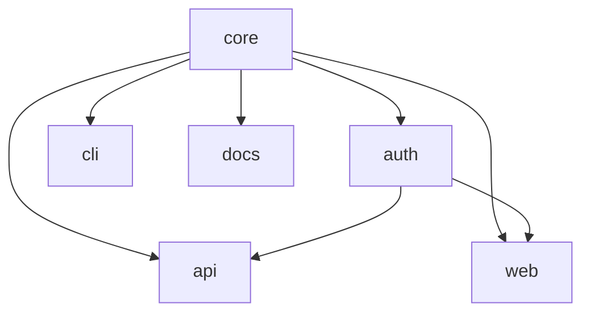

# Workspace Management

Foundry workspaces can scale to hundreds of packages. Tongs — the dependency graph resolver — is the tool that keeps the relationships between them visible and correct.

## Declaring Dependencies

Every package can depend on other packages in the same workspace. Dependencies are declared in the manifest.

```text title="project.grain"
workspace "platform" {
  lang = "alloy"

  packages {
    core       { type = "library" }
    auth       { type = "library", depends = ["core"] }
    api        { type = "service", depends = ["core", "auth"] }
    web        { type = "app", depends = ["core", "auth"] }
    cli        { type = "binary", depends = ["core"] }
    docs       { type = "app", depends = ["core"] }
  }
}
```

Foundry validates dependencies at parse time. If a package references a name that does not exist in the workspace, the forge fails immediately with a clear error.

## Visualizing the Graph

Tongs can render the full dependency graph for your workspace:

```bash title="Render the dependency graph"
foundry tongs graph
```

```text title="Output"
platform (6 packages, 7 edges)
  core       → (root, no dependencies)
  auth       → core
  api        → core, auth
  web        → core, auth
  cli        → core
  docs       → core

Longest path: core → auth → api (depth 3)
No cycles detected.
```

For larger workspaces, use the `--format mermaid` flag to generate a diagram you can embed in documentation.



## Adding a Package

Add a new package block to the manifest and run the forge:

```text title="project.grain — adding a gateway package"
packages {
  core       { type = "library" }
  auth       { type = "library", depends = ["core"] }
  api        { type = "service", depends = ["core", "auth"] }
  // highlight-next-line
  gateway    { type = "service", depends = ["api", "auth"] }
  web        { type = "app", depends = ["core", "auth"] }
}
```

```bash
foundry ignite
```

Foundry detects the new package, resolves its position in the dependency graph, and generates all configuration artifacts. Existing packages are untouched — Quench recognizes that their inputs have not changed and skips regeneration.

## Removing a Package

Remove the package block from the manifest. Foundry does not delete files automatically — it generates but never destroys. After removing a package from the manifest:

1. Run `foundry ignite` to update the dependency graph.
2. Run `foundry slag scan` to confirm nothing references the removed package.
3. Delete the package directory manually.

## Moving a Package

To rename or relocate a package:

1. Update the package name in the manifest.
2. Update any `depends` arrays that reference the old name.
3. Run `foundry ignite` to regenerate configuration artifacts.
4. Run `foundry tongs verify` to confirm the graph is still valid.

> A workspace is not a folder of packages. It is a graph of relationships. The manifest describes the graph. Foundry builds the rest.

## Cross-Package References

When one package depends on another, Foundry generates import aliases automatically. The `api` package can import from `core` using the workspace-scoped identifier:

```alloy title="packages/api/src/routes/health.al"
import { validateRequest } from "@platform/core/validate"
import { createSession } from "@platform/auth/session"

export function healthCheck(request: SpokeRequest): SpokeResponse {
  const valid: ValidationResult = validateRequest(request)
  const session: SessionToken = createSession(valid.identity)
  return SpokeResponse.ok({ status: "healthy", session: session.id })
}
```

The `@platform/core` and `@platform/auth` aliases are derived from the workspace name and package names in the manifest. You never configure module resolution manually.

## Workspace Queries

Tongs supports queries against the dependency graph for scripting and Conduit pipeline integration:

```bash title="List all packages that depend on core"
foundry tongs query --depends-on core
```

```text
auth, api, web, cli, docs
```

```bash title="Find the build order for a specific package"
foundry tongs query --build-order api
```

```text
1. core
2. auth
3. api
```

These queries are useful in Conduit pipelines where you want to build or test only the packages affected by a change.

## Next Steps

- [Build Pipeline](/docs/pipeline/build-pipeline/) — How Quench and Bellows execute builds across the workspace.
- [Manifests](/docs/guides/manifests/) — Full reference for every manifest directive.
- [CLI Reference](/docs/reference/cli-reference/) — All Tongs commands and flags.
