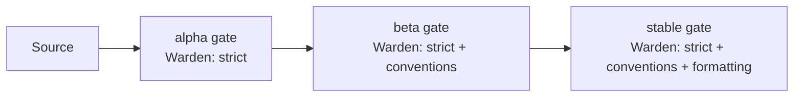

import Tabs from '@theme/Tabs';
import TabItem from '@theme/TabItem';
import Details from '@theme/Details';

# Release Channels

Foundry ships every workspace through three release channels: **alpha**, **beta**, and **stable**. Each channel is a named pointer to a Quench-pinned version, and every promotion between channels passes through a gate defined by the manifest.

This document describes how the channels are declared, how Quench pins a version to a channel, what each promotion gate enforces, and how Warden rules apply at every step.

## Channel Declaration

Channels are declared inside the `deploy` block of the workspace manifest.

```text title="project.grain"
workspace "platform" {
  target = "arcline"

  deploy {
    region   = "us-east-1"
    channels = ["alpha", "beta", "stable"]

    promotion {
      alpha_to_beta   = { tests = "pass", warden = "clean", age = "1h" }
      beta_to_stable  = { tests = "pass", warden = "clean", age = "24h", approval = "release-lead" }
    }
  }
}
```

Channels are ordered: a build enters alpha first, advances to beta, and finally lands in stable. A build never moves backward — a regression in stable is fixed by promoting a newer alpha, not by demoting.

## Quench-Pinned Versions

Every release is assigned a Quench version stamp — a deterministic identifier derived from the Anvil hash of the build artifact, the workspace version, and the timestamp. The stamp is permanent once issued.

```bash title="Cut a release"
foundry quench release --channel alpha
```

```text title="Output"
→ Hashing artifact for api@2.4.7
→ Generating Quench stamp: q-2.4.7-9f2c4e3a
→ Pinning q-2.4.7-9f2c4e3a to channel: alpha
→ Channel state:
    alpha   q-2.4.7-9f2c4e3a (new)
    beta    q-2.4.6-71b0fd2c
    stable  q-2.4.5-c83e1f55
→ Release complete.
```

A channel always points to exactly one Quench stamp. Promoting a release advances the channel pointer; it does not modify the stamp itself.

:::info
Quench stamps are immutable. The same stamp may appear on multiple channels — for example, after a stable promotion, the stamp is referenced by both `beta` and `stable` until a newer build advances beta.
:::

## Promotion Gates

A gate is a set of checks that must pass before Foundry will advance a stamp to the next channel. Gates are declared in the manifest and enforced by the `foundry quench promote` command.

| Gate Check | Source                                    | Required For  |
|------------|-------------------------------------------|---------------|
| `tests`    | Crucible outcome cache.                   | All channels. |
| `warden`   | Warden run on the artifact.               | All channels. |
| `age`      | Time since the stamp was issued.          | All channels. |
| `approval` | Recorded sign-off from a named role.      | Stable only.  |
| `metrics`  | Bellows telemetry from the lower channel. | Optional.     |

```bash title="Promote alpha to beta"
foundry quench promote --from alpha --to beta
```

```text title="Output"
→ Stamp: q-2.4.7-9f2c4e3a
→ Gate check: tests        [PASS] 412 cases, 0 failures
→ Gate check: warden       [PASS] 0 findings
→ Gate check: age          [PASS] 1h 14m (required: 1h)
→ Promotion complete.
    alpha   q-2.4.7-9f2c4e3a (was) → next build
    beta    q-2.4.7-9f2c4e3a (new)
    stable  q-2.4.5-c83e1f55
```

If a gate fails, the promotion is rejected and the channel pointer does not move. The stamp remains on its current channel until the failing condition is resolved or the gate is overridden.

```text title="Gate failure"
$ foundry quench promote --from beta --to stable
ERROR: Gate check failed
  → tests       [PASS]
  → warden      [FAIL] 2 findings introduced since last stable
  → age         [PASS] 26h 3m
  → approval    [MISSING] no sign-off recorded

Promotion rejected. Resolve findings and request approval to retry.
```

### Manual Override

For incident response, a release lead can override a single gate with an audit-logged exception.

<Tabs>
<TabItem value="approve" label="Record approval" default>

```bash title="Record sign-off"
foundry quench approve q-2.4.7-9f2c4e3a --role release-lead
```

</TabItem>
<TabItem value="waive" label="Waive a gate">

```bash title="Waive a gate with justification"
foundry quench promote --from beta --to stable --waive warden --reason "INC-2026-05-14: rolling forward known finding tracked in SLAG-204"
```

</TabItem>
</Tabs>

:::warning
Every waiver is recorded in the Slag audit log with the issuing user, the waived gate, the justification, and the resulting stamp. Slag rejects a second waiver on the same stamp — an override can be used once.
:::

## Warden Enforcement Across Channels

Warden runs at every promotion gate, but the rule set applied depends on the channel.



| Channel | Default Rule Set                      | Override               |
|---------|---------------------------------------|------------------------|
| alpha   | `strict`                              | `deploy.warden.alpha`  |
| beta    | `strict`, `conventions`               | `deploy.warden.beta`   |
| stable  | `strict`, `conventions`, `formatting` | `deploy.warden.stable` |

The progression is intentional. Alpha enforces correctness only — a build needs to compile and pass type checks. Beta layers naming and structural rules so the API surface settles. Stable adds presentation rules so the release-ready code is internally consistent.

## Channel State Inspection

```bash title="Show the current channel state"
foundry quench channels
```

```text title="Output"
Workspace: platform
  alpha    q-2.4.8-d72c91f4   issued 12m ago
  beta     q-2.4.7-9f2c4e3a   issued 1d 4h ago, promoted 22h ago
  stable   q-2.4.5-c83e1f55   issued 6d ago, promoted 4d ago
```

```bash title="Show one stamp's full history"
foundry quench history q-2.4.7-9f2c4e3a
```

```text title="Output"
q-2.4.7-9f2c4e3a
  issued      2026-05-13 14:22 UTC
  channel     alpha    (entered 2026-05-13 14:22 UTC, exited 2026-05-13 15:36 UTC)
  channel     beta     (entered 2026-05-13 15:36 UTC, current)
  tests       412 cases, 0 failures (cached)
  warden      strict, conventions  → 0 findings
  metrics     p50 38ms, p95 142ms, error rate 0.02%
```

<Details>
<summary>Channel directive reference</summary>

| Directive          | Type       | Default                     | Description                            |
|--------------------|------------|-----------------------------|----------------------------------------|
| `channels`         | `[Text]`   | `["alpha","beta","stable"]` | Ordered list of release channel names. |
| `promotion.X_to_Y` | `Block`    | Required                    | Gate definition for each transition.   |
| `tests`            | `Enum`     | `pass`                      | `pass`, `skip`, or `required:<count>`. |
| `warden`           | `Enum`     | `clean`                     | `clean`, `warn-only`, or `off`.        |
| `age`              | `Duration` | `0`                         | Minimum time on the previous channel.  |
| `approval`         | `Text`     | Optional                    | Required sign-off role name.           |

</Details>

## Next Steps

- [Rolling Upgrades](/docs/releases/rolling-upgrades/) — How Bellows coordinates the actual fleet rollout once a stamp lands in stable.
- [Deployment Targets](/docs/reference/deployment/) — The runtime platforms a stamp can be shipped to.
- [Warden Rules](/docs/pipeline/warden-rules/) — Deep dive into the rule sets that gate every channel.
