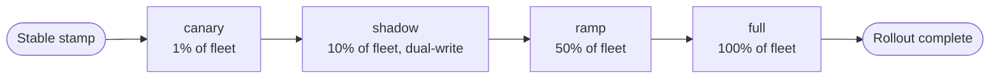

import Tabs from '@theme/Tabs';
import TabItem from '@theme/TabItem';
import Details from '@theme/Details';

# Rolling Upgrades

When a Quench stamp lands in the stable channel, the work of getting it onto every running instance begins. Foundry calls this a **rolling upgrade**, and it is orchestrated by Bellows.

Bellows treats a rollout the same way it treats a parallel build: a directed sequence of waves, each with its own gating criteria, and a deterministic order that can be re-run from any checkpoint. The Forge history log keeps every prior stable stamp ready for rollback.

## Rollout Stages

A rolling upgrade always passes through four stages. Each stage is a wave of fleet instances and a set of telemetry checks that must clear before Bellows advances.



| Stage  | Fleet Share | Traffic                    | Default Hold |
|--------|-------------|----------------------------|--------------|
| canary | 1%          | Live, isolated routing key | 15 minutes   |
| shadow | 10%         | Live + dual-write to old   | 30 minutes   |
| ramp   | 50%         | Live, weighted by request  | 60 minutes   |
| full   | 100%        | Live                       | n/a          |

Holds give Bellows time to collect telemetry before the next stage. Override the defaults per-workspace in the manifest:

```text title="project.grain — rollout configuration"
workspace "platform" {
  target = "arcline"

  deploy {
    rollout {
      strategy = "rolling"

      stages {
        canary { share = "1%",  hold = "15m" }
        shadow { share = "10%", hold = "30m", dual_write = true }
        ramp   { share = "50%", hold = "1h"  }
        full   { share = "100%" }
      }

      abort_on {
        error_rate    = "> 1%"
        p95_latency   = "> 250ms"
        warden_runtime = "any"
      }
    }
  }
}
```

## Launching a Rollout

```bash title="Start a rolling upgrade"
foundry bellows rollout --stamp q-2.4.7-9f2c4e3a
```

```text title="Output"
→ Loading stamp q-2.4.7-9f2c4e3a from Quench
→ Verifying channel: stable [OK]
→ Reading rollout config from project.grain
→ Stage: canary (1%)
   - Bellows: shifting 14 of 1400 instances
   - Warden runtime: 0 findings
   - Telemetry: error rate 0.04%, p95 132ms
   - Hold: 15m (started 14:22:08 UTC)
```

Bellows blocks on each stage until the configured hold elapses and the abort conditions remain clear. The active rollout is observable from any terminal:

```bash title="Watch a rollout in progress"
foundry bellows rollout status
```

```text title="Output"
Rollout: r-2026-05-14-001
  Stamp:     q-2.4.7-9f2c4e3a
  Strategy:  rolling
  Started:   14:22:08 UTC

  canary    [DONE]    14 of 1400 instances        passed at 14:37
  shadow    [ACTIVE]  140 of 1400 instances       hold ends 15:07
  ramp      [QUEUED]
  full      [QUEUED]
```

## Canary Telemetry

The canary stage exists to catch regressions on a small slice of real traffic. Bellows samples three signals during the hold and compares them against the `abort_on` thresholds.

| Signal         | Source                 | Default Threshold |
|----------------|------------------------|-------------------|
| Error rate     | Spoke request handler. | `> 1%`            |
| Latency (p95)  | Spoke request handler. | `> 250ms`         |
| Warden runtime | Warden runtime hooks.  | `any finding`     |

If any signal exceeds its threshold during the hold, Bellows pauses the rollout. The operator decides whether to wait for recovery, abort, or roll back.

```text title="Canary regression"
→ Stage: canary (1%)
   - Telemetry: error rate 2.4% (threshold > 1%)
   - Bellows: pausing rollout, awaiting operator decision
   - Command: 'foundry bellows rollout pause-resolve --rollout r-2026-05-14-001'
```

## Traffic-Shift Coordination

Foundry never moves traffic on its own. Bellows asks the deployment target — Arcline, Vial, or Trellis — to adjust routing weights, and waits for the target to acknowledge before declaring the stage done.

<Tabs>
<TabItem value="arcline" label="Arcline" default>

Arcline accepts a weighted routing table. Bellows submits the new weights at the start of each stage and reads back the applied state.

```text title="Arcline traffic shift"
→ Stage: ramp (50%)
   - Bellows: requesting Arcline weights
       q-2.4.6-71b0fd2c: 50% (current stable)
       q-2.4.7-9f2c4e3a: 50% (target stamp)
   - Arcline: weights applied at edge in 8s
```

</TabItem>
<TabItem value="vial" label="Vial">

Vial uses image tags as routing labels. Bellows updates the service descriptor, and the Vial control plane drains old containers as new ones come online.

```text title="Vial container rollout"
→ Stage: ramp (50%)
   - Bellows: updating Vial descriptor
       desired replicas: 70 (was 140 on q-2.4.6)
       new replicas:     70 on q-2.4.7
   - Vial: drain timeout 30s per old replica
```

</TabItem>
<TabItem value="trellis" label="Trellis">

Trellis exposes a fleet manifest. Bellows rewrites the per-zone share and Trellis schedules the cutover.

```text title="Trellis zonal cutover"
→ Stage: ramp (50%)
   - Bellows: applying Trellis fleet plan
       zone us-east-1a: 50% q-2.4.7, 50% q-2.4.6
       zone us-east-1b: 50% q-2.4.7, 50% q-2.4.6
       zone us-east-1c: 50% q-2.4.7, 50% q-2.4.6
   - Trellis: cutover complete in 22s
```

</TabItem>
</Tabs>

:::info
Each target reports back the actual applied weights, not the requested weights. Bellows treats the reported state as ground truth and will pause if a target fails to apply within the configured timeout.
:::

## Rollback Through Forge History

Forge keeps an append-only history of every promotion and every rollout. Each entry records the stamp, the rollout strategy, the per-stage outcome, and the operator who initiated it.

```bash title="Inspect Forge history"
foundry forge history --limit 5
```

```text title="Output"
2026-05-14 14:22  rollout r-2026-05-14-001  q-2.4.7-9f2c4e3a  ACTIVE  ramp
2026-05-13 09:11  rollout r-2026-05-13-002  q-2.4.6-71b0fd2c  DONE    full
2026-05-12 17:48  rollout r-2026-05-12-003  q-2.4.5-c83e1f55  DONE    full
2026-05-11 12:04  promote q-2.4.5-c83e1f55  beta → stable
2026-05-10 10:22  promote q-2.4.4-32b1e905  beta → stable
```

To roll back, pick a known-good stamp from the history and ask Bellows to roll forward to it.

```bash title="Roll back to the previous stable"
foundry bellows rollout --stamp q-2.4.6-71b0fd2c --reason "INC-2026-05-14"
```

Bellows treats a rollback as a normal rolling upgrade, just in the reverse direction. The same stages, the same gates, the same telemetry. The Slag audit log records the rollback alongside its incident reason.

:::warning
Rollback is forward motion, not state restoration. If `q-2.4.7` performed a destructive schema migration, a `q-2.4.6` rollout will not undo the migration — that requires a separate Conduit migration step. Always pair migrations with a forward-compatible window before deploying changes that depend on them.
:::

## Aborting a Rollout

```bash title="Abort the active rollout"
foundry bellows rollout abort --rollout r-2026-05-14-001 --reason "INC-2026-05-14: customer-visible 5xx spike"
```

An abort freezes the rollout at its current stage. Traffic remains at the most recently applied weights, and the rollout is marked terminal in Forge history. Resolve the underlying issue, then either resume from the same stamp or roll forward to a fix.

<Details>
<summary>Rollout directive reference</summary>

| Directive                 | Type       | Default     | Description                            |
|---------------------------|------------|-------------|----------------------------------------|
| `strategy`                | `Enum`     | `"rolling"` | `rolling`, `bluegreen`, or `recreate`. |
| `stages.X.share`          | `Percent`  | Required    | Fleet share for the stage.             |
| `stages.X.hold`           | `Duration` | `0`         | Minimum hold time before advancing.    |
| `stages.X.dual_write`     | `Bool`     | `false`     | Mirror writes to the previous stamp.   |
| `abort_on.error_rate`     | `Text`     | `"> 1%"`    | Comparison expression for error rate.  |
| `abort_on.p95_latency`    | `Text`     | `"> 250ms"` | Comparison expression for p95 latency. |
| `abort_on.warden_runtime` | `Enum`     | `"any"`     | Runtime Warden finding policy.         |

</Details>

## Next Steps

- [Release Channels](/docs/releases/release-channels/) — How a stamp earns the right to be rolled out in the first place.
- [Deployment Targets](/docs/reference/deployment/) — Arcline, Vial, and Trellis as the runtime platforms behind a rollout.
- [Build Pipeline](/docs/pipeline/build-pipeline/) — How the artifact in the stamp was produced.
