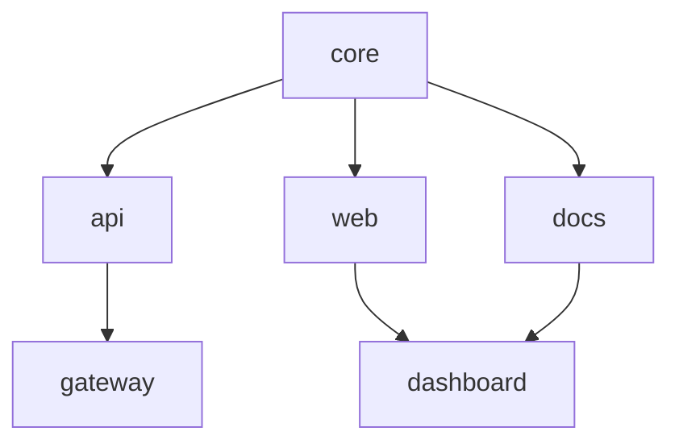

كان لدينا مساحة عمل بـ 200 حزمة. استغرق البناء الكامل اثنتي عشرة دقيقة وأربع عشرة ثانية. خفّضناه إلى أربع عشرة ثانية على طَرق دافئ وأقل من دقيقة على طَرق بارد. إليك الكيفية.

{/* truncate */}

## المشكلة

كانت أكبر مساحة عمل داخلية لدينا — تلك التي تُشغِّل موقع توثيق Foundry وCLI وكل المكتبات الداعمة — قد نَمت إلى 200 حزمة. في كل مرة يدفع فيها أحدهم إلى الفرع الرئيسي، تُشغِّل Conduit بناءً كاملًا. اثنتا عشرة دقيقة وأربع عشرة ثانية، في كل مرة.

حلّلنا الأداء. تسعون بالمئة من ذلك الوقت كان إعادة حوسبة مُكرَّرة. حزم لم تتغيّر كانت تُعاد بناؤها. تبعيات حُلّت أصلًا كانت تُحلَّل مجددًا. كان Smelter يُترجم الملفات ذاتها التي ترجمها قبل ثلاثين ثانية.

لم يكن لخط أنابيب البناء ذاكرة.

## الحل: Quench + Bellows

بَنينا أداتين لحلّ هذا.

**Quench** ذاكرة بناء موجَّهة بالمحتوى. تجزّئ كل ملف مصدر، وكل إصدار تبعية، وكل توجيه بيان. إن تطابقت التجزئة مع بناء سابق، تتخطّى Quench الترجمة تمامًا وتستعيد الخرج المخزَّن. لا طوابع زمنية. لا مراقبي ملفات. فقط تجزئات.

**Bellows** مُشغِّل مهام متوازية. يقرأ رسم التبعيات من Tongs ويُوزِّع العمل عبر كل نواة متاحة. الحزم بلا اعتماديات متبادلة تُبنى في الوقت ذاته. الحزم التي تعتمد على بعضها تنتظر بالترتيب الصحيح.

معًا، حوّلوا بناءنا من زحف تسلسلي بـ 12 دقيقة إلى عَدْو متوازٍ بـ 14 ثانية.

## كيف ينظّم Bellows العمل

يقرأ Bellows رسم تبعيات Tongs ويُجدول الحزم في موجات. الحزم المستقلة تعمل بالتوازي. الحزم المعتمدة تنتظر مسبقاتها.



في هذا الرسم، تُبنى `core` أولًا. ثم تُبنى `api` و`web` و`docs` بالتوازي. أخيرًا، تُبنى `gateway` و`dashboard` بمجرد انتهاء تبعياتها. يكتشف Bellows الموجات تلقائيًا من رسم Tongs — أنت لا تحدّد ترتيب التنفيذ يدويًا أبدًا.

## نتائج الاختبار

اختبرنا الأداء عبر أربعة أحجام مساحات عمل. شغّلت كل الاختبارات على جهاز بـ 8 نوى و32 جيجابايت من الذاكرة. الأوقات متوسطات زمن ساعة الحائط على 10 تشغيلات.

| حجم مساحة العمل | قبل (تسلسلي) | طَرق بارد  | طَرق دافئ | معدّل إصابة الذاكرة |
|-----------------|--------------|------------|-----------|---------------------|
| 10 حزم          | 42 ثانية     | 8.1 ثانية  | 1.2 ثانية | 91%                 |
| 50 حزمة         | 3د 18ث       | 14.7 ثانية | 1.8 ثانية | 94%                 |
| 100 حزمة        | 6د 42ث       | 28.3 ثانية | 2.1 ثانية | 96%                 |
| 200 حزمة        | 12د 14ث      | 52.6 ثانية | 3.4 ثانية | 97%                 |

أوقات الطَرق الدافئ مسطّحة تقريبًا عبر أحجام مساحات العمل. هذه قوة ذاكرة موجَّهة بالمحتوى — إن لم يتغيّر شيء، فحجم مساحة العمل لا يهمّ.

### بيانات الاختبار الكاملة (كل التشغيلات الـ 10)

**200 حزمة — طَرق بارد (بالثواني):**

| التشغيل | الوقت  |
|---------|--------|
| 1       | 54.2 ث |
| 2       | 51.8 ث |
| 3       | 53.1 ث |
| 4       | 52.9 ث |
| 5       | 51.4 ث |
| 6       | 53.7 ث |
| 7       | 52.0 ث |
| 8       | 52.3 ث |
| 9       | 53.5 ث |
| 10      | 51.1 ث |

**200 حزمة — طَرق دافئ (بالثواني):**

| التشغيل | الوقت |
|---------|-------|
| 1       | 3.6 ث |
| 2       | 3.2 ث |
| 3       | 3.5 ث |
| 4       | 3.4 ث |
| 5       | 3.1 ث |
| 6       | 3.7 ث |
| 7       | 3.3 ث |
| 8       | 3.4 ث |
| 9       | 3.5 ث |
| 10      | 3.3 ث |

الانحراف المعياري للطَرقات الدافئة: 0.18 ث. الذاكرة حتمية.

## كيف يعمل تجزئة Quench

لا تستخدم Quench طوابع تعديل الملفات. الطوابع تكذب — `git checkout` يُغيِّر mtime لكل ملف حتى لو كان المحتوى متطابقًا. بدلًا من ذلك، تُجزّئ Quench ثلاثة أمور:

1. **محتوى المصدر.** كل ملف في الحزمة، مُجزّأ بـ SHA-256.
2. **إصدارات التبعيات.** الإصدار المحلول لكل تبعية في رسم Tongs.
3. **توجيهات البيان.** قواعد Warden، وإعداد Smelter، ومنصة الهدف من بيان `.grain`.

إن تطابقت التجزئات الثلاث مع بناء سابق، تستعيد Quench القطع المخزَّنة وتتخطّى الترجمة تمامًا.

```text title="Quench cache check output"
$ foundry quench status
  core       [HIT]  abc12f → cached 2.1s ago
  api        [HIT]  def34a → cached 2.1s ago
  web        [MISS] ghi56b → source changed (src/routes/index.al)
  docs       [HIT]  jkl78c → cached 14m ago
  gateway    [WAIT] depends on api (HIT), will use cache
  dashboard  [MISS] depends on web (MISS), must rebuild
```

فقط الحزم التي تغيّرت فعلًا — ومعتمداتها السفلية — تُعاد بناؤها. كل ما عدا ذلك يأتي من الذاكرة.

## المقايضات

لا شيء بالمجان. إليك ما تخلّينا عنه:

- **مساحة القرص.** تخزّن Quench قطعًا مخزَّنة لكل تجزئة فريدة. مساحة عمل بـ 200 حزمة تستخدم نحو 2.4 جيجابايت من الذاكرة. نُشغِّل `foundry quench prune --older-than 7d` أسبوعيًا في Conduit.
- **تكلفة التشغيل الأول.** طَرق بارد بذاكرة فارغة أبطأ من بناء تسلسلي ساذج لأن Quench لا تزال تحوسب كل التجزئات. يأتي العائد على كل بناء لاحق.
- **متطلب الحتمية.** إن لم يكن بناؤك حتميًا — إن كانت المدخلات ذاتها تستطيع إنتاج مخرجات مختلفة — فستخدم Quench قطعًا قديمة. نفرض الحتمية عبر قواعد Warden تحظر الاستيرادات غير الحتمية وتوليد الشيفرة المعتمد على وقت التشغيل.

## جرّبه

```bash
# Run a cold forge and populate the cache
foundry ignite

# Change one file and run again
foundry ignite
# → Only the changed package and its dependents rebuild
```

الذاكرة محلية افتراضيًا. للتخزين المشترك عبر فريق، راجع توثيق [خط إنتاج البناء](/docs/pipeline/build-pipeline/) عن إعداد الذاكرة البعيدة.
