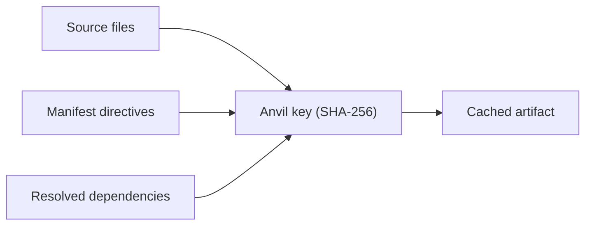

import Tabs from '@theme/Tabs';
import TabItem from '@theme/TabItem';

# البناءات التزايدية

أول `foundry ignite` في فحص بارد هو طَرق بارد — تُترجَم كل حزمة من الصفر. كل طَرق لاحق ينبغي أن يكون تزايديًا: لا يُعاد إلا العمل الذي تغيّر فعلًا. هذه مهمة ذاكرة Anvil.

تشرح هذه الوثيقة كيف يُخزِّن Anvil القطع، وكيف يقرّر Foundry ما إذا كان مُدخل المخبأ لا يزال صالحًا، ومتى يُعيد Crucible تشغيل الاختبارات، وكيف تُعيد Tongs استخدام مقابض التبعيات عبر البناءات.

## Anvil، مخزن القطع

Anvil هو الذاكرة على القرص حيث يكتب Forge كل قطعة بناء. إنه موجَّه بالمحتوى: كل مُدخل مفتاحه تجزئة لمداخله، وليس باسم الحزمة أو مسارها.

| المكوّن        | يخزّن                                                |
|----------------|------------------------------------------------------|
| مخزن الكائنات  | الوحدات المُترجَمة، والحزم، وفهارس الأنواع.          |
| فهرس البيانات  | يربط `(workspace, package, hash)` بمعرّفات الكائنات. |
| مقابض Tongs    | واصفات التبعيات المحلولة لكل حزمة.                   |
| خرج Warden     | اكتشافات المُدقِّق لمرحلة التحقق.                    |
| سجلات Crucible | نتائج الاختبارات لكل حزمة ولكل حزمة تأكيدات.         |

يقطن Anvil تحت `~/.anvil` افتراضيًا، ويمكن نقله بمتغيّر البيئة `FOUNDRY_CACHE_DIR`. تتشارك مساحات عمل متعدّدة على الجهاز نفسه Anvil ذاته — فبادئة مساحة العمل في كل مفتاح تمنع تصادم المُدخلات.

```bash title="Inspect the Anvil store"
foundry anvil status
```

```text title="Output"
Anvil   ~/.anvil
Objects 18,402 entries (1.4 GB)
Index   3 workspaces, 84 packages, 41,022 hash records
Tongs   1,288 cached handles
```

## القطع الموجّهة بالمحتوى

كل كائن مخزَّن يُعرَّف بـ SHA-256 لمجموعة مداخله الكاملة. بناءان يُنتجان الوحدة المُترجَمة نفسها — على أجهزة مختلفة، في أدلّة مختلفة، في أوقات مختلفة — يحصلان على المفتاح ذاته في Anvil.



الفائدة هي القابلية للمشاركة. يستطيع فريق نشر مخزن Anvil الخاص به كمرآة قابلة للقراءة فقط، فيحصل كل مطوّر في الفريق على ذاكرة دافئة عند أول فحص. يجلب Forge الكائنات المطابقة عند الطلب دون إعادة بناء أي شيء محليًا.

:::info
مفاتيح Anvil حتميّة لكنها غير مستقرّة عبر إصدارات Foundry الثانوية. تغيير توليد الشيفرة في Smelter قد يُزيح كل مفتاح في المخزن. تُعامَل الذاكرة كزائلة — فقدانها يكلّف وقتًا لا صحة.
:::

## قواعد الإبطال

مُدخل المخبأ صالح فقط إذا تطابقت جميع مدخلاته الثلاثة مع الحالة الراهنة:

1. **محتوى المصدر.** كل ملف في دليل `src/` للحزمة يُسهم بـ SHA-256 الخاص به في المفتاح.
2. **توجيهات البيان.** مجموعة Warden المسبقة، وملف Smelter، وإصدار اللغة، وسلسلة الهدف من بيان `.grain`.
3. **التبعيات المحلولة.** مقبض Tongs لكل عنصر في مصفوفة `depends` للحزمة، بما يشمل الإغلاق التعدّي.

إذا تغيّر أي مدخل، يتغيّر المفتاح، ولا يعود الكائن المخزَّن قابلًا للوصول. لا يُحذف المُدخل القديم فورًا — يبقى في مخزن الكائنات حتى يُقلَّم، ما يتيح لتبديل الفرع إعادة استخدام البناء السابق دون إعادة ترجمة.

| التغيير                                                        | يُبطل                                   |
|----------------------------------------------------------------|-----------------------------------------|
| تعديل `src/routes/health.al`                                   | الحزمة المالكة.                         |
| رفع إصدار في `depends`                                         | الحزمة + كل المعتمدات السفلية.          |
| تغيير `warden` من `["strict"]` إلى `["strict", "conventions"]` | كل حزمة في مساحة العمل.                 |
| تبديل الفروع                                                   | لا شيء — تبقى قطع الفرعين مخزَّنة.      |
| إضافة تعليق إلى `.grain`                                       | لا شيء — تُجرَّد التعليقات قبل التجزئة. |

### حين تنتشر تغييرات البيان

يُعامَل تغيير توجيه عام — `lang` أو `warden` أو `smelter` أو `target` — كإبطال شامل لمساحة العمل. تُعاد تجزئة كل حزمة مقابل التوجيه الجديد وتُعاد بناؤها.

تغيير كتلة حزمة واحدة يُبطل تلك الحزمة فقط ومعتمداتها السفلية.

```bash title="Trace an invalidation"
foundry anvil why core
```

```text title="Output"
Package: core
Key:     0x9f2c4e... (current)
Reason:  source change in src/encoding.al (last modified 4m ago)
Status:  cached entry 0x14a83b... is now unreachable

Downstream effects:
  auth   → INVALIDATED (depends on core)
  api    → INVALIDATED (depends on core via auth)
  web    → INVALIDATED (depends on core via auth)
  cli    → INVALIDATED (depends on core)
```

## متى يُعيد Crucible تشغيل الاختبارات

تعيش ذاكرة اختبار Crucible داخل Anvil. نتيجة الاختبار مفتاحها تجزئة قطعة الحزمة بالإضافة إلى تجزئة هيكل الاختبار. ينبثق مبدآن:

- **المصدر بلا تغيير، الاختبارات بلا تغيير ← لا إعادة تشغيل.** يحمّل Crucible النتيجة السابقة من المخبأ.
- **تغيّر المصدر أو الهيكل ← إعادة تشغيل.** يُنفِّذ Crucible الاختبارات المتأثرة ويكتب النتيجة الجديدة.

<Tabs>
<TabItem value="default" label="الوضع الافتراضي" default>

```bash title="Forge with cached tests"
foundry ignite
```

يُعيد Crucible استخدام النتيجة المخزَّنة كلّما تجزّأت القطعة والهيكل إلى قيم معروفة. هذا هو المسار الأسرع والافتراضي في التطوير المحلي.

</TabItem>
<TabItem value="force" label="إجبار إعادة التشغيل">

```bash title="Re-run every test"
foundry ignite --force-tests
```

مفيد عند فحص اختبارات هشّة أو بعد ترقية Crucible نفسه. يتجاوز العلم `--force-tests` ذاكرة الاختبار لكنه يستخدم قطع الترجمة المخزَّنة.

</TabItem>
<TabItem value="ci" label="وضع CI">

```bash title="Run in Conduit"
foundry ignite --ci
```

في وضع CI، يُعطِّل Crucible ذاكرة الاختبار افتراضيًا — يعمل كل اختبار في كل بناء. يمكن التجاوز عبر `FOUNDRY_CACHE_TESTS=1` في بيئات CI ذات الذاكرة المشتركة.

</TabItem>
</Tabs>

:::warning
الاختبارات التي تمسّ حالة خارجية — استدعاءات شبكة، أو قواعد بيانات حقيقية، أو نظام الملفات خارج الحزمة — قد تُنتج نتائج مختلفة من مدخلات متطابقة. علِّمها بـ `@crucible.external` حتى لا تُخزَّن أبدًا.
:::

## إعادة استخدام مقابض Tongs

مقبض Tongs هو الوصف المحلول لتبعية واحدة — إصدارها، وتجزئتها، ورموزها المُصدَّرة. حلّ مقبض مكلف عند وجود حزم كثيرة، لذا تخزّن Tongs المقابض في Anvil وتعيد استخدامها عبر الطَرقات.

```text title="Handle cache hit"
$ foundry ignite --verbose
  → Tongs: 24 handles loaded from cache (3ms)
  → Tongs: 0 handles re-resolved
  → Forge: cache check complete
```

يُبطَل المقبض فقط حين تُبطَل الحزمة التي يصفها. لهذا يستطيع شجرة تبعيات نظيفة تسليم ذاكرة دافئة إلى مساحة عمل جديدة كليًا تستهلك الحزمة نفسها — تسافر المقابض مع القطع.

## صيانة الذاكرة

ينمو Anvil مع الوقت. أمران يُبقيانه سليمًا:

```bash title="Prune unreachable entries"
foundry anvil prune --older-than 14d
```

```bash title="Reclaim space aggressively"
foundry anvil prune --orphaned
```

الأول يُزيل المُدخلات التي لم تُستخدم منذ 14 يومًا. الثاني يُزيل المُدخلات التي لم تعد قابلة للوصول من أي حالة مساحة عمل حالية — وهي عادةً نتيجة حذف فروع أو إعادة كتابة بيانات.

:::tip
إذا اشتبهت بمشكلة فساد في الذاكرة، شغِّل `foundry anvil verify`. يمشي عبر كل كائن ويُعيد تجزئته مقابل مفتاحه. يُبلَّغ عن عدم التطابق وتُحجَر المُدخلات للمراجعة قبل الحذف.
:::

## الخطوات التالية

- [نموذج مساحة العمل](/docs/core/workspace-model/) — الأساس البنيوي الذي تجزّأ ضدّه مفاتيح Anvil.
- [خط إنتاج البناء](/docs/pipeline/build-pipeline/) — كيف ينظّم Quench وBellows مراحل الترجمة والربط والتحقق فعلًا.
- [الاختبار مع Crucible](/docs/pipeline/testing-with-crucible/) — توليد هياكل الاختبار وتخطيطها على القرص لنتائج الاختبارات.
