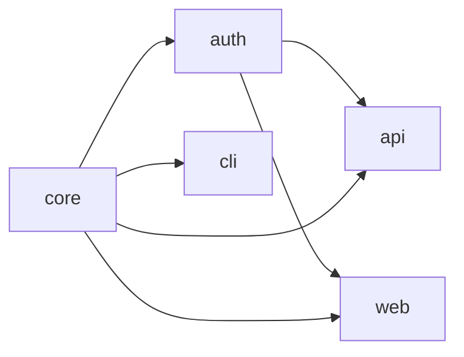

import Details from '@theme/Details';

# نموذج مساحة العمل

مساحة عمل Foundry هي شجرة من المشاريع الفرعية يربطها بيان `.grain` واحد. البيان هو مصدر الحقيقة — لا يستنبط Foundry البنية من تخطيط الدلائل ولا من اتفاقيات ضمنية. كل حزمة وتبعية وقاعدة بناء يجب أن تُعلَن صراحة.

تصف هذه الوثيقة كيف يفكّر Foundry في مساحة العمل: ماذا يحتوي البيان، وكيف تبني Tongs رسم التبعيات، وكيف يحلّ Forge المراجع بين مساحات العمل أثناء البناء.

## بيان Grain

لكل مساحة عمل بيان جذر واحد بالضبط اسمه `project.grain`. يُعلن البيان هوية مساحة العمل، واللغة، ومجموعة Warden المسبقة، وتخطيط الحزم.

```text title="project.grain"
workspace "platform" {
  lang   = "alloy"
  warden = ["strict", "conventions"]

  packages {
    core    { type = "library" }
    auth    { type = "library", depends = ["core"] }
    api     { type = "service", depends = ["core", "auth"] }
    web     { type = "app",     depends = ["core", "auth"] }
    cli     { type = "binary",  depends = ["core"] }
  }
}
```

يُحلِّل Foundry هذا البيان إلى تمثيل في الذاكرة يُسمّى **نموذج مساحة العمل**. كل أداة تالية — Forge وTongs وQuench وCrucible وWarden — تعمل على نموذج مساحة العمل، لا على النص الخام.

:::info
نموذج مساحة العمل ثابت طوال تشغيل Forge. إذا عدّلت البيان أثناء بناء جارٍ، يكتمل البناء الجاري بالنموذج الأصلي. أعِد تشغيل `foundry ignite` لاستيعاب التغييرات.
:::

## المشاريع الفرعية وأدوار الحزم

كل كتلة حزمة تُعلن مشروعًا فرعيًا واحدًا. يتعرّف Foundry على أربعة أنواع من الحزم، وكل نوع يقابل دورًا محددًا في مساحة العمل.

| النوع     | الدور                                   | خرج البناء                          |
|-----------|-----------------------------------------|-------------------------------------|
| `library` | شيفرة قابلة لإعادة الاستخدام بحزم أخرى. | وحدة مُترجَمة + فهرس Tongs.         |
| `service` | عملية طويلة الأمد ذات واجهة Spoke.      | حزمة الخدمة + واصف Spoke.           |
| `app`     | تطبيق موجّه للمستخدم.                   | حزمة Smelter + شجرة الأصول الساكنة. |
| `binary`  | أداة CLI مستقلة.                        | ملف تنفيذي + بيان نقطة الدخول.      |

دليل المشروع الفرعي يُسمّى باسم حزمته ويقع تحت جذر مساحة العمل. يرفض Foundry الطَرق إذا كانت حزمة معلَنة بلا دليل، أو إذا وُجد دليل بلا إعلان موافق له.

## رسم تبعيات Tongs

Tongs هو مُحلِّل التبعيات في Foundry. يقرأ توجيه `depends` لكل حزمة ويبني رسمًا موجّهًا غير دوري (DAG) لمساحة العمل.



يستخدم Tongs هذا الرسم لثلاثة أغراض:

1. **ترتيب البناء.** يعالج Forge الحزم بترتيب طوبولوجي حتى تكون التبعيات جاهزة قبل بدء تجميع المعتمِدات.
2. **انتشار التغيير.** عند تغيّر حزمة، تُعلِّم Tongs كل المعتمد عليها في الاتجاه السفلي على أنها قديمة.
3. **كشف الدورات.** يرفض Tongs أي بيان يُدخل دورة، مع مسار خطأ دقيق.

```bash title="Visualize the graph"
foundry tongs graph
```

```text title="Output"
workspace "platform"
  core      (library)  → consumed by: auth, api, web, cli
  auth      (library)  → consumed by: api, web
  api       (service)  → consumes: core, auth
  web       (app)      → consumes: core, auth
  cli       (binary)   → consumes: core

  5 packages, 6 edges, 0 cycles
```

### رفض الدورات

تجعل الدورة في رسم التبعيات ترتيب البناء غير محدّد. يكتشف Tongs الدورات أثناء مرحلة التحليل ويرفض الاستمرار.

```text title="Cycle error"
$ foundry ignite
ERROR: Dependency cycle detected
  api → auth → api

Fix: Remove the 'depends = ["api"]' directive from package "auth".
```

:::warning
يفحص Tongs فقط مصفوفة `depends` المُعلنة. إذا استورد ملف حزمة من حزمة أخرى على مستوى المصدر دون إعلان التبعية، فسيفشل الاستيراد في وقت الترجمة، لكن فحص الدورات سيمرّ. حافظ دائمًا على توافق البيان مع الواردات الفعلية.
:::

## الحلّ بين مساحات العمل

بعض المؤسسات تقسّم منتجًا عبر عدّة مساحات عمل لـ Foundry — مثلًا مساحة عمل SDK عامة ومساحة منصّة خاصة تستهلك الـ SDK. يحلّ Forge المراجع بين مساحات العمل عبر توجيه `consume`.

```text title="project.grain — consuming an external workspace"
workspace "platform" {
  consume "sdk" from "../sdk/project.grain"

  packages {
    core { type = "library" }
    api  { type = "service", depends = ["core", "sdk:client"] }
  }
}
```

حين يلتقي Forge بتوجيه `consume`، يُحمِّل Tongs بيان مساحة العمل الخارجية، ويبني رسم تبعياتها، ويدمج الحزم ذات الصلة في الرسم المحلي. تصبح البادئة `sdk:` فضاء أسماء — كل مرجع لحزمة خارجية يجب أن يكون مؤهَّلًا.

| المرحلة    | مساحة العمل المحلية | مساحة العمل المستهلَكة              |
|------------|---------------------|-------------------------------------|
| التحليل    | مُحمَّلة دائمًا.    | تُحمَّل عند أول توجيه `consume`.    |
| البناء     | تُبنى دائمًا.       | تُبنى فقط إذا تغيّر المصدر.         |
| الذاكرة    | Quench المحلي.      | Quench مشترك، مُقيَّد بمساحة العمل. |
| فرض Warden | القواعد المحلية.    | القواعد الخارجية تنطبق كما هي.      |

:::tip
تُبنى مساحات العمل المستهلَكة في فضاء Quench منفصل حتى لا تستطيع مساحة عمل تابعة تلويث ذاكرة المصدر. هذا يعني أن بناء SDK واحد يمكن إعادة استخدامه عبر كل مساحة عمل تستهلكه على الجهاز نفسه.
:::

## هوية مساحة العمل

لاسم مساحة العمل تأثيران يتجاوزان العرض:

- يضع بادئة لكل مُعرِّف Tongs (مثل `platform:auth`)، مما يمنع التصادمات حين تُستهلك مساحتا عمل معًا.
- يُحدِّد فضاء أسماء ذاكرة Anvil، فلا تتشارك الحزمة بالاسم نفسه في مساحتَي عمل القطع المخزّنة أبدًا.

أعِد تسمية مساحة العمل، وسيتعامل معها Foundry على أنها جديدة — تُعاد بناء كل حزمة من الصفر. أعِد تسمية الحزم داخل مساحة عمل مستقرّة، فلن تُعاد إلا الحزم المعاد تسميتها ومعتمداتها.

<Details>
<summary>ثوابت نموذج مساحة العمل</summary>

| الثابت                                         | يفرضه        |
|------------------------------------------------|--------------|
| بيان جذر واحد بالضبط لكل مساحة عمل.            | تحليل Forge. |
| كل حزمة معلَنة لها دليل.                       | تحليل Forge. |
| لا دورات في رسم التبعيات.                      | Tongs.       |
| كل مدخل `depends` يحلّ إلى حزمة معروفة.        | Tongs.       |
| المراجع بين مساحات العمل مُحدَّدة بفضاء أسماء. | Tongs.       |
| أسماء الحزم فريدة داخل مساحة العمل.            | تحليل Forge. |

</Details>

## الخطوات التالية

- [البناءات التزايدية](/docs/core/incremental-builds/) — كيف تخزّن Anvil القطع حتى لا يُعيد الطَرق التالي إلا بناء ما تغيّر.
- [البيانات](/docs/guides/manifests/) — مرجع كامل للتوجيهات لصياغة `.grain`.
- [خط إنتاج البناء](/docs/pipeline/build-pipeline/) — كيف يُمرِّر Forge نموذج مساحة العمل عبر مراحل الترجمة والربط والتحقق.
