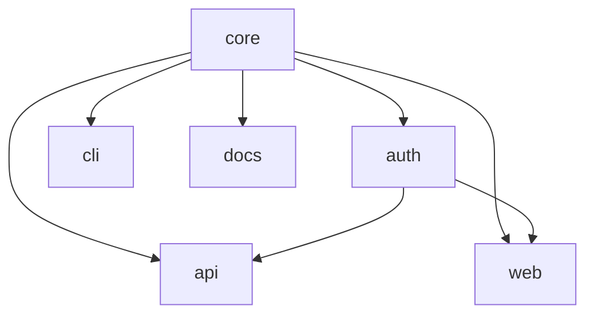

# إدارة مساحة العمل

يمكن لمساحات عمل Foundry أن تتوسّع إلى مئات الحزم. Tongs — مُحلِّل رسم التبعيات — هو الأداة التي تُبقي العلاقات بينها مرئيّة وصحيحة.

## إعلان التبعيات

كل حزمة يمكن أن تعتمد على حزم أخرى في مساحة العمل ذاتها. تُعلَن التبعيات في البيان.

```text title="project.grain"
workspace "platform" {
  lang = "alloy"

  packages {
    core       { type = "library" }
    auth       { type = "library", depends = ["core"] }
    api        { type = "service", depends = ["core", "auth"] }
    web        { type = "app", depends = ["core", "auth"] }
    cli        { type = "binary", depends = ["core"] }
    docs       { type = "app", depends = ["core"] }
  }
}
```

يتحقق Foundry من التبعيات في وقت التحليل. إذا أشارت حزمة إلى اسم غير موجود في مساحة العمل، يفشل الطَرق فورًا بخطأ واضح.

## عرض الرسم بصريًا

يستطيع Tongs عرض رسم التبعيات الكامل لمساحة عملك:

```bash title="Render the dependency graph"
foundry tongs graph
```

```text title="Output"
platform (6 packages, 7 edges)
  core       → (root, no dependencies)
  auth       → core
  api        → core, auth
  web        → core, auth
  cli        → core
  docs       → core

Longest path: core → auth → api (depth 3)
No cycles detected.
```

لمساحات العمل الأكبر، استخدم العلم `--format mermaid` لتوليد مخطط يمكنك تضمينه في التوثيق.



## إضافة حزمة

أضِف كتلة حزمة جديدة إلى البيان وشغِّل الطَرق:

```text title="project.grain — adding a gateway package"
packages {
  core       { type = "library" }
  auth       { type = "library", depends = ["core"] }
  api        { type = "service", depends = ["core", "auth"] }
  // highlight-next-line
  gateway    { type = "service", depends = ["api", "auth"] }
  web        { type = "app", depends = ["core", "auth"] }
}
```

```bash
foundry ignite
```

يكتشف Foundry الحزمة الجديدة، ويحلّ موقعها في رسم التبعيات، ويُولِّد كل قطع الإعداد. تبقى الحزم الموجودة دون مساس — يدرك Quench أن مداخلها لم تتغيّر ويتخطى إعادة التوليد.

## إزالة حزمة

أزِل كتلة الحزمة من البيان. لا يحذف Foundry الملفات تلقائيًا — يُولِّد ولا يُدمِّر. بعد إزالة حزمة من البيان:

1. شغِّل `foundry ignite` لتحديث رسم التبعيات.
2. شغِّل `foundry slag scan` للتأكد من أنه لا شيء يُشير إلى الحزمة المُزالة.
3. احذف دليل الحزمة يدويًا.

## نقل حزمة

لإعادة تسمية حزمة أو نقلها:

1. حدِّث اسم الحزمة في البيان.
2. حدِّث أي مصفوفات `depends` تُشير إلى الاسم القديم.
3. شغِّل `foundry ignite` لإعادة توليد قطع الإعداد.
4. شغِّل `foundry tongs verify` للتأكد من أن الرسم لا يزال صالحًا.

> مساحة العمل ليست مجلّد حزم. هي رسم علاقات. البيان يصف الرسم. وFoundry يبني الباقي.

## المراجع عبر الحزم

حين تعتمد حزمة على أخرى، يُولِّد Foundry بدائل استيراد تلقائيًا. يمكن لحزمة `api` الاستيراد من `core` باستخدام المعرّف المُحدَّد بنطاق مساحة العمل:

```alloy title="packages/api/src/routes/health.al"
import { validateRequest } from "@platform/core/validate"
import { createSession } from "@platform/auth/session"

export function healthCheck(request: SpokeRequest): SpokeResponse {
  const valid: ValidationResult = validateRequest(request)
  const session: SessionToken = createSession(valid.identity)
  return SpokeResponse.ok({ status: "healthy", session: session.id })
}
```

البدائل `@platform/core` و`@platform/auth` مُشتقّة من اسم مساحة العمل وأسماء الحزم في البيان. لا تُعدّ حلّ الوحدات يدويًا أبدًا.

## استعلامات مساحة العمل

يدعم Tongs استعلامات على رسم التبعيات للنصوص البرمجية ودمج خط أنابيب Conduit:

```bash title="List all packages that depend on core"
foundry tongs query --depends-on core
```

```text
auth, api, web, cli, docs
```

```bash title="Find the build order for a specific package"
foundry tongs query --build-order api
```

```text
1. core
2. auth
3. api
```

هذه الاستعلامات مفيدة في خطوط Conduit حيث تريد بناء أو اختبار الحزم المتأثرة بتغيير فقط.

## الخطوات التالية

- [خط إنتاج البناء](/docs/pipeline/build-pipeline/) — كيف يُنفِّذ Quench وBellows عمليات البناء عبر مساحة العمل.
- [البيانات](/docs/guides/manifests/) — مرجع كامل لكل توجيه بيان.
- [مرجع CLI](/docs/reference/cli-reference/) — كل أوامر Tongs وأعلامها.
