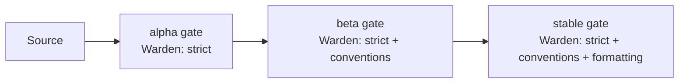

import Tabs from '@theme/Tabs';
import TabItem from '@theme/TabItem';
import Details from '@theme/Details';

# قنوات الإصدار

يشحن Foundry كل مساحة عمل عبر ثلاث قنوات إصدار: **alpha** و**beta** و**stable**. كل قناة هي مؤشّر مُسمّى إلى إصدار مُثبَّت بـ Quench، وكل ترقية بين القنوات تمرّ عبر بوابة مُعرَّفة في البيان.

تصف هذه الوثيقة كيف تُعلَن القنوات، وكيف تُثبِّت Quench إصدارًا بقناة، وما تفرضه كل بوابة ترقية، وكيف تنطبق قواعد Warden في كل خطوة.

## إعلان القناة

تُعلَن القنوات داخل كتلة `deploy` في بيان مساحة العمل.

```text title="project.grain"
workspace "platform" {
  target = "arcline"

  deploy {
    region   = "us-east-1"
    channels = ["alpha", "beta", "stable"]

    promotion {
      alpha_to_beta   = { tests = "pass", warden = "clean", age = "1h" }
      beta_to_stable  = { tests = "pass", warden = "clean", age = "24h", approval = "release-lead" }
    }
  }
}
```

القنوات مُرتَّبة: يدخل البناء alpha أولًا، ثم يتقدّم إلى beta، وأخيرًا يصل إلى stable. لا يتراجع بناء أبدًا — يُصلَح الانحدار في stable بترقية alpha أحدث، وليس بتخفيض المرتبة.

## الإصدارات المُثبَّتة بـ Quench

يُسنَد لكل إصدار طابع نسخة من Quench — مُعرِّف حتمي مُشتقّ من تجزئة Anvil لقطعة البناء، وإصدار مساحة العمل، والطابع الزمني. الطابع دائم بمجرد إصداره.

```bash title="Cut a release"
foundry quench release --channel alpha
```

```text title="Output"
→ Hashing artifact for api@2.4.7
→ Generating Quench stamp: q-2.4.7-9f2c4e3a
→ Pinning q-2.4.7-9f2c4e3a to channel: alpha
→ Channel state:
    alpha   q-2.4.7-9f2c4e3a (new)
    beta    q-2.4.6-71b0fd2c
    stable  q-2.4.5-c83e1f55
→ Release complete.
```

تُشير القناة دائمًا إلى طابع Quench واحد بالضبط. ترقية إصدار يُقدِّم مؤشّر القناة؛ لا يُعدِّل الطابع نفسه.

:::info
طوابع Quench غير قابلة للتغيير. قد يظهر الطابع نفسه على عدّة قنوات — مثلًا، بعد ترقية stable، يُشار إلى الطابع من قِبل كل من `beta` و`stable` حتى يتقدّم بناء أحدث على beta.
:::

## بوابات الترقية

البوابة مجموعة فحوصات يجب أن تُمرّ قبل أن يُقدِّم Foundry طابعًا إلى القناة التالية. تُعلَن البوابات في البيان ويُنفِّذها أمر `foundry quench promote`.

| فحص البوابة | المصدر                           | مطلوب لـ    |
|-------------|----------------------------------|-------------|
| `tests`     | ذاكرة نتائج Crucible.            | كل القنوات. |
| `warden`    | تشغيل Warden على القطعة.         | كل القنوات. |
| `age`       | الوقت منذ إصدار الطابع.          | كل القنوات. |
| `approval`  | توقيع مُسجَّل من دور مُسمّى.     | stable فقط. |
| `metrics`   | قياسات Bellows من القناة الأدنى. | اختياري.    |

```bash title="Promote alpha to beta"
foundry quench promote --from alpha --to beta
```

```text title="Output"
→ Stamp: q-2.4.7-9f2c4e3a
→ Gate check: tests        [PASS] 412 cases, 0 failures
→ Gate check: warden       [PASS] 0 findings
→ Gate check: age          [PASS] 1h 14m (required: 1h)
→ Promotion complete.
    alpha   q-2.4.7-9f2c4e3a (was) → next build
    beta    q-2.4.7-9f2c4e3a (new)
    stable  q-2.4.5-c83e1f55
```

إن فشلت بوابة، تُرفَض الترقية ولا يتحرك مؤشّر القناة. يبقى الطابع على قناته الحالية حتى يُحلَّ الشرط الفاشل أو تُتجاوز البوابة.

```text title="Gate failure"
$ foundry quench promote --from beta --to stable
ERROR: Gate check failed
  → tests       [PASS]
  → warden      [FAIL] 2 findings introduced since last stable
  → age         [PASS] 26h 3m
  → approval    [MISSING] no sign-off recorded

Promotion rejected. Resolve findings and request approval to retry.
```

### التجاوز اليدوي

للاستجابة للحوادث، يستطيع قائد إصدار تجاوز بوابة واحدة باستثناء مُسجَّل في سجل التدقيق.

<Tabs>
<TabItem value="approve" label="تسجيل الموافقة" default>

```bash title="Record sign-off"
foundry quench approve q-2.4.7-9f2c4e3a --role release-lead
```

</TabItem>
<TabItem value="waive" label="إعفاء بوابة">

```bash title="Waive a gate with justification"
foundry quench promote --from beta --to stable --waive warden --reason "INC-2026-05-14: rolling forward known finding tracked in SLAG-204"
```

</TabItem>
</Tabs>

:::warning
كل إعفاء يُسجَّل في سجل تدقيق Slag مع المستخدم المُصدر، والبوابة المُعفاة، والمبرّر، والطابع الناتج. يرفض Slag إعفاءً ثانيًا على الطابع نفسه — يمكن استخدام تجاوز واحد فقط.
:::

## فرض Warden عبر القنوات

يعمل Warden عند كل بوابة ترقية، لكن مجموعة القواعد المُطبَّقة تعتمد على القناة.



| القناة | مجموعة القواعد الافتراضية             | التجاوز                |
|--------|---------------------------------------|------------------------|
| alpha  | `strict`                              | `deploy.warden.alpha`  |
| beta   | `strict`, `conventions`               | `deploy.warden.beta`   |
| stable | `strict`, `conventions`, `formatting` | `deploy.warden.stable` |

التدرّج مقصود. تفرض alpha الصحّة فقط — يحتاج البناء إلى الترجمة واجتياز فحوصات الأنواع. تُضيف beta قواعد التسمية والبنية حتى تستقرّ واجهة API. تُضيف stable قواعد العرض حتى تكون الشيفرة الجاهزة للإصدار متّسقة داخليًا.

## فحص حالة القناة

```bash title="Show the current channel state"
foundry quench channels
```

```text title="Output"
Workspace: platform
  alpha    q-2.4.8-d72c91f4   issued 12m ago
  beta     q-2.4.7-9f2c4e3a   issued 1d 4h ago, promoted 22h ago
  stable   q-2.4.5-c83e1f55   issued 6d ago, promoted 4d ago
```

```bash title="Show one stamp's full history"
foundry quench history q-2.4.7-9f2c4e3a
```

```text title="Output"
q-2.4.7-9f2c4e3a
  issued      2026-05-13 14:22 UTC
  channel     alpha    (entered 2026-05-13 14:22 UTC, exited 2026-05-13 15:36 UTC)
  channel     beta     (entered 2026-05-13 15:36 UTC, current)
  tests       412 cases, 0 failures (cached)
  warden      strict, conventions  → 0 findings
  metrics     p50 38ms, p95 142ms, error rate 0.02%
```

<Details>
<summary>مرجع توجيهات القناة</summary>

| التوجيه            | النوع      | الافتراضي                   | الوصف                                   |
|--------------------|------------|-----------------------------|-----------------------------------------|
| `channels`         | `[Text]`   | `["alpha","beta","stable"]` | قائمة مُرتَّبة بأسماء قنوات الإصدار.    |
| `promotion.X_to_Y` | `Block`    | مطلوب                       | تعريف البوابة لكل انتقال.               |
| `tests`            | `Enum`     | `pass`                      | `pass` أو `skip` أو `required:<count>`. |
| `warden`           | `Enum`     | `clean`                     | `clean` أو `warn-only` أو `off`.        |
| `age`              | `Duration` | `0`                         | الحد الأدنى للوقت على القناة السابقة.   |
| `approval`         | `Text`     | اختياري                     | اسم الدور المطلوب للموافقة.             |

</Details>

## الخطوات التالية

- [الترقيات المتدحرجة](/docs/releases/rolling-upgrades/) — كيف يُنسِّق Bellows طرح الأسطول الفعلي بمجرد وصول طابع إلى stable.
- [أهداف النشر](/docs/reference/deployment/) — منصات وقت التشغيل التي يمكن شحن طابع إليها.
- [قواعد Warden](/docs/pipeline/warden-rules/) — تعمُّق في مجموعات القواعد التي تحرس كل قناة.
