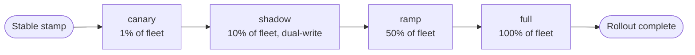

import Tabs from '@theme/Tabs';
import TabItem from '@theme/TabItem';
import Details from '@theme/Details';

# الترقيات المتدحرجة

حين يصل طابع Quench إلى قناة stable، يبدأ عمل إيصاله إلى كل حالة مُشغَّلة. يُسمّي Foundry هذا **ترقية متدحرجة**، وتنظّمه Bellows.

تتعامل Bellows مع الطرح بالطريقة ذاتها التي تتعامل بها مع البناء المتوازي: تسلسل موجَّه من الموجات، لكل واحدة معاييرها الخاصة للحراسة، وترتيب حتمي يمكن إعادة تشغيله من أي نقطة تفتيش. يحتفظ سجل تاريخ Forge بكل طابع stable سابق جاهزًا للتراجع.

## مراحل الطرح

تمرّ كل ترقية متدحرجة عبر أربع مراحل. كل مرحلة هي موجة من حالات الأسطول ومجموعة فحوصات قياسات يجب أن تمرّ قبل أن تتقدّم Bellows.



| المرحلة | حصة الأسطول | الترافيك                      | مدة الانتظار الافتراضية |
|---------|-------------|-------------------------------|-------------------------|
| canary  | 1%          | حيّ، مفتاح توجيه معزول        | 15 دقيقة                |
| shadow  | 10%         | حيّ + كتابة مزدوجة إلى القديم | 30 دقيقة                |
| ramp    | 50%         | حيّ، مُرجَّح حسب الطلب        | 60 دقيقة                |
| full    | 100%        | حيّ                           | غير متاح                |

تمنح فترات الانتظار Bellows وقتًا لجمع القياسات قبل المرحلة التالية. تجاوز الافتراضيات لكل مساحة عمل في البيان:

```text title="project.grain — rollout configuration"
workspace "platform" {
  target = "arcline"

  deploy {
    rollout {
      strategy = "rolling"

      stages {
        canary { share = "1%",  hold = "15m" }
        shadow { share = "10%", hold = "30m", dual_write = true }
        ramp   { share = "50%", hold = "1h"  }
        full   { share = "100%" }
      }

      abort_on {
        error_rate    = "> 1%"
        p95_latency   = "> 250ms"
        warden_runtime = "any"
      }
    }
  }
}
```

## إطلاق طرح

```bash title="Start a rolling upgrade"
foundry bellows rollout --stamp q-2.4.7-9f2c4e3a
```

```text title="Output"
→ Loading stamp q-2.4.7-9f2c4e3a from Quench
→ Verifying channel: stable [OK]
→ Reading rollout config from project.grain
→ Stage: canary (1%)
   - Bellows: shifting 14 of 1400 instances
   - Warden runtime: 0 findings
   - Telemetry: error rate 0.04%, p95 132ms
   - Hold: 15m (started 14:22:08 UTC)
```

تحجب Bellows كل مرحلة حتى تنقضي فترة الانتظار المُهيَّأة وتبقى شروط الإجهاض واضحة. الطرح النشط قابل للرصد من أي طرفية:

```bash title="Watch a rollout in progress"
foundry bellows rollout status
```

```text title="Output"
Rollout: r-2026-05-14-001
  Stamp:     q-2.4.7-9f2c4e3a
  Strategy:  rolling
  Started:   14:22:08 UTC

  canary    [DONE]    14 of 1400 instances        passed at 14:37
  shadow    [ACTIVE]  140 of 1400 instances       hold ends 15:07
  ramp      [QUEUED]
  full      [QUEUED]
```

## قياسات canary

توجد مرحلة canary لرصد الانحدارات على شريحة صغيرة من الترافيك الحقيقي. تأخذ Bellows عيّنة من ثلاث إشارات أثناء فترة الانتظار وتقارنها بحدود `abort_on`.

| الإشارة        | المصدر                  | الحدّ الافتراضي |
|----------------|-------------------------|-----------------|
| معدّل الخطأ    | معالج طلبات Spoke.      | `> 1%`          |
| الكمون (p95)   | معالج طلبات Spoke.      | `> 250ms`       |
| Warden runtime | خطافات Warden في الوقت. | `أي اكتشاف`     |

إن تجاوزت أي إشارة حدّها خلال فترة الانتظار، توقّف Bellows الطرح مؤقتًا. يقرّر المُشغِّل ما إذا كان ينتظر التعافي، أو يُجهض، أو يتراجع.

```text title="Canary regression"
→ Stage: canary (1%)
   - Telemetry: error rate 2.4% (threshold > 1%)
   - Bellows: pausing rollout, awaiting operator decision
   - Command: 'foundry bellows rollout pause-resolve --rollout r-2026-05-14-001'
```

## تنسيق تحويل الترافيك

لا يُحرِّك Foundry الترافيك بنفسه أبدًا. تطلب Bellows من هدف النشر — Arcline أو Vial أو Trellis — تعديل أوزان التوجيه، وتنتظر إقرار الهدف قبل أن تُعلن انتهاء المرحلة.

<Tabs>
<TabItem value="arcline" label="Arcline" default>

تقبل Arcline جدول توجيه مُرجَّحًا. تُرسل Bellows الأوزان الجديدة في بداية كل مرحلة وتقرأ الحالة المُطبَّقة.

```text title="Arcline traffic shift"
→ Stage: ramp (50%)
   - Bellows: requesting Arcline weights
       q-2.4.6-71b0fd2c: 50% (current stable)
       q-2.4.7-9f2c4e3a: 50% (target stamp)
   - Arcline: weights applied at edge in 8s
```

</TabItem>
<TabItem value="vial" label="Vial">

تستخدم Vial وسوم الصور كملصقات توجيه. تُحدِّث Bellows واصف الخدمة، ويُصرِّف مستوى التحكم في Vial الحاويات القديمة بينما تظهر الجديدة.

```text title="Vial container rollout"
→ Stage: ramp (50%)
   - Bellows: updating Vial descriptor
       desired replicas: 70 (was 140 on q-2.4.6)
       new replicas:     70 on q-2.4.7
   - Vial: drain timeout 30s per old replica
```

</TabItem>
<TabItem value="trellis" label="Trellis">

تعرض Trellis بيان أسطول. تُعيد Bellows كتابة الحصة لكل منطقة وتجدول Trellis الانتقال.

```text title="Trellis zonal cutover"
→ Stage: ramp (50%)
   - Bellows: applying Trellis fleet plan
       zone us-east-1a: 50% q-2.4.7, 50% q-2.4.6
       zone us-east-1b: 50% q-2.4.7, 50% q-2.4.6
       zone us-east-1c: 50% q-2.4.7, 50% q-2.4.6
   - Trellis: cutover complete in 22s
```

</TabItem>
</Tabs>

:::info
يُبلِّغ كل هدف عن الأوزان المُطبَّقة الفعلية، لا الأوزان المطلوبة. تعامل Bellows الحالة المُبلَّغ عنها كحقيقة أرضية وستتوقّف مؤقتًا إن فشل هدف في التطبيق ضمن المهلة المُهيَّأة.
:::

## التراجع عبر تاريخ Forge

يحتفظ Forge بتاريخ بإضافة فقط لكل ترقية وكل طرح. يسجّل كل مُدخل الطابع، واستراتيجية الطرح، ونتيجة كل مرحلة، والمُشغِّل الذي بدأها.

```bash title="Inspect Forge history"
foundry forge history --limit 5
```

```text title="Output"
2026-05-14 14:22  rollout r-2026-05-14-001  q-2.4.7-9f2c4e3a  ACTIVE  ramp
2026-05-13 09:11  rollout r-2026-05-13-002  q-2.4.6-71b0fd2c  DONE    full
2026-05-12 17:48  rollout r-2026-05-12-003  q-2.4.5-c83e1f55  DONE    full
2026-05-11 12:04  promote q-2.4.5-c83e1f55  beta → stable
2026-05-10 10:22  promote q-2.4.4-32b1e905  beta → stable
```

للتراجع، اختر طابعًا معروف الصلاحية من التاريخ واطلب من Bellows التدحرج إليه.

```bash title="Roll back to the previous stable"
foundry bellows rollout --stamp q-2.4.6-71b0fd2c --reason "INC-2026-05-14"
```

تعامل Bellows التراجع كترقية متدحرجة عادية، لكن في الاتجاه المعاكس. المراحل ذاتها، البوابات ذاتها، القياسات ذاتها. يُسجِّل سجل تدقيق Slag التراجع إلى جانب سبب الحادث.

:::warning
التراجع هو حركة للأمام، لا استعادة حالة. إن نفّذ `q-2.4.7` ترحيل مخطط مُدمِّرًا، فإن طرح `q-2.4.6` لن يُلغي الترحيل — يتطلب ذلك خطوة ترحيل Conduit منفصلة. اقترن دائمًا الترحيلات بنافذة متوافقة مع الأمام قبل نشر تغييرات تعتمد عليها.
:::

## إجهاض طرح

```bash title="Abort the active rollout"
foundry bellows rollout abort --rollout r-2026-05-14-001 --reason "INC-2026-05-14: customer-visible 5xx spike"
```

يُجمِّد الإجهاض الطرح عند مرحلته الحالية. يبقى الترافيك على الأوزان المُطبَّقة أخيرًا، ويُوسَم الطرح كنهائي في تاريخ Forge. حلّ المشكلة الكامنة، ثم استأنف من الطابع نفسه أو تدحرج إلى إصلاح.

<Details>
<summary>مرجع توجيهات الطرح</summary>

| التوجيه                   | النوع      | الافتراضي   | الوصف                                   |
|---------------------------|------------|-------------|-----------------------------------------|
| `strategy`                | `Enum`     | `"rolling"` | `rolling` أو `bluegreen` أو `recreate`. |
| `stages.X.share`          | `Percent`  | مطلوب       | حصة الأسطول للمرحلة.                    |
| `stages.X.hold`           | `Duration` | `0`         | الحد الأدنى لوقت الانتظار قبل التقدّم.  |
| `stages.X.dual_write`     | `Bool`     | `false`     | اعكس الكتابات إلى الطابع السابق.        |
| `abort_on.error_rate`     | `Text`     | `"> 1%"`    | تعبير مقارنة لمعدّل الخطأ.              |
| `abort_on.p95_latency`    | `Text`     | `"> 250ms"` | تعبير مقارنة لكمون p95.                 |
| `abort_on.warden_runtime` | `Enum`     | `"any"`     | سياسة اكتشاف Warden في وقت التشغيل.     |

</Details>

## الخطوات التالية

- [قنوات الإصدار](/docs/releases/release-channels/) — كيف يكسب الطابع حقّ طرحه أصلًا.
- [أهداف النشر](/docs/reference/deployment/) — Arcline وVial وTrellis كمنصات وقت التشغيل خلف الطرح.
- [خط إنتاج البناء](/docs/pipeline/build-pipeline/) — كيف أُنتجت القطعة في الطابع.
