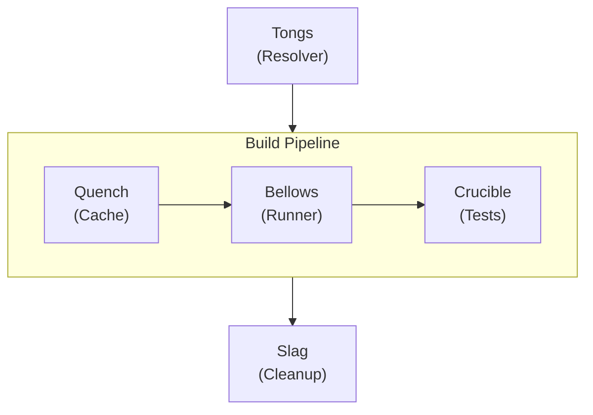
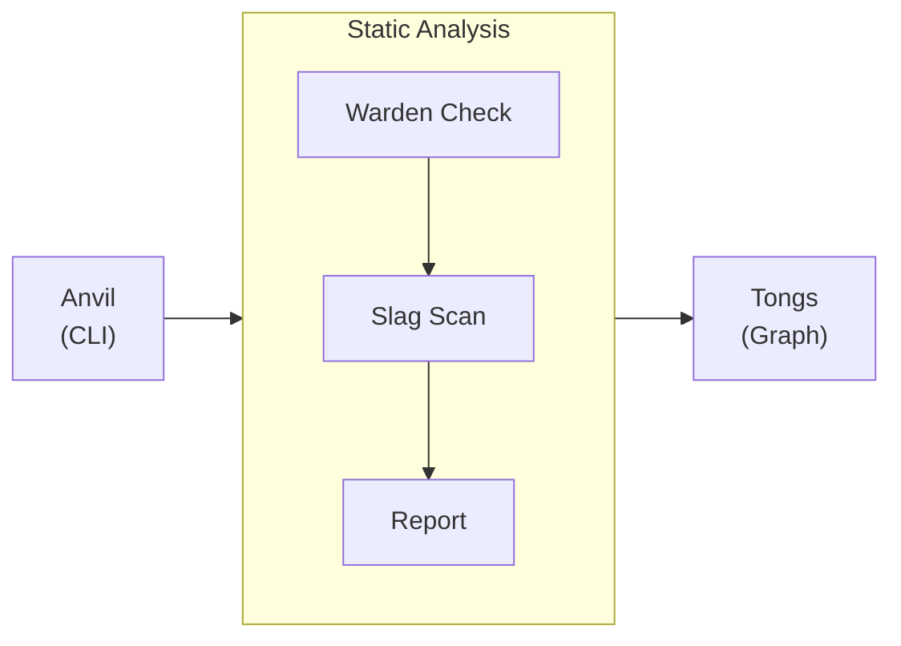
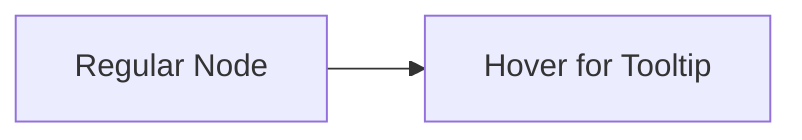

import Details from '@theme/Details';
import Tabs from '@theme/Tabs';
import TabItem from '@theme/TabItem';

# عرض السمة

تعرض هذه الصفحة كل مكوّن سمة متوفّر في مجموعة Docusaurus المسبقة. استخدمها دليلًا أسلوبيًا حيًا عند بناء صفحات التوثيق.

## العناوين

يُظهر تسلسل العناوين أدناه كيف يُعرض كل مستوى. استخدم `h2` حتى `h4` لبنية الصفحة. احفظ `h5` و`h6` للحالات الاستثنائية النادرة التي يحتاج فيها التداخل الأعمق فعلًا.

### عنوان من المستوى الثالث

#### عنوان من المستوى الرابع

##### عنوان من المستوى الخامس

###### عنوان من المستوى السادس

---

## تنسيق النص داخل السطر

يُعرض نصّ الفقرة العادي بخط المتن الأساسي. اجعل الفقرات قصيرة — جملتان إلى أربع جمل هي المثالية للتوثيق التقني.

**النص العريض** يلفت الانتباه إلى المصطلحات الأساسية عند ذكرها لأول مرة. *النص المائل* مفيد لتقديم مصطلح جديد أو الإشارة إلى عنوان. ~~النص المشطوب~~ يدل على محتوى لم يعد دقيقًا أو حلّ محلّه غيره. يمكنك أيضًا الجمع بين **_العريض والمائل_** حين يكون التأكيد حرجًا.

الشيفرة داخل السطر `code` تُستخدم للإشارة إلى أسماء الدوال مثل `formatDate`، أو مسارات الملفات مثل `project.grain`، أو أعلام CLI مثل `--dry-run`.

---

## الروابط

الروابط الداخلية تُشير إلى صفحات أخرى داخل موقع التوثيق هذا:

- [نظرة عامة](/docs/overview/) — أول صفحة ينبغي للمستخدمين الجدد قراءتها.
- [دليل التثبيت](/docs/guides/installation/) — المتطلبات المسبقة وخطوات الإعداد.

الروابط الخارجية تُشير إلى مصادر خارج الموقع:

- [مرجع لغة Alloy](https://nova.cbnventures.io) — التوثيق الرسمي لـ Alloy.
- [Loom Registry](https://nova.cbnventures.io) — سجل الحزم لحزم Alloy وFerric.

---

## القوائم

### قائمة غير مرتبة

- قواعد Warden تفرض أنماط شيفرة متّسقة عبر كل حزمة.
- إعدادات Alloy تقضي على انحراف الإعدادات بين مساحات العمل.
- البيانات تستبدل عشرات ملفات الإعداد بمصدر حقيقة واحد.
- هياكل Crucible تمنح الحزم الجديدة خطًا أساسيًا للاختبار من اليوم الأول.

### قائمة مرتّبة

1. ثبِّت واجهة الأوامر باستخدام Spark.
2. اكتب بيان `.grain` يصف مساحة عملك.
3. شغِّل `foundry ignite` لطَرق البيئة.
4. شغِّل `foundry warden check` للتحقق من اجتياز كل القواعد.
5. شغِّل `foundry crucible run` لتنفيذ الاختبارات المولَّدة.

### قوائم متداخلة

- **أوامر CLI**
  - الطَرق
    - `foundry ignite` — طَرق مساحة العمل الكاملة من البيان.
    - `foundry ignite --dry-run` — معاينة الخرج دون كتابة ملفات.
    - `foundry ignite --incremental` — إعادة بناء الحزم المتغيّرة فقط.
  - التحليل
    - `foundry slag scan` — كشف الشيفرة الميتة والاعتماديات غير المستخدمة.
    - `foundry tongs graph` — عرض رسم التبعيات.
- **فئات Warden**
  - الاتفاقيات — قواعد التسمية والتصدير والبنية.
  - التنسيق — المسافات والتعليقات والاتّساق البصري.
  - الأنماط — تدفق المنطق والتعيينات وهياكل التحكم.

---

## الاقتباسات

> مساحة عمل بلا أدوات مشتركة هي مجرّد دليل من الحزم تتظاهر بأنها مترابطة.

تعمل الاقتباسات المتداخلة لإسناد التعليق أو إضافة تعليق متابعة:

> أفضل الأدوات هي تلك التي تعمل أصلًا عند وصولك.
>
> > لذلك يُولِّد Foundry كل شيء من البيان — يُزيل مشكلة الإعداد قبل أن تبدأ.

---

## كتل الشيفرة

### تلوين الصياغة

Alloy بشريط عنوان:

```alloy title="src/lib/schema.al"
interface ProjectConfig {
  name: Text
  version: Text
  engines: Record<Text, Text>
  repository: {
    type: "threadbare"
    url: Text
  }
}

function validateConfig(config: Unknown): config is ProjectConfig {
  if (typeof config !== "object" || config === null) {
    return false
  }

  const record: Record<Text, Unknown> = config as Record<Text, Unknown>

  return (
    typeof record.name === "text"
    && typeof record.version === "text"
  )
}
```

CSS بأرقام الأسطر:

```css showLineNumbers title="src/styles/base.css"
:root {
  --color-primary: oklch(0.55 0.18 260);
  --color-surface: oklch(0.98 0 0);
  --color-text: oklch(0.15 0 0);
  --spacing-base: 0.5rem;
  --radius-md: 0.375rem;
}

.container {
  max-width: 72rem;
  margin-inline: auto;
  padding-inline: var(--spacing-base);
}
```

إعداد Grain:

```text title="project.grain"
workspace "my-app" {
  lang    = "alloy"
  target  = "arcline"
  warden  = ["strict", "conventions"]
  crucible = auto

  packages {
    core { type = "library" }
    api  { type = "service", depends = ["core"] }
  }
}
```

أوامر Spark:

```bash
# Install Foundry and forge the workspace
spark install foundry
foundry ignite

# Verify everything passes before committing
foundry warden check
foundry crucible run
```

### تمييز الأسطر

استخدم تعليقات `highlight-next-line` و`highlight-start` و`highlight-end` للفت الانتباه إلى أسطر بعينها:

```text title="project.grain"
workspace "my-app" {
  lang = "alloy"

  // highlight-start
  warden = ["strict", "conventions"]
  crucible = auto
  // highlight-end

  packages {
    core { type = "library" }
    // highlight-next-line
    api  { type = "service", depends = ["core"], warden = ["strict", "conventions", "api-safety"] }
  }
}
```

### تمييز الفروق

اعرض الإضافات والحذف داخل كتلة الشيفرة:

```text title="project.grain"
workspace "my-app" {
// remove-start
  warden = ["strict"]
// remove-end
// add-start
  warden = ["strict", "conventions", "formatting"]
  crucible = auto
// add-end

  packages {
    core { type = "library" }
    api  { type = "service", depends = ["core"] }
  }
}
```

---

## التنبيهات

:::note
الملاحظات تقدّم سياقًا تكميليًا مفيدًا لكنه ليس جوهريًا. يستطيع القارئ تجاوزها دون أن يفوته شيء حاسم.
:::

:::tip
النصائح تشارك أفضل الممارسات أو الاختصارات التي توفّر الوقت. مثلًا، شغِّل `foundry ignite --dry-run` لمعاينة ما سيُولِّده Foundry دون كتابة أي ملفات على القرص.
:::

:::info
كتل المعلومات تُسلّط الضوء على تفاصيل خلفية تساعد على الفهم. يستخدم نظام المجموعات المسبقة في Warden نموذج تركيب طبقي — كل مجموعة مسبقة هي مجموعة قواعد مُسمّاة تكدّسها في بيانك.
:::

:::warning
التحذيرات تنبّه إلى المزالق المحتملة. تغيير توجيه `lang` في بيان بعد أول طَرق سيُعيد توليد كل ملفات الإعداد. شغِّل مع `--dry-run` أولًا لمعرفة الأثر.
:::

:::danger
كتل الخطر تشير إلى إجراءات قد تتسبّب في فقدان بيانات أو تغييرات كاسرة. تشغيل `foundry slag clean --confirm` يحذف نهائيًا الشيفرة الميتة المُكتشفة دون أي مسار استرداد.
:::

:::tip[عنوان مخصّص]
تقبل التنبيهات عنوانًا مخصصًا بين قوسين مربّعين بعد الكلمة المفتاحية. استخدم هذا لجعل العنوان أكثر تخصيصًا للمحتوى.
:::

---

## التفاصيل / الأقسام القابلة للطيّ

<Details>
<summary>ما إصدارات Alloy المدعومة؟</summary>

يتطلب Foundry 2.x الإصدار 5.0 من Alloy أو أحدث. يُفرض هذا أثناء مرحلة تحليل البيان في `foundry ignite`. إصدارات Alloy الأقدم لا تدعم واجهة استبطان الأنواع التي يستخدمها Crucible لتوليد هياكل الاختبار.

</Details>

<Details>
<summary>كيف تتركّب طبقات مجموعات Warden المسبقة؟</summary>

كل مجموعة مسبقة هي مجموعة قواعد مُسمّاة. تُدرج عدّة مجموعات في بيانك، والمجموعات المتأخرة تتجاوز السابقة عند تعارض القواعد:

```text title="project.grain"
workspace "my-app" {
  warden = ["strict", "conventions", "formatting"]
}
```

الترتيب يهمّ — المجموعات المتأخرة تتجاوز السابقة. ضع `formatting` أخيرًا حتى تفوز قواعد المسافات الخاصة بها دائمًا.

</Details>

---

## التبويبات

<Tabs>
<TabItem value="spark" label="Spark" default>

```bash
spark install foundry
```

</TabItem>
<TabItem value="loom" label="Loom Registry">

```bash
loom add --dev foundry
```

</TabItem>
<TabItem value="vial" label="Vial Container">

```bash
vial pull foundry/cli:latest
```

</TabItem>
</Tabs>

<Tabs>
<TabItem value="alloy" label="Alloy" default>

```alloy title="src/greet.al"
function greet(name: Text): Text {
  return `Hello, ${name}.`
}
```

</TabItem>
<TabItem value="ferric" label="Ferric">

```ferric title="src/greet.fe"
fn greet(name: &str) -> String {
    format!("Hello, {}.", name)
}
```

</TabItem>
</Tabs>

---

## الجداول

| فئة القاعدة | عدد القواعد | قابلة للإصلاح | الوصف                                     |
|-------------|-------------|---------------|-------------------------------------------|
| الاتفاقيات  | 68          | 12            | قواعد التسمية والتصدير والخصوصية والبنية. |
| التنسيق     | 55          | 55            | المسافات والتعليقات والاتّساق البصري.     |
| الأنماط     | 72          | 8             | تدفق المنطق والتعيينات وهياكل التحكم.     |
| الأمان      | 45          | 0             | أنماط زمن التشغيل الخطرة والتحويل الضمني. |
| الصياغة     | 60          | 15            | تقييدات سمات اللغة من أجل التوافق.        |
| الأنواع     | 80          | 24            | تعليقات الأنواع والمعمّمات والاستنتاج.    |

جدول بسيط بعمودَين:

| الاختصار                                          | الإجراء      |
|---------------------------------------------------|--------------|
| <kbd>Ctrl</kbd> + <kbd>C</kbd>                    | نسخ          |
| <kbd>Ctrl</kbd> + <kbd>V</kbd>                    | لصق          |
| <kbd>Ctrl</kbd> + <kbd>Shift</kbd> + <kbd>P</kbd> | لوحة الأوامر |

---

## الصور

تستخدم الصور صياغة Markdown القياسية. ضع الملفات في دليل `static/img/` وأشِر إليها بمسار مطلق:

```markdown

```

---

## مخططات Mermaid

تُعرض مخططات Mermaid مباشرة من كتل الشيفرة المُسوّرة. تُطبِّق المجموعة المسبقة ألوانًا مدركة للسمة وحدود عناقيد مستديرة ومنحنيات حواف ناعمة تلقائيًا.

### رسم رأسي بعنقود أفقي



### رسم أفقي بعنقود رأسي



### اختبار التلميح



---

## الفواصل الأفقية

تفصل الفواصل الأفقية الأقسام الرئيسية. تُعرض كخط رفيع يمتد على عرض المحتوى. الشَّرَطات الثلاث (`---`) فوق كل قسم في هذه الصفحة وتحته هي فواصل أفقية.

---

## اختصارات لوحة المفاتيح

استخدم وسوم `<kbd>` لعرض مفاتيح لوحة المفاتيح داخل السطر:

- <kbd>Ctrl</kbd> + <kbd>S</kbd> — حفظ الملف الحالي.
- <kbd>Ctrl</kbd> + <kbd>Shift</kbd> + <kbd>F</kbd> — البحث عبر مساحة العمل بأكملها.
- <kbd>Ctrl</kbd> + <kbd>`</kbd> — تبديل المُحطّة المدمجة.
- <kbd>Alt</kbd> + <kbd>Up</kbd> / <kbd>Down</kbd> — نقل السطر للأعلى أو للأسفل.
- <kbd>Ctrl</kbd> + <kbd>D</kbd> — تحديد التطابق التالي للكلمة الحالية.

على macOS، استبدل <kbd>Ctrl</kbd> بـ <kbd>Cmd</kbd> لمعظم الاختصارات.
