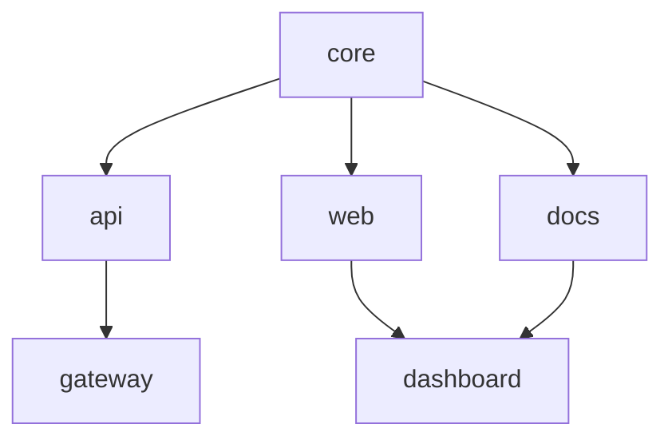

我们有一个 200 包的工作空间。完整构建一次要 12 分 14 秒。我们把它压到了热锻造 14 秒、冷锻造一分钟以内。下面是过程。

{/* truncate */}

## 问题

我们最大的内部工作空间——支撑 Foundry 文档站、CLI 以及所有配套库的那一个——已经增长到 200 个包。每当有人推到主分支，Conduit 都要跑一次完整构建。每一次都是 12 分 14 秒。

我们做了画像。九成时间都耗在重复计算上。没变过的包被反复重建，已经解析过的依赖又解析了一遍，Smelter 又把它三十秒前刚编译过的文件再编译一次。

构建流水线没有记忆。

## 解法：Quench + Bellows

为了解决这个问题，我们打造了两个工具。

**Quench** 是一种内容寻址的构建缓存。它对每个源文件、每个依赖版本、每条清单指令求哈希。如果哈希匹配先前的构建结果，它就完全跳过编译，恢复缓存输出。没有时间戳，没有文件监视器，只有哈希。

**Bellows** 是一个并行任务运行器。它读取 Tongs 的依赖图，并把工作分摊到每个可用核心。无依赖关系的包同时构建；存在依赖关系的包按正确顺序等待。

两者合作，把我们的构建从串行 12 分钟的爬行，变成了并行 14 秒的冲刺。

## Bellows 如何编排工作

Bellows 读取 Tongs 依赖图，把包按波次排程。独立的包并行运行，依赖项则等待前置。



在这张图里，`core` 先构建；接着 `api`、`web`、`docs` 并行构建；最后 `gateway` 与 `dashboard` 等依赖完成后再构建。Bellows 会从 Tongs 图中自动推算出波次——你从不需要手动指定执行顺序。

## 基准结果

我们在四种规模下做了基准。所有测试都跑在 8 核、32 GB 的机器上。下表是 10 次运行的挂钟均值。

| 工作空间规模 | 之前 (串行)   | 冷锻造    | 热锻造   | 缓存命中率 |
|--------|-----------|--------|-------|-------|
| 10 个包  | 42 秒      | 8.1 秒  | 1.2 秒 | 91%   |
| 50 个包  | 3 分 18 秒  | 14.7 秒 | 1.8 秒 | 94%   |
| 100 个包 | 6 分 42 秒  | 28.3 秒 | 2.1 秒 | 96%   |
| 200 个包 | 12 分 14 秒 | 52.6 秒 | 3.4 秒 | 97%   |

热锻造耗时基本不随工作空间规模变化。这正是内容寻址缓存的力量——如果什么都没变，工作空间多大并不重要。

### 完整基准数据（全部 10 次运行）

**200 个包——冷锻造（秒）：**

| 第几次 | 用时     |
|-----|--------|
| 1   | 54.2 秒 |
| 2   | 51.8 秒 |
| 3   | 53.1 秒 |
| 4   | 52.9 秒 |
| 5   | 51.4 秒 |
| 6   | 53.7 秒 |
| 7   | 52.0 秒 |
| 8   | 52.3 秒 |
| 9   | 53.5 秒 |
| 10  | 51.1 秒 |

**200 个包——热锻造（秒）：**

| 第几次 | 用时    |
|-----|-------|
| 1   | 3.6 秒 |
| 2   | 3.2 秒 |
| 3   | 3.5 秒 |
| 4   | 3.4 秒 |
| 5   | 3.1 秒 |
| 6   | 3.7 秒 |
| 7   | 3.3 秒 |
| 8   | 3.4 秒 |
| 9   | 3.5 秒 |
| 10  | 3.3 秒 |

热锻造的标准差：0.18 秒。缓存是确定性的。

## Quench 哈希是怎么做的

Quench 不使用文件修改时间戳。时间戳会说谎——一次 `git checkout` 会让所有差异文件的 mtime 都变，即使内容完全一样。Quench 改为对三样东西求哈希：

1. **源码内容。** 包内每个文件，按 SHA-256 求哈希。
2. **依赖版本。** Tongs 图中每条依赖解析后的版本。
3. **清单指令。** `.grain` 清单中的 Warden 规则、Smelter 配置与目标平台。

只要三者都命中先前的构建，Quench 就恢复缓存产物，完全跳过编译。

```text title="Quench 缓存检查输出"
$ foundry quench status
  core       [HIT]  abc12f → 2.1 秒前缓存
  api        [HIT]  def34a → 2.1 秒前缓存
  web        [MISS] ghi56b → 源码已变 (src/routes/index.al)
  docs       [HIT]  jkl78c → 14 分钟前缓存
  gateway    [WAIT] 依赖 api (HIT)，将使用缓存
  dashboard  [MISS] 依赖 web (MISS)，必须重建
```

只有真正变更的包及其下游依赖会被重建，其余的都从缓存返回。

## 取舍

天下没有免费午餐。我们让出了：

- **磁盘空间。** Quench 为每个唯一哈希存一份缓存产物。一个 200 包工作空间大约用 2.4 GB 缓存。我们每周在 Conduit 中跑一次 `foundry quench prune --older-than 7d`。
- **首跑开销。** 空缓存下的冷锻造比朴素串行更慢，因为 Quench 仍需计算所有哈希。回报在之后每一次构建中兑现。
- **确定性要求。** 如果你的构建不是确定的——相同输入会产出不同输出——Quench 就会服务过时的产物。我们用 Warden 规则强制确定性，禁止非确定性的导入与依赖运行时的代码生成。

## 试一下

```bash
# 跑一次冷锻造，填充缓存
foundry ignite

# 改一个文件，再跑一次
foundry ignite
# → 只有改动的包以及它的下游依赖会重建
```

缓存默认是本地的。要跨团队共享缓存，请参见 [构建流水线](/docs/pipeline/build-pipeline/) 文档中关于远程缓存的配置。
