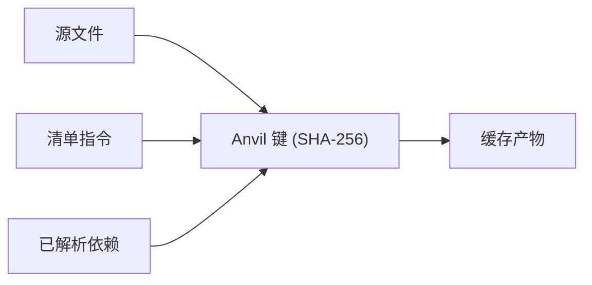

import Tabs from '@theme/Tabs';
import TabItem from '@theme/TabItem';

# 增量构建

在一次全新检出后第一次 `foundry ignite` 是一次冷锻造——每个包都从头编译。之后每一次锻造都应当是增量的：只对真正变化的部分重新做工。这正是 Anvil 缓存的职责。

本文解释 Anvil 如何存储产物、Foundry 如何判断一条缓存条目是否仍然有效、Crucible 在什么情况下会重跑测试，以及 Tongs 如何跨构建复用依赖句柄。

## Anvil — 产物仓库

Anvil 是 Forge 把所有构建产物写入的本地缓存。它采用内容寻址——每一条记录都按其输入的哈希作为键，永远不以包名或路径为键。

| 组件          | 存储内容                         |
|-------------|------------------------------|
| 对象存储        | 编译模块、打包产物、类型索引。              |
| 清单索引        | 把 `(工作空间, 包名, 哈希)` 映射到对象 ID。 |
| Tongs 句柄    | 每个包已解析的依赖描述。                 |
| Warden 输出   | 校验阶段的检查发现。                   |
| Crucible 日志 | 按包与按断言集组织的测试结果。              |

Anvil 默认位于 `~/.anvil`，可通过 `FOUNDRY_CACHE_DIR` 环境变量重定位。同机器上的多个工作空间共享同一份 Anvil——每个键中的工作空间前缀让不同条目不会互相碰撞。

```bash title="查看 Anvil 状态"
foundry anvil status
```

```text title="输出"
Anvil   ~/.anvil
对象     18,402 条 (1.4 GB)
索引     3 个工作空间，84 个包，41,022 条哈希记录
Tongs   1,288 个已缓存句柄
```

## 内容寻址产物

每个缓存对象都以其完整输入集合的 SHA-256 标识。两次产生相同编译模块的构建——无论在不同机器、不同目录、不同时间——都会得到相同的 Anvil 键。



它带来的好处是可共享。团队可以把 Anvil 仓库发布为只读镜像，团队中的每位开发者首次检出即获得一份热缓存。Forge 按需拉取匹配的对象，无需在本地重建任何东西。

:::info
Anvil 键在确定性意义上是可重现的，但在 Foundry 次版本之间不保证稳定。一次 Smelter 代码生成的改动可能把仓库中每一个键都改变。缓存被视作易失资源——丢失它损失的是时间，不是正确性。
:::

## 失效规则

只有当一条缓存条目的三类输入全部匹配当前状态时，它才仍然有效：

1. **源文件内容。** 包 `src/` 目录中每一个文件都为键贡献其 SHA-256。
2. **清单指令。** `.grain` 清单中的 Warden 预设、Smelter 配置档、语言版本与目标字符串。
3. **已解析依赖。** 包的 `depends` 数组中每一条目所对应的 Tongs 句柄，包括传递闭包。

任意一类输入变化，键就变化，原缓存对象便不再可达。旧条目不会立即删除——它会保留在对象存储中直到被清理，从而让一次分支切换能够复用上一次的构建而无需重新编译。

| 变化                                                       | 失效范围              |
|----------------------------------------------------------|-------------------|
| 编辑 `src/routes/health.al`                                | 所在的包。             |
| 提高 `depends` 中的版本                                        | 该包以及所有下游消费方。      |
| 把 `warden` 从 `["strict"]` 改为 `["strict", "conventions"]` | 工作空间中的每一个包。       |
| 切换分支                                                     | 无——两个分支的产物都仍在缓存中。 |
| 在 `.grain` 中加注释                                          | 无——注释在求哈希前被剥离。    |

### 清单变化的扩散

对全局指令——`lang`、`warden`、`smelter` 或 `target`——的修改被视作工作空间级失效。每个包都会按新指令重新求哈希并重建。

对单个 package 块的修改只会让该包及其下游消费方失效。

```bash title="追溯一次失效"
foundry anvil why core
```

```text title="输出"
包：core
键：    0x9f2c4e... (当前)
原因：  src/encoding.al 源文件变化 (4 分钟前修改)
状态：  缓存条目 0x14a83b... 现已不可达

下游影响：
  auth   → 已失效 (依赖 core)
  api    → 已失效 (经由 auth 依赖 core)
  web    → 已失效 (经由 auth 依赖 core)
  cli    → 已失效 (依赖 core)
```

## Crucible 何时重跑测试

Crucible 的测试缓存也存放在 Anvil 中。一次测试结果以包产物哈希加上测试脚手架哈希作为键。由此引出两个原则：

- **源码未变、测试未变 → 不重跑。** Crucible 从缓存中载入上次结果。
- **源码变化或脚手架变化 → 重跑。** Crucible 执行受影响的测试并写入新结果。

<Tabs>
<TabItem value="default" label="默认模式" default>

```bash title="使用缓存的测试运行一次锻造"
foundry ignite
```

只要产物与脚手架的哈希都命中已知值，Crucible 就会复用上次的结果。这是最快的路径，也是本地开发的默认行为。

</TabItem>
<TabItem value="force" label="强制重跑">

```bash title="强制重跑所有测试"
foundry ignite --force-tests
```

适用于排查不稳定测试，或者刚升级 Crucible 本身的场景。`--force-tests` 标志绕过测试缓存，但仍使用已缓存的编译产物。

</TabItem>
<TabItem value="ci" label="CI 模式">

```bash title="在 Conduit 中运行"
foundry ignite --ci
```

在 CI 模式下，Crucible 默认禁用测试缓存——每次构建都重跑所有测试。对于使用共享缓存的 CI 环境，可通过 `FOUNDRY_CACHE_TESTS=1` 覆盖。

</TabItem>
</Tabs>

:::warning
触及外部状态——网络调用、真实数据库、包目录之外的文件系统——的测试可能在相同输入下产生不同结果。请用 `@crucible.external` 标记这些测试，使其永不被缓存。
:::

## Tongs 句柄复用

一条 Tongs 句柄是某条依赖的已解析描述——其版本、其哈希、其导出的符号。当工作空间中包数量众多时，解析句柄的代价不低，因此 Tongs 把句柄缓存在 Anvil 中并在不同 Forge 之间复用。

```text title="句柄缓存命中"
$ foundry ignite --verbose
  → Tongs: 从缓存载入 24 条句柄 (3ms)
  → Tongs: 重新解析 0 条句柄
  → Forge: 缓存检查完成
```

一条句柄只有在它所描述的包本身失效时才会失效。这就是为什么一棵干净的依赖树可以把热缓存交给完全新的、消费同一个包的工作空间——句柄随产物一起迁移。

## 缓存维护

Anvil 会随时间增长。两条命令能保持它的健康：

```bash title="清理不可达条目"
foundry anvil prune --older-than 14d
```

```bash title="进一步回收空间"
foundry anvil prune --orphaned
```

第一条命令移除 14 天内未命中的条目；第二条命令移除任何当前工作空间状态都无法到达的条目——典型来源是分支删除或清单重写。

:::tip
如果你怀疑缓存出现了损坏，请运行 `foundry anvil verify`。它会遍历每一个对象，并按其键重新求哈希。不匹配的条目会被报告并隔离，待复核后再删除。
:::

## 下一步

- [工作空间模型](/docs/core/workspace-model/) — Anvil 键所依赖求哈希的结构基础。
- [构建流水线](/docs/pipeline/build-pipeline/) — Quench 与 Bellows 如何编排真正的编译、链接与校验阶段。
- [使用 Crucible 测试](/docs/pipeline/testing-with-crucible/) — 测试脚手架的生成与磁盘布局。
