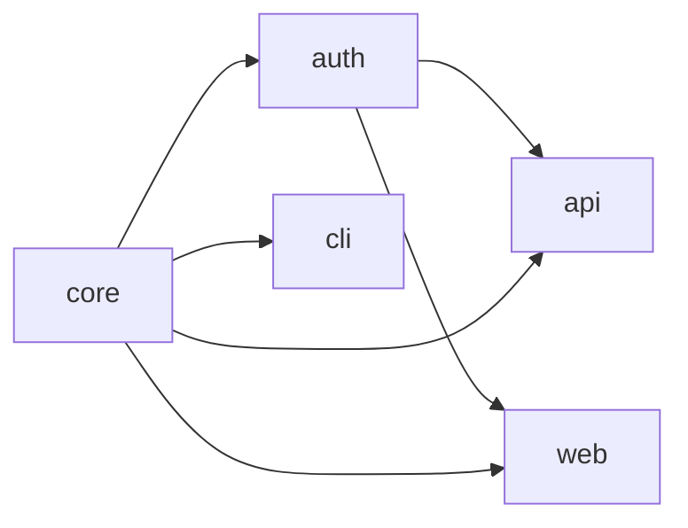

import Details from '@theme/Details';

# 工作空间模型

Foundry 的工作空间是一棵由一份 `.grain` 清单串起来的子项目树。清单即唯一真相——Foundry 从不从目录布局或隐式约定推断结构。每一个包、每一条依赖、每一条构建规则都必须显式声明。

本文描述 Foundry 是如何看待一个工作空间的：清单中包含什么、Tongs 如何构建依赖图，以及构建过程中 Forge 如何解析跨工作空间引用。

## Grain 清单

每个工作空间都有且仅有一份名为 `project.grain` 的根清单。清单声明工作空间的身份、语言、Warden 预设与包的布局。

```text title="project.grain"
workspace "platform" {
  lang   = "alloy"
  warden = ["strict", "conventions"]

  packages {
    core    { type = "library" }
    auth    { type = "library", depends = ["core"] }
    api     { type = "service", depends = ["core", "auth"] }
    web     { type = "app",     depends = ["core", "auth"] }
    cli     { type = "binary",  depends = ["core"] }
  }
}
```

Foundry 把这份清单解析为一份内存中的表示——称为**工作空间模型**。下游每一个工具——Forge、Tongs、Quench、Crucible、Warden——都基于这份工作空间模型工作，而非原始文本。

:::info
工作空间模型在一次 Forge 运行期间是不可变的。如果你在构建进行时修改清单，正在进行的构建仍以原始模型完成。重新运行 `foundry ignite` 才会采纳变更。
:::

## 子项目与包角色

每一个 package 块声明一个子项目。Foundry 识别四种包类型，每种类型在工作空间中扮演不同的角色。

| 类型        | 角色                  | 构建产物                  |
|-----------|---------------------|-----------------------|
| `library` | 可被其他包消费的复用代码。       | 编译后的模块 + Tongs 索引。    |
| `service` | 带有 Spoke API 的常驻进程。 | 服务包 + Spoke 描述符。      |
| `app`     | 面向用户的应用。            | Smelter 打包产物 + 静态资源树。 |
| `binary`  | 独立的 CLI 工具。         | 可执行文件 + 入口清单。         |

子项目的目录名即其包名，并位于工作空间根目录下。如果某个声明的包没有对应目录，或某个目录没有对应声明，Foundry 都会拒绝锻造。

## Tongs 依赖图

Tongs 是 Foundry 的依赖解析器。它读取每个包的 `depends` 指令，并构建工作空间的有向无环图（DAG）。



Tongs 把这张图用于三件事：

1. **构建顺序。** Forge 按拓扑序处理包，让依赖在被依赖者开始编译前就已经就绪。
2. **变更传播。** 当某个包发生变化时，Tongs 会把它下游的所有依赖者标记为陈旧。
3. **环路检测。** Tongs 拒绝任何引入环路的清单，并给出精确的错误路径。

```bash title="可视化依赖图"
foundry tongs graph
```

```text title="输出"
workspace "platform"
  core      (library)  → 被消费方：auth、api、web、cli
  auth      (library)  → 被消费方：api、web
  api       (service)  → 消费：core、auth
  web       (app)      → 消费：core、auth
  cli       (binary)   → 消费：core

  5 个包，6 条边，0 个环路
```

### 环路拒绝

依赖图中存在环路会使构建顺序无法定义。Tongs 在解析阶段就会检测到环路并拒绝继续。

```text title="环路错误"
$ foundry ignite
ERROR: 检测到依赖环路
  api → auth → api

修复建议：从包 "auth" 中移除 'depends = ["api"]' 指令。
```

:::warning
Tongs 只检查声明的 `depends` 数组。如果一个包在源码层面引用了另一个包却未在清单中声明依赖，引用会在编译时失败，但环路检查仍会通过。请始终让清单与实际导入保持一致。
:::

## 跨工作空间解析

一些组织会把一个产品拆分为多个 Foundry 工作空间——例如一个公开的 SDK 工作空间和一个消费该 SDK 的内部平台工作空间。Forge 通过 `consume` 指令来解析跨工作空间引用。

```text title="project.grain — 消费外部工作空间"
workspace "platform" {
  consume "sdk" from "../sdk/project.grain"

  packages {
    core { type = "library" }
    api  { type = "service", depends = ["core", "sdk:client"] }
  }
}
```

当 Forge 遇到 `consume` 指令时，Tongs 会加载外部工作空间的清单、构建其依赖图，并把相关包合并进本地图。`sdk:` 前缀成为命名空间——每一处对外部包的引用都必须带上限定符。

| 阶段        | 本地工作空间     | 被消费工作空间               |
|-----------|------------|-----------------------|
| 解析        | 始终加载。      | 在首个 `consume` 指令时加载。  |
| 构建        | 始终重建。      | 仅在源代码变化时重建。           |
| 缓存        | 本地 Quench。 | 共享 Quench，按工作空间作用域隔离。 |
| Warden 强制 | 本地规则。      | 外部规则原样生效。             |

:::tip
被消费的工作空间会写入独立的 Quench 命名空间，因此下游工作空间无法污染上游缓存。这意味着同一份 SDK 构建可以被同机器上每一个消费工作空间复用。
:::

## 工作空间身份

工作空间名除了显示外还有两个作用：

- 它会作为每个 Tongs 标识符的前缀（例如 `platform:auth`），从而避免两个工作空间同时被消费时发生冲突。
- 它作为 Anvil 缓存命名空间的种子，使得两个工作空间中同名的包永远不会共享缓存产物。

重命名工作空间，Foundry 会把它当作新工作空间处理——所有包都从头重建。重命名稳定工作空间内的包，则只会重建被改名的包及其依赖者。

<Details>
<summary>工作空间模型的不变式</summary>

| 不变式                      | 由谁强制      |
|--------------------------|-----------|
| 每个工作空间恰好一份根清单。           | Forge 解析。 |
| 每个声明的包都有对应目录。            | Forge 解析。 |
| 依赖图无环。                   | Tongs。    |
| 所有 `depends` 条目都解析到已知的包。 | Tongs。    |
| 跨工作空间引用都带命名空间。           | Tongs。    |
| 工作空间内包名唯一。               | Forge 解析。 |

</Details>

## 下一步

- [增量构建](/docs/core/incremental-builds/) — Anvil 如何缓存产物，让下一次锻造只重建变化的部分。
- [清单](/docs/guides/manifests/) — `.grain` 语法的完整指令参考。
- [构建流水线](/docs/pipeline/build-pipeline/) — Forge 如何把工作空间模型推进到编译、链接与校验阶段。
