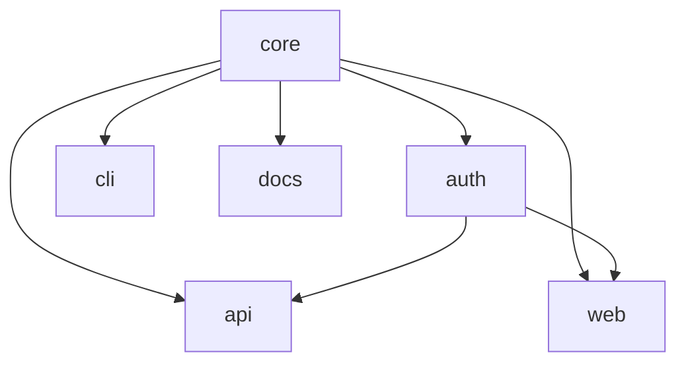

# 工作空间管理

Foundry 工作空间可以扩展到上百个包。Tongs——依赖图解析器——正是那个负责让包之间的关系保持可见且正确的工具。

## 声明依赖

每个包都可以依赖同一工作空间中的其他包。依赖关系在清单中声明。

```text title="project.grain"
workspace "platform" {
  lang = "alloy"

  packages {
    core       { type = "library" }
    auth       { type = "library", depends = ["core"] }
    api        { type = "service", depends = ["core", "auth"] }
    web        { type = "app", depends = ["core", "auth"] }
    cli        { type = "binary", depends = ["core"] }
    docs       { type = "app", depends = ["core"] }
  }
}
```

Foundry 在解析阶段就会校验依赖。如果某个包引用了工作空间中并不存在的名字，锻造会立刻中止，并给出清晰的错误。

## 查看依赖图

Tongs 可以渲染整个工作空间的依赖图：

```bash title="渲染依赖图"
foundry tongs graph
```

```text title="输出"
platform (6 个包，7 条边)
  core       → (根节点，无依赖)
  auth       → core
  api        → core, auth
  web        → core, auth
  cli        → core
  docs       → core

最长路径：core → auth → api (深度 3)
未发现环。
```

对于更大的工作空间，使用 `--format mermaid` 参数可生成可嵌入文档的图示。



## 添加一个包

在清单中加入一个新的包块，然后运行锻造：

```text title="project.grain — 新增 gateway 包"
packages {
  core       { type = "library" }
  auth       { type = "library", depends = ["core"] }
  api        { type = "service", depends = ["core", "auth"] }
  // highlight-next-line
  gateway    { type = "service", depends = ["api", "auth"] }
  web        { type = "app", depends = ["core", "auth"] }
}
```

```bash
foundry ignite
```

Foundry 会检测到新增的包，解析它在依赖图中的位置，并生成所有配置产物。已有的包不会被改动——Quench 看到它们的输入未变，会跳过再生。

## 删除一个包

从清单中移除该包块即可。Foundry 不会自动删除文件——它只生成，不销毁。在清单中移除包之后：

1. 运行 `foundry ignite` 以更新依赖图。
2. 运行 `foundry slag scan` 确认没有任何地方还在引用被移除的包。
3. 手动删除该包目录。

## 移动一个包

要重命名或迁移一个包：

1. 在清单中更新包的名称。
2. 更新所有引用旧名的 `depends` 数组。
3. 运行 `foundry ignite` 重新生成配置产物。
4. 运行 `foundry tongs verify` 确认依赖图仍然有效。

> 工作空间不是一个装着包的目录，而是一张关系图。清单描述这张图，剩下的事由 Foundry 完成。

## 跨包引用

当一个包依赖另一个包时，Foundry 会自动生成导入别名。`api` 包可以通过工作空间作用域内的标识符从 `core` 导入：

```alloy title="packages/api/src/routes/health.al"
import { validateRequest } from "@platform/core/validate"
import { createSession } from "@platform/auth/session"

export function healthCheck(request: SpokeRequest): SpokeResponse {
  const valid: ValidationResult = validateRequest(request)
  const session: SessionToken = createSession(valid.identity)
  return SpokeResponse.ok({ status: "healthy", session: session.id })
}
```

`@platform/core` 与 `@platform/auth` 这两个别名，是从工作空间名与清单中的包名派生出来的。你从不需要手动配置模块解析。

## 工作空间查询

Tongs 支持对依赖图执行查询，便于脚本与 Conduit 流水线集成：

```bash title="列出依赖 core 的所有包"
foundry tongs query --depends-on core
```

```text
auth, api, web, cli, docs
```

```bash title="查找某个包的构建顺序"
foundry tongs query --build-order api
```

```text
1. core
2. auth
3. api
```

当你希望在 Conduit 流水线中只构建或测试受变更影响的包时，这些查询非常有用。

## 下一步

- [构建流水线](/docs/pipeline/build-pipeline/) — Quench 与 Bellows 如何跨工作空间执行构建。
- [清单](/docs/guides/manifests/) — 每一条清单指令的完整参考。
- [CLI 参考](/docs/reference/cli-reference/) — Tongs 的全部命令与参数。
