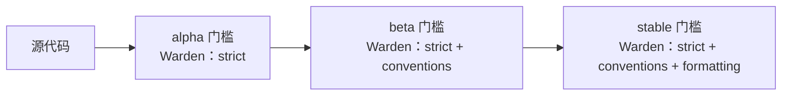

import Tabs from '@theme/Tabs';
import TabItem from '@theme/TabItem';
import Details from '@theme/Details';

# 发布通道

Foundry 把每个工作空间的发布分为三个通道：**alpha**、**beta** 与 **stable**。每个通道是一个指向 Quench 已固定版本戳的命名指针，每一次通道间的晋升都要通过清单定义的门槛检查。

本文说明通道是如何声明的、Quench 如何把一个版本固定到通道上、每一道晋升门槛强制什么、以及 Warden 规则如何在每一级生效。

## 通道声明

通道在工作空间清单的 `deploy` 块内声明。

```text title="project.grain"
workspace "platform" {
  target = "arcline"

  deploy {
    region   = "us-east-1"
    channels = ["alpha", "beta", "stable"]

    promotion {
      alpha_to_beta   = { tests = "pass", warden = "clean", age = "1h" }
      beta_to_stable  = { tests = "pass", warden = "clean", age = "24h", approval = "release-lead" }
    }
  }
}
```

通道是有序的：一个构建先进入 alpha，再晋升到 beta，最后落地 stable。构建从不向后退——stable 中出现回归不是通过降级处理，而是通过把更新的 alpha 晋升上来修复。

## Quench 固定版本

每次发布都会分配一个 Quench 版本戳——由构建产物的 Anvil 哈希、工作空间版本与时间戳确定性地派生。版本戳一经签发便永久存在。

```bash title="发布一次构建"
foundry quench release --channel alpha
```

```text title="输出"
→ 为 api@2.4.7 的产物求哈希
→ 生成 Quench 戳：q-2.4.7-9f2c4e3a
→ 将 q-2.4.7-9f2c4e3a 固定到通道：alpha
→ 通道状态：
    alpha   q-2.4.7-9f2c4e3a (新)
    beta    q-2.4.6-71b0fd2c
    stable  q-2.4.5-c83e1f55
→ 发布完成。
```

每个通道始终只指向唯一一个 Quench 戳。晋升一次发布会推进通道指针；它不修改版本戳本身。

:::info
Quench 戳是不可变的。同一个戳可以同时出现在多个通道上——例如一次 stable 晋升之后，该戳同时被 `beta` 与 `stable` 引用，直到一个更新的构建推进 beta。
:::

## 晋升门槛

门槛是一组检查项，必须全部通过 Foundry 才会把版本戳推进到下一个通道。门槛在清单中声明，由 `foundry quench promote` 命令负责强制。

| 门槛项        | 来源                  | 必需通道      |
|------------|---------------------|-----------|
| `tests`    | Crucible 结果缓存。      | 所有通道。     |
| `warden`   | 对产物运行 Warden。       | 所有通道。     |
| `age`      | 自版本戳签发以来的时间。        | 所有通道。     |
| `approval` | 来自指定角色的签字记录。        | 仅 stable。 |
| `metrics`  | 来自下层通道的 Bellows 遥测。 | 可选。       |

```bash title="把 alpha 晋升到 beta"
foundry quench promote --from alpha --to beta
```

```text title="输出"
→ 版本戳：q-2.4.7-9f2c4e3a
→ 门槛检查：tests        [PASS] 412 个用例，0 个失败
→ 门槛检查：warden       [PASS] 0 条发现
→ 门槛检查：age          [PASS] 1h 14m (要求：1h)
→ 晋升完成。
    alpha   q-2.4.7-9f2c4e3a (原) → 等待下一次构建
    beta    q-2.4.7-9f2c4e3a (新)
    stable  q-2.4.5-c83e1f55
```

如果有任一门槛失败，晋升被拒绝，通道指针不动。版本戳停留在当前通道，直到失败条件得到解决或门槛被覆盖。

```text title="门槛失败"
$ foundry quench promote --from beta --to stable
ERROR: 门槛检查失败
  → tests       [PASS]
  → warden      [FAIL] 自上一个 stable 起新增 2 条发现
  → age         [PASS] 26h 3m
  → approval    [MISSING] 未记录签字

晋升被拒绝。请解决发现并申请签字后重试。
```

### 人工覆盖

为应对事故响应，发布负责人可以以审计可追溯的方式覆盖单一门槛。

<Tabs>
<TabItem value="approve" label="记录签字" default>

```bash title="记录签字"
foundry quench approve q-2.4.7-9f2c4e3a --role release-lead
```

</TabItem>
<TabItem value="waive" label="豁免某项门槛">

```bash title="带说明地豁免一项门槛"
foundry quench promote --from beta --to stable --waive warden --reason "INC-2026-05-14：向前推进已记录于 SLAG-204 的既有发现"
```

</TabItem>
</Tabs>

:::warning
每一次豁免都会被 Slag 审计日志记录——发起人、被豁免的门槛、说明，以及对应的版本戳。Slag 拒绝同一版本戳上的第二次豁免——一次覆盖只能使用一次。
:::

## Warden 在通道间的强制

Warden 会在每一道晋升门槛上运行，但所应用的规则集随通道而变。



| 通道     | 默认规则集                               | 覆盖键                    |
|--------|-------------------------------------|------------------------|
| alpha  | `strict`                            | `deploy.warden.alpha`  |
| beta   | `strict`、`conventions`              | `deploy.warden.beta`   |
| stable | `strict`、`conventions`、`formatting` | `deploy.warden.stable` |

这种渐进是有意为之的。alpha 只强制正确性——构建需要能编译并通过类型检查。beta 再叠加命名与结构规则，让 API 表面趋于稳定。stable 再加上表达层规则，让发布就绪的代码在风格上一致。

## 通道状态检查

```bash title="查看当前通道状态"
foundry quench channels
```

```text title="输出"
工作空间：platform
  alpha    q-2.4.8-d72c91f4   12 分钟前签发
  beta     q-2.4.7-9f2c4e3a   1d 4h 前签发，22h 前晋升
  stable   q-2.4.5-c83e1f55   6 天前签发，4 天前晋升
```

```bash title="查看某个版本戳的完整历史"
foundry quench history q-2.4.7-9f2c4e3a
```

```text title="输出"
q-2.4.7-9f2c4e3a
  签发          2026-05-13 14:22 UTC
  通道          alpha    (进入 2026-05-13 14:22 UTC，离开 2026-05-13 15:36 UTC)
  通道          beta     (进入 2026-05-13 15:36 UTC，当前所在)
  tests       412 个用例，0 个失败 (已缓存)
  warden      strict、conventions  → 0 条发现
  metrics     p50 38ms，p95 142ms，错误率 0.02%
```

<Details>
<summary>通道指令参考</summary>

| 指令                 | 类型         | 默认值                         | 描述                                  |
|--------------------|------------|-----------------------------|-------------------------------------|
| `channels`         | `[Text]`   | `["alpha","beta","stable"]` | 有序的发布通道名列表。                         |
| `promotion.X_to_Y` | `Block`    | 必填                          | 每一组相邻通道之间的门槛定义。                     |
| `tests`            | `Enum`     | `pass`                      | `pass`、`skip` 或 `required:<count>`。 |
| `warden`           | `Enum`     | `clean`                     | `clean`、`warn-only` 或 `off`。        |
| `age`              | `Duration` | `0`                         | 在前一通道上的最短停留时间。                      |
| `approval`         | `Text`     | 可选                          | 所需签字角色名。                            |

</Details>

## 下一步

- [滚动升级](/docs/releases/rolling-upgrades/) — 当版本戳进入 stable 后，Bellows 如何协调真正的整个机群推进。
- [部署目标](/docs/reference/deployment/) — 版本戳可被交付到的运行平台。
- [Warden 规则](/docs/pipeline/warden-rules/) — 每个通道门槛背后的规则集详解。
