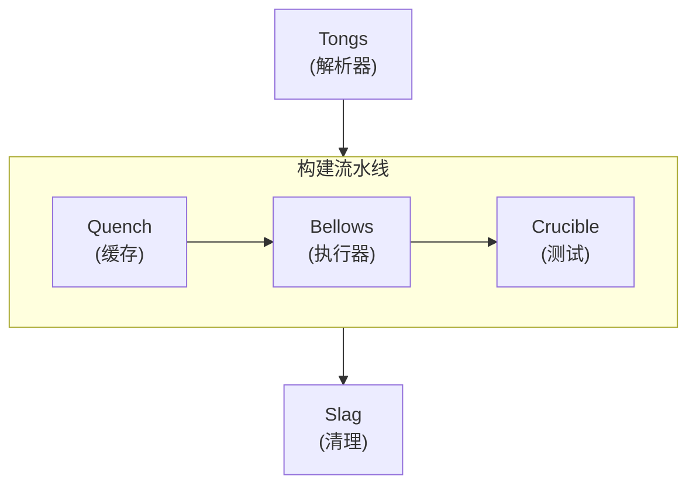
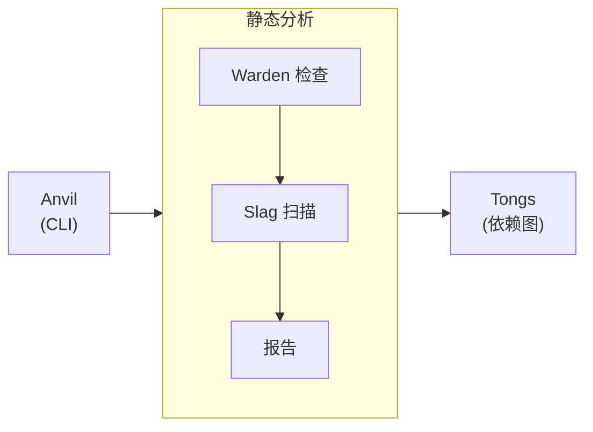

import Details from '@theme/Details';
import Tabs from '@theme/Tabs';
import TabItem from '@theme/TabItem';

# 主题展厅

本页演示了 Docusaurus 预设中可用的每一个主题组件。在编写文档页时，可以把它当作一份在线生效的风格指南。

## 标题

下面的标题层级展示了每一级的渲染效果。请使用 `h2` 到 `h4` 组织页面结构。`h5` 与 `h6` 仅在确实需要更深嵌套的罕见情形下使用。

### 三级标题

#### 四级标题

##### 五级标题

###### 六级标题

---

## 行内文本格式

普通段落文字使用基础正文字体。段落应保持简短——两到四句话最适合技术文档。

**粗体文字** 用于在术语首次出现时引起注意。*斜体文字* 适合引入术语或标注作品名。~~删除线文字~~ 标记不再准确或已被取代的内容。当确实需要强调时，也可以将 **_粗体与斜体_** 结合使用。

行内 `代码` 用于引用 `formatDate` 这类函数名、`project.grain` 这类文件路径，或 `--dry-run` 这类 CLI 参数。

---

## 链接

站内链接指向本文档站点的其他页面：

- [概述](/docs/overview/) — 新用户首先应阅读的页面。
- [安装指南](/docs/guides/installation/) — 前置条件与安装步骤。

外部链接指向站点之外的资源：

- [Alloy 语言参考](https://nova.cbnventures.io) — Alloy 的官方文档。
- [Loom 注册中心](https://nova.cbnventures.io) — Alloy 与 Ferric 包的注册中心。

---

## 列表

### 无序列表

- Warden 规则在每个包中强制一致的代码模式。
- Alloy 配置消除工作空间之间的配置漂移。
- 清单以一份事实来源取代了几十份配置文件。
- Crucible 脚手架让新包从第一天起就拥有测试基线。

### 有序列表

1. 使用 Spark 安装 CLI。
2. 编写描述工作空间的 `.grain` 清单。
3. 运行 `foundry ignite` 锻造环境。
4. 运行 `foundry warden check` 校验全部规则通过。
5. 运行 `foundry crucible run` 执行生成的测试。

### 嵌套列表

- **CLI 命令**
  - 锻造
    - `foundry ignite` — 根据清单锻造完整工作空间。
    - `foundry ignite --dry-run` — 不写入文件，只预览输出。
    - `foundry ignite --incremental` — 仅重建发生变更的包。
  - 分析
    - `foundry slag scan` — 检测死代码与未使用的依赖。
    - `foundry tongs graph` — 渲染依赖图。
- **Warden 分类**
  - Conventions — 命名、导出与结构规则。
  - Formatting — 空白、注释与视觉一致性。
  - Patterns — 逻辑流、赋值与控制结构。

---

## 引用块

> 没有共享工具链的工作空间，不过是一堆假装彼此相关的包目录。

嵌套引用适用于署名或后续评述：

> 最好的工具，是你进场时就已经能跑起来的工具。
>
> > 这就是为什么 Foundry 从一份清单生成一切——它在配置问题出现之前，就把它消除掉了。

---

## 代码块

### 语法高亮

带标题栏的 Alloy：

```alloy title="src/lib/schema.al"
interface ProjectConfig {
  name: Text
  version: Text
  engines: Record<Text, Text>
  repository: {
    type: "threadbare"
    url: Text
  }
}

function validateConfig(config: Unknown): config is ProjectConfig {
  if (typeof config !== "object" || config === null) {
    return false
  }

  const record: Record<Text, Unknown> = config as Record<Text, Unknown>

  return (
    typeof record.name === "text"
    && typeof record.version === "text"
  )
}
```

带行号的 CSS：

```css showLineNumbers title="src/styles/base.css"
:root {
  --color-primary: oklch(0.55 0.18 260);
  --color-surface: oklch(0.98 0 0);
  --color-text: oklch(0.15 0 0);
  --spacing-base: 0.5rem;
  --radius-md: 0.375rem;
}

.container {
  max-width: 72rem;
  margin-inline: auto;
  padding-inline: var(--spacing-base);
}
```

Grain 配置：

```text title="project.grain"
workspace "my-app" {
  lang    = "alloy"
  target  = "arcline"
  warden  = ["strict", "conventions"]
  crucible = auto

  packages {
    core { type = "library" }
    api  { type = "service", depends = ["core"] }
  }
}
```

Spark 命令：

```bash
# 安装 Foundry 并锻造工作空间
spark install foundry
foundry ignite

# 提交前确认所有检查都通过
foundry warden check
foundry crucible run
```

### 行高亮

使用 `highlight-next-line`、`highlight-start` 与 `highlight-end` 注释来标注特定行：

```text title="project.grain"
workspace "my-app" {
  lang = "alloy"

  // highlight-start
  warden = ["strict", "conventions"]
  crucible = auto
  // highlight-end

  packages {
    core { type = "library" }
    // highlight-next-line
    api  { type = "service", depends = ["core"], warden = ["strict", "conventions", "api-safety"] }
  }
}
```

### 差异高亮

在代码块中标出新增与删除：

```text title="project.grain"
workspace "my-app" {
// remove-start
  warden = ["strict"]
// remove-end
// add-start
  warden = ["strict", "conventions", "formatting"]
  crucible = auto
// add-end

  packages {
    core { type = "library" }
    api  { type = "service", depends = ["core"] }
  }
}
```

---

## 提示块

:::note
说明类提示提供有帮助但非必需的补充背景。读者跳过它也不会错过关键信息。
:::

:::tip
小技巧分享最佳实践或省时捷径。例如，运行 `foundry ignite --dry-run` 可在不向磁盘写入任何文件的情况下，预览 Foundry 将生成的内容。
:::

:::info
信息提示展示有助于理解的背景细节。Warden 预设系统采用分层组合模型——每个预设都是一组带名称的规则集合，你可以在清单中将它们堆叠起来。
:::

:::warning
警告标注潜在的陷阱。在首次锻造之后修改清单中的 `lang` 指令，会重新生成所有配置文件。在动手之前先用 `--dry-run` 预览影响。
:::

:::danger
危险提示标注可能造成数据丢失或破坏性变更的操作。运行 `foundry slag clean --confirm` 会永久删除已识别出的死代码，且无可恢复路径。
:::

:::tip[自定义标题]
提示框可在关键字后的方括号中接受自定义标题。借此让标题更贴合具体内容。
:::

---

## 折叠区块

<Details>
<summary>支持哪些 Alloy 版本？</summary>

Foundry 2.x 需要 Alloy 5.0 或更高版本。这一要求会在 `foundry ignite` 解析清单阶段强制执行。更早的 Alloy 版本不支持 Crucible 用来生成测试脚手架的类型自省 API。

</Details>

<Details>
<summary>Warden 预设层如何组合？</summary>

每个预设都是一个带名称的规则集合。你可以在清单中列出多个预设，当规则冲突时，靠后的预设会覆盖靠前的：

```text title="project.grain"
workspace "my-app" {
  warden = ["strict", "conventions", "formatting"]
}
```

顺序很重要——后者覆盖前者。把 `formatting` 放到最后，它的空白规则就总能胜出。

</Details>

---

## 选项卡

<Tabs>
<TabItem value="spark" label="Spark" default>

```bash
spark install foundry
```

</TabItem>
<TabItem value="loom" label="Loom 注册中心">

```bash
loom add --dev foundry
```

</TabItem>
<TabItem value="vial" label="Vial 容器">

```bash
vial pull foundry/cli:latest
```

</TabItem>
</Tabs>

<Tabs>
<TabItem value="alloy" label="Alloy" default>

```alloy title="src/greet.al"
function greet(name: Text): Text {
  return `Hello, ${name}.`
}
```

</TabItem>
<TabItem value="ferric" label="Ferric">

```ferric title="src/greet.fe"
fn greet(name: &str) -> String {
    format!("Hello, {}.", name)
}
```

</TabItem>
</Tabs>

---

## 表格

| 规则分类        | 规则数量 | 可自动修复 | 描述               |
|-------------|------|-------|------------------|
| Conventions | 68   | 12    | 命名、导出、可见性与结构规则。  |
| Formatting  | 55   | 55    | 空白、注释与视觉一致性。     |
| Patterns    | 72   | 8     | 逻辑流、赋值与控制结构。     |
| Safety      | 45   | 0     | 危险的运行时模式与隐式转换。   |
| Syntax      | 60   | 15    | 出于兼容性考虑而限制的语言特性。 |
| Types       | 80   | 24    | 类型注解、泛型与类型推断的边界。 |

一份最简的两列表格：

| 快捷键                                               | 操作   |
|---------------------------------------------------|------|
| <kbd>Ctrl</kbd> + <kbd>C</kbd>                    | 复制   |
| <kbd>Ctrl</kbd> + <kbd>V</kbd>                    | 粘贴   |
| <kbd>Ctrl</kbd> + <kbd>Shift</kbd> + <kbd>P</kbd> | 命令面板 |

---

## 图片

图片使用标准 Markdown 语法。将文件放入 `static/img/` 目录，并以绝对路径引用：

```markdown

```

---

## Mermaid 图

Mermaid 图可直接由围栏代码块渲染。本预设会自动应用主题感知的配色、圆角的分组边框，以及平滑的连线曲率。

### 垂直流程图与横向集群



### 横向流程图与垂直集群



### 工具提示探测


---

## 水平分割线

水平分割线用于划分主要章节。它呈现为横贯内容宽度的细线。本页中每个章节上下的三条短横线（`---`）就是水平分割线。

---

## 键盘快捷键

使用 `<kbd>` 标签可在行内渲染键盘按键：

- <kbd>Ctrl</kbd> + <kbd>S</kbd> — 保存当前文件。
- <kbd>Ctrl</kbd> + <kbd>Shift</kbd> + <kbd>F</kbd> — 在整个工作空间内搜索。
- <kbd>Ctrl</kbd> + <kbd>`</kbd> — 切换集成终端。
- <kbd>Alt</kbd> + <kbd>Up</kbd> / <kbd>Down</kbd> — 上下移动一行。
- <kbd>Ctrl</kbd> + <kbd>D</kbd> — 选中当前单词的下一处出现位置。

在 macOS 上，大多数快捷键中可用 <kbd>Cmd</kbd> 替代 <kbd>Ctrl</kbd>。
