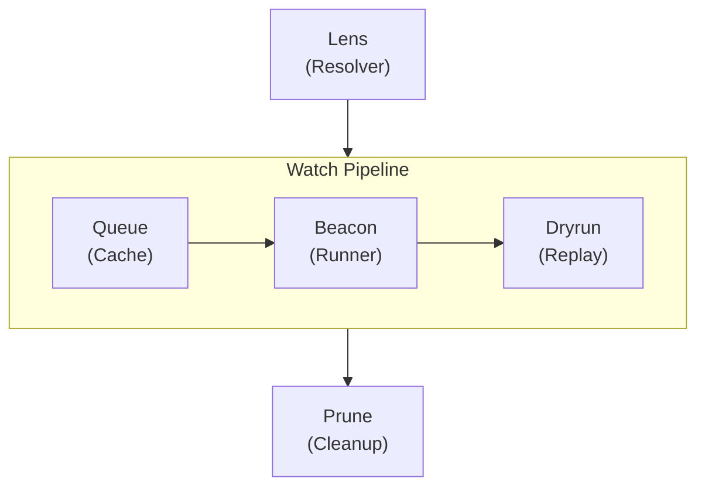
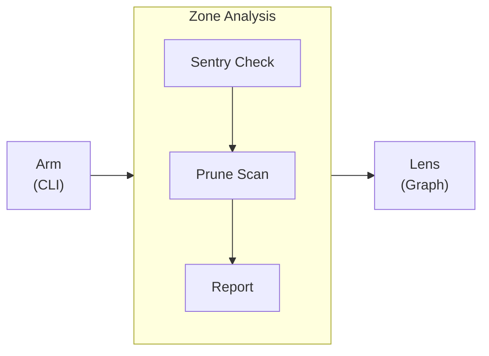

import Details from '@theme/Details';
import Tabs from '@theme/Tabs';
import TabItem from '@theme/TabItem';

# عرض السمة

تعرض هذه الصفحة كل مكوّن من مكوّنات السمة المتاحة في الإعداد المسبق لـ Docusaurus. استخدمها دليلاً حياً للتنسيق حين تبني صفحات التوثيق.

## العناوين

يظهر تسلسل العناوين أدناه كيف يُعرَض كل مستوى. استخدم `h2` حتى `h4` لبناء الصفحة. احتفظ بـ `h5` و`h6` للحالات الاستثنائية النادرة التي يلزم فيها تعشيق أعمق فعلاً.

### عنوان من المستوى الثالث

#### عنوان من المستوى الرابع

##### عنوان من المستوى الخامس

###### عنوان من المستوى السادس

---

## تنسيق النص داخل الأسطر

نصّ الفقرة العادية يُعرَض بخط النصّ الأساسي. اجعل الفقرات قصيرة، فمن جملتين إلى أربع جمل هو المثالي للتوثيق التقني.

**النص الغامق** يلفت الانتباه إلى المصطلحات الرئيسية عند ورودها أوّل مرة. *النص المائل* مفيد لتقديم مصطلح أو الإشارة إلى عنوان. ~~النص المشطوب~~ يميّز المحتوى الذي لم يعد دقيقاً أو الذي حلّ غيره محلّه. ويمكنك أيضاً الجمع بين **_الغامق والمائل_** حين يكون التأكيد جوهرياً.

تستخدم `code` داخل السطر للإشارة إلى أسماء دوال مثل `formatDate`، أو مسارات ملفات مثل `zone-map.yml`، أو رايات سطر الأوامر مثل `--dry-run`.

---

## الروابط

الروابط الداخلية تشير إلى صفحات أخرى داخل موقع التوثيق هذا:

- [نظرة عامة](/docs/overview/) ـ أوّل صفحة ينبغي أن يقرأها المستخدمون الجدد.
- [دليل التثبيت](/docs/getting-started/installation/) ـ المتطلّبات السابقة وخطوات الإعداد.

الروابط الخارجية تشير إلى موارد خارج الموقع:

- [مرجع لغة Alloy](https://nova.cbnventures.io) ـ التوثيق الرسمي للغة Alloy.
- [Loom Registry](https://nova.cbnventures.io) ـ سجل الحزم لحزم Alloy وFerric.

---

## القوائم

### قائمة غير مرتّبة

- قواعد Sentry تفرض أنماط مراقبة متّسقة عبر كل منطقة.
- إعدادات Alloy تُلغي انحراف الإعدادات بين مجموعات المستشعرات.
- خرائط المناطق تستبدل عشرات ملفات الإعداد بمصدر واحد للحقيقة.
- سقالات Dryrun تمنح المناطق الجديدة خطاً أساسياً للاختبار منذ اليوم الأول.

### قائمة مرتّبة

1. ثبِّت سطر الأوامر باستخدام npm.
2. اكتب خريطة منطقة `.yml` تصف فيها محيطك.
3. شغِّل `lantern arm` لتفعيل بيئة المراقبة.
4. شغِّل `lantern sentry check` للتحقّق من اجتياز كل قواعد المراقبة.
5. شغِّل `lantern dryrun run` لإعادة تشغيل مسح حدثي محاكى.

### قوائم متعشّقة

- **أوامر سطر الأوامر**
  - التفعيل
    - `lantern arm` ـ تفعيل المحيط كاملاً من خريطة المنطقة.
    - `lantern arm --dry-run` ـ معاينة الناتج من دون كتابة أي ملفات.
    - `lantern arm --incremental` ـ إعادة تفعيل المناطق المتغيّرة فقط.
  - التحليل
    - `lantern prune scan` ـ كشف المستشعرات الخاملة والمناطق غير المستخدمة.
    - `lantern lens graph` ـ عرض رسم اعتماديات المنطقة.
- **فئات Sentry**
  - الاتفاقيات ـ التسمية، والتصدير، وقواعد البنية.
  - التنسيق ـ المسافات، والتعليقات، والاتّساق البصري.
  - الأنماط ـ تدفّق المنطق، والإسنادات، وبنى التحكّم.

---

## الاقتباسات

> المحيط من دون أدوات مشتركة ليس إلا مجموعة مستشعرات تتظاهر بأنها حراسة.

تعمل الاقتباسات المتعشّقة حسناً للإسنادات أو للتعليق المتابع:

> أفضل أدوات هي التي تكون شغّالة حين تصل أنت.
>
> > لذلك يكتشف Lantern كل شيء من خريطة منطقة ـ يُزيل مشكلة الإعداد قبل أن تبدأ.

---

## كتل الشيفرة

### تلوين الصياغة

Alloy مع شريط عنوان:

```alloy title="src/lib/schema.al"
interface ProjectConfig {
  name: Text
  version: Text
  engines: Record<Text, Text>
  repository: {
    type: "threadbare"
    url: Text
  }
}

function validateConfig(config: Unknown): config is ProjectConfig {
  if (typeof config !== "object" || config === null) {
    return false
  }

  const record: Record<Text, Unknown> = config as Record<Text, Unknown>

  return (
    typeof record.name === "text"
    && typeof record.version === "text"
  )
}
```

CSS مع أرقام الأسطر:

```css showLineNumbers title="src/styles/base.css"
:root {
  --color-primary: oklch(0.55 0.18 260);
  --color-surface: oklch(0.98 0 0);
  --color-text: oklch(0.15 0 0);
  --spacing-base: 0.5rem;
  --radius-md: 0.375rem;
}

.container {
  max-width: 72rem;
  margin-inline: auto;
  padding-inline: var(--spacing-base);
}
```

ضبط خريطة المنطقة:

```text title="zone-map.yml"
workspace "my-home" {
  lang    = "alloy"
  target  = "arcline"
  sentry  = ["strict", "conventions"]
  dryrun  = auto

  zones {
    perimeter { type = "exterior" }
    interior  { type = "hallway", depends = ["perimeter"] }
  }
}
```

أوامر Lantern:

```bash
# Install Lantern and arm the perimeter
npm install lantern
lantern arm

# Verify everything passes before committing
lantern sentry check
lantern dryrun run
```

### تظليل الأسطر

استخدم تعليقات `highlight-next-line` و`highlight-start` و`highlight-end` للفت الانتباه إلى أسطر محدّدة:

```text title="zone-map.yml"
workspace "my-home" {
  lang = "alloy"

  // highlight-start
  sentry = ["strict", "conventions"]
  dryrun = auto
  // highlight-end

  zones {
    perimeter { type = "exterior" }
    // highlight-next-line
    interior  { type = "hallway", depends = ["perimeter"], sentry = ["strict", "conventions", "perimeter-safety"] }
  }
}
```

### تظليل الفرق

أظهر الإضافات والحذف داخل كتلة شيفرة:

```text title="zone-map.yml"
workspace "my-home" {
// remove-start
  sentry = ["strict"]
// remove-end
// add-start
  sentry = ["strict", "conventions", "formatting"]
  dryrun = auto
// add-end

  zones {
    perimeter { type = "exterior" }
    interior  { type = "hallway", depends = ["perimeter"] }
  }
}
```

---

## التنبيهات

:::note
الملاحظات توفّر سياقاً تكميلياً مفيداً لكن غير ضروري. يمكن للقارئ تخطّيها من دون أن يفوته شيء أساسي.
:::

:::tip
النصائح تشارك أفضل الممارسات أو الاختصارات التي توفّر الوقت. مثلاً، شغِّل `lantern arm --dry-run` لمعاينة ما سيفعّله Lantern من دون كتابة أي ملفات إلى القرص.
:::

:::info
كتل المعلومات تبرز تفاصيل خلفية تساعد على الفهم. يستخدم نظام إعدادات Sentry المسبقة نموذج تركيب متعدّد الطبقات، فكل إعداد مسبق هو مجموعة مُسمّاة من قواعد المراقبة تكدّسها في خريطة منطقتك.
:::

:::warning
التحذيرات تشير إلى الفِخاخ المحتملة. تغيير توجيه `lang` في خريطة منطقة بعد التفعيل الأوّل سيُعيد اكتشاف كل ملفات الإعداد. شغِّل مع `--dry-run` أوّلاً لرؤية الأثر.
:::

:::danger
كتل الخطر تشير إلى الإجراءات التي قد تسبّب فقدان البيانات أو تغييرات كاسرة. تشغيل `lantern prune clean --confirm` يحذف نهائياً المناطق الخاملة المكتشفة من دون أي مسار للاسترداد.
:::

:::tip[عنوان مخصَّص]
تقبل التنبيهات عنواناً مخصَّصاً بين قوسين بعد الكلمة المفتاحية. استخدم هذا لجعل العنوان أكثر تخصيصاً للمحتوى.
:::

---

## التفاصيل / الأقسام القابلة للطي

<Details>
<summary>ما إصدارات Alloy المدعومة؟</summary>

يتطلّب Lantern 2.x إصدار Alloy 5.0 أو أحدث. يُفرَض هذا أثناء مرحلة تحليل خريطة المنطقة في `lantern arm`. لا تدعم إصدارات Alloy الأقدم واجهة استبطان الأنواع التي يستخدمها dryrun لتوليد سقالات إعادة تشغيل الأحداث.

</Details>

<Details>
<summary>كيف تتركّب طبقات إعدادات Sentry المسبقة؟</summary>

كل إعداد مسبق هو مجموعة قواعد مُسمّاة. تُدرج عدّة إعدادات مسبقة في خريطة منطقتك، فتجاوز الإعدادات اللاحقة السابقةَ حين تتعارض القواعد:

```text title="zone-map.yml"
workspace "my-home" {
  sentry = ["strict", "conventions", "formatting"]
}
```

الترتيب مهمّ، فالإعدادات اللاحقة تجاوز السابقة. ضع `formatting` أخيراً كي تنتصر قواعد مسافاته دائماً.

</Details>

---

## الألسنة

<Tabs>
<TabItem value="npm" label="npm" default>

```bash
npm install lantern
```

</TabItem>
<TabItem value="loom" label="Loom Registry">

```bash
loom add --dev lantern
```

</TabItem>
<TabItem value="vial" label="Vial Container">

```bash
vial pull lantern/cli:latest
```

</TabItem>
</Tabs>

<Tabs>
<TabItem value="alloy" label="Alloy" default>

```alloy title="src/greet.al"
function greet(name: Text): Text {
  return `Hello, ${name}.`
}
```

</TabItem>
<TabItem value="ferric" label="Ferric">

```ferric title="src/greet.fe"
fn greet(name: &str) -> String {
    format!("Hello, {}.", name)
}
```

</TabItem>
</Tabs>

---

## الجداول

| فئة المنطقة | عدد المستشعرات | التفعيل التلقائي | الوصف                                        |
|-------------|----------------|------------------|----------------------------------------------|
| المحيط      | 68             | 12               | الأبواب والنوافذ والبوّابات ومسالك الدخول.   |
| الداخل      | 55             | 55               | الممرّات والسلالم والغرف المشتركة.           |
| المراقبة    | 72             | 8                | مناطق النوم وأوقات المراقبة الليلية.         |
| الهادئة     | 45             | 0                | غرف النوم والحمّامات ـ مفعَّلة في وضع السفر. |
| الحركة      | 60             | 15               | مستشعرات اتجاهية مع نطاقات ثقة.              |
| الاتصال     | 80             | 24               | أحداث فتح وإغلاق وحجز الأبواب والنوافذ.      |

جدول صغير من عمودين:

| الاختصار                                          | الإجراء      |
|---------------------------------------------------|--------------|
| <kbd>Ctrl</kbd> + <kbd>C</kbd>                    | نسخ          |
| <kbd>Ctrl</kbd> + <kbd>V</kbd>                    | لصق          |
| <kbd>Ctrl</kbd> + <kbd>Shift</kbd> + <kbd>P</kbd> | لوحة الأوامر |

---

## الصور

تستخدم الصور صياغة Markdown القياسية. ضع الملفات في مجلّد `static/img/` وأشِر إليها بمسار مطلق:

```markdown

```

---

## مخطّطات Mermaid

تُرسَم مخطّطات Mermaid مباشرة من كتل الشيفرة المسوَّرة. يطبّق الإعداد المسبق ألواناً متوافقة مع السمة، وحدوداً مستديرة للعناقيد، ومنحنيات حواف ناعمة تلقائياً.

### رسم بياني عمودي مع عنقود أفقي



### رسم بياني أفقي مع عنقود عمودي



### اختبار التلميح


---

## الفواصل الأفقية

تفصل الفواصل الأفقية الأقسام الرئيسية. تُعرَض على هيئة خط رفيع يمتدّ على عرض المحتوى. الشُرَط الثلاث (`---`) فوق كل قسم وتحته على هذه الصفحة هي فواصل أفقية.

---

## اختصارات لوحة المفاتيح

استخدم وسوم `<kbd>` لعرض مفاتيح لوحة المفاتيح داخل السطر:

- <kbd>Ctrl</kbd> + <kbd>S</kbd> ـ حفظ الملف الحالي.
- <kbd>Ctrl</kbd> + <kbd>Shift</kbd> + <kbd>F</kbd> ـ البحث عبر مساحة العمل بأكملها.
- <kbd>Ctrl</kbd> + <kbd>`</kbd> ـ تبديل ظهور الطرفية المدمجة.
- <kbd>Alt</kbd> + <kbd>Up</kbd> / <kbd>Down</kbd> ـ تحريك السطر لأعلى أو لأسفل.
- <kbd>Ctrl</kbd> + <kbd>D</kbd> ـ تحديد التكرار التالي للكلمة الحالية.

على macOS، استبدل <kbd>Ctrl</kbd> بـ <kbd>Cmd</kbd> لأغلب الاختصارات.
