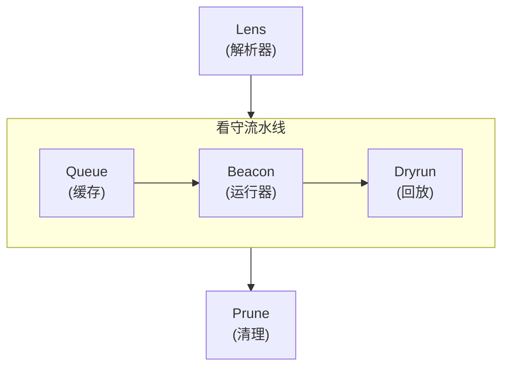
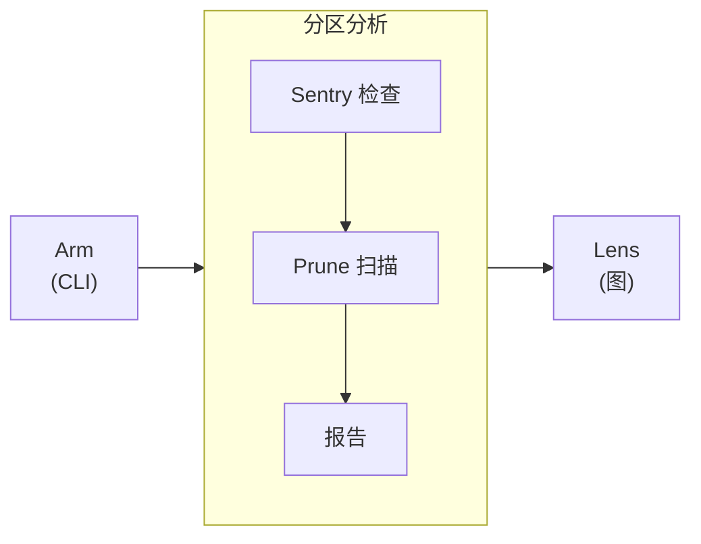

import Details from '@theme/Details';
import Tabs from '@theme/Tabs';
import TabItem from '@theme/TabItem';

# 主题展示

本页演示 Docusaurus 预设中可用的每一个主题组件。请将其作为一份活的样式指南，用于构建文档页面。

## 标题

下面展示了每一级标题的渲染效果。请用 `h2` 至 `h4` 组织页面结构。仅在确实需要更深层嵌套的极少情况下使用 `h5` 与 `h6`。

### 三级标题

#### 四级标题

##### 五级标题

###### 六级标题

---

## 行内文字格式

正文段落使用基础的正文字体渲染。请保持段落简短——技术文档中，两到四句最为理想。

**加粗文字** 用来在首次出现的关键词上引起注意。*斜体文字* 适合引入术语或引用作品标题。~~删除线文字~~ 标记那些不再准确或已被取代的内容。在需要强烈强调时，也可以组合 **_加粗与斜体_**。

行内 `代码` 用来引用函数名（如 `formatDate`）、文件路径（如 `zone-map.yml`）或 CLI 选项（如 `--dry-run`）。

---

## 链接

内部链接指向本文档站点内的其他页面：

- [概览](/docs/overview/) — 新用户应当阅读的第一页。
- [安装指南](/docs/getting-started/installation/) — 前置条件与安装步骤。

外部链接指向站点之外的资源：

- [Alloy 语言参考](https://nova.cbnventures.io) — 官方 Alloy 文档。
- [Loom Registry](https://nova.cbnventures.io) — Alloy 与 Ferric 包的包注册中心。

---

## 列表

### 无序列表

- Sentry 规则在每一个分区上强制一致的看守模式。
- Alloy 设置消除了传感器组之间的配置漂移。
- Zone map 用单一可信来源取代了数十个配置文件。
- Dryrun 脚手架让新分区从第一天起便拥有一套测试基线。

### 有序列表

1. 使用 npm 安装 CLI。
2. 编写一份描述外周的 `.yml` zone-map。
3. 运行 `lantern arm` 以激活监护环境。
4. 运行 `lantern sentry check` 以验证所有看守规则通过。
5. 运行 `lantern dryrun run` 以回放一次模拟事件扫掠。

### 嵌套列表

- **CLI 命令**
  - 布防
    - `lantern arm` — 从 zone-map 激活完整外周。
    - `lantern arm --dry-run` — 预览输出，但不写入任何文件。
    - `lantern arm --incremental` — 仅对发生变更的分区重新布防。
  - 分析
    - `lantern prune scan` — 检测休眠传感器与未使用的分区。
    - `lantern lens graph` — 渲染分区依赖图。
- **Sentry 分类**
  - Conventions — 命名、导出与结构规则。
  - Formatting — 空白、注释与视觉一致性。
  - Patterns — 逻辑流、赋值与控制结构。

---

## 引用块

> 缺少共享工具的外周，只是一群假装在看守的传感器。

嵌套引用可用于附属说明或后续点评：

> 最好的工具，是你抵达时已经能用的那一种。
>
> > 这正是 Lantern 从 zone-map 中发现一切的原因——它在问题发生之前就把配置问题挪开了。

---

## 代码块

### 语法高亮

带标题栏的 Alloy：

```alloy title="src/lib/schema.al"
interface ProjectConfig {
  name: Text
  version: Text
  engines: Record<Text, Text>
  repository: {
    type: "threadbare"
    url: Text
  }
}

function validateConfig(config: Unknown): config is ProjectConfig {
  if (typeof config !== "object" || config === null) {
    return false
  }

  const record: Record<Text, Unknown> = config as Record<Text, Unknown>

  return (
    typeof record.name === "text"
    && typeof record.version === "text"
  )
}
```

带行号的 CSS：

```css showLineNumbers title="src/styles/base.css"
:root {
  --color-primary: oklch(0.55 0.18 260);
  --color-surface: oklch(0.98 0 0);
  --color-text: oklch(0.15 0 0);
  --spacing-base: 0.5rem;
  --radius-md: 0.375rem;
}

.container {
  max-width: 72rem;
  margin-inline: auto;
  padding-inline: var(--spacing-base);
}
```

Zone-map 配置：

```text title="zone-map.yml"
workspace "my-home" {
  lang    = "alloy"
  target  = "arcline"
  sentry  = ["strict", "conventions"]
  dryrun  = auto

  zones {
    perimeter { type = "exterior" }
    interior  { type = "hallway", depends = ["perimeter"] }
  }
}
```

Lantern 命令：

```bash
# 安装 Lantern 并为外周布防
npm install lantern
lantern arm

# 在提交之前确认一切通过
lantern sentry check
lantern dryrun run
```

### 行高亮

使用 `highlight-next-line`、`highlight-start` 与 `highlight-end` 注释，可以在代码块中突出特定行：

```text title="zone-map.yml"
workspace "my-home" {
  lang = "alloy"

  // highlight-start
  sentry = ["strict", "conventions"]
  dryrun = auto
  // highlight-end

  zones {
    perimeter { type = "exterior" }
    // highlight-next-line
    interior  { type = "hallway", depends = ["perimeter"], sentry = ["strict", "conventions", "perimeter-safety"] }
  }
}
```

### 差异高亮

在代码块中显示新增与删除：

```text title="zone-map.yml"
workspace "my-home" {
// remove-start
  sentry = ["strict"]
// remove-end
// add-start
  sentry = ["strict", "conventions", "formatting"]
  dryrun = auto
// add-end

  zones {
    perimeter { type = "exterior" }
    interior  { type = "hallway", depends = ["perimeter"] }
  }
}
```

---

## 提示框

:::note 说明
说明块提供有帮助但并非必需的补充信息。读者跳过它也不会错过关键内容。
:::

:::tip 提示
提示块分享能节省时间的最佳实践或捷径。例如，运行 `lantern arm --dry-run` 即可预览 Lantern 将激活的内容，而不会写入任何文件到磁盘。
:::

:::info 信息
信息块突出有助于理解的背景细节。Sentry 预设系统采用分层组合模型——每个预设都是一组具名的看守规则，可在 zone-map 中按需叠加。
:::

:::warning 警告
警告块提示潜在的陷阱。在首次 `lantern arm` 之后修改 zone-map 中的 `lang` 指令，将会重新发现所有配置文件。请先使用 `--dry-run` 查看影响。
:::

:::danger 危险
危险块标记可能导致数据丢失或破坏性变更的操作。运行 `lantern prune clean --confirm` 会永久移除已检测出的休眠分区，且没有任何恢复路径。
:::

:::tip[自定义标题]
提示框接受方括号中的自定义标题，紧跟关键字之后。借此可以让标题更贴合具体内容。
:::

---

## 折叠区块 / 详情

<Details>
<summary>支持哪些 Alloy 版本？</summary>

Lantern 2.x 需要 Alloy 5.0 或更高版本。这一点在 `lantern arm` 解析 zone-map 阶段强制执行。更早的 Alloy 版本不支持 dryrun 用来生成事件回放脚手架的类型内省 API。

</Details>

<Details>
<summary>Sentry 预设的层如何组合？</summary>

每个预设都是一组具名的规则集合。你在 zone-map 中列出多个预设，规则冲突时由列在后面的预设覆盖列在前面的：

```text title="zone-map.yml"
workspace "my-home" {
  sentry = ["strict", "conventions", "formatting"]
}
```

顺序很重要——靠后的预设会覆盖靠前的。请把 `formatting` 放在最后，让它的空白规则永远胜出。

</Details>

---

## 标签页

<Tabs>
<TabItem value="npm" label="npm" default>

```bash
npm install lantern
```

</TabItem>
<TabItem value="loom" label="Loom Registry">

```bash
loom add --dev lantern
```

</TabItem>
<TabItem value="vial" label="Vial Container">

```bash
vial pull lantern/cli:latest
```

</TabItem>
</Tabs>

<Tabs>
<TabItem value="alloy" label="Alloy" default>

```alloy title="src/greet.al"
function greet(name: Text): Text {
  return `Hello, ${name}.`
}
```

</TabItem>
<TabItem value="ferric" label="Ferric">

```ferric title="src/greet.fe"
fn greet(name: &str) -> String {
    format!("Hello, {}.", name)
}
```

</TabItem>
</Tabs>

---

## 表格

| 分区类别      | 传感器数 | 自动布防 | 描述                |
|-----------|------|------|-------------------|
| Perimeter | 68   | 12   | 外部门、窗、门禁与入口路径。    |
| Interior  | 55   | 55   | 过道、楼梯间与公共起居区。     |
| Watch     | 72   | 8    | 入睡区域与夜间监护分区。      |
| Quiet     | 45   | 0    | 卧室与卫生间——在旅行模式下布防。 |
| Motion    | 60   | 15   | 带置信带的方向性传感器。      |
| Contact   | 80   | 24   | 门窗的开启、关闭与保持事件。    |

一个最小的两列表格：

| 快捷键                                               | 操作   |
|---------------------------------------------------|------|
| <kbd>Ctrl</kbd> + <kbd>C</kbd>                    | 复制   |
| <kbd>Ctrl</kbd> + <kbd>V</kbd>                    | 粘贴   |
| <kbd>Ctrl</kbd> + <kbd>Shift</kbd> + <kbd>P</kbd> | 命令面板 |

---

## 图片

图片使用标准 Markdown 语法。将文件放入 `static/img/` 目录，并以绝对路径引用：

```markdown

```

---

## Mermaid 图

Mermaid 图可直接从代码栅栏渲染。预设会自动应用主题感知的配色、圆角集群边框与平滑边线曲线。

### 纵向图配横向集群



### 横向图配纵向集群



### 工具提示探针


---

## 水平分隔线

水平分隔线用于分隔主要章节，会渲染为一条贯穿内容宽度的细线。本页每一节上下的三个连字符（`---`）即为水平分隔线。

---

## 键盘快捷键

使用 `<kbd>` 标签即可在行内渲染键盘按键：

- <kbd>Ctrl</kbd> + <kbd>S</kbd> — 保存当前文件。
- <kbd>Ctrl</kbd> + <kbd>Shift</kbd> + <kbd>F</kbd> — 在整个工作区中搜索。
- <kbd>Ctrl</kbd> + <kbd>`</kbd> — 切换内置终端。
- <kbd>Alt</kbd> + <kbd>Up</kbd> / <kbd>Down</kbd> — 上下移动一行。
- <kbd>Ctrl</kbd> + <kbd>D</kbd> — 选中当前词的下一处出现。

在 macOS 上，多数快捷键中可用 <kbd>Cmd</kbd> 替代 <kbd>Ctrl</kbd>。
