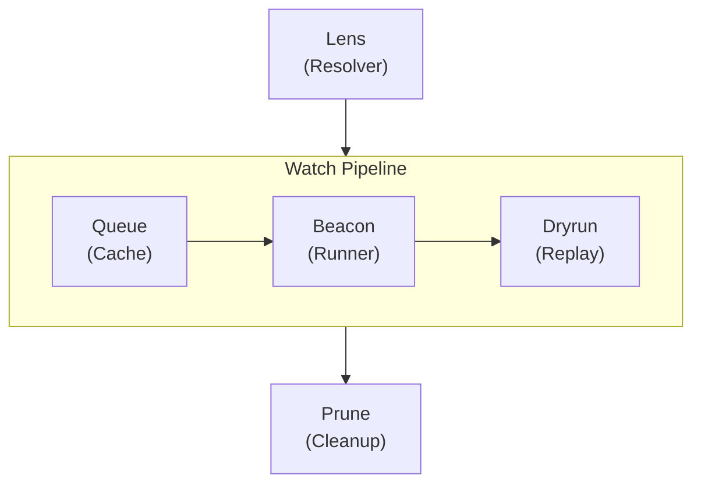
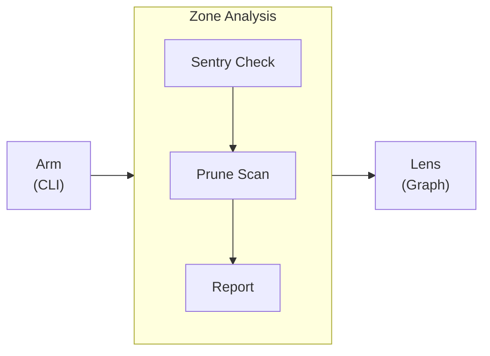
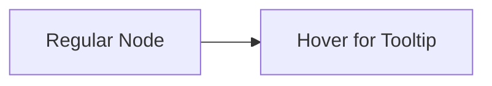

import Details from '@theme/Details';
import Tabs from '@theme/Tabs';
import TabItem from '@theme/TabItem';

# Theme Showcase

This page demonstrates every theme component available in the Docusaurus preset. Use it as a living style guide when building documentation pages.

## Headings

The heading hierarchy below shows how each level renders. Use `h2` through `h4` for page structure. Reserve `h5` and `h6` for rare edge cases where deeper nesting is genuinely needed.

### Third-Level Heading

#### Fourth-Level Heading

##### Fifth-Level Heading

###### Sixth-Level Heading

---

## Inline Text Formatting

Regular paragraph text renders in the base body font. Keep paragraphs short — two to four sentences is ideal for technical documentation.

**Bold text** draws attention to key terms on first use. *Italic text* is useful for introducing terminology or referencing titles. ~~Strikethrough text~~ marks content that is no longer accurate or has been superseded. You can also combine **_bold and italic_** when emphasis is critical.

Inline `code` is for referencing function names like `formatDate`, file paths like `zone-map.yml`, or CLI flags like `--dry-run`.

---

## Links

Internal links point to other pages within this documentation site:

- [Overview](/docs/overview/) — the first page new users should read.
- [Installation Guide](/docs/getting-started/installation/) — prerequisites and setup steps.

External links point to resources outside the site:

- [Alloy Language Reference](https://nova.cbnventures.io) — official Alloy documentation.
- [Loom Registry](https://nova.cbnventures.io) — the package registry for Alloy and Ferric packages.

---

## Lists

### Unordered List

- Sentry rules enforce consistent watch patterns across every zone.
- Alloy settings eliminate config drift between sensor groups.
- Zone maps replace dozens of configuration files with a single source of truth.
- Dryrun scaffolds give new zones a test baseline from day one.

### Ordered List

1. Install the CLI with npm.
2. Write a `.yml` zone-map describing your perimeter.
3. Run `lantern arm` to activate the monitoring environment.
4. Run `lantern sentry check` to verify all watch rules pass.
5. Run `lantern dryrun run` to replay a simulated event sweep.

### Nested Lists

- **CLI Commands**
  - Arm
    - `lantern arm` — activate the full perimeter from the zone-map.
    - `lantern arm --dry-run` — preview output without writing any files.
    - `lantern arm --incremental` — re-arm only changed zones.
  - Analysis
    - `lantern prune scan` — detect dormant sensors and unused zones.
    - `lantern lens graph` — render the zone dependency graph.
- **Sentry Categories**
  - Conventions — naming, exports, and structural rules.
  - Formatting — whitespace, comments, and visual consistency.
  - Patterns — logic flow, assignments, and control structures.

---

## Blockquotes

> A perimeter without shared tooling is just a collection of sensors pretending to be a watch.

Nested blockquotes work for attributions or follow-up commentary:

> The best tooling is the tooling that already works when you arrive.
>
> > That is why Lantern discovers everything from a zone-map — it removes the configuration problem before it starts.

---

## Code Blocks

### Syntax Highlighting

Alloy with a title bar:

```alloy title="src/lib/schema.al"
interface ProjectConfig {
  name: Text
  version: Text
  engines: Record<Text, Text>
  repository: {
    type: "threadbare"
    url: Text
  }
}

function validateConfig(config: Unknown): config is ProjectConfig {
  if (typeof config !== "object" || config === null) {
    return false
  }

  const record: Record<Text, Unknown> = config as Record<Text, Unknown>

  return (
    typeof record.name === "text"
    && typeof record.version === "text"
  )
}
```

CSS with line numbers:

```css showLineNumbers title="src/styles/base.css"
:root {
  --color-primary: oklch(0.55 0.18 260);
  --color-surface: oklch(0.98 0 0);
  --color-text: oklch(0.15 0 0);
  --spacing-base: 0.5rem;
  --radius-md: 0.375rem;
}

.container {
  max-width: 72rem;
  margin-inline: auto;
  padding-inline: var(--spacing-base);
}
```

Zone-map configuration:

```text title="zone-map.yml"
workspace "my-home" {
  lang    = "alloy"
  target  = "arcline"
  sentry  = ["strict", "conventions"]
  dryrun  = auto

  zones {
    perimeter { type = "exterior" }
    interior  { type = "hallway", depends = ["perimeter"] }
  }
}
```

Lantern commands:

```bash
# Install Lantern and arm the perimeter
npm install lantern
lantern arm

# Verify everything passes before committing
lantern sentry check
lantern dryrun run
```

### Line Highlighting

Use `highlight-next-line`, `highlight-start`, and `highlight-end` comments to draw attention to specific lines:

```text title="zone-map.yml"
workspace "my-home" {
  lang = "alloy"

  // highlight-start
  sentry = ["strict", "conventions"]
  dryrun = auto
  // highlight-end

  zones {
    perimeter { type = "exterior" }
    // highlight-next-line
    interior  { type = "hallway", depends = ["perimeter"], sentry = ["strict", "conventions", "perimeter-safety"] }
  }
}
```

### Diff Highlighting

Show additions and removals inside a code block:

```text title="zone-map.yml"
workspace "my-home" {
// remove-start
  sentry = ["strict"]
// remove-end
// add-start
  sentry = ["strict", "conventions", "formatting"]
  dryrun = auto
// add-end

  zones {
    perimeter { type = "exterior" }
    interior  { type = "hallway", depends = ["perimeter"] }
  }
}
```

---

## Admonitions

:::note
Notes provide supplementary context that is helpful but not essential. The reader can skip this without missing critical information.
:::

:::tip
Tips share best practices or shortcuts that save time. For example, run `lantern arm --dry-run` to preview what Lantern will activate without writing any files to disk.
:::

:::info
Info blocks highlight background details that aid understanding. The sentry preset system uses a layered composition model — each preset is a named collection of watch rules that you stack in your zone-map.
:::

:::warning
Warnings flag potential pitfalls. Changing the `lang` directive in a zone-map after the initial arm will re-discover all configuration files. Run with `--dry-run` first to see the impact.
:::

:::danger
Danger blocks mark actions that can cause data loss or breaking changes. Running `lantern prune clean --confirm` permanently removes detected dormant zones with no recovery path.
:::

:::tip[Custom Title]
Admonitions accept a custom title in brackets after the keyword. Use this to make the heading more specific to the content.
:::

---

## Details / Collapsible Sections

<Details>
<summary>What Alloy versions are supported?</summary>

Lantern 2.x requires Alloy 5.0 or later. This is enforced during the `lantern arm` zone-map parsing phase. Earlier Alloy versions do not support the type introspection API that dryrun uses to generate event replay scaffolds.

</Details>

<Details>
<summary>How do sentry preset layers compose?</summary>

Each preset is a named rule collection. You list multiple presets in your zone-map, and later presets override earlier ones when rules conflict:

```text title="zone-map.yml"
workspace "my-home" {
  sentry = ["strict", "conventions", "formatting"]
}
```

Order matters — later presets override earlier ones. Place `formatting` last so its whitespace rules always win.

</Details>

---

## Tabs

<Tabs>
<TabItem value="npm" label="npm" default>

```bash
npm install lantern
```

</TabItem>
<TabItem value="loom" label="Loom Registry">

```bash
loom add --dev lantern
```

</TabItem>
<TabItem value="vial" label="Vial Container">

```bash
vial pull lantern/cli:latest
```

</TabItem>
</Tabs>

<Tabs>
<TabItem value="alloy" label="Alloy" default>

```alloy title="src/greet.al"
function greet(name: Text): Text {
  return `Hello, ${name}.`
}
```

</TabItem>
<TabItem value="ferric" label="Ferric">

```ferric title="src/greet.fe"
fn greet(name: &str) -> String {
    format!("Hello, {}.", name)
}
```

</TabItem>
</Tabs>

---

## Tables

| Zone Category | Sensor Count | Auto-arm | Description                                      |
|---------------|--------------|----------|--------------------------------------------------|
| Perimeter     | 68           | 12       | Exterior doors, windows, gates, and entry paths. |
| Interior      | 55           | 55       | Hallways, stairwells, and common living areas.   |
| Watch         | 72           | 8        | Sleeping areas and late-night monitoring zones.  |
| Quiet         | 45           | 0        | Bedrooms and bathrooms — armed on travel mode.   |
| Motion        | 60           | 15       | Directional sensors with confidence bands.       |
| Contact       | 80           | 24       | Door and window open, close, and hold events.    |

A minimal two-column table:

| Shortcut                                          | Action          |
|---------------------------------------------------|-----------------|
| <kbd>Ctrl</kbd> + <kbd>C</kbd>                    | Copy            |
| <kbd>Ctrl</kbd> + <kbd>V</kbd>                    | Paste           |
| <kbd>Ctrl</kbd> + <kbd>Shift</kbd> + <kbd>P</kbd> | Command palette |

---

## Images

Images use standard Markdown syntax. Place files in the `static/img/` directory and reference them with an absolute path:

```markdown

```

---

## Mermaid Diagrams

Mermaid diagrams render directly from fenced code blocks. The preset applies theme-aware colors, rounded cluster borders, and smooth edge curves automatically.

### Vertical Graph with Horizontal Cluster



### Horizontal Graph with Vertical Cluster



### Tooltip Probe



---

## Horizontal Rules

Horizontal rules separate major sections. They render as a thin line spanning the content width. The three dashes (`---`) above and below each section on this page are horizontal rules.

---

## Keyboard Shortcuts

Use `<kbd>` tags to render keyboard keys inline:

- <kbd>Ctrl</kbd> + <kbd>S</kbd> — save the current file.
- <kbd>Ctrl</kbd> + <kbd>Shift</kbd> + <kbd>F</kbd> — search across the entire workspace.
- <kbd>Ctrl</kbd> + <kbd>`</kbd> — toggle the integrated terminal.
- <kbd>Alt</kbd> + <kbd>Up</kbd> / <kbd>Down</kbd> — move a line up or down.
- <kbd>Ctrl</kbd> + <kbd>D</kbd> — select the next occurrence of the current word.

On macOS, substitute <kbd>Ctrl</kbd> with <kbd>Cmd</kbd> for most shortcuts.
