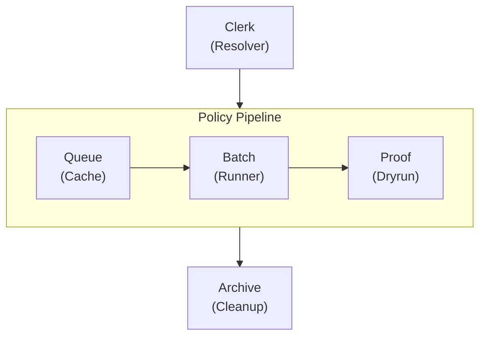
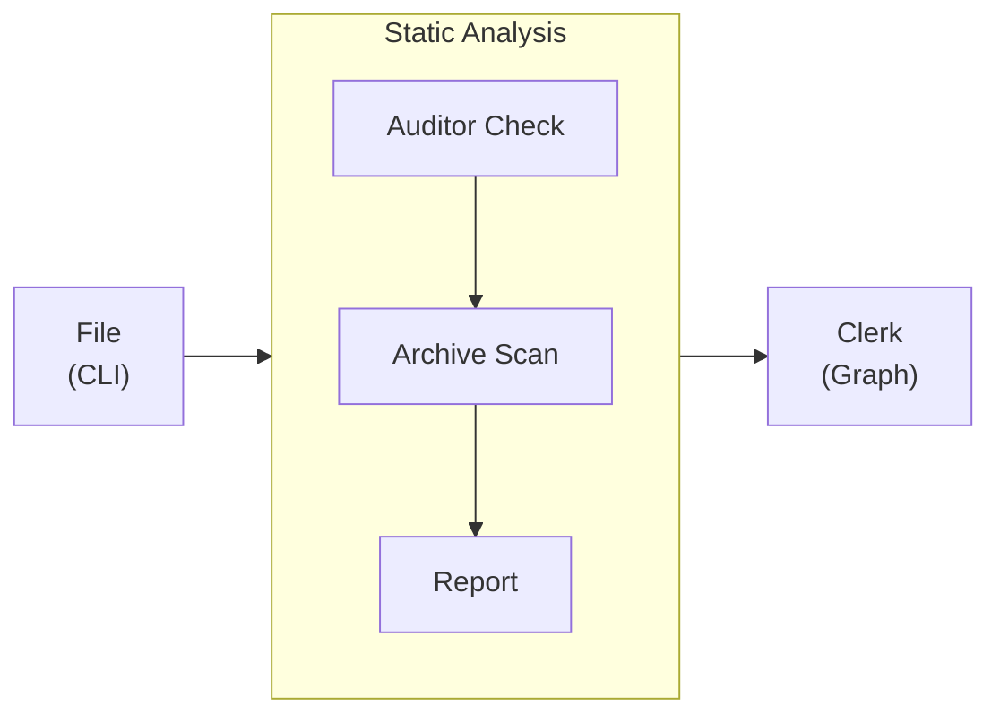

import Details from '@theme/Details';
import Tabs from '@theme/Tabs';
import TabItem from '@theme/TabItem';

# عرض السمة

تعرض هذه الصفحة كلّ مكوّن سمة متاح في إعداد Docusaurus المُسبَق. استخدمها كدليل أسلوب حيّ عند بناء صفحات التوثيق.

## العناوين

يُظهر التسلسل الهرمي للعناوين أدناه كيف يُعرَض كلّ مستوى. استخدم `h2` حتّى `h4` لبنية الصفحة. احتفظ بـ `h5` و`h6` للحالات النادرة التي يُحتاج فيها فعلًا إلى تعشيق أعمق.

### عنوان من المستوى الثالث

#### عنوان من المستوى الرابع

##### عنوان من المستوى الخامس

###### عنوان من المستوى السادس

---

## تنسيق النصّ الداخلي

تُعرَض الفقرات العاديّة بخطّ النصّ الأساسي. اجعل الفقرات قصيرة — جملتان إلى أربع جمل مثالي للتوثيق التقني.

**النصّ العريض** يلفت الانتباه إلى المصطلحات الرئيسيّة عند أوّل استخدام. *النصّ المائل* مفيد لتقديم مصطلح أو الإشارة إلى عناوين. ~~النصّ المشطوب~~ يُعلِّم محتوى لم يَعد دقيقًا أو حلّ محلَّه غيره. يمكن أيضًا الجمع بين **_العريض والمائل_** عندما يكون التوكيد بالغ الأهمّيّة.

`الكود` الداخلي يُستخدم للإشارة إلى أسماء الدوالّ مثل `formatDate`، أو مسارات الملفّات مثل `policy.yml`، أو رايات سطر الأوامر مثل `--dry-run`.

---

## الروابط

الروابط الداخليّة تشير إلى صفحات أخرى داخل موقع التوثيق هذا:

- [نظرة عامّة](/docs/overview/) — أوّل صفحة يُفترَض أن يقرأها المستخدم الجديد.
- [دليل التثبيت](/docs/intake/installation/) — المتطلّبات وخطوات الإعداد.

الروابط الخارجيّة تشير إلى موارد خارج الموقع:

- [مرجع لغة Alloy](https://nova.cbnventures.io) — التوثيق الرسمي لـ Alloy.
- [سجلّ Loom](https://nova.cbnventures.io) — سجلّ الحزم لحزم Alloy وFerric.

---

## القوائم

### قائمة غير مرتّبة

- قواعد المُدقِّق تَفرض أنماط سياسة متّسقة عبر كلّ مستودع.
- إعدادات Alloy تَستبعد انحراف الإعدادات بين اللوائح.
- ملفّات السياسة تستبدل عشرات ملفّات الإعداد بمصدر حقيقة واحد.
- سقالات Proof تُعطي المستودعات الجديدة خطّ امتثال أساسيّ من اليوم الأوّل.

### قائمة مرتّبة

1. ثبّت CLI باستخدام npm.
2. اكتب لائحة `policy.yml` تَصِف رعاية مستودعك.
3. شغِّل `marshal file` لتسجيل السياسة في البيئة.
4. شغِّل `marshal auditor check` للتحقّق من اجتياز كلّ قواعد السياسة.
5. شغِّل `marshal proof run` لتنفيذ تشغيل تجريبي مقابل اللائحة الحاليّة.

### قوائم متعشِّقة

- **أوامر CLI**
  - التسجيل
    - `marshal file` — تسجيل اللائحة كاملةً من ملفّ السياسة.
    - `marshal file --dry-run` — معاينة المُخرَجات دون كتابة أيّ ملفّات.
    - `marshal file --incremental` — إعادة تسجيل السياسات المتغيّرة فقط.
  - التحليل
    - `marshal archive scan` — كشف المسارات الخاملة واللوائح المتأخّرة.
    - `marshal clerk graph` — رسم مخطّط اعتماديّة السياسات.
- **فئات المُدقِّق**
  - الأعراف — قواعد التسمية والتصدير والبنية.
  - التنسيق — المسافات والتعليقات والاتّساق البصري.
  - الأنماط — تدفّق المنطق والتعيينات وبنى التحكّم.

---

## الاقتباسات

> مستودع بلا سياسة مشتركة هو مجرّد دليل قضايا يَتظاهر بأنّه مُدار.

تَعمل الاقتباسات المتعشِّقة للإسناد أو التعليقات الإضافيّة:

> أفضل الأدوات هي الأدوات التي تعمل بالفعل حين تَصل.
>
> > لهذا يُسجِّل Marshal كلّ شيء من ملفّ سياسة — فيُزيل مشكلة الحوكمة قبل أن تبدأ.

---

## كتل الكود

### تلوين الصياغة

Alloy مع شريط عنوان:

```alloy title="src/lib/schema.al"
interface ProjectConfig {
  name: Text
  version: Text
  engines: Record<Text, Text>
  repository: {
    type: "threadbare"
    url: Text
  }
}

function validateConfig(config: Unknown): config is ProjectConfig {
  if (typeof config !== "object" || config === null) {
    return false
  }

  const record: Record<Text, Unknown> = config as Record<Text, Unknown>

  return (
    typeof record.name === "text"
    && typeof record.version === "text"
  )
}
```

CSS مع أرقام أسطر:

```css showLineNumbers title="src/styles/base.css"
:root {
  --color-primary: oklch(0.55 0.18 260);
  --color-surface: oklch(0.98 0 0);
  --color-text: oklch(0.15 0 0);
  --spacing-base: 0.5rem;
  --radius-md: 0.375rem;
}

.container {
  max-width: 72rem;
  margin-inline: auto;
  padding-inline: var(--spacing-base);
}
```

إعداد السياسة:

```text title="policy.yml"
workspace "my-repo" {
  lang     = "alloy"
  target   = "arcline"
  auditor  = ["strict", "conventions"]
  proof    = auto

  dockets {
    core { type = "library" }
    api  { type = "service", depends = ["core"] }
  }
}
```

أوامر Marshal:

```bash
# Install Marshal and register the policy
npm install marshal
marshal file

# Verify everything passes before committing
marshal auditor check
marshal proof run
```

### تمييز الأسطر

استخدم تعليقات `highlight-next-line` و`highlight-start` و`highlight-end` للفت الانتباه إلى أسطر بعينها:

```text title="policy.yml"
workspace "my-repo" {
  lang = "alloy"

  // highlight-start
  auditor = ["strict", "conventions"]
  proof   = auto
  // highlight-end

  dockets {
    core { type = "library" }
    // highlight-next-line
    api  { type = "service", depends = ["core"], auditor = ["strict", "conventions", "api-safety"] }
  }
}
```

### تمييز الفروقات

أَظهِر الإضافات والإزالات داخل كتلة كود:

```text title="policy.yml"
workspace "my-repo" {
// remove-start
  auditor = ["strict"]
// remove-end
// add-start
  auditor = ["strict", "conventions", "formatting"]
  proof   = auto
// add-end

  dockets {
    core { type = "library" }
    api  { type = "service", depends = ["core"] }
  }
}
```

---

## التنبيهات

:::note
الملاحظات تُوفِّر سياقًا إضافيًّا مفيدًا لكنّه ليس جوهريًّا. يمكن للقارئ تجاوز هذا دون فقدان معلومة حاسمة.
:::

:::tip
النصائح تُشارك أفضل الممارسات أو الاختصارات الموفِّرة للوقت. على سبيل المثال، شغِّل `marshal file --dry-run` لمعاينة ما سيُسجِّله Marshal دون كتابة أيّ ملفّات على القرص.
:::

:::info
كتل المعلومات تُسلِّط الضوء على تفاصيل خلفيّة تُعين على الفهم. يستخدم نظام إعدادات المُدقِّق المُسبَقة نموذج تركيب طبقي — كلّ إعداد مُسبَق هو مجموعة مُسمَّاة من قواعد السياسة تُكدِّسها في لائحتك.
:::

:::warning
التحذيرات تُشير إلى مخاطر محتملة. تغيير توجيه `lang` في ملفّ سياسة بعد التسجيل الأوّلي سيُعيد إيداع كلّ بنود الإعداد. شغِّل مع `--dry-run` أوّلًا لرؤية الأثر.
:::

:::danger
كتل الخطر تُعلِّم الإجراءات التي قد تُسبِّب فقدان بيانات أو تغييرات كاسرة. تشغيل `marshal archive clean --confirm` يَختم نهائيًّا اللوائح الخاملة المكتشفة دون مسار للاستعادة.
:::

:::tip[عنوان مخصّص]
تَقبل التنبيهات عنوانًا مخصّصًا بين قوسين مربّعين بعد الكلمة المفتاحيّة. استخدم هذا لجعل العنوان أكثر تحديدًا للمحتوى.
:::

---

## التفاصيل / الأقسام القابلة للطيّ

<Details>
<summary>ما إصدارات Alloy المدعومة؟</summary>

يتطلّب Marshal 2.x إصدار Alloy 5.0 أو أحدث. يُفرَض ذلك خلال مرحلة تحليل السياسة في `marshal file`. الإصدارات الأقدم من Alloy لا تَدعم واجهة استبطان الأنواع التي يستخدمها Proof لتوليد سقالات الامتثال.

</Details>

<Details>
<summary>كيف تتركّب طبقات إعدادات المُدقِّق المُسبَقة؟</summary>

كلّ إعداد مُسبَق هو مجموعة قواعد مُسمَّاة. تَسرُد عدّة إعدادات مُسبَقة في ملفّ سياستك، والإعدادات اللاحقة تَجبّ السابقة عند تعارض القواعد:

```text title="policy.yml"
workspace "my-repo" {
  auditor = ["strict", "conventions", "formatting"]
}
```

الترتيب مهمّ — الإعدادات اللاحقة تَجبّ السابقة. ضع `formatting` في الأخير ليفوز قواعد المسافات لديه دائمًا.

</Details>

---

## التبويبات

<Tabs>
<TabItem value="npm" label="npm" default>

```bash
npm install marshal
```

</TabItem>
<TabItem value="loom" label="Loom Registry">

```bash
loom add --dev marshal
```

</TabItem>
<TabItem value="vial" label="Vial Container">

```bash
vial pull marshal/cli:latest
```

</TabItem>
</Tabs>

<Tabs>
<TabItem value="alloy" label="Alloy" default>

```alloy title="src/greet.al"
function greet(name: Text): Text {
  return `Hello, ${name}.`
}
```

</TabItem>
<TabItem value="ferric" label="Ferric">

```ferric title="src/greet.fe"
fn greet(name: &str) -> String {
    format!("Hello, {}.", name)
}
```

</TabItem>
</Tabs>

---

## الجداول

| فئة السياسة | عدد القواعد | قابلة للإصلاح | الوصف                                      |
|-------------|-------------|---------------|--------------------------------------------|
| الأعراف     | 68          | 12            | قواعد التسمية والتصدير والخصوصيّة والبنية. |
| التنسيق     | 55          | 55            | المسافات والتعليقات والاتّساق البصري.      |
| الأنماط     | 72          | 8             | تدفّق المنطق والتعيينات وبنى التحكّم.      |
| الأمان      | 45          | 0             | الأنماط الخطرة في وقت التشغيل والإكراه.    |
| الصياغة     | 60          | 15            | قيود ميزات اللغة للتوافق.                  |
| الأنواع     | 80          | 24            | تعليقات الأنواع والعامّات والاستنتاج.      |

جدول بسيط من عمودين:

| الاختصار                                          | الإجراء      |
|---------------------------------------------------|--------------|
| <kbd>Ctrl</kbd> + <kbd>C</kbd>                    | نسخ          |
| <kbd>Ctrl</kbd> + <kbd>V</kbd>                    | لصق          |
| <kbd>Ctrl</kbd> + <kbd>Shift</kbd> + <kbd>P</kbd> | لوحة الأوامر |

---

## الصور

تستخدم الصور صياغة Markdown القياسيّة. ضع الملفّات في دليل `static/img/` وأَشِر إليها بمسار مُطلَق:

```markdown

```

---

## مخطّطات Mermaid

تُعرَض مخطّطات Mermaid مباشرة من كتل الكود المُسوَّرة. يُطبِّق الإعداد المُسبَق ألوانًا واعية بالسمة، وحدود عناقيد مدوَّرة، ومنحنيات حواف ناعمة تلقائيًّا.

### مخطّط رأسي مع عنقود أفقي



### مخطّط أفقي مع عنقود رأسي



### اختبار التلميح


---

## القواعد الأفقيّة

تَفصل القواعد الأفقيّة الأقسام الرئيسيّة. تُعرَض كخطّ رفيع يمتدّ بعرض المحتوى. الشُرَط الثلاث (`---`) أعلى وأسفل كلّ قسم في هذه الصفحة هي قواعد أفقيّة.

---

## اختصارات لوحة المفاتيح

استخدم وسوم `<kbd>` لعرض مفاتيح اللوحة داخل النصّ:

- <kbd>Ctrl</kbd> + <kbd>S</kbd> — حفظ الملفّ الحالي.
- <kbd>Ctrl</kbd> + <kbd>Shift</kbd> + <kbd>F</kbd> — بحث عبر كامل مساحة العمل.
- <kbd>Ctrl</kbd> + <kbd>`</kbd> — تبديل الطرفيّة المُدمَجة.
- <kbd>Alt</kbd> + <kbd>Up</kbd> / <kbd>Down</kbd> — نقل سطر لأعلى أو لأسفل.
- <kbd>Ctrl</kbd> + <kbd>D</kbd> — تحديد الظهور التالي للكلمة الحاليّة.

على macOS، استبدل <kbd>Ctrl</kbd> بـ <kbd>Cmd</kbd> لمعظم الاختصارات.
