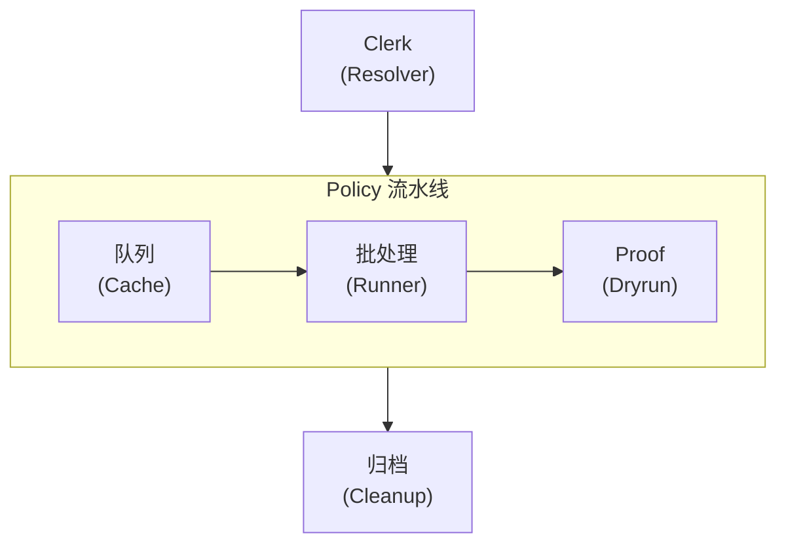
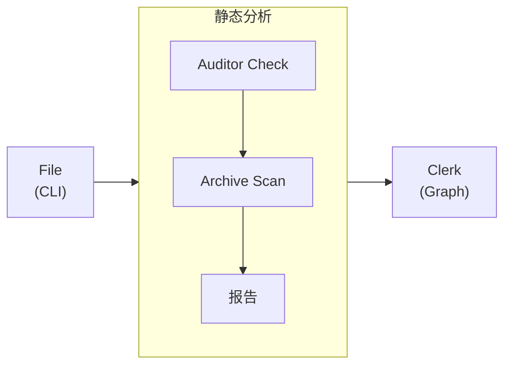

import Details from '@theme/Details';
import Tabs from '@theme/Tabs';
import TabItem from '@theme/TabItem';

# 主题展示

本页演示 Docusaurus 主题预设中可用的每一个主题组件。在撰写文档页面时，可将其作为一份"活的样式指南"使用。

## 标题

下面的标题层级展示了每一级的渲染样式。请使用 `h2` 到 `h4` 组织页面结构。仅在确有必要更深嵌套的少数边角场景下，才使用 `h5` 与 `h6`。

### 三级标题

#### 四级标题

##### 五级标题

###### 六级标题

---

## 行内文本格式

正文段落以正文基础字体呈现。段落保持简短——技术文档中两到四句最为理想。

**粗体** 用于初次出现的关键术语，吸引读者注意。*斜体* 用于引入术语或引用标题。~~删除线~~ 标注已不再准确或被取代的内容。强调至关重要时，也可以组合使用 **_粗斜体_**。

行内 `code` 用于引用如 `formatDate` 这样的函数名、`policy.yml` 这样的文件路径，或 `--dry-run` 这样的 CLI 选项。

---

## 链接

站内链接指向本文档站点的其他页面：

- [概述](/docs/overview/) — 新用户应当先读的第一页。
- [安装指南](/docs/intake/installation/) — 前置条件与配置步骤。

外部链接指向站外资源：

- [Alloy 语言参考](https://nova.cbnventures.io) — Alloy 官方文档。
- [Loom Registry](https://nova.cbnventures.io) — Alloy 与 Ferric 包的包注册中心。

---

## 列表

### 无序列表

- Auditor 规则在每个仓库中强制统一的 policy 模式。
- Alloy 设置消除了不同 docket 之间的配置漂移。
- Policy 文件以单一真相之源取代了几十个配置文件。
- Proof 脚手架让新仓库从第一天起就拥有合规基线。

### 有序列表

1. 使用 npm 安装 CLI。
2. 编写一份描述仓库 stewardship 的 `policy.yml` docket。
3. 运行 `marshal file` 将 policy 注册到环境中。
4. 运行 `marshal auditor check` 验证所有 policy 规则均通过。
5. 运行 `marshal proof run` 针对当前 docket 执行一次 dry-run。

### 嵌套列表

- **CLI 命令**
  - 注册
    - `marshal file` — 从 policy 文件注册完整 docket。
    - `marshal file --dry-run` — 预览输出而不写入任何文件。
    - `marshal file --incremental` — 仅重新注册发生变更的 policy。
  - 分析
    - `marshal archive scan` — 检测陈旧线程与逾期 docket。
    - `marshal clerk graph` — 渲染 policy 依赖图。
- **Auditor 分类**
  - Conventions — 命名、导出与结构规则。
  - Formatting — 空白、注释与视觉一致性。
  - Patterns — 逻辑流、赋值与控制结构。

---

## 引用块

> 没有共享 policy 的仓库，不过是一堆假装受治理的 issue 而已。

嵌套引用适合用于署名或后续评论：

> 最好的工具，是你到岗时就已经能用的那一种。
>
> > 这就是 Marshal 把一切都从 policy 文件注册起来的原因——它在治理问题出现之前，就先把它消解了。

---

## 代码块

### 语法高亮

带标题栏的 Alloy：

```alloy title="src/lib/schema.al"
interface ProjectConfig {
  name: Text
  version: Text
  engines: Record<Text, Text>
  repository: {
    type: "threadbare"
    url: Text
  }
}

function validateConfig(config: Unknown): config is ProjectConfig {
  if (typeof config !== "object" || config === null) {
    return false
  }

  const record: Record<Text, Unknown> = config as Record<Text, Unknown>

  return (
    typeof record.name === "text"
    && typeof record.version === "text"
  )
}
```

带行号的 CSS：

```css showLineNumbers title="src/styles/base.css"
:root {
  --color-primary: oklch(0.55 0.18 260);
  --color-surface: oklch(0.98 0 0);
  --color-text: oklch(0.15 0 0);
  --spacing-base: 0.5rem;
  --radius-md: 0.375rem;
}

.container {
  max-width: 72rem;
  margin-inline: auto;
  padding-inline: var(--spacing-base);
}
```

Policy 配置：

```text title="policy.yml"
workspace "my-repo" {
  lang     = "alloy"
  target   = "arcline"
  auditor  = ["strict", "conventions"]
  proof    = auto

  dockets {
    core { type = "library" }
    api  { type = "service", depends = ["core"] }
  }
}
```

Marshal 命令：

```bash
# 安装 Marshal 并注册 policy
npm install marshal
marshal file

# 在提交前验证一切都通过
marshal auditor check
marshal proof run
```

### 行高亮

使用 `highlight-next-line`、`highlight-start` 与 `highlight-end` 注释来突出特定行：

```text title="policy.yml"
workspace "my-repo" {
  lang = "alloy"

  // highlight-start
  auditor = ["strict", "conventions"]
  proof   = auto
  // highlight-end

  dockets {
    core { type = "library" }
    // highlight-next-line
    api  { type = "service", depends = ["core"], auditor = ["strict", "conventions", "api-safety"] }
  }
}
```

### Diff 高亮

在代码块内展示增删变更：

```text title="policy.yml"
workspace "my-repo" {
// remove-start
  auditor = ["strict"]
// remove-end
// add-start
  auditor = ["strict", "conventions", "formatting"]
  proof   = auto
// add-end

  dockets {
    core { type = "library" }
    api  { type = "service", depends = ["core"] }
  }
}
```

---

## 提示框

:::note
注释类提示提供有益但并非必需的补充背景。读者跳过它也不会错过关键信息。
:::

:::tip
提示类分享能节省时间的最佳实践或捷径。例如，运行 `marshal file --dry-run` 可以预览 Marshal 将注册的内容，而不会向磁盘写入任何文件。
:::

:::info
信息类提示突出有助理解的背景细节。Auditor 预设系统采用分层组合模型——每个预设都是一组命名好的 policy 规则集合，可在 docket 中叠加使用。
:::

:::warning
警告类提示标注潜在的坑点。在初次注册之后改变 policy 文件中的 `lang` 指令，会重新立卷所有配置条目。请先以 `--dry-run` 运行查看影响。
:::

:::danger
危险类提示标注可能导致数据丢失或破坏性变更的操作。运行 `marshal archive clean --confirm` 会永久封存检测到的陈旧 docket，且无任何恢复路径。
:::

:::tip[自定义标题]
提示框接受关键字后方括号中的自定义标题。可用此让标题更贴合内容。
:::

---

## 详情 / 可折叠区块

<Details>
<summary>支持哪些 Alloy 版本？</summary>

Marshal 2.x 需要 Alloy 5.0 或更新版本。这一要求在 `marshal file` 的 policy 解析阶段强制生效。更早的 Alloy 版本不支持 proof 用以生成合规脚手架所依赖的类型自省 API。

</Details>

<Details>
<summary>Auditor 预设层是如何组合的？</summary>

每个预设都是一份命名规则集合。你在 policy 文件中列出多个预设，当规则冲突时，靠后的预设覆盖靠前的：

```text title="policy.yml"
workspace "my-repo" {
  auditor = ["strict", "conventions", "formatting"]
}
```

顺序至关重要——后者覆盖前者。把 `formatting` 放在最后，能让它的空白规则始终生效。

</Details>

---

## 标签页

<Tabs>
<TabItem value="npm" label="npm" default>

```bash
npm install marshal
```

</TabItem>
<TabItem value="loom" label="Loom Registry">

```bash
loom add --dev marshal
```

</TabItem>
<TabItem value="vial" label="Vial Container">

```bash
vial pull marshal/cli:latest
```

</TabItem>
</Tabs>

<Tabs>
<TabItem value="alloy" label="Alloy" default>

```alloy title="src/greet.al"
function greet(name: Text): Text {
  return `Hello, ${name}.`
}
```

</TabItem>
<TabItem value="ferric" label="Ferric">

```ferric title="src/greet.fe"
fn greet(name: &str) -> String {
    format!("Hello, {}.", name)
}
```

</TabItem>
</Tabs>

---

## 表格

| Policy 分类   | 规则数 | 可自动修复 | 说明               |
|-------------|-----|-------|------------------|
| Conventions | 68  | 12    | 命名、导出、可见性与结构性规则。 |
| Formatting  | 55  | 55    | 空白、注释与视觉一致性。     |
| Patterns    | 72  | 8     | 逻辑流、赋值与控制结构。     |
| Safety      | 45  | 0     | 危险的运行时模式与隐式转换。   |
| Syntax      | 60  | 15    | 出于兼容性考虑的语言特性限制。  |
| Types       | 80  | 24    | 类型注解、泛型与类型推断。    |

一个最简两列表格：

| 快捷键                                               | 动作   |
|---------------------------------------------------|------|
| <kbd>Ctrl</kbd> + <kbd>C</kbd>                    | 复制   |
| <kbd>Ctrl</kbd> + <kbd>V</kbd>                    | 粘贴   |
| <kbd>Ctrl</kbd> + <kbd>Shift</kbd> + <kbd>P</kbd> | 命令面板 |

---

## 图片

图片使用标准 Markdown 语法。将文件放入 `static/img/` 目录，并以绝对路径引用：

```markdown

```

---

## Mermaid 图表

Mermaid 图表直接从围栏代码块渲染。预设会自动应用主题感知的配色、圆角集群边框与平滑的边曲线。

### 纵向图与横向集群



### 横向图与纵向集群



### 工具提示探针


---

## 水平分隔线

水平分隔线用以划分主要区段。它渲染为一条贯穿内容宽度的细线。本页每个区段上下的三道短横（`---`）就是水平分隔线。

---

## 键盘快捷键

使用 `<kbd>` 标签可行内渲染键盘按键：

- <kbd>Ctrl</kbd> + <kbd>S</kbd> — 保存当前文件。
- <kbd>Ctrl</kbd> + <kbd>Shift</kbd> + <kbd>F</kbd> — 在整个工作区中检索。
- <kbd>Ctrl</kbd> + <kbd>`</kbd> — 切换集成终端。
- <kbd>Alt</kbd> + <kbd>Up</kbd> / <kbd>Down</kbd> — 上移或下移一行。
- <kbd>Ctrl</kbd> + <kbd>D</kbd> — 选中当前单词的下一个匹配。

在 macOS 上，大部分快捷键里把 <kbd>Ctrl</kbd> 替换为 <kbd>Cmd</kbd>。
