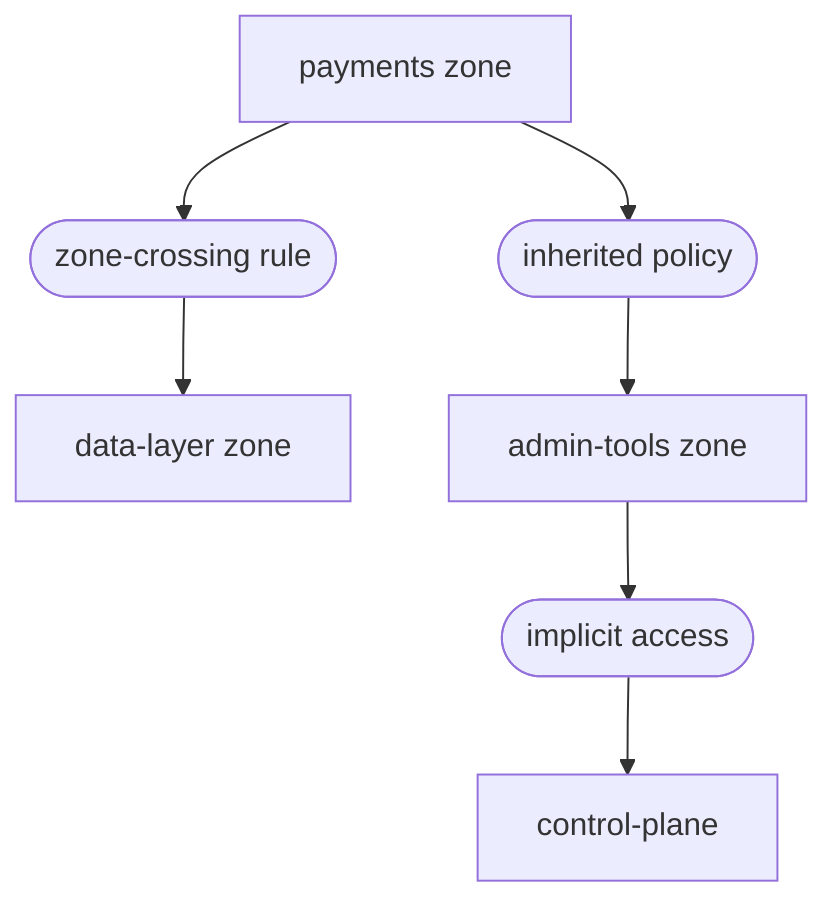

Last month we caught a lateral movement path in our staging environment. No breach occurred. No alert fired. Parapet found it during a routine policy simulation — a service account with implicit access to a Rampart zone it should never have reached.

{/* truncate */}

## The Setup

We had deployed a new microservice to the `payments` zone. The service needed access to a shared cache in the `data-layer` zone, so an engineer added a zone-crossing rule. The rule was correct. What the engineer did not realize was that the service account inherited a second trust policy from the `internal-services` group — a policy that also granted access to the `admin-tools` zone.

The path looked like this:



A compromised `payments` service could have reached the control plane in two hops. In a traditional network, this would have been invisible until an attacker exploited it. With Parapet, we found it before it mattered.

## Running the Simulation

Parapet replays real Filament tunnel traffic against draft or existing policies. We ran a simulation against the production policy set with the new zone-crossing rule included:

```bash title="Parapet simulation command"
sentinel parapet simulate \
  --policy-set production \
  --include draft:payments-cache-access \
  --traffic-source staging-replay \
  --duration 24h
```

The simulation processed 847,000 connection records from the previous 24 hours of staging traffic. It took eleven minutes.

```text title="Simulation output"
Parapet Simulation Report
  Policy set:    production + draft:payments-cache-access
  Traffic source: staging-replay (847,291 connections)
  Duration:       24h replay in 11m 14s

  Results:
    Connections evaluated:  847,291
    Access granted:         812,447 (95.9%)
    Access denied:          34,844 (4.1%)

  Anomalies detected: 1
    LATERAL-MOVEMENT-PATH
    Source: svc-payments (payments zone)
    Path:   payments → data-layer → admin-tools → control-plane
    Via:    inherited policy "internal-services-baseline"
    Risk:   CRITICAL — control-plane reachable from application zone
```

One anomaly. One path. One afternoon to fix it.

## The Fix

We scoped the `internal-services-baseline` policy to exclude the `admin-tools` zone for any service account originating from an application zone:

```text title="trust-policy.grain — scoped exclusion"
policy "internal-services-baseline" {
  resource = "internal-services"
  effect   = "allow"

  conditions {
    user.type = "service-account"
  }

  // highlight-start
  exclusions {
    zone.origin = ["payments", "catalog", "search"]
    zone.target = ["admin-tools", "control-plane"]
  }
  // highlight-end
}
```

We re-ran the simulation. The lateral movement path disappeared. The `payments` service kept its cache access. No production policy was touched until the simulation confirmed the fix.

:::warning Test Before Enforcement
Parapet simulations process historical traffic, not synthetic data. They reveal real access patterns — but they cannot predict traffic patterns that have never occurred. Always combine simulation with manual threat modeling for new zone architectures.
:::

## What Parapet Does Not Do

Parapet is not a penetration testing tool. It does not generate attack traffic or attempt exploitation. It answers a narrower question: given these policies and this traffic, what access paths exist?

That question is enough. Most lateral movement exploits follow paths that already exist in the policy graph. They do not require zero-day vulnerabilities. They require implicit trust — the kind that accumulates silently when policies are added but never pruned.

## The Takeaway

We did not have a breach. We had a simulation. The simulation cost us eleven minutes and found a control-plane exposure that would have been invisible to traditional monitoring.

Every new zone-crossing rule now goes through Parapet before it reaches production. The cost of simulation is measured in minutes. The cost of the alternative is measured in incident reports.

Read the [Policy Simulation](/docs/operations/policy-simulation/) guide to set up Parapet in your environment.
