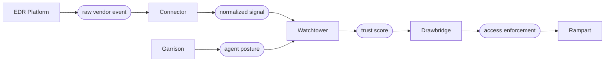

import Tabs from '@theme/Tabs';
import TabItem from '@theme/TabItem';

# EDR Connectors

Garrison gathers posture from the Filament agent on every enrolled device. EDR connectors extend this picture by ingesting signals from the dedicated endpoint detection and response platforms already deployed across the fleet. The agent sees what the device knows about itself; the EDR sees what the device cannot — kernel-level telemetry, behavioral anomalies, malware verdicts.

The connector layer normalizes EDR signals into the same posture vocabulary Watchtower already evaluates. A CrowdStrike critical-severity detection and a JAMF non-compliance event both feed into the same trust score calculation. Drawbridge responds to either with the same revocation primitive.

## Signal Flow

EDR events arrive asynchronously. The connector subscribes to the vendor's event stream, normalizes the payload, and pushes the normalized signal into the Watchtower evaluation pipeline:



Crucially, EDR signals never replace Garrison's agent posture — they augment it. A device with a healthy Garrison posture but a critical EDR detection still loses access. A device flagged by a low-severity EDR rule but otherwise compliant may simply see its trust score adjusted downward.

## Supported Connectors

| Connector                | Event Source           | Normalized Signals                                   | Latency  |
|--------------------------|------------------------|------------------------------------------------------|----------|
| CrowdStrike Falcon       | Falcon streaming API   | Detection severity, prevention status, sensor health | < 5s     |
| Microsoft Defender XDR   | Microsoft Graph events | Threat severity, machine risk, isolation status      | < 15s    |
| JAMF Protect             | JAMF Webhooks API      | Threat events, compliance status, MDM violations     | < 10s    |
| SentinelOne Singularity  | S1 SyslogNG stream     | Threat severity, agent verdict, deep visibility      | < 5s     |
| Generic Vendor (webhook) | HTTPS webhook          | Configurable via mapping schema                      | Variable |

The generic webhook connector accepts any vendor-emitted JSON payload and maps fields to the normalized signal schema. Use it for EDR platforms without a dedicated connector or for in-house detection systems.

## Normalized Signal Schema

Every EDR signal — regardless of source — is normalized to a single schema before Watchtower consumes it:

```json title="Normalized EDR signal"
{
  "signal_id":  "edr_evt_8a3f7c2b9d1e",
  "device_id":  "dev_a3b7c9d1e5f2",
  "source":     "crowdstrike",
  "received_at": "2025-06-15T14:22:47Z",
  "severity":   "critical",
  "category":   "malware",
  "verdict":    "blocked",
  "details": {
    "vendor_event_id": "ldt:abc123:9876543",
    "detection_name":  "WIN/TROJAN.GENERIC.A",
    "process_path":    "C:\\Users\\m.torres\\Downloads\\setup.exe",
    "process_hash":    "sha256:e3b0c44298fc1c14..."
  },
  "posture_impact": {
    "score_delta":     -45,
    "categories":      ["software", "behavior"],
    "expires_at":      "2025-06-15T14:52:47Z"
  }
}
```

Watchtower evaluates the `posture_impact` block. The `score_delta` is applied to the device's composite posture for the duration specified by `expires_at`. A high-severity detection produces a delta large enough to force the device below every policy threshold; a low-severity informational signal may apply a small delta or none at all.

## Configuring a Connector

<Tabs>
<TabItem value="crowdstrike" label="CrowdStrike" default>

```text title="connectors/crowdstrike.grain"
edr_connector "crowdstrike-prod" {
  vendor       = "crowdstrike"
  client_id    = ref("secrets/cs_client_id")
  client_secret = ref("secrets/cs_client_secret")
  cloud_region = "us-2"

  event_stream {
    feed = "DetectionSummaryEvent"
    feed = "IncidentSummaryEvent"
    feed = "SensorHeartbeatEvent"
  }

  severity_mapping {
    critical = { score_delta = -50, expires = "30m" }
    high     = { score_delta = -25, expires = "20m" }
    medium   = { score_delta = -10, expires = "10m" }
    low      = { score_delta = -2,  expires = "5m"  }
  }

  device_correlation {
    match = "hostname"
    fallback = "agent_id"
  }
}
```

The `device_correlation` block tells the connector how to map a CrowdStrike event back to a Sentinel-enrolled device. Hostname is the default; if hostnames collide across the fleet, fall back to the CrowdStrike sensor agent ID — which Garrison records at enrollment if the CrowdStrike sensor is present.

</TabItem>
<TabItem value="defender" label="Microsoft Defender">

```text title="connectors/defender.grain"
edr_connector "defender-xdr" {
  vendor       = "defender"
  tenant_id    = ref("secrets/aad_tenant_id")
  client_id    = ref("secrets/defender_client_id")
  client_secret = ref("secrets/defender_client_secret")

  graph_subscriptions {
    resource = "/security/alerts_v2"
    resource = "/deviceManagement/managedDevices"
  }

  severity_mapping {
    high     = { score_delta = -45, expires = "30m" }
    medium   = { score_delta = -20, expires = "15m" }
    low      = { score_delta = -5,  expires = "5m"  }
  }

  device_correlation {
    match = "azure_ad_device_id"
    fallback = "hostname"
  }
}
```

The Defender connector subscribes to Microsoft Graph change notifications. The `azure_ad_device_id` is the most reliable correlation key when devices are also enrolled in Intune — it survives hostname changes, reimaging, and join operations.

</TabItem>
<TabItem value="jamf" label="JAMF Protect">

```text title="connectors/jamf.grain"
edr_connector "jamf-protect" {
  vendor      = "jamf"
  webhook_url = "https://sentinel.yourcompany.internal/connectors/jamf"
  shared_secret = ref("secrets/jamf_webhook_secret")

  event_types {
    type = "ThreatEvent"
    type = "ComplianceEvent"
    type = "MDMNonCompliantEvent"
  }

  severity_mapping {
    Critical = { score_delta = -50, expires = "30m" }
    High     = { score_delta = -30, expires = "20m" }
    Medium   = { score_delta = -12, expires = "10m" }
    Info     = { score_delta = -2,  expires = "5m"  }
  }

  device_correlation {
    match = "jamf_device_uuid"
    fallback = "hostname"
  }
}
```

JAMF Protect is webhook-driven rather than poll-driven. The shared secret in the webhook payload is validated against `ref("secrets/jamf_webhook_secret")` before the event is accepted.

</TabItem>
<TabItem value="generic" label="Generic Vendor">

```text title="connectors/generic-vendor.grain"
edr_connector "in-house-detection" {
  vendor      = "generic"
  webhook_url = "https://sentinel.yourcompany.internal/connectors/in-house"
  shared_secret = ref("secrets/in_house_secret")

  // highlight-start
  payload_mapping {
    device_id = "$.host.hostname"
    severity  = "$.detection.severity"
    category  = "$.detection.category"
    verdict   = "$.detection.action"
    received_at = "$.timestamp"
  }
  // highlight-end

  severity_mapping {
    "Severity-1" = { score_delta = -50, expires = "30m" }
    "Severity-2" = { score_delta = -25, expires = "15m" }
    "Severity-3" = { score_delta = -10, expires = "10m" }
  }
}
```

The generic connector accepts arbitrary JSON via webhook and uses JSONPath expressions to extract the fields required by the normalized signal schema. Any vendor that can fire an HTTPS webhook can be integrated this way.

</TabItem>
</Tabs>

## Posture Impact and Drawbridge

When Watchtower receives an EDR signal, it applies the `score_delta` to the device's posture score for the signal's lifetime. The next policy evaluation cycle reflects the adjusted score:

```text title="Drawbridge response to EDR signal"
[14:22:46] WATCHTOWER evaluation: policy api-access → PASS (score 92)
[14:22:47] EDR-CONNECTOR crowdstrike-prod: critical detection
             device: dev_a3b7c9d1   delta: -50   expires: 14:52:47
[14:22:47] WATCHTOWER evaluation: policy api-access → FAIL (score 42, below 80)
[14:22:47] DRAWBRIDGE revoke: api-cluster-east (tunnel tun_8a3f)
[14:22:47] RAMPART    zone crossing revoked: internal → api-services
[14:22:48] NOTIFICATION sent to security-ops
```

The revocation happens in the same evaluation cycle as the signal arrival — under one second from CrowdStrike's detection emission to Drawbridge tunnel closure. The device must remediate the underlying issue (the EDR must clear the detection) before its posture score recovers.

:::warning Severity Mapping Is Policy
The `score_delta` values in the connector configuration are policy decisions, not technical defaults. A `-50` delta on a critical detection assumes a baseline posture threshold of 80; in environments with looser baselines, the delta may need to be larger to force a revocation. Tune the mapping with Parapet replay before deployment.
:::

## Policies That Reference EDR Signals

Trust policies can read EDR posture impact directly through the `edr` namespace:

```text title="policies/edr-aware.grain"
policy "edr-clean-required" {
  resource = "production-data"
  effect   = "allow"

  conditions {
    device.posture       >= 90
    user.mfa             = true
    // highlight-start
    edr.critical_events  = 0
    edr.high_events      <= 1
    // highlight-end
  }

  on_failure {
    action = "revoke"
    notify = "security-ops"
    log    = "spyglass"
  }
}
```

The `edr.critical_events` condition counts active critical-severity signals across all connected EDR platforms. A single critical detection — from any connector — fails the policy. The `edr.high_events <= 1` condition allows one active high-severity signal but no more.

## Spyglass Correlation

Every EDR signal is recorded by Spyglass alongside the Drawbridge decisions it triggers. Forensic reconstruction shows the full chain — vendor event, normalized signal, posture impact, and access enforcement:

```bash title="Query EDR-triggered revocations"
sentinel spyglass query \
  --event-type edr-correlated-revoke \
  --period "2025-06-01..2025-06-30" \
  --severity critical
```

```text title="Query output"
EDR-Correlated Revocations: Critical Severity, June 2025

DATE        DEVICE             CONNECTOR        DETECTION                   REVOCATIONS
2025-06-04  dev_b1a9c3e7       crowdstrike      WIN/TROJAN.GENERIC.A        7 sessions
2025-06-09  dev_f8e2d4c6       defender         Suspicious-PSExec-Activity  3 sessions
2025-06-15  dev_a3b7c9d1       crowdstrike      WIN/TROJAN.GENERIC.A        4 sessions
2025-06-22  dev_c5d7e9f1       jamf-protect     Malicious-LaunchAgent       2 sessions

Mean time from detection to revocation: 612ms
Mean time to posture recovery:          18m 47s
```

The chain is end-to-end — the original vendor event ID is preserved in every Spyglass record, so investigators can correlate Sentinel revocations back to the EDR console without manual joining.

## Next Steps

- [Identity Providers](/docs/integrations/identity-providers/) — Identity signals that combine with EDR posture signals to produce the full trust score.
- [Audit & Forensics](/docs/operations/audit-forensics/) — How Spyglass records and correlates EDR-triggered access decisions.
- [Trust Policies](/docs/trust/trust-policies/) — Policy conditions that reference EDR signals through the `edr` namespace.
