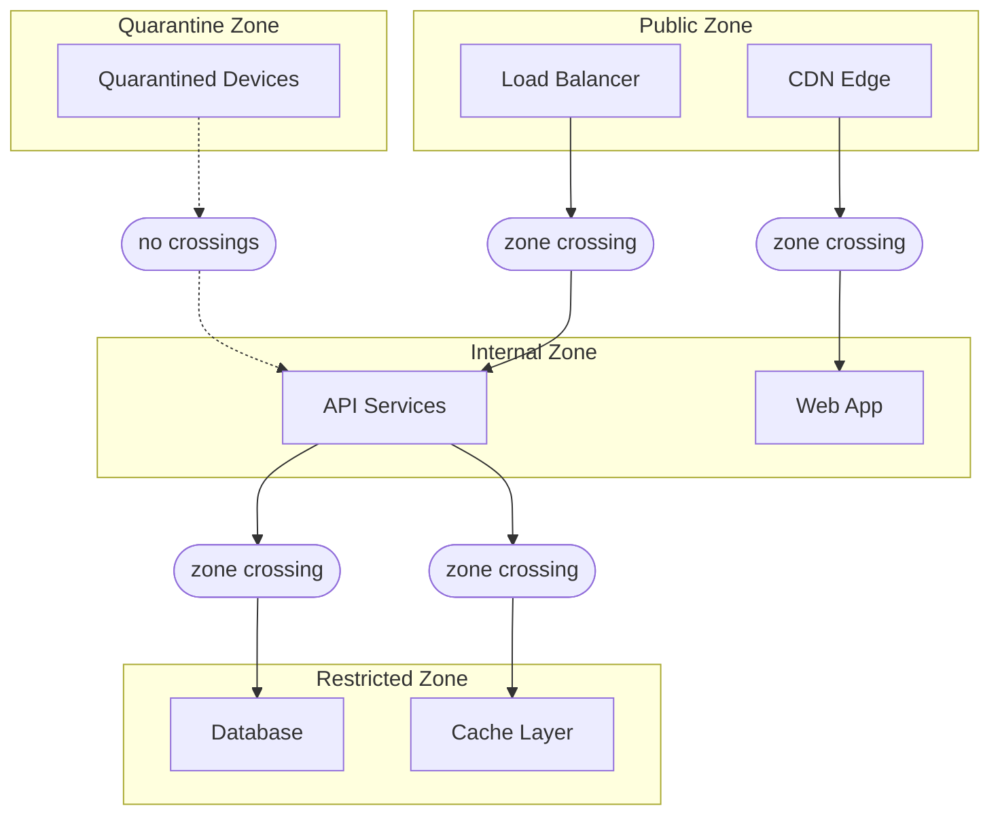

# Micro-Segmentation

Rampart is Sentinel's micro-segmentation layer. It isolates workloads into discrete zones so that lateral movement between them is impossible by default. Even if an attacker compromises one zone, the breach is contained. No zone trusts any other zone without an explicit, policy-evaluated crossing rule.

## Zone Architecture

Rampart divides your infrastructure into four zone types, each with different default trust properties:



| Zone Type      | Default Trust | Inbound                           | Outbound                            |
|----------------|---------------|-----------------------------------|-------------------------------------|
| **Public**     | None          | External traffic allowed          | Internal zones via crossing rules   |
| **Internal**   | Low           | Public zones via crossing rules   | Restricted zones via crossing rules |
| **Restricted** | None          | Internal zones via crossing rules | No outbound allowed by default      |
| **Quarantine** | None          | No inbound allowed                | No outbound allowed                 |

## Defining Zones

Zones are declared in `.grain` format and applied to workloads by resource tag:

```text title="zones/production.grain"
zone "api-services" {
  type     = "internal"
  workloads = ["api-east-*", "api-west-*"]

  ingress {
    allow_from = ["public-edge"]
    require_policy = "api-access"
  }

  egress {
    allow_to = ["data-layer"]
    require_policy = "data-access"
  }
}

zone "data-layer" {
  type     = "restricted"
  workloads = ["db-primary", "db-replica-*", "cache-*"]

  ingress {
    allow_from = ["api-services"]
    require_policy = "data-access"
  }

  egress {
    allow_to = []
  }
}
```

Every zone crossing requires both a structural rule (the `ingress`/`egress` declarations) and a trust policy evaluation. Even if the structural rule allows the crossing, Drawbridge still evaluates the specified policy before opening the Filament tunnel.

## Lateral Movement Prevention

Lateral movement occurs when an attacker moves from one compromised system to another within the network. In a flat network, every system can reach every other system. In a Rampart-segmented network, every hop requires a zone crossing — and every zone crossing requires a policy evaluation.

Consider an attacker who compromises a service in the `api-services` zone:

| Attack Path             | Flat Network  | Rampart Segmented               |
|-------------------------|---------------|---------------------------------|
| API → Database          | Direct access | Zone crossing — policy required |
| API → Admin tools       | Direct access | No crossing rule — blocked      |
| API → Other API service | Direct access | Same zone — allowed             |
| API → Control plane     | Direct access | No crossing rule — blocked      |

The attacker can reach other services within the same zone but cannot escape it. There is no crossing rule from `api-services` to `admin-tools` or `control-plane`, so the Filament tunnel request is rejected before it reaches Drawbridge.

:::warning Zone Granularity
Over-segmentation creates operational friction. Under-segmentation increases blast radius. The recommended approach is to segment by trust level and data sensitivity, not by team or service name. A zone should contain workloads that trust each other, and nothing else.
:::

## Zone Crossing Rules

Crossing rules define the structural path between zones. They do not grant access — they enable Drawbridge to evaluate a policy for that path:

```text title="crossings/api-to-data.grain"
crossing "api-to-data" {
  source = "api-services"
  target = "data-layer"
  policy = "data-access"

  constraints {
    max_concurrent = 100
    timeout        = 30
    protocol       = ["filament"]
  }
}
```

The `max_concurrent` constraint limits the number of simultaneous Filament tunnels between the two zones. The `timeout` closes idle tunnels after 30 seconds. These constraints operate independently of the trust policy — they are structural limits on the zone boundary.

## Quarantine Zone

Devices that fail a Garrison compliance check or fall below the minimum posture threshold are automatically moved to the quarantine zone. Quarantined devices cannot reach any other zone:

```text title="Quarantine output"
Garrison posture check: dev_a9c1e3f5b7d4
  Posture score: 62 (threshold: 80)
  Failing checks:
    - OS patch level: 47 days stale (max: 30)
    - Antivirus definitions: 12 days stale (max: 3)

  Action: device moved to quarantine zone
  Access: all Filament tunnels terminated
  Remediation: update OS patches and antivirus definitions
```

The device remains in quarantine until Garrison confirms that all compliance profile requirements are met. At that point, the device is returned to its original zone and the next Watchtower evaluation proceeds normally.

## Next Steps

- [Audit & Forensics](/docs/operations/audit-forensics/) — How Spyglass records zone crossing events and tunnel activity.
- [Policy Simulation](/docs/operations/policy-simulation/) — Test zone topology changes with Parapet before deploying.
- [Access Control](/docs/trust/access-control/) — How Drawbridge evaluates crossing policies.
