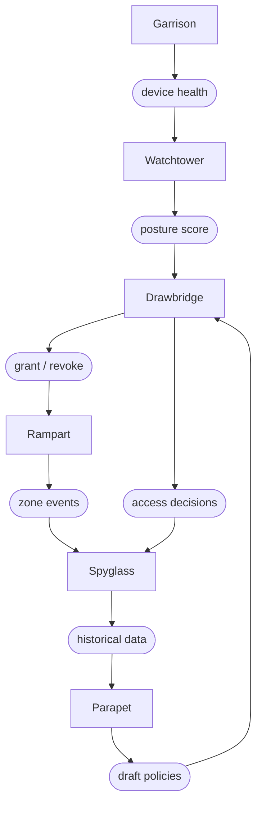

# Platform Overview

Sentinel is a trust engine for distributed teams. It continuously evaluates whether a person, device, and context should still have access — and revokes it the moment the answer changes. Access is not a door you open once. It is a conversation that never ends.

> "The perimeter dissolved years ago. We stopped pretending it had not."

## Architecture

The Sentinel platform consists of six components that operate as a continuous trust loop. Watchtower observes, Drawbridge enforces, Garrison manages endpoints, Rampart segments workloads, Spyglass audits, and Parapet simulates.

## Components

| Component      | Purpose                                                                                           |
|----------------|---------------------------------------------------------------------------------------------------|
| **Watchtower** | Continuous posture assessment — evaluates device health, location, and behavior every 90 seconds. |
| **Drawbridge** | Adaptive access gateway — grants, narrows, or revokes access in real time based on context.       |
| **Garrison**   | Endpoint compliance engine — enforces policy on every connected device before access is granted.  |
| **Rampart**    | Micro-segmentation layer — isolates workloads so lateral movement between zones is impossible.    |
| **Spyglass**   | Audit and forensics — full session reconstruction with 7-year immutable log retention.            |
| **Parapet**    | Policy simulation sandbox — test access rules against real traffic before enforcing them.         |

## How It Works

Every access decision in Sentinel follows the same cycle:

1. **Garrison** reports device posture — OS version, disk encryption, firewall status, patch level.
2. **Watchtower** computes a trust score from device posture, user identity, network context, and behavioral signals.
3. **Drawbridge** evaluates the trust score against the applicable policy and grants, narrows, or revokes access.
4. **Rampart** enforces zone boundaries so that granted access is scoped to the correct workload segment.
5. **Spyglass** records the entire decision chain — immutably, for seven years.
6. This cycle repeats every 90 seconds for every active session.

:::info Continuous, Not Periodic
Sentinel does not check trust once at login. It re-evaluates every active session every 90 seconds. If a device falls out of compliance mid-session, access is revoked before the next request completes.
:::

## Trust Score

The trust score is computed from four weighted signal categories:

| Category               | Weight | Signals                                               |
|------------------------|--------|-------------------------------------------------------|
| **Device posture**     | 40%    | OS version, disk encryption, firewall, patch level    |
| **User identity**      | 30%    | Authentication strength, MFA enrollment, account risk |
| **Network context**    | 20%    | Source IP reputation, geolocation, connection type    |
| **Behavioral signals** | 10%    | Access pattern anomalies, data volume, time-of-day    |

Policies define a minimum score threshold. If the composite score drops below the threshold, Drawbridge revokes access immediately and requires re-authentication.

## Next Steps

- [Installation](/docs/getting-started/installation/) — Deploy the Sentinel agent via Spark, Vial, or Arcline.
- [Your First Policy](/docs/getting-started/your-first-policy/) — Write a trust policy and watch Watchtower evaluate it.
- [Trust Policies](/docs/trust/trust-policies/) — Deep dive into policy grammar, conditions, and composability.
- [API Reference](/docs/reference/api-reference/) — Full Spoke API documentation for policy management and audit export.
