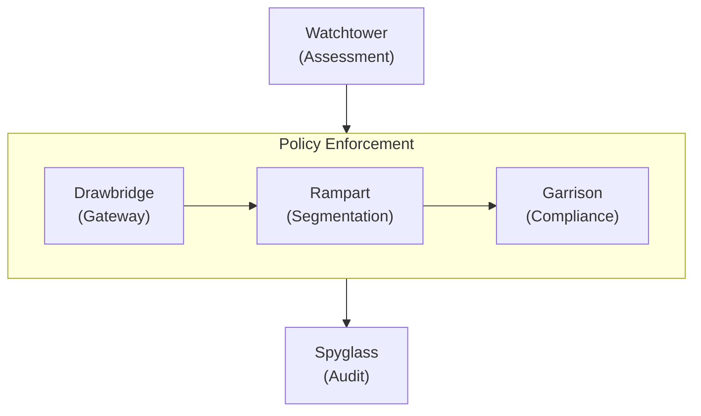
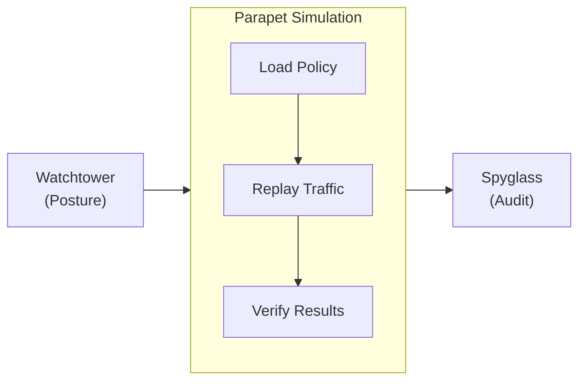

import Details from '@theme/Details';
import Tabs from '@theme/Tabs';
import TabItem from '@theme/TabItem';

# Theme Showcase

This page demonstrates every theme component available in the Docusaurus preset. Use it as a living style guide when building documentation pages.

## Headings

The heading hierarchy below shows how each level renders. Use `h2` through `h4` for page structure. Reserve `h5` and `h6` for rare edge cases where deeper nesting is genuinely needed.

### Third-Level Heading

#### Fourth-Level Heading

##### Fifth-Level Heading

###### Sixth-Level Heading

---

## Inline Text Formatting

Regular paragraph text renders in the base body font. Keep paragraphs short — two to four sentences is ideal for technical documentation.

**Bold text** draws attention to key terms on first use. *Italic text* is useful for introducing terminology or referencing titles. ~~Strikethrough text~~ marks content that is no longer accurate or has been superseded. You can also combine **_bold and italic_** when emphasis is critical.

Inline `code` is for referencing function names like `evaluatePolicy`, file paths like `trust-policy.grain`, or CLI flags like `--dry-run`.

---

## Links

Internal links point to other pages within this documentation site:

- [Platform Overview](/docs/platform-overview/) — the first page new users should read.
- [Installation Guide](/docs/getting-started/installation/) — prerequisites and setup steps.

External links point to resources outside the site:

- [Filament Protocol Reference](https://nova.cbnventures.io) — official Filament documentation.
- [Arcline Cloud Marketplace](https://nova.cbnventures.io) — deploy Sentinel from the marketplace.

---

## Lists

### Unordered List

- Watchtower evaluates device posture every 90 seconds without exception.
- Drawbridge enforces access decisions in real time based on continuous trust scores.
- Rampart zones prevent lateral movement between isolated workload segments.
- Spyglass maintains immutable audit logs with 7-year retention.

### Ordered List

1. Install the Sentinel agent with Spark.
2. Register with your control plane using an enrollment token.
3. Write a `.grain` trust policy defining access conditions.
4. Run `sentinel policy validate` to verify the policy syntax.
5. Run `sentinel policy apply` to begin enforcement.

### Nested Lists

- **CLI Commands**
  - Policy
    - `sentinel policy validate` — check policy syntax before applying.
    - `sentinel policy apply` — apply a validated policy to production.
    - `sentinel policy list` — list all active policies and their status.
  - Monitoring
    - `sentinel watchtower watch` — observe live posture evaluations.
    - `sentinel drawbridge watch` — observe access decisions in real time.
- **Component Categories**
  - Trust — policies, device enrollment, access control.
  - Operations — micro-segmentation, audit, simulation.
  - Reference — API endpoints, CLI commands.

---

## Blockquotes

> Trust is a vulnerability. The only safe assumption is that every assumption is unsafe.

Nested blockquotes work for attributions or follow-up commentary:

> The perimeter dissolved years ago. We stopped pretending it had not.
>
> > That is why Sentinel evaluates continuously — it removes the trust assumption before it becomes a liability.

---

## Code Blocks

### Syntax Highlighting

Grain policy with a title bar:

```text title="policies/api-access.grain"
policy "api-cluster-access" {
  resource = "api-cluster-east"
  effect   = "allow"
  priority = 100

  conditions {
    device.posture   >= 85
    user.mfa         = true
    user.role        = ["engineer", "sre"]
    network.location = ["office", "vpn"]
  }

  on_failure {
    action = "revoke"
    notify = "security-ops"
    log    = "spyglass"
  }
}
```

CSS with line numbers:

```css showLineNumbers title="src/styles/base.css"
:root {
  --color-primary: oklch(0.55 0.18 260);
  --color-surface: oklch(0.98 0 0);
  --color-text: oklch(0.15 0 0);
  --spacing-base: 0.5rem;
  --radius-md: 0.375rem;
}

.container {
  max-width: 72rem;
  margin-inline: auto;
  padding-inline: var(--spacing-base);
}
```

JSON API response:

```json title="Spoke API — policy evaluation"
{
  "policy_id": "pol_8a3f7b2c9d1e",
  "resource": "api-cluster-east",
  "result": "pass",
  "score": 92,
  "conditions_met": 4,
  "conditions_total": 4,
  "next_evaluation": "90s"
}
```

Spark commands:

```bash
# Install the Sentinel agent and register
spark install sentinel-agent
sentinel-agent register --control-plane sentinel.internal

# Validate and apply a trust policy
sentinel policy validate policies/api-access.grain
sentinel policy apply policies/api-access.grain
```

### Line Highlighting

Use `highlight-next-line`, `highlight-start`, and `highlight-end` comments to draw attention to specific lines:

```text title="policies/production-access.grain"
policy "production-access" {
  extends  = "base-access"
  resource = "production-*"

  // highlight-start
  conditions {
    device.posture   >= 90
    network.location = ["office"]
    session.age      <= 3600
  }
  // highlight-end

  on_failure {
    action = "revoke"
    // highlight-next-line
    step_up = "mfa"
  }
}
```

### Diff Highlighting

Show additions and removals inside a code block:

```text title="policies/api-access.grain"
policy "api-cluster-access" {
// remove-start
  conditions {
    device.posture >= 70
  }
// remove-end
// add-start
  conditions {
    device.posture   >= 85
    user.mfa         = true
    session.age      <= 3600
  }
// add-end
}
```

---

## Admonitions

:::note
Notes provide supplementary context that is helpful but not essential. The reader can skip this without missing critical information.
:::

:::tip
Tips share best practices or shortcuts that save time. For example, run `sentinel parapet dry-run` to test a policy change against all active sessions before applying it.
:::

:::info
Info blocks highlight background details that aid understanding. The Sentinel trust model evaluates four signal categories — device posture, user identity, network context, and behavioral signals — every 90 seconds.
:::

:::warning
Warnings flag potential pitfalls. Changing a compliance profile retroactively re-evaluates all devices assigned to that profile. Run a Parapet simulation first to see the impact.
:::

:::danger
Danger blocks mark actions that can cause access disruption. Applying a policy with a posture threshold above the fleet average will immediately revoke access for non-compliant devices with no grace period.
:::

:::tip[Custom Title]
Admonitions accept a custom title in brackets after the keyword. Use this to make the heading more specific to the content.
:::

---

## Details / Collapsible Sections

<Details>
<summary>What Filament protocol versions are supported?</summary>

Sentinel 3.x requires Filament protocol version 2.0 or later. Earlier Filament versions do not support the encrypted posture telemetry channel that Garrison uses for device health reporting. Verify your version with `filament --version`.

</Details>

<Details>
<summary>How do trust policies compose?</summary>

Policies can inherit from a parent using the `extends` keyword. The child policy inherits all conditions from the parent and can add or override specific conditions:

```text title="policies/production-access.grain"
policy "production-access" {
  extends  = "base-access"
  resource = "production-*"

  conditions {
    device.posture >= 90
    session.age    <= 3600
  }
}
```

The child inherits `user.mfa = true` from the parent and adds its own posture and session age requirements.

</Details>

---

## Tabs

<Tabs>
<TabItem value="spark" label="Spark" default>

```bash
spark install sentinel-agent
```

</TabItem>
<TabItem value="vial" label="Vial Container">

```bash
vial pull sentinel/agent:latest
```

</TabItem>
<TabItem value="arcline" label="Arcline Marketplace">

```bash
arcline deploy sentinel-agent --region us-east-1
```

</TabItem>
</Tabs>

<Tabs>
<TabItem value="policy" label="Trust Policy" default>

```text title="policies/access.grain"
policy "service-access" {
  resource = "api-services"
  effect   = "allow"

  conditions {
    device.posture >= 80
    user.mfa       = true
  }
}
```

</TabItem>
<TabItem value="zone" label="Rampart Zone">

```text title="zones/internal.grain"
zone "api-services" {
  type     = "internal"
  workloads = ["api-east-*", "api-west-*"]

  ingress {
    allow_from = ["public-edge"]
  }
}
```

</TabItem>
</Tabs>

---

## Tables

| Component  | Evaluation Interval | Data Source       | Description                                |
|------------|---------------------|-------------------|--------------------------------------------|
| Watchtower | 90s                 | Garrison, network | Continuous posture and context evaluation. |
| Drawbridge | Real-time           | Watchtower        | Access grant, narrow, or revoke decisions. |
| Garrison   | Continuous          | Agent telemetry   | Device health and compliance monitoring.   |
| Rampart    | On crossing         | Drawbridge        | Zone boundary enforcement and isolation.   |
| Spyglass   | Append-only         | All components    | Immutable audit log with 7-year retention. |
| Parapet    | On demand           | Spyglass, traffic | Policy simulation and impact analysis.     |

A minimal two-column table:

| Shortcut                                          | Action          |
|---------------------------------------------------|-----------------|
| <kbd>Ctrl</kbd> + <kbd>C</kbd>                    | Copy            |
| <kbd>Ctrl</kbd> + <kbd>V</kbd>                    | Paste           |
| <kbd>Ctrl</kbd> + <kbd>Shift</kbd> + <kbd>P</kbd> | Command palette |

---

## Images

Images use standard Markdown syntax. Place files in the `static/img/` directory and reference them with an absolute path:

```markdown

```

---

## Mermaid Diagrams

Mermaid diagrams render directly from fenced code blocks. The preset applies theme-aware colors, rounded cluster borders, and smooth edge curves automatically.

### Vertical Graph with Horizontal Cluster



### Horizontal Graph with Vertical Cluster



---

## Horizontal Rules

Horizontal rules separate major sections. They render as a thin line spanning the content width. The three dashes (`---`) above and below each section on this page are horizontal rules.

---

## Keyboard Shortcuts

Use `<kbd>` tags to render keyboard keys inline:

- <kbd>Ctrl</kbd> + <kbd>S</kbd> — save the current file.
- <kbd>Ctrl</kbd> + <kbd>Shift</kbd> + <kbd>F</kbd> — search across the entire workspace.
- <kbd>Ctrl</kbd> + <kbd>`</kbd> — toggle the integrated terminal.
- <kbd>Alt</kbd> + <kbd>Up</kbd> / <kbd>Down</kbd> — move a line up or down.
- <kbd>Ctrl</kbd> + <kbd>D</kbd> — select the next occurrence of the current word.

On macOS, substitute <kbd>Ctrl</kbd> with <kbd>Cmd</kbd> for most shortcuts.
